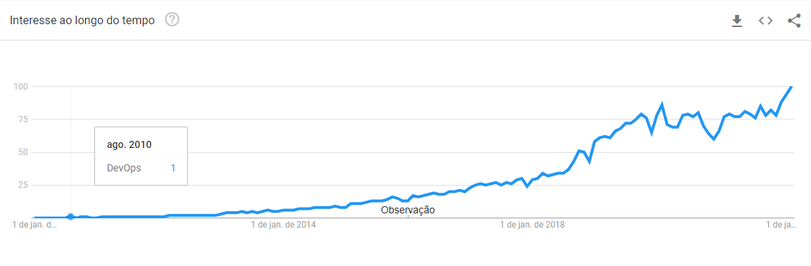
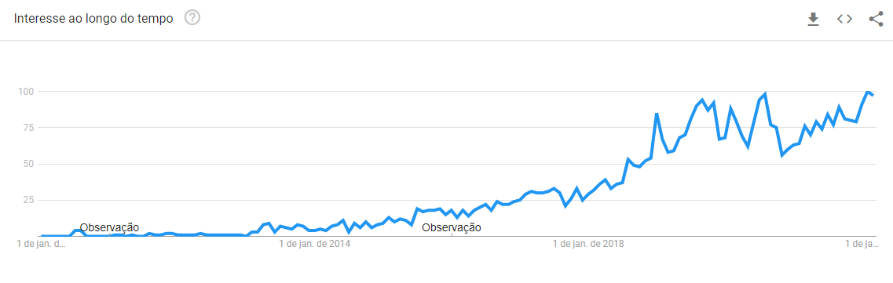

# 1.2 DevOps e Docker

Nesta seção faz-se uma introdução a DevOps e qual a sua relação com contêineres e, consequentemente, Docker.

Desenvolvimento e Operações (DevOps) corresponde à ideia de unir duas áreas que eram consideradas conflitantes. A ideia do DevOps é permitir que desenvolvimento, garantia de qualidade (QA), operações de TI e segurança da informação (Infosec) passem a trabalhar juntas e de maneira bastante integrada ([Kim et al., 2018](https://altabooks.com.br/produto/manual-de-devops/)).

[Kim et al. (2018)](https://altabooks.com.br/produto/manual-de-devops/) alertam que em quase toda organização de TI há conflito entre a equipe de desenvolvimento e as operações de TI, necessárias para operacionalizar o desenvolvimento e distribuição do software. Tal conflito resulta em uma queda de desempenho e um tempo cada vez maior na entrega de melhorias nos produtos de software.

Organizações de TI, segundo [Kim et al. (2018)](https://altabooks.com.br/produto/manual-de-devops/), possuem dois grande objetivos:

* Responder ao cenário competitivo e que muda frequentemente; e
* Fornecer serviço estável, confiável e seguro para o cliente.

Nesse sentido, com frequência, o Desenvolvimento assumirá a responsabilidade de responder ao mercado, corrigindo, implementando novas funcionalidades e desenvolvendo novos produtos para atender o mercado o mais rápido possível. Por outro lado, as Operações de TI assumirão a responsabilidade de garantir a qualidade de serviço ao cliente, mantendo o ambiente estável e seguro, o que de certa forma vai contra o objetivo do Desenvolvimento, em geral, por dificultar a introdução de mudanças, resultando no conflito de interesse entre as duas áreas ([Kim et al., 2018](https://altabooks.com.br/produto/manual-de-devops/)).

Basicamente, DevOps introduz uma cultura que permite esse ciclo ser quebrado e a cooperação entre Desenvolvimento e Operações de TI passe a ocorrer efetivamente, e todos saem ganhando.

O interesse pelo tema, como pode ser observado nos gráficos abaixo, ainda é crescente. A título de ilustração, seguem dois gráficos referentes a busca pelo termo "DevOps" no [Google Trends](https://trends.google.com.br) de 01/01/2010 até 25/03/2022. O primeiro gráfico apresenta a demanda mundial na busca pelo termo DevOps e o segundo, a demanda nacional para o mesmo período acima.

Como pode ser observado nos gráficos acima, o interesse pelo tema ainda é crescente e trata-se de um assunto importante de ser estudado e aprendido considerando o cenário atual de desenvolvimento de software.

Os pilares por trás do DevOps tem origem nos métodos ágeis. Entretanto, juntar ambos nem sempre é uma tarefa trivial, conforme relatado por [Betteley e Skelton (2017)](https://www.infoq.com/br/articles/merging-devops-agile/). Eles relatam no artigo intitulado "[Unindo desenvolvimento ágil e DevOps](https://www.infoq.com/br/articles/merging-devops-agile/)" as diferenças entre ágil e DevOps e o que precisa ser feito para que ambos cooperem entre si para prover recursos de melhor qualidade no desenvolvimento de software.

Se considerarmos as práticas do DevOps em que as equipes de desenvolvimento e operações cooperam entre si, observamos que juntas elas desenvolvem, testam, implementam e monitoram aplicativos com velocidade, qualidade e controle, seguindo o que é chamado de Fluxo (_Pipeline_) DevOps. A figura abaixo, extraída de [Torre (2020)](https://docs.microsoft.com/pt-br/dotnet/architecture/containerized-lifecycle/), ilustra as etapas previstas num fluxo DevOps e a presença dos contêineres Docker para a realização de determinadas etapas do fluxo.

Como pode ser observado, há contêineres Docker viabilizando o ambiente de trabalho do Dev, no loop interno de desenvolvimento (1); na parte de construção, integração contínua e teste (3), na entrega contínua (4); e no ambiente de gerenciamento e execução da aplicação (5), referente ao ambiente de produção.

Dento do contexto deste curso, a intenção é que passemos por essas etapas, utilizando uma ou mais aplicações exemplo, que nos permitam realizarmos o fluxo completo de DevOps, ilustrado com contêineres Docker e outras ferramentas relacionadas.

Animados!? Hora de começar a por a mão na massa.
