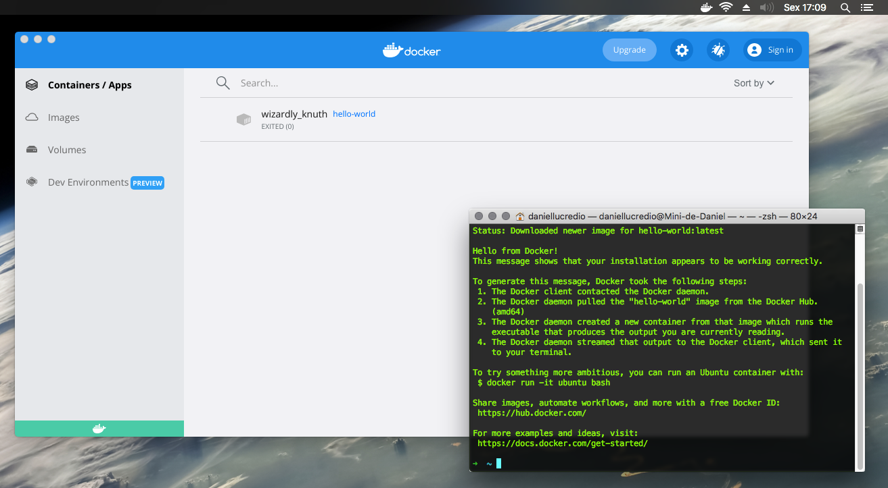
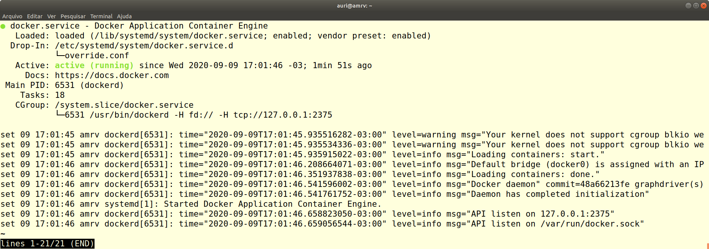

# 1.4 Configuração do Ambiente - Docker

Um dos grandes desafios no uso de tecnologias voltadas para o desenvolvimento de aplicações diz respeito à configuração de ambientes para o desenvolvimento e execução do produto de software produzido. A cada novo colaborador que chega na organização, a preparação do ambiente de trabalho pode consumir um tempo significativo. Conforme visto na [Seção 1.2](1-2-devops-e-docker.md), o uso de máquinas virtuais simplificou bastante esse processo, mas as máquinas virtuais ainda sofrem do problema da exigência de um SO completo em cada uma delas para prover os serviços necessários. A evolução das mesmas deu origem ao conceito de contêineres, os quais possuem capacidades semelhantes às das máquinas virtuais, com a vantagem de serem mais "leves" e demandarem menos recursos de hardware para sua execução.

A tecnologia de contêineres surgiu para facilitar essa atividade e simplificar não apenas a configuração do ambiente de desenvolvimento, como também o ambiente de execução da aplicação. Utiliza-se muito hoje o termo _dockerização de aplicação_ para fazer referência a uma aplicação que não era executada em contêineres e passa a ser após a _dockerização_.

O primeiro passo para dar início a esse processo é instalar as ferramentas do [Docker](https://www.docker.com/get-started/). Nesta seção veremos como instalar e configurar o ambiente do Docker + Docker Compose que será utilizado nos capítulos seguintes. Apesar do Docker poder ser instalado no ambiente Windows, é altamente recomendável que você faça uso da plataforma no ambiente Linux por este ser mais estável e alinhado com a filosofia do Docker.

## Windows

* Faça o download do instalador do Docker Desktop [aqui](https://hub.docker.com/editions/community/docker-ce-desktop-windows/);
* Abra o instalador e siga as instruções **(Importante: deixe a opção "Enable Hyper-V Windows Features" ativa!)**;
* Quando o processo de instalação terminar, reinicie o computador;
* Ao reiniciar, abra o Docker Desktop para poder iniciar o _daemon_ do docker;
*   Tanto o Docker quanto o Docker Compose estarão instalados e ativos na sua máquina, e podem ser testados abrindo uma janela do Powershell e inserindo comandos como `docker run hello-world`.

    > Obs: No Windows, o Docker Desktop também vem com um pequeno tutorial para começar a utilizar a ferramenta, pode ser útil.


## Mac

* Faça o download do instalador do Docker Desktop [aqui](https://www.docker.com/get-started)
* Instale normalmente, como qualquer aplicativo Mac (duplo-clique no arquivo .dmg)
* Após instalação, execute-o no menu de aplicativos (será necessário autorizar e digitar sua senha de administrador)
* Assim que o Docker terminar de iniciar, seu ícone ficará fixo na barra do sistema


* A partir deste momento, a instalação está completa. É possível testar abrindo uma janela do terminal e rodando o comando `docker run hello-world`

> Obs: No Mac, o Docker Desktop também vem com um pequeno tutorial para começar a utilizar a ferramenta, pode ser útil.



## Linux

### Docker Engine no Linux Ubuntu

Uma boa fonte de informação para a instalação do Docker é o seu próprio web site. Os passos da instalação no Ubuntu apresentados abaixo foram extraídas de lá, nas opções [_Install Docker Engine on Ubuntu_](https://docs.docker.com/engine/install/ubuntu/#set-up-the-repository) e [_Install Docker Dekstop on Ubuntu_](https://docs.docker.com/desktop/install/ubuntu/).

Os passos a seguir, correspondem a execução dos comandos para a instalação utilizando-se os repositórios de pacotes da própria Docker Inc.&#x20;

#### Configuração do repositório

* Remova instalações anteriores com&#x20;

```
sudo apt remove docker-desktop
rm -r $HOME/.docker/desktop
sudo rm /usr/local/bin/com.docker.cli
sudo apt purge docker-desktop
sudo apt remove docker docker-engine docker.io containerd runc
```

* Configure os repositórios

```
sudo apt-get update

sudo apt-get install \
    ca-certificates \
    curl \
    gnupg \
    lsb-release
```

* Adicione a GPG Key oficial da Docker

```
sudo mkdir -m 0755 -p /etc/apt/keyrings

curl -fsSL https://download.docker.com/linux/ubuntu/gpg | sudo gpg --dearmor -o /etc/apt/keyrings/docker.gpg
```

* Verificação da identididade Docker. A _fingerprint_ exibida deve ser`9DC8 5822 9FC7 DD38 854A  E2D8 8D81 803C 0EBF CD88`

```
sudo apt-key fingerprint 0EBFCD88
```

* A saída produzida pelo comando acima deve ser:

```
pub   rsa4096 2017-02-22 [SCEA]
      9DC8 5822 9FC7 DD38 854A  E2D8 8D81 803C 0EBF CD88
uid           [ unknown] Docker Release (CE deb) <docker@docker.com>
sub   rsa4096 2017-02-22 [S]
```

* Configuração do repositório _stable_ como fonte para a instalação dos pacotes

```
echo \
  "deb [arch=$(dpkg --print-architecture) signed-by=/etc/apt/keyrings/docker.gpg] https://download.docker.com/linux/ubuntu \
  $(lsb_release -cs) stable" | sudo tee /etc/apt/sources.list.d/docker.list > /dev/null
```

#### Instalação dos pacotes

* Utilize os comandos abaixo para a instalação do `docker` e `docker-compose`&#x20;

```
sudo apt-get update

 sudo apt-get install docker-ce docker-ce-cli containerd.io docker-buildx-plugin docker-compose-plugin
```

* Testando a instalação

```
docker version

Client: Docker Engine - Community
 Version:           19.03.12
 API version:       1.40
 Go version:        go1.13.10
 Git commit:        48a66213fe
 Built:             Mon Jun 22 15:45:36 2020
 OS/Arch:           linux/amd64
 Experimental:      false
Cannot connect to the Docker daemon at tcp://127.0.0.1:2375. 
Is the docker daemon running?
```

Observa-se no comando acima que o docker está instalado na versão 19.03.12, entretanto, as configurações ainda não estão completas. Continue nos passos abaixo para finalizar as configurações para que a mensagem "_Cannot connect to the Docker daemon at tcp://127.0.0.1:2375. Is the docker daemon running?_" não seja mais exibida.

#### Configurações pós-instalação

* Habilitar o uso do Docker para usuários sem privilégio de root. Após a execução do comando abaixo, o ideal é fazer o logoff e logar novamente na conta para habilitar as alterações nos grupos do Linux

```
sudo groupadd docker
sudo usermod -aG docker $USER
newgrp docker
```

* Após realizar o logout ou reinicializar a máquina, para verificar se você foi adicionado ao grupo, utilize o comando abaixo

```
id
```

* O resultado, deve ser parecido com o apresentado abaixo. Observe que o usuário faz parte do grupo docker

```
uid=1000(auri) gid=1000(auri) grupos=1000(auri),4(adm),24(cdrom),27(sudo),
30(dip),46(plugdev),116(lpadmin),126(sambashare),127(vboxusers),129(docker)
```

* Configure o Docker para inicializar no boot da máquina

```
sudo systemctl enable docker
```

* Caso deseje desabilitar esse comportamento, basta executar

```
sudo systemctl disable docker
```

* Configurar acesso remoto por meio do arquivo de unidade do **`systemd`**
  * Se após a instalação você observar que apareceu uma mensagem do tipo "_Cannot connect to the Docker daemon at tcp://127.0.0.1:2375. Is the docker daemon running?_", será necessária a execução dos passos abaixo.
  * Use o comando abaixo para sobrescrever o arquivo `docker.service`

```
sudo mkdir -p /etc/systemd/system/docker.service.d
sudo nano /etc/systemd/system/docker.service.d/override.conf
```

* Cole e salve o conteúdo abaixo no arquivo

```
[Service]
ExecStart=
ExecStart=/usr/bin/dockerd -H fd:// -H tcp://127.0.0.1:2375
```

* Em seguida, reinicialize o systemctl

```
sudo systemctl daemon-reload
```

* Reinicialize o serviço do docker

```
sudo systemctl restart docker.service
```

#### Teste da instalação e execução do hello-world

Chegando até aqui, recomendo a reinicialização da máquina e o teste do Docker com a execução dos comandos a seguir

* Verificando o status da execução do docker daemon

```
sudo service docker status
```

* Como resultado, esse comando irá apresentar algo parecido com o mostrado na imagem a seguir



* Verificação da versão do Docker em execução. Observe que após todas as configurações acima, não aparece mais a mensagem de erro mostrada acima _Cannot connect to the Docker daemon at tcp://127.0.0.1:2375. Is the docker daemon running?_" e a saída do comando é correta conforma ilustrada na imagem abaixo.

```
docker version
```

```
docker version
Client: Docker Engine - Community
 Version:           20.10.14
 API version:       1.41
 Go version:        go1.16.15
 Git commit:        a224086
 Built:             Thu Mar 24 01:48:02 2022
 OS/Arch:           linux/amd64
 Context:           default
 Experimental:      true

Server: Docker Engine - Community
 Engine:
  Version:          20.10.14
  API version:      1.41 (minimum version 1.12)
  Go version:       go1.16.15
  Git commit:       87a90dc
  Built:            Thu Mar 24 01:45:53 2022
  OS/Arch:          linux/amd64
  Experimental:     false
 containerd:
  Version:          1.5.11
  GitCommit:        3df54a852345ae127d1fa3092b95168e4a88e2f8
 runc:
  Version:          1.0.3
  GitCommit:        v1.0.3-0-gf46b6ba
 docker-init:
  Version:          0.19.0
  GitCommit:        de40ad0

```

* Finalmente, podemos executar o Hello World do Docker com o comando abaixo. A imagem a seguir ilustra a saída resultante do comando.

```
docker run hello-world
```

O comando acima irá produzir como resultado:

<pre><code><strong>Unable to find image 'hello-world:latest' locally
</strong>latest: Pulling from library/hello-world
2db29710123e: Pull complete 
Digest: sha256:bfea6278a0a267fad2634554f4f0c6f31981eea41c553fdf5a83e95a41d40c38
Status: Downloaded newer image for hello-world:latest

Hello from Docker!
This message shows that your installation appears to be working correctly.

To generate this message, Docker took the following steps:
 1. The Docker client contacted the Docker daemon.
 2. The Docker daemon pulled the "hello-world" image from the Docker Hub.
    (amd64)
 3. The Docker daemon created a new container from that image which runs the
    executable that produces the output you are currently reading.
 4. The Docker daemon streamed that output to the Docker client, which sent it
    to your terminal.

To try something more ambitious, you can run an Ubuntu container with:
 $ docker run -it ubuntu bash

Share images, automate workflows, and more with a free Docker ID:
 https://hub.docker.com/

For more examples and ideas, visit:
 https://docs.docker.com/get-started/
</code></pre>

Se você chegou até aqui com sucesso, o seu ambiente está pronto para a continuidade do nosso curso. Do contrário, poste sua dúvida de instalação no nosso Fórum que teremos o maior prazer em ajudar.

Para aqueles que desejarem, há uma máquina virtual Linux Mint 21.1 para VirtualBox, com o ambiente configurado, incluíndo o Python e o Docker. O download da mesma pode ser feito a partir do link [https://drive.google.com/file/d/1Fk9JoIUM202J2IUgPvgF-y7vwa0tH9IW/view?usp=sharing](https://drive.google.com/file/d/1Fk9JoIUM202J2IUgPvgF-y7vwa0tH9IW/view?usp=sharing). Após o download e descompactação, para fazer uso da imagem basta escolher a opção Arquivo->Importar Appliance do VirtualBox. Login: **mlops** e Senha: **mlops**.

### Docker Desktop no Linux Ubuntu

Em princípio, conforme documentação, ao instalar o Docker Desktop sozinho, o Docker Engine também deveria ser instalado. Entretanto, na minha distribuição baseada em Ubuntu, Linux Mint 21.1, o Docker Desktop só funcionou conforme desejado se instalasse antes o Docker Engine.&#x20;

Desse modo, para os que desejarem tentar instalar apenas o Docker Desktop, os passos detalhados estão disponíveis no link [Install Docker Desktop on Ubuntu](https://docs.docker.com/desktop/install/ubuntu/).

No exemplo apresentado aqui, uma vez que o Docker Engine já se encontra instalado, a instalação do Docker Desktop se resume a baixar a última versão do arquivo de instalação `docker-desktop--.deb`(disponível no site acima) realizar a instalação.

No ato da escrita desta versão do livro, o instalador estava a versão: `docker-desktop-4.16.2-amd64.deb`. Desse modo, para realizar a instalação desse pacote, basta executar o comando abaixo:

<pre><code><strong>$ sudo apt-get install ./docker-desktop-4.16.2-amd64.deb
</strong></code></pre>

### Linux Arch

* No terminal, instale os pacotes `docker` e `docker-compose` com `sudo pacman -S docker docker-compose`
* Rode o comando `sudo usermod -aG docker $USER` para adicionar o usuário atual ao grupo do docker e então poder rodar o comando sem ser root;
* Feche o terminal e abra de novo (talvez seja necessário reiniciar o computador para finalizar a instalação e ativar o daemon do docker);
* Rode o comando `docker run hello-world` para confirmar que a instalação aconteceu corretamente.


