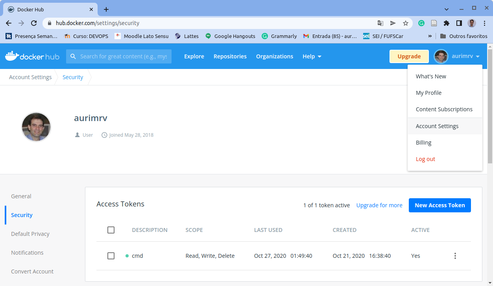
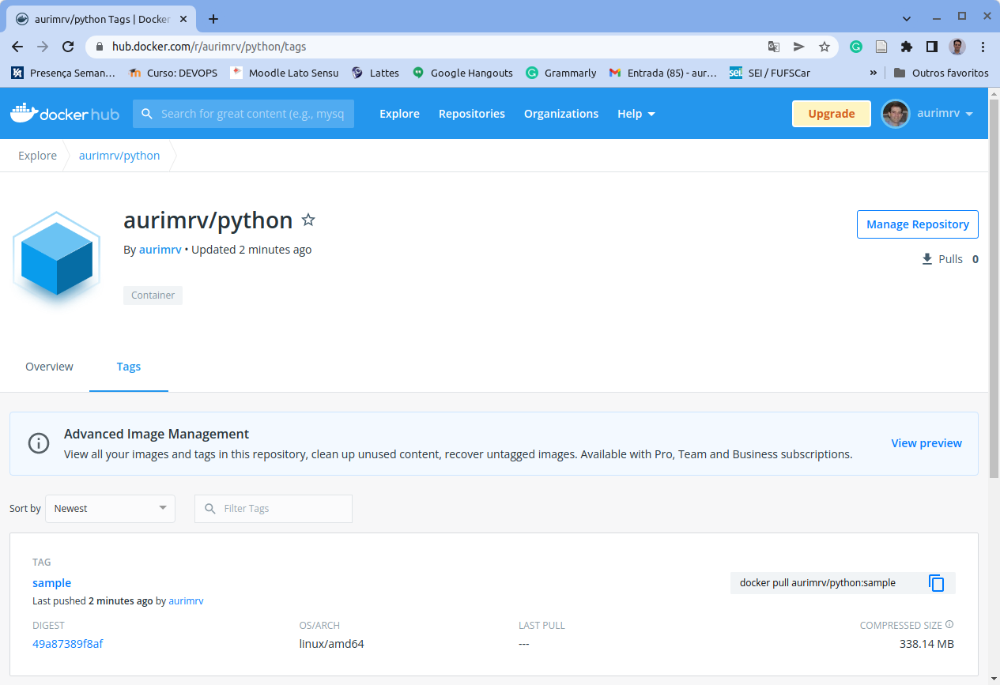
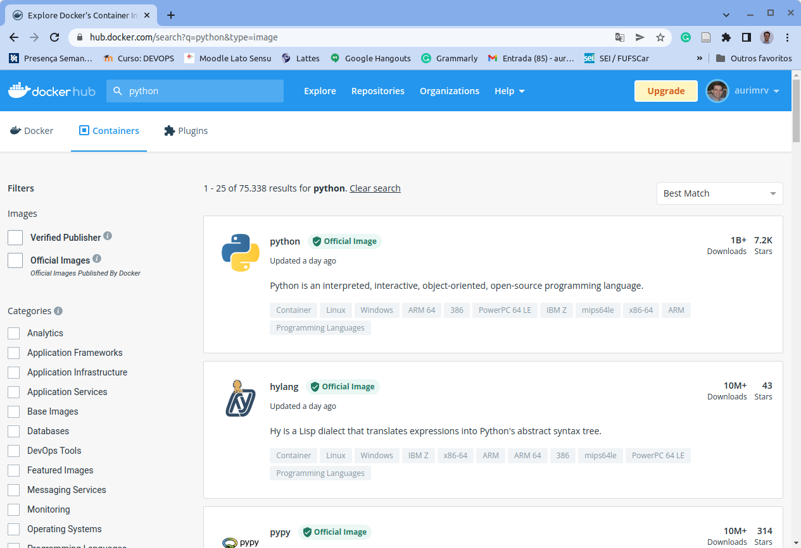
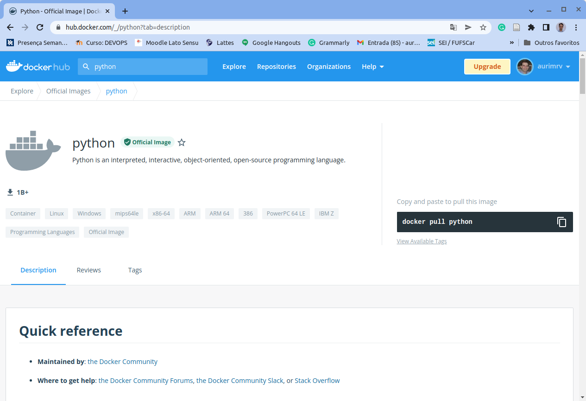
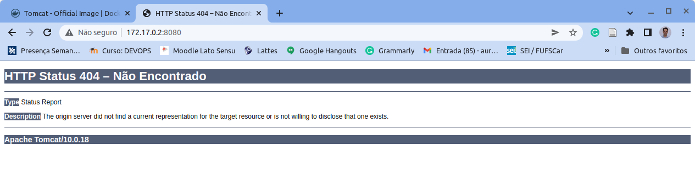
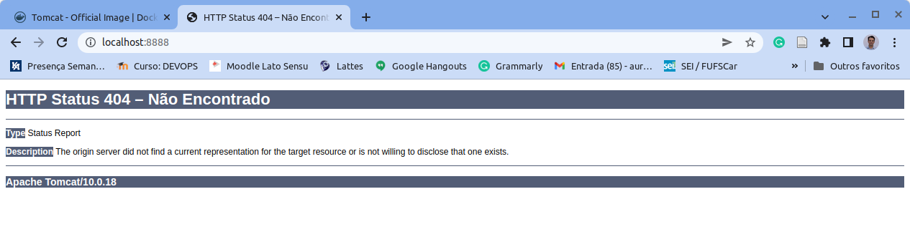

# 1.6 Docker Hub e Comandos Adicionais

Como vimos na seção anterior, o Docker é uma importante ferramenta e possui uma gama de comandos para a criação de imagens e manipulação de contêineres. Para informações detalhadas das diversas opções pode-se utilizar o comando `docker --help` ou até mesmo consultar a documentação on-line disponível em [https://docs.docker.com/](https://docs.docker.com).

Nesta seção falaremos um pouco mais sobre o registry público do Docker, denominado Docker Hub. Sugerimos fortemente que você crie uma conta no Docker Hub e gere um Token de Acesso que irá permitir a você armazenar imagens no Docker Hub, conforme veremos a seguir. Uma vez logado em sua conta, a criação do token de acesso pode ser feita no menu "_Account Settings/Security_", conforme ilustrado na tela a seguir.



Ao gerar o Token de Acesso, copie e cole o número gerado pois ele será necessário em cada nova conexão ao [Docker Hub](https://hub.docker.com) realizada via linha de comando quando se desejar armazenar uma imagem no registry público do Docker.

### Registrando nova imagem no Docker Hub

Por exemplo, na Seção 1.5, construímos uma imagem, denominada python:sample que ficou armazenada no registry local. Para isso, utilizamos o comando abaixo:

```
$ docker build -t python:sample .
```

Se desejarmos que essa imagem possa ser compartilhada via Hub Docker, inicialmente, precisamos mudar o seu nome de modo a incluir, prescendendo o mesmo, o `DOCKER_ID` do usuário  do Hub Docker. No exemplo aqui apresentado, esse `DOCKER_ID` é `aurimrv`. como pode ser observado na figura acima. Desse modo, o comando de construção a ser utilizado será:

```
$ docker build -t aurimrv/python:sample .
Sending build context to Docker daemon  4.096kB
Step 1/6 : FROM python:3
 ---> ee2a4300ffa2
Step 2/6 : WORKDIR /usr/src/app
 ---> Using cache
 ---> c311c48f19db
Step 3/6 : COPY requirements.txt ./
 ---> Using cache
 ---> ea7e1c3c6991
Step 4/6 : RUN pip install --no-cache-dir -r requirements.txt
 ---> Using cache
 ---> ca94e718b78b
Step 5/6 : COPY . .
 ---> Using cache
 ---> 4fec572aaf81
Step 6/6 : CMD [ "python", "./script.py" ]
 ---> Using cache
 ---> 9862ce240bbe
Successfully built 9862ce240bbe
Successfully tagged aurimrv/python:sample
```

Observa-se no final da execução (linha 21) que a imagem passou a ser rotulada como `aurimrv/python:sample`.

Ao final desse processo temos uma imagem denominada `aurimrv/python:sample`, criada e armazenada localmente. Agora vamos enviá-la para o Docker Hub. Para isso você precisa saber o seu `DOCKER_ID` e o seu `DOCKER_TOKEN`. Ambos serão utilizados no processo. Ao ser solicitada a Password, simplesmente copie e cole o seu token de acesso de desenvolvedor gerado na plataforma Docker Hub.

```
$ docker login -u aurimrv
Password: 
WARNING! Your password will be stored unencrypted in /home/auri/.docker/config.json.
Configure a credential helper to remove this warning. See
https://docs.docker.com/engine/reference/commandline/login/#credentials-store

Login Succeeded
```

Em seguida, o comando `docker push` permite submeter uma nova imagem para o registry do Docker Hub, conforme ilustrado abaixo:

```
$ docker push aurimrv/python:sample
The push refers to repository [docker.io/aurimrv/python]
8f87ebb3c106: Pushed 
9efb950a790c: Pushed 
e8900ae5a74c: Pushed 
9be204ecae2e: Pushed 
50ba39281905: Mounted from library/python 
c4dbdfaeca5a: Mounted from library/python 
a221bc56b147: Mounted from library/python 
7ed1d87a050a: Mounted from library/python 
3ffc178e6d86: Mounted from library/python 
327e42081bbe: Mounted from library/python 
6e632f416458: Mounted from library/python 
e019be289189: Mounted from library/python 
c9a63110150b: Mounted from library/python 
sample: digest: sha256:49a87389f8af762b96318c71942e1ccd9bd3a59203870a93a1452d65aae66972 size: 3050
```

Ao consultar a respectiva conta no Docker Hub, observa-se que essa imagem aparece disponível  para ser utilizada por qualquer outro usuário. A figura a seguir ilustra a presença dessa imagem.



### Consultando por imagens existentes

Como apresentado acima, o Docker Hub é um grande repositório de imagens que estão disponíveis para serem utilizadas para uso direto ou como base para o desenvolvimento de novas imagens como fizemos no exemplo apresento. Pelo campo de busca do Docker Hub você pode pesquisar por imagens de interesse. A tela a seguir, por exemplo, ilustra a pesquisa feita por Python.

Como pode ser observao, existe uma grande variedade de imagens contento Python no nome em alguma parte da descrição de uma imagem, basta localizar a desejada e utilizar. No nosso exemplo, utilizamos a imagem oficial do Python com a Tag 3.8.





Existe também a opção de procurar por imagens utilizando-se o comando `docker search` via linha de comando. Por exemplo a busca realizada acima no Docker Hub via linha de comando ficaria conforme abaixo:

```
$ docker search python
NAME                                     DESCRIPTION                                     STARS     OFFICIAL   AUTOMATED
python                                   Python is an interpreted, interactive, objec…   7217      [OK]       
continuumio/anaconda3                    Powerful and flexible python distribution       596                  [OK]
pypy                                     PyPy is a fast, compliant alternative implem…   314       [OK]       
continuumio/anaconda                     Powerful and flexible python distribution       219                  [OK]
circleci/python                          Python is an interpreted, interactive, objec…   48                   
hylang                                   Hy is a Lisp dialect that translates express…   43        [OK]       
amazon/aws-lambda-python                 AWS Lambda base images for Python               41                   
bitnami/python                           Bitnami Python Docker Image                     17                   [OK]
google/guestbook-python-redis            A simple guestbook example written in Python…   4                    
cimg/python                                                                              3                    
appdynamics/python-agent-init            AppDynamics Repository for Python agent inst…   0                    
okteto/python-fastapi                                                                    0                    
pachyderm/python-build                                                                   0                    
ibmcom/python-sybase-ppc64le             Docker image for python-sybase-ppc64le          0                    
ibmcom/python-memcached-ppc64le          Docker image for python-memcached-ppc64le       0                    
bitnami/python-snapshot                                                                  0                    
ibmcom/python-dropbox-ppc64le            Docker image for python-dropbox-ppc64leDocke…   0                    
ibmcom/python-glanceclient-ppc64le       Docker image for python-glanceclient-ppc64le    0                    
ibmcom/python-ceilometerclient-ppc64le   Docker image for python-ceilometerclient-ppc…   0                    
ibmcom/pythonfutures-ppc64le             Docker image for pythonfutures-ppc64le          0                    
okteto/python                                                                            0                    
mirantis/python-operations-api           https://mirantis.jira.com/browse/IT-40189       0                    [OK]
pachyderm/python-evaluate                                                                0                    
okteto/python-job-launcher                                                               0                    
ibmcom/python-semver-ppc64le             Docker image for python-semver-ppc64leDocker…   0                    
```

Entretanto, certamente a documentação encontrada no Docker Hub referente as imagens é mais detalhada e merece ser lida para viabilizar a correta utilização das mesmas.

### Executando a imagem registrada

Para executar a imagem registrada utiliza-se o comando docker run mas, agora, passando o nome da imagem registrada remotamente.

```
$ docker run --rm aurimrv/python:sample
Basic Image Operations With the Python Pillow Library
Read the full article at https://realpython.com/image-processing-with-the-
```

### Parando a execução de um contêiner

Suponha que tenha se iniciado a execução de um contêiner contendo uma instância do Apache Tomcat. Por exemplo, o comando abaixo colocaria tal contêiner em execução.

```
$ docker run --rm tomcat
Unable to find image 'tomcat:latest' locally
latest: Pulling from library/tomcat
5492f66d2700: Already exists 
540ff8c0841d: Already exists 
a0bf850a0df0: Already exists 
d751dc38ae51: Already exists 
21fd8f6c2501: Pull complete 
3585e93a38a5: Pull complete 
fca7cf2735d1: Pull complete 
4f339b93865d: Pull complete 
39442253360c: Pull complete 
89db664184b6: Pull complete 
Digest: sha256:09d1da454a73d526264e62f71c63beb62c189a3438606269a2298c0a943b2726
Status: Downloaded newer image for tomcat:latest
NOTE: Picked up JDK_JAVA_OPTIONS:  --add-opens=java.base/java.lang=ALL-UNNAMED --add-opens=java.base/java.io=ALL-UNNAMED --add-opens=java.base/java.util=ALL-UNNAMED --add-opens=java.base/java.util.concurrent=ALL-UNNAMED --add-opens=java.rmi/sun.rmi.transport=ALL-UNNAMED
26-Mar-2022 04:36:13.972 INFO [main] org.apache.catalina.startup.VersionLoggerListener.log Server version name:   Apache Tomcat/10.0.18
26-Mar-2022 04:36:13.974 INFO [main] org.apache.catalina.startup.VersionLoggerListener.log Server built:          Mar 9 2022 14:30:15 UTC
26-Mar-2022 04:36:13.975 INFO [main] org.apache.catalina.startup.VersionLoggerListener.log Server version number: 10.0.18.0
26-Mar-2022 04:36:13.975 INFO [main] org.apache.catalina.startup.VersionLoggerListener.log OS Name:               Linux
26-Mar-2022 04:36:13.975 INFO [main] org.apache.catalina.startup.VersionLoggerListener.log OS Version:            5.4.0-105-generic
26-Mar-2022 04:36:13.975 INFO [main] org.apache.catalina.startup.VersionLoggerListener.log Architecture:          amd64
26-Mar-2022 04:36:13.975 INFO [main] org.apache.catalina.startup.VersionLoggerListener.log Java Home:             /usr/local/openjdk-11
26-Mar-2022 04:36:13.975 INFO [main] org.apache.catalina.startup.VersionLoggerListener.log JVM Version:           11.0.14.1+1
26-Mar-2022 04:36:13.975 INFO [main] org.apache.catalina.startup.VersionLoggerListener.log JVM Vendor:            Oracle Corporation
26-Mar-2022 04:36:13.976 INFO [main] org.apache.catalina.startup.VersionLoggerListener.log CATALINA_BASE:         /usr/local/tomcat
26-Mar-2022 04:36:13.976 INFO [main] org.apache.catalina.startup.VersionLoggerListener.log CATALINA_HOME:         /usr/local/tomcat
26-Mar-2022 04:36:13.984 INFO [main] org.apache.catalina.startup.VersionLoggerListener.log Command line argument: --add-opens=java.base/java.lang=ALL-UNNAMED
26-Mar-2022 04:36:13.984 INFO [main] org.apache.catalina.startup.VersionLoggerListener.log Command line argument: --add-opens=java.base/java.io=ALL-UNNAMED
26-Mar-2022 04:36:13.984 INFO [main] org.apache.catalina.startup.VersionLoggerListener.log Command line argument: --add-opens=java.base/java.util=ALL-UNNAMED
26-Mar-2022 04:36:13.984 INFO [main] org.apache.catalina.startup.VersionLoggerListener.log Command line argument: --add-opens=java.base/java.util.concurrent=ALL-UNNAMED
26-Mar-2022 04:36:13.985 INFO [main] org.apache.catalina.startup.VersionLoggerListener.log Command line argument: --add-opens=java.rmi/sun.rmi.transport=ALL-UNNAMED
26-Mar-2022 04:36:13.985 INFO [main] org.apache.catalina.startup.VersionLoggerListener.log Command line argument: -Djava.util.logging.config.file=/usr/local/tomcat/conf/logging.properties
26-Mar-2022 04:36:13.985 INFO [main] org.apache.catalina.startup.VersionLoggerListener.log Command line argument: -Djava.util.logging.manager=org.apache.juli.ClassLoaderLogManager
26-Mar-2022 04:36:13.985 INFO [main] org.apache.catalina.startup.VersionLoggerListener.log Command line argument: -Djdk.tls.ephemeralDHKeySize=2048
26-Mar-2022 04:36:13.985 INFO [main] org.apache.catalina.startup.VersionLoggerListener.log Command line argument: -Djava.protocol.handler.pkgs=org.apache.catalina.webresources
26-Mar-2022 04:36:13.985 INFO [main] org.apache.catalina.startup.VersionLoggerListener.log Command line argument: -Dorg.apache.catalina.security.SecurityListener.UMASK=0027
26-Mar-2022 04:36:13.985 INFO [main] org.apache.catalina.startup.VersionLoggerListener.log Command line argument: -Dignore.endorsed.dirs=
26-Mar-2022 04:36:13.986 INFO [main] org.apache.catalina.startup.VersionLoggerListener.log Command line argument: -Dcatalina.base=/usr/local/tomcat
26-Mar-2022 04:36:13.986 INFO [main] org.apache.catalina.startup.VersionLoggerListener.log Command line argument: -Dcatalina.home=/usr/local/tomcat
26-Mar-2022 04:36:13.986 INFO [main] org.apache.catalina.startup.VersionLoggerListener.log Command line argument: -Djava.io.tmpdir=/usr/local/tomcat/temp
26-Mar-2022 04:36:13.991 INFO [main] org.apache.catalina.core.AprLifecycleListener.lifecycleEvent Loaded Apache Tomcat Native library [1.2.31] using APR version [1.7.0].
26-Mar-2022 04:36:13.991 INFO [main] org.apache.catalina.core.AprLifecycleListener.lifecycleEvent APR capabilities: IPv6 [true], sendfile [true], accept filters [false], random [true], UDS [true].
26-Mar-2022 04:36:13.993 INFO [main] org.apache.catalina.core.AprLifecycleListener.initializeSSL OpenSSL successfully initialized [OpenSSL 1.1.1k  25 Mar 2021]
26-Mar-2022 04:36:14.258 INFO [main] org.apache.coyote.AbstractProtocol.init Initializing ProtocolHandler ["http-nio-8080"]
26-Mar-2022 04:36:14.278 INFO [main] org.apache.catalina.startup.Catalina.load Server initialization in [442] milliseconds
26-Mar-2022 04:36:14.318 INFO [main] org.apache.catalina.core.StandardService.startInternal Starting service [Catalina]
26-Mar-2022 04:36:14.318 INFO [main] org.apache.catalina.core.StandardEngine.startInternal Starting Servlet engine: [Apache Tomcat/10.0.18]
26-Mar-2022 04:36:14.325 INFO [main] org.apache.coyote.AbstractProtocol.start Starting ProtocolHandler ["http-nio-8080"]
26-Mar-2022 04:36:14.334 INFO [main] org.apache.catalina.startup.Catalina.start Server startup in [55] milliseconds
```

No caso específico desse contêiner, como o Tomcat permanece em execução, o prompt não é liberado. É possível, inclusive, conectar nessa instância do Tomcat e verificar que o mesmo está em execução no endereço. Entretanto, da forma como o comando docker run foi executado acima, para se conectar à instância do Tomcat em execução no contêiner é necessário se saber o endereço IP que o contêiner está utilizando. Para isso pode-se utilizar o comando `docker ps` para se obter o ID ou nome do contêiner e, em seguida, o `docker inspect` para obter informações sobre o status da execução do contêiner, incluíndo o endereço IP utilizado.

```
$ docker ps
CONTAINER ID   IMAGE     COMMAND             CREATED         STATUS         PORTS      NAMES
e579c1e6c9d0   tomcat    "catalina.sh run"   4 minutes ago   Up 4 minutes   8080/tcp   laughing_bhaskara
```

Por exemplo, o comando acima identificou que o ID do contêiner é `e579c1e6c9d0` e seu nome é `laughing_bhaskara`. Utilizando qualquer desses identificadores podemos inspecionar o contêiner com o comando abaixo:

```
$ docker inspect laughing_bhaskara
[
    {
        "Id": "f192b01ab34da76e8e90fd3e0149aeb7b8e2db5c169e6d58eb50059708752b02",
        "Created": "2022-03-26T04:46:38.249343033Z",
        "Path": "catalina.sh",
        "Args": [
            "run"
        ],
        "State": {
            "Status": "running",
            "Running": true,
            "Paused": false,
            "Restarting": false,
            "OOMKilled": false,
            "Dead": false,
            "Pid": 886865,
            "ExitCode": 0,
            "Error": "",
            "StartedAt": "2022-03-26T04:46:38.646300898Z",
            "FinishedAt": "0001-01-01T00:00:00Z"
        },
...
        "NetworkSettings": {
            "Bridge": "",
            "SandboxID": "82f74a380a231629fdcd91ebfe854233faeabb8325074bf2fa8e677543248517",
            "HairpinMode": false,
            "LinkLocalIPv6Address": "",
            "LinkLocalIPv6PrefixLen": 0,
            "Ports": {
                "8080/tcp": null
            },
            "SandboxKey": "/var/run/docker/netns/82f74a380a23",
            "SecondaryIPAddresses": null,
            "SecondaryIPv6Addresses": null,
            "EndpointID": "d90e6190337b57fbbd82dbfe7aea461ad19871727b2775df3dd65dd3dfd70829",
            "Gateway": "172.17.0.1",
            "GlobalIPv6Address": "",
            "GlobalIPv6PrefixLen": 0,
            "IPAddress": "172.17.0.2",
            "IPPrefixLen": 16,
            "IPv6Gateway": "",
            "MacAddress": "02:42:ac:11:00:02",
            "Networks": {
                "bridge": {
                    "IPAMConfig": null,
                    "Links": null,
                    "Aliases": null,
                    "NetworkID": "7c0d6ff2b1c4b28c768e3fcb9e8bff30a1fca54eedd057653392f379d764178a",
                    "EndpointID": "d90e6190337b57fbbd82dbfe7aea461ad19871727b2775df3dd65dd3dfd70829",
                    "Gateway": "172.17.0.1",
                    "IPAddress": "172.17.0.2",
                    "IPPrefixLen": 16,
                    "IPv6Gateway": "",
                    "GlobalIPv6Address": "",
                    "GlobalIPv6PrefixLen": 0,
                    "MacAddress": "02:42:ac:11:00:02",
                    "DriverOpts": null
                }
            }
        }
    }
]

```

Observa-se pelo comando acima que o endereço IP utilizado pelo contêiner é o `172.17.0.2`. Desse modo, é possível se conectar a essa instância do Tomcat utilizando-se o endereço: [http://172.17.0.2:8080/](http://172.17.0.2:8080) que irá produzir como saída um erro 404 uma vez que no contêiner não há qualquer aplicação instalada.



Para parar o contêiner é necessário abrir um outro prompt de comando e executar os comandos docker ps para se decobrir o ID ou nome do contêiner e, em seguida, o comando docker stop com a identificação do contêiner que se deseja interromper a execução.

```
$ docker ps
CONTAINER ID   IMAGE     COMMAND             CREATED         STATUS         PORTS      NAMES
e579c1e6c9d0   tomcat    "catalina.sh run"   4 minutes ago   Up 4 minutes   8080/tcp   laughing_bhaskara

$ docker stop e579c1e6c9d0
e579c1e6c9d0
```

### Redirecionamento de portas

No caso do Tomcat e outros serviços que fazem uso de portas, o docker run oferece um parâmetro que permite realizar o mapeamento de portas utilizadas no contêiner para portas na máquina hospedeira, executando os contêineres. Por exemplo, considerando o exemplo do Tomcat acima, se o executássemos conforme abaixo, a porta 8080 utilizada pelo contêiner no endereço 172.17.0.2 seria mapeada para a porta 8888 na máquina local, ou seja, em http://localhost:8888, como pode ser observado na figura abaixo:



### Compartilhamento de volumes

Outra característica interessante dos contêineres é que eles executam em um espaço de dados separado da máquina local no qual executa. Desse modo, caso existam dados que sejam produzidos pelo contêiner que precisam ser repassados para a máquina local ou vice versa, a solução para isso, recomendada pelo [Docker](https://docs.docker.com/storage/), é por meio de volumes. O exemplo a seguir ilustra esse cenário. Para isso, será utilizada uma imagem do servidor de banco de dados [MySQL](https://hub.docker.com/\_/mysql).&#x20;

O Docker Hub oferece uma documentação detalhada de como fazer uso da imagem para a criação de contêineres executando o MySQL. O problema que desejamos demonstrar é que, ao utilizar um banco de dados para o armazenamento de dados de uma aplicação, quando o contêiner encerra sua execução ou é destruído, os dados armazenados internamente no banco de dados se perdem, caso não sejam compartilhados com a máquina local. Uma das formas de fazer isso é pode meio de volumes que basicamente mapeiam um diretório ou arquivo na máquina local com um diretório ou arquivo dentro do contêiner.

O comando abaixo ilustra essa situação:

```
$ docker run --name mysql-mlops-01 -v "$(pwd)/datadir":/var/lib/mysql \
-e MYSQL_ROOT_PASSWORD=mlops mysql

2022-03-26 14:19:06+00:00 [Note] [Entrypoint]: Entrypoint script for MySQL Server 8.0.28-1debian10 started.
2022-03-26 14:19:06+00:00 [Note] [Entrypoint]: Switching to dedicated user 'mysql'
2022-03-26 14:19:06+00:00 [Note] [Entrypoint]: Entrypoint script for MySQL Server 8.0.28-1debian10 started.
2022-03-26 14:19:06+00:00 [Note] [Entrypoint]: Initializing database files
2022-03-26T14:19:06.277742Z 0 [System] [MY-013169] [Server] /usr/sbin/mysqld (mysqld 8.0.28) initializing of server in progress as process 43
2022-03-26T14:19:06.284569Z 1 [System] [MY-013576] [InnoDB] InnoDB initialization has started.
2022-03-26T14:19:14.442141Z 1 [System] [MY-013577] [InnoDB] InnoDB initialization has ended.
2022-03-26T14:19:18.914419Z 6 [Warning] [MY-010453] [Server] root@localhost is created with an empty password ! Please consider switching off the --initialize-insecure option.
2022-03-26 14:19:21+00:00 [Note] [Entrypoint]: Database files initialized
2022-03-26 14:19:21+00:00 [Note] [Entrypoint]: Starting temporary server
....
2022-03-26 14:19:25+00:00 [Note] [Entrypoint]: MySQL init process done. Ready for start up.
2022-03-26T14:19:25.527652Z 0 [System] [MY-010116] [Server] /usr/sbin/mysqld (mysqld 8.0.28) starting as process 1
2022-03-26T14:19:25.539381Z 1 [System] [MY-013576] [InnoDB] InnoDB initialization has started.
2022-03-26T14:19:25.680864Z 1 [System] [MY-013577] [InnoDB] InnoDB initialization has ended.
2022-03-26T14:19:25.865450Z 0 [Warning] [MY-010068] [Server] CA certificate ca.pem is self signed.
2022-03-26T14:19:25.865500Z 0 [System] [MY-013602] [Server] Channel mysql_main configured to support TLS. Encrypted connections are now supported for this channel.
2022-03-26T14:19:25.866682Z 0 [Warning] [MY-011810] [Server] Insecure configuration for --pid-file: Location '/var/run/mysqld' in the path is accessible to all OS users. Consider choosing a different directory.
2022-03-26T14:19:25.881075Z 0 [System] [MY-010931] [Server] /usr/sbin/mysqld: ready for connections. Version: '8.0.28'  socket: '/var/run/mysqld/mysqld.sock'  port: 3306  MySQL Community Server - GPL.
2022-03-26T14:19:25.881074Z 0 [System] [MY-011323] [Server] X Plugin ready for connections. Bind-address: '::' port: 33060, socket: /var/run/mysqld/mysqlx.sock
```

Observamos que na instrução do `docker run` temos alguns parâmetros novos. O primeiro é o parâmetro `--name` que permite atribuirmos um nome para nosso contêiner que entrará em execução. No caso, atribuímos a ele o nome `mysql-mlops-01` e podemos utilizar esse nome para referência-lo nos demais comandos que faremos uso.

O segundo parâmetro é o `-v` que permite o compartilhamento de um diretório local (no exemplo), com um diretório dentro do contêiner. No caso, o diretório local é representado por `$(pwd)/datadir` , ou seja, a pasta corrente onde o domando docker run está sendo executado `$(pwd)` terá um subdiretório `datadir` que será associado ao diretório `var/lib/mysql` dentro do contêiner.&#x20;

Inicialmente, na primeira execução do contêiner, a pasta local `$(pwd)/datadir` está vazia mas, ao utilizar o banco de dados dentro do contêiner, os dados referentes a base de dados criada são copiados, ao término da execução, para essa pasta e, numa execução futura do contêiner, o banco de dados é restaurado a partir dos dados locais transferidos para o contêiner.

Finalmente, o parâmetro `-e` permite definir uma variável de ambiente que é utilizada pelo contêiner. Uma das variáveis que o contêiner do MySQL permite ser especificada é a `MYSQL_ROOT_PASSWORD` que indica a senha de administrador (root) no banco de dados. Em nosso caso, definimos essa senha como `mlops`. Essa senha será utilizada para que possamos conectar ao banco de dados e executar instruções em SQL.

Com o contêiner em execução, o comando a seguir conecta no contêiner e executa um comando simples no MySQL para exemplificar que a mesma foi alterada.&#x20;

```
$ docker exec -it mysql-mlops-01 /bin/bash
root@79580350c91a:/# mysql -u root -p
Enter password: 
Welcome to the MySQL monitor.  Commands end with ; or \g.
Your MySQL connection id is 8
Server version: 8.0.28 MySQL Community Server - GPL

Copyright (c) 2000, 2022, Oracle and/or its affiliates.

Oracle is a registered trademark of Oracle Corporation and/or its
affiliates. Other names may be trademarks of their respective
owners.

Type 'help;' or '\h' for help. Type '\c' to clear the current input statement.

mysql> show databases;
+--------------------+
| Database           |
+--------------------+
| information_schema |
| mysql              |
| performance_schema |
| sys                |
+--------------------+
4 rows in set (0.00 sec)

mysql> create database MLOPS;
Query OK, 1 row affected (0.01 sec)

mysql> quit;
Bye
root@79580350c91a:/# exit
```

No exemplo acima, abrimos um prompt de comando no contêiner em execução, conectamos ao banco de dados e criamos uma nova base de dados, nomeada `MLOPS`, no MySQL. Os comandos apresentados a seguir irão parar e remover o contêiner em execução.

```
$ docker stop mysql-mlops-01; docker rm mysql-mlops-01
mysql-mlops-01
mysql-mlops-01
```

Ao verificar o diretório local `$(pwd)/datadir` observamos que o mesmo contêm dados referentes ao banco de dados que estava armazenado dentro do contêiner.&#x20;

```
$ ls -l datadir/
total 185772
-rw-r----- 1 netdata netdata       56 mar 26 11:19  auto.cnf
-rw-r----- 1 netdata netdata  3116922 mar 26 11:19  binlog.000001
-rw-r----- 1 netdata netdata      368 mar 26 11:36  binlog.000002
-rw-r----- 1 netdata netdata       32 mar 26 11:19  binlog.index
-rw------- 1 netdata netdata     1676 mar 26 11:19  ca-key.pem
-rw-r--r-- 1 netdata netdata     1112 mar 26 11:19  ca.pem
-rw-r--r-- 1 netdata netdata     1112 mar 26 11:19  client-cert.pem
-rw------- 1 netdata netdata     1676 mar 26 11:19  client-key.pem
-rw-r----- 1 netdata netdata   196608 mar 26 11:30 '#ib_16384_0.dblwr'
-rw-r----- 1 netdata netdata  8585216 mar 26 11:19 '#ib_16384_1.dblwr'
-rw-r----- 1 netdata netdata     4062 mar 26 11:36  ib_buffer_pool
-rw-r----- 1 netdata netdata 12582912 mar 26 11:36  ibdata1
-rw-r----- 1 netdata netdata 50331648 mar 26 11:30  ib_logfile0
-rw-r----- 1 netdata netdata 50331648 mar 26 11:19  ib_logfile1
drwxr-x--- 2 netdata netdata     4096 mar 26 11:36 '#innodb_temp'
drwxr-x--- 2 netdata netdata     4096 mar 26 11:30  MLOPS
drwxr-x--- 2 netdata netdata     4096 mar 26 11:19  mysql
-rw-r----- 1 netdata netdata 31457280 mar 26 11:30  mysql.ibd
drwxr-x--- 2 netdata netdata     4096 mar 26 11:19  performance_schema
-rw------- 1 netdata netdata     1680 mar 26 11:19  private_key.pem
-rw-r--r-- 1 netdata netdata      452 mar 26 11:19  public_key.pem
-rw-r--r-- 1 netdata netdata     1112 mar 26 11:19  server-cert.pem
-rw------- 1 netdata netdata     1680 mar 26 11:19  server-key.pem
drwxr-x--- 2 netdata netdata     4096 mar 26 11:19  sys
-rw-r----- 1 netdata netdata 16777216 mar 26 11:30  undo_001
-rw-r----- 1 netdata netdata 16777216 mar 26 11:21  undo_002
```

Desse modo, ao colocar o contêiner em execução novamente, e conectarmos ao mesmo via prompt de comando, podemos consultar as bases de dados presentes e a base `MLOPS` criada anteriormente, estará lá.

```
$ docker run --name mysql-mlops-01 -v "$(pwd)/datadir":/var/lib/mysql \
-e MYSQL_ROOT_PASSWORD=mlops mysql
2022-03-26 14:40:09+00:00 [Note] [Entrypoint]: Entrypoint script for MySQL Server 8.0.28-1debian10 started.
2022-03-26 14:40:09+00:00 [Note] [Entrypoint]: Switching to dedicated user 'mysql'
2022-03-26 14:40:09+00:00 [Note] [Entrypoint]: Entrypoint script for MySQL Server 8.0.28-1debian10 started.
2022-03-26T14:40:10.042369Z 0 [System] [MY-010116] [Server] /usr/sbin/mysqld (mysqld 8.0.28) starting as process 1
2022-03-26T14:40:11.323343Z 1 [System] [MY-013576] [InnoDB] InnoDB initialization has started.
2022-03-26T14:40:13.475029Z 1 [System] [MY-013577] [InnoDB] InnoDB initialization has ended.
2022-03-26T14:40:13.594808Z 0 [Warning] [MY-010068] [Server] CA certificate ca.pem is self signed.
2022-03-26T14:40:13.594839Z 0 [System] [MY-013602] [Server] Channel mysql_main configured to support TLS. Encrypted connections are now supported for this channel.
2022-03-26T14:40:13.595929Z 0 [Warning] [MY-011810] [Server] Insecure configuration for --pid-file: Location '/var/run/mysqld' in the path is accessible to all OS users. Consider choosing a different directory.
2022-03-26T14:40:13.613367Z 0 [System] [MY-011323] [Server] X Plugin ready for connections. Bind-address: '::' port: 33060, socket: /var/run/mysqld/mysqlx.sock
2022-03-26T14:40:13.613448Z 0 [System] [MY-010931] [Server] /usr/sbin/mysqld: ready for connections. Version: '8.0.28'  socket: '/var/run/mysqld/mysqld.sock'  port: 3306  MySQL Community Server - GPL.
```

```
$ docker exec -it mysql-mlops-01 /bin/bash
root@2aff1c318c15:/# mysql -u root -p
Enter password: 
Welcome to the MySQL monitor.  Commands end with ; or \g.
Your MySQL connection id is 8
Server version: 8.0.28 MySQL Community Server - GPL

Copyright (c) 2000, 2022, Oracle and/or its affiliates.

Oracle is a registered trademark of Oracle Corporation and/or its
affiliates. Other names may be trademarks of their respective
owners.

Type 'help;' or '\h' for help. Type '\c' to clear the current input statement.

mysql> show databases;
+--------------------+
| Database           |
+--------------------+
| MLOPS              |
| information_schema |
| mysql              |
| performance_schema |
| sys                |
+--------------------+
5 rows in set (0.01 sec)

mysql> quit
Bye
root@2aff1c318c15:/# exit
```

### Removendo contêineres, imagens ou limpando todo ambiente

A medida que imagens e contêineres são criados, executados e encerrados pode ser que parte dos arquivos utilizados pelos mesmos permaneçam na máquina local e demandem uma limpeza periódica. Para consultar a lista de contêineres disponíveis em execução e/ou encerrados é possível utilizar o comando docker ps -a, conforme ilustrado abaixo:

```
$ docker ps -a
CONTAINER ID   IMAGE           COMMAND                CREATED         STATUS                   PORTS                                       NAMES
4615bf8ce7f7   tomcat          "catalina.sh run"      4 minutes ago   Up 4 minutes             0.0.0.0:8888->8080/tcp, :::8888->8080/tcp   cool_heisenberg
529d2796888a   python:sample   "python ./script.py"   2 hours ago     Exited (0) 2 hours ago                                               interesting_wescoff
```

No exemplo acima observa-se que existem dois contêineres, um em execução e outro cuja execução já se encerrou a duas horas atrás.

Para remover contêineres utiliza-se o comando docker rm fornecendo como parâmetro a identificação do contêiner que se deseja remover. Entretanto, só podem ser removidos contêineres que não estejam em execução. Do contrário, primeiro o mesmo deve ser parado antes de ser removido.

Os comandos a seguir removem todos os contêineres localizados.

```
$ docker stop 4615bf8ce7f7
4615bf8ce7f7

$ docker rm 4615bf8ce7f7 529d2796888a
529d2796888a
Error: No such container: 4615bf8ce7f7
```

Observa-se que, ao tentar executar o docker rm no ID do contêiner do Tomcat foi exibida uma mensagem de erro indicando que o contêiner com ID `4615bf8ce7f7` não existe. Isso porque ao iniciarmos a execução do contêiner utilizamos o parâmetro `--rm` que remove automaticamente o contêiner assim que o mesmo encerra sua execução, o que foi feito com o comando `docker stop`.

Já as imagens podem ser consultadas e removidas de maneira similar. Para consultar a lista de imagens utilizamos o comando docker imagens docker image ls -a. Esse comando apresenta a lista de imagens que foram baixadas, incluíndo as camadas de imagem intermediárias.

```
$ docker image ls -a
REPOSITORY       TAG       IMAGE ID       CREATED        SIZE
<none>           <none>    4fec572aaf81   2 hours ago    929MB
aurimrv/python   sample    9862ce240bbe   2 hours ago    929MB
python           sample    9862ce240bbe   2 hours ago    929MB
<none>           <none>    ca94e718b78b   2 hours ago    929MB
<none>           <none>    c311c48f19db   2 hours ago    919MB
<none>           <none>    ea7e1c3c6991   2 hours ago    919MB
python           3         ee2a4300ffa2   30 hours ago   919MB
python           latest    ee2a4300ffa2   30 hours ago   919MB
tomcat           latest    97f970b9f6d1   5 days ago     680MB
```

Para remover uma imagem utiliza-se o comando docker rmi seguido do ID das imagens desejadas.Por exemplo, o comando abaixo remove a imagem do Tomcat com ID `97f970b9f6d1`.

```
$ docker rmi 97f970b9f6d1
Untagged: tomcat:latest
Untagged: tomcat@sha256:09d1da454a73d526264e62f71c63beb62c189a3438606269a2298c0a943b2726
Deleted: sha256:97f970b9f6d1db03eb2ebe7b9982e6466928c9d3acc36c20dc62b66b6229addc
Deleted: sha256:56a4cf9aaee1f131854ac1535eb0d5bdb0763bc7d5bdefa0e0e47791fc00ddb0
Deleted: sha256:ce5b7103f7eb8577cac47b0d345811463682c0d1fd1e6be537f09edbfb3ab95d
Deleted: sha256:cff5340daa127e18f6d1c6267d18f3dd3950a9caf2c4ade0382088b555d94213
Deleted: sha256:0c54b18d5e09cfa580026a6d2e413fd4287cee3f5f0cdf10ecffadfb11c11c42
Deleted: sha256:47ee0d7330dcc3e172fe2f8ead8e4206871099f6b70147f1a8156572e74d91c9
Deleted: sha256:3e8be97af4532cfaa3611fc23206bd4559345acd5d1b4c4ee15b0e4dd9928cde
```

Uma opção mais drástica e que permite uma limpeza de todo o sistema seria a execução do comando `docker system prune -a`.

```
$ docker system prune -a
WARNING! This will remove:
  - all stopped containers
  - all networks not used by at least one container
  - all images without at least one container associated to them
  - all build cache

Are you sure you want to continue? [y/N] y
Deleted Images:
untagged: aurimrv/python:sample
untagged: aurimrv/python@sha256:49a87389f8af762b96318c71942e1ccd9bd3a59203870a93a1452d65aae66972
untagged: python:sample
deleted: sha256:9862ce240bbecce01d5cb7f57a2e3307d1733397122c9905377fbe867b01a88f
deleted: sha256:4fec572aaf81180fcb0689045b281d2b570eb28e3c5064bf433441c5859235cd
deleted: sha256:a4e5524503a0dd9f7386af337b0054861dd5d4779f9ec32da75c39276eb70daf
deleted: sha256:ca94e718b78b7b0d3dc728d3ed8e31fd2ba1e90639e8185d1ab7913b5b1468af
deleted: sha256:f3a02a46be5e804985318f365035fa7edf801bec0e7edaee8f6090886e50ce0f
deleted: sha256:ea7e1c3c6991990656ef58af3807b51fab54d37d35d1ab2cc884aa57b42f8408
deleted: sha256:828d254f82a4ef46769178a9978b65e06d10694e4859a20aa0875063ce5ab4c4
deleted: sha256:c311c48f19dbf0817f480f4d208fc880b80e40a113b8f293dfcdd23eaa1d9f56
deleted: sha256:1316c4822760638f7d7b8b10a7bafcc87504eeafeb550ca63ca93ed4570f22fd
untagged: python:3
untagged: python:latest
untagged: python@sha256:6441e2f0bd2e566de0df6445cb8e7e395ea1a376dd702de908d70401d3700961
deleted: sha256:ee2a4300ffa25463a9e22ec4108dab2e2a80c1007a38c59e5a659c8157d27ca8
deleted: sha256:9b1f782d893e5e62978cd131578743d03695fcd9c671bfc53a02cec42bcd79dc
deleted: sha256:8e2f7234436e79bddbd3fe27ba4ac7ec8a28dc9ecd94736df8cc4ad707e9a6b4
deleted: sha256:e21b4a94be334967a8b4d35c725f6c84b3e841649fd2e0ebe16469493032578c
deleted: sha256:79da52d6547f4a882f3374c89f7fb1719f0a42ce7aa1ee676a1d2b74e3df7e83
deleted: sha256:49ad93c5fd7af64479d03986dffcca005e9978dbae23b0f1af00c4a038891fe6
deleted: sha256:3ba522f21511dd7dc3df1b12d4d74751d35ede46e2a978a2437f5836665746bf
deleted: sha256:a8db7d07f7124d9886940f6d6404b6f7f4ec7f094822f40456670c05796588ca
deleted: sha256:c43bfc7bb5e729f0fb22644eacf0137c53665c5b8758ed35cf90351e29102658
deleted: sha256:c9a63110150bce5ba04ee231fc765e35acb9e6a03d3ec68ae1215883278b03dd

Total reclaimed space: 929MB
```

Mais informações sobre remoção de contêineres, imagens e limpeza do sistema podem ser obtidas no artigo de [Anderson (2020)](https://www.digitalocean.com/community/tutorials/how-to-remove-docker-images-containers-and-volumes-pt).
