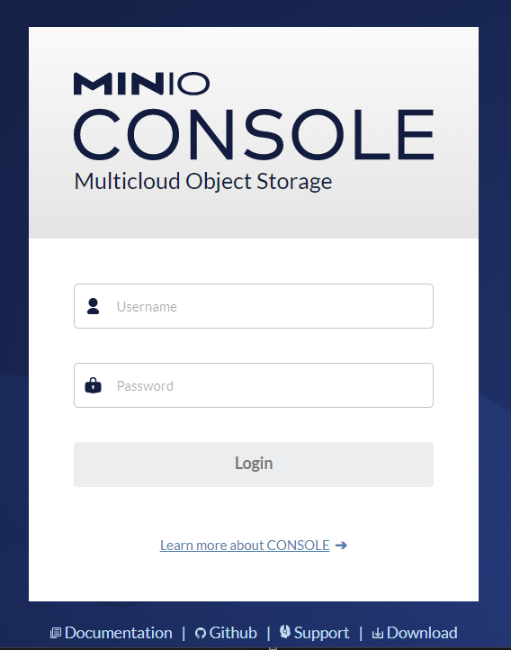
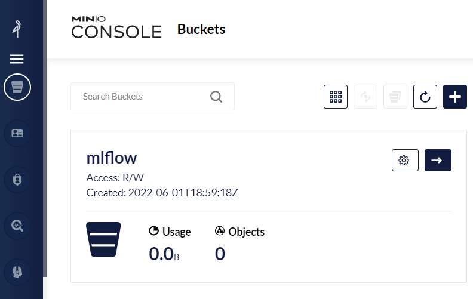

# 10.3 Configuração do MLflow

O MLflow precisa de um _back-end_ para salvar os dados dos experimentos, tais como as métricas, parâmetros, artefatos e modelos. Na seção anterior, executamos os tutoriais básicos, que utilizam o sistema de arquivos como _back-end_, mas essa abordagem é muito limitada, pois exige que os comandos sejam executados sempre na mesma máquina. Para um único usuário interessado em controlar seus experimentos e modelos, pode servir, mas para uma equipe que deseja um mínimo de consistência e colaboração, é desejável a configuração de um local centralizado.

Existem dois tipos de _storage_ que precisam ser configurados para o funcionamento completo do MLflow:

* Um serviço de _storage_ simples, como Amazon S3 ou Google File storage, para armazenar artefatos e parâmetros/métrica;
* Um serviço de banco de dados, como MySQL ou PostgreSQL, para armazenar dados para registro de modelos.

Faremos aqui uma configuração completa usando Docker, que possibilita que o MLflow seja utilizado com todos seus recursos. O exemplo foi adaptado [deste repositório aqui](https://github.com/Toumash/mlflow-docker).

## 10.3.1 Serviço de storage MinIO

O primeiro serviço que iremos configurar é o armazenamento de arquivos. O [MinIO](https://min.io/) é uma ferramenta open source compatível com o Amazon S3, portanto é uma excelente opção para demonstrar como esse tipo de armazenamento pode ser utilizado. O leitor pode optar por configurar sua própria instância do MinIO ou utilizar o Amazon S3, com as mesmas configurações do lado do MLflow.

Para configurar o MinIO, utilizaremos uma imagem Docker pronta. Faremos também uso do `docker compose` como facilitador na configuração do ambiente.

Crie uma pasta em um local qualquer, chamada `mlflow-server`. Crie um arquivo chamado `compose.yml`:

```yaml
services:
  s3:
    image: minio/minio:RELEASE.2022-05-26T05-48-41Z.hotfix.15f13935a
    restart: unless-stopped
    ports:
      - "9000:9000"
      - "9001:9001"
    environment:
      - MINIO_ROOT_USER=${AWS_ACCESS_KEY_ID}
      - MINIO_ROOT_PASSWORD=${AWS_SECRET_ACCESS_KEY}
    command: server /data --console-address ":9001"
    networks:
      - internal
      - public
    volumes:
      - minio_volume:/data
networks:
  internal:
  public:
    driver: bridge
volumes:
  minio_volume:
```

Esse arquivo faz a configuração de um contêiner com base na imagem oficial do MinIO. Há duas portas sendo abertas, 9000 (para a interface principal) e 9001 (para os comandos internos). A configuração do usuário e senha também é feita nesse arquivo, com base em duas variáveis de ambiente que serão definidas a seguir. O comando que executa o servidor é o seguinte:

```server /data --console-address ":9001"```

* `/data` é a pasta onde serão salvos os arquivos e metadados
* `console-address` define a porta para onde os comandos devem ser enviados

O arquivo do `docker compose` também define duas redes onde esse serviço estará disponível. A rede `internal` será compartilhada com outros serviços que definiremos mais adiante, e a rede `public` é, como o nome sugere, a rede por onde acessaremos o MinIO a partir da máquina local e de outras máquinas, caso quisermos.

Por último, o arquivo define que existirá um volume, chamado `minio_volume` que ficará mapeado para a pasta `/data` do contêiner (a mesma indicada no comando que executa o servidor).

Para poder rodar esse serviço, é necessário definir as configurações de usuário e senha. Faremos isso em um arquivo chamado `.env`:

```
AWS_ACCESS_KEY_ID=admin
AWS_SECRET_ACCESS_KEY=senhasenha
```

Fique à vontade para trocar os valores, caso desejar.

Agora já podemos rodar. Execute:

```sh
docker-compose up
```

Assim que o contêiner for iniciado, podemos testar, abrindo o navegador no endereço `http://localhost:9000`.



Experimente a interface, crie novos _buckets_, faça o envio de arquivos para ver como funciona.

O MLflow irá armazenar seus artefatos em um _bucket_. Um _bucket_ é uma unidade de armazenamento no Amazon S3, [confira a documentação para saber mais](https://docs.aws.amazon.com/pt_br/AmazonS3/latest/userguide/creating-buckets-s3.html). Podemos criá-lo manualmente, pela interface, e depois informar ao MLflow o nome do _bucket_. Mas podemos também automatizar essa etapa. Assim, seguindo a filosofia de infraestrutura como código, podemos deixar tudo programado de modo a gerar menos erros.

Vamos fazer uso do [CLI do MinIO](https://docs.min.io/minio/baremetal/reference/minio-mc.html), uma ferramenta em linha de comando que permite a execução de diversos comandos. Por exemplo, para criar um novo _bucket_ chamado "umbucketqualquer" podemos executar os comandos:

```sh
.\mc alias set minio http://localhost:9000 admin senhasenha
.\mc mb minio/umbucketqualquer  
```

O primeiro comando configura a ferramenta CLI para acessar o servidor local, e o segundo solicita a criação de um novo _bucket_.

Portanto, vamos configurar um serviço no arquivo `compose` para automaticamente criar um _bucket_, caso não exista, assim que o serviço for executado. Modifique o arquivo `compose.yml`:

```diff
services:
  s3:
    image: minio/minio:RELEASE.2022-05-26T05-48-41Z.hotfix.15f13935a
    restart: unless-stopped
    ports:
      - "9000:9000"
      - "9001:9001"
    environment:
      - MINIO_ROOT_USER=${AWS_ACCESS_KEY_ID}
      - MINIO_ROOT_PASSWORD=${AWS_SECRET_ACCESS_KEY}
    command: server /data --console-address ":9001"
    networks:
      - internal
      - public
    volumes:
      - minio_volume:/data
+  create_s3_buckets:
+    image: minio/mc
+    depends_on:
+      - "s3"
+    entrypoint: >
+      /bin/sh -c "
+      until (/usr/bin/mc alias set minio http://s3:9000 '${AWS_ACCESS_KEY_ID}' '${AWS_SECRET_ACCESS_KEY}') do echo '...waiting...' && sleep 1; done;
+      /usr/bin/mc mb minio/${AWS_BUCKET_NAME};
+      exit 0;
+      "
+    networks:
+      - internal
networks:
  internal:
  public:
    driver: bridge
volumes:
  minio_volume:
```

O novo serviço utiliza uma imagem que tem apenas o cliente do MinIO instalado, pronto para usar. Então podemos apenas executar o comando que quisermos. Mas não podemos executar nada antes de termos certeza que o serviço do MinIO terminou de rodar. No arquivo, existe uma dependência deste novo serviço para o serviço do MinIO (`depends_on`), mas isso não garante que ele execute apenas após o outro estar pronto, como já discutimos antes, na [Seção 5.2](../5-infraestrutura-como-codigo-e-orquestracao/5-2-docker-compose.md). Por isso, o comando definido nesse serviço fica tentando (laço "until") fazer o login no serviço, com espera de 1 segundo entre cada tentativa. Apenas quando essa tentativa é bem sucedida que o comando segue para a criação do _bucket_. O nome do _bucket_ deve ser definido no arquivo `.env`:

```diff
AWS_ACCESS_KEY_ID=admin
AWS_SECRET_ACCESS_KEY=senhasenha
+AWS_BUCKET_NAME=mlflow
```

É importante entender que o comando tenta criar o _bucket_ de qualquer maneira. Se ele já existir, não será criado. Como estamos fazendo uso de um volume, os dados ficarão persistentes mesmo entre as execuções. Para testar, interrompa e execute o `docker-compose up` novamente. Após a execução, acesse a interface novamente e veja como o _bucket_ foi criado.



## 10.3.2 Serviço de banco de dados MySQL

O próximo serviço a ser executado é o banco de dados. Faremos uso do MySQL, que também já tem uma imagem Docker pronta para ser utilizada. Vamos modificar o arquivo `compose.yml`:

```diff
services:
  s3:
    image: minio/minio:RELEASE.2022-05-26T05-48-41Z.hotfix.15f13935a
    restart: unless-stopped
    ports:
      - "9000:9000"
      - "9001:9001"
    environment:
      - MINIO_ROOT_USER=${AWS_ACCESS_KEY_ID}
      - MINIO_ROOT_PASSWORD=${AWS_SECRET_ACCESS_KEY}
    command: server /data --console-address ":9001"
    networks:
      - internal
      - public
    volumes:
      - minio_volume:/data
  create_s3_buckets:
    image: minio/mc
    depends_on:
      - "s3"
    entrypoint: >
      /bin/sh -c "
      until (/usr/bin/mc alias set minio http://s3:9000 '${AWS_ACCESS_KEY_ID}' '${AWS_SECRET_ACCESS_KEY}') do echo '...waiting...' && sleep 1; done;
      /usr/bin/mc mb minio/${AWS_BUCKET_NAME};
      exit 0;
      "
    networks:
      - internal
+  db:
+    image: mysql/mysql-server:5.7.38
+    restart: unless-stopped
+    container_name: mlflow_db
+    expose:
+      - "3306"
+    environment:
+      - MYSQL_DATABASE=${MYSQL_DATABASE}
+      - MYSQL_USER=${MYSQL_USER}
+      - MYSQL_PASSWORD=${MYSQL_PASSWORD}
+      - MYSQL_ROOT_PASSWORD=${MYSQL_ROOT_PASSWORD}
+    volumes:
+      - db_volume:/var/lib/mysql
+    networks:
+      - internal
networks:
  internal:
  public:
    driver: bridge
volumes:
+  db_volume:
  minio_volume:
```

Não há muita novidade aqui. Estamos expondo a porta 3306, que é a porta padrão do MySQL, configurando dados do banco de dados, como base de dados, usuário e senha, um volume para armazenamento persistente e uso da rede `internal` (somente o mlflow precisará acessar esse serviço).

Modifique também o arquivo `.env` para adicionar as informações adicionadas:

```diff
AWS_ACCESS_KEY_ID=admin
AWS_SECRET_ACCESS_KEY=senhasenha
AWS_BUCKET_NAME=mlflow
+MYSQL_DATABASE=mlflow
+MYSQL_USER=mlflow_user
+MYSQL_PASSWORD=mlflow_password
+MYSQL_ROOT_PASSWORD=senhasenha
```

Já podemos subir os serviços e ver o resultado. Na verdade não há muito o que ver, exceto as mensagens no terminal informando que o MySQL está de fato rodando.

## 10.3.3 Serviço do MLflow

O terceiro e último serviço que iremos rodar é o MLflow. Também não é difícil configurá-lo no `docker-compose`, sendo basicamente configurações e endereços dos demais serviços para a orquestração. Porém, há um complicador. Para que o MLflow execute corretamente, é preciso que o serviço de banco de dados, pelo menos, esteja rodando. Como já discutido anteriormente, apesar de existir no `docker-compose` o conceito de `depends_on`, pode haver uma demora entre o início da execução do serviço e o momento em que ele está de fato pronto para ser utilizado. No caso do MLflow, é preciso que a porta do MySQL esteja pronta para ser acessada.

Para resolver esse problema, é preciso algum tipo de lógica adicional na inicialização do serviço. Faremos uso de um _script_ que faz exatamente isso. O projeto [wait-for-it](https://github.com/vishnubob/wait-for-it) é uma ferramenta de linha de comando que aguarda por uma determinada porta, antes de executar um comando. Faça download do arquivo `wait-for-it.sh` desse repositório e salve-o em sua pasta.

Crie um arquivo chamado `Dockerfile`, com o seguinte conteúdo:

```
FROM continuumio/miniconda3:latest

RUN pip install mlflow boto3 pymysql

ADD . /app
WORKDIR /app

COPY wait-for-it.sh wait-for-it.sh 
RUN chmod +x wait-for-it.sh
```

Essa imagem é baseada em uma imagem do `miniconda`, e terá instalado o MLflow e demais dependências necessárias para conexão aos demais serviços. Também será copiado o _script_ `wait-for-it.sh` que acabamos de baixar.

Agora vamos modificar o `compose.yml`:

```diff
services:
  s3:
    image: minio/minio:RELEASE.2022-05-26T05-48-41Z.hotfix.15f13935a
    restart: unless-stopped
    ports:
      - "9000:9000"
      - "9001:9001"
    environment:
      - MINIO_ROOT_USER=${AWS_ACCESS_KEY_ID}
      - MINIO_ROOT_PASSWORD=${AWS_SECRET_ACCESS_KEY}
    command: server /data --console-address ":9001"
    networks:
      - internal
      - public
    volumes:
      - minio_volume:/data
  create_s3_buckets:
    image: minio/mc
    depends_on:
      - "s3"
    entrypoint: >
      /bin/sh -c "
      until (/usr/bin/mc alias set minio http://s3:9000 '${AWS_ACCESS_KEY_ID}' '${AWS_SECRET_ACCESS_KEY}') do echo '...waiting...' && sleep 1; done;
      /usr/bin/mc mb minio/${AWS_BUCKET_NAME};
      exit 0;
      "
    networks:
      - internal
  db:
    image: mysql/mysql-server:5.7.38
    restart: unless-stopped
    container_name: mlflow_db
    expose:
      - "3306"
    environment:
      - MYSQL_DATABASE=${MYSQL_DATABASE}
      - MYSQL_USER=${MYSQL_USER}
      - MYSQL_PASSWORD=${MYSQL_PASSWORD}
      - MYSQL_ROOT_PASSWORD=${MYSQL_ROOT_PASSWORD}
    volumes:
      - db_volume:/var/lib/mysql
    networks:
      - internal
+  mlflow:
+    container_name: mlflow-server-container
+    image: mlflow-server
+    restart: unless-stopped
+    build:
+      context: .
+      dockerfile: Dockerfile
+    ports:
+      - "5000:5000"
+    environment:
+      - AWS_ACCESS_KEY_ID=${AWS_ACCESS_KEY_ID}
+      - AWS_SECRET_ACCESS_KEY=${AWS_SECRET_ACCESS_KEY}
+      - AWS_DEFAULT_REGION=${AWS_REGION}
+      - MLFLOW_S3_ENDPOINT_URL=http://s3:9000
+    networks:
+      - public
+      - internal
+    entrypoint: bash ./wait-for-it.sh db:3306 -t 90 -- mlflow server --backend-store-uri mysql+pymysql://${MYSQL_USER}:${MYSQL_PASSWORD}@db:3306/${MYSQL_DATABASE} --artifacts-destination s3://${AWS_BUCKET_NAME}/ --serve-artifacts -h 0.0.0.0
networks:
  internal:
  public:
    driver: bridge
volumes:
  db_volume:
  minio_volume:
```

Ainda falta configurar algumas coisas no `.env`:

```diff
AWS_ACCESS_KEY_ID=admin
AWS_SECRET_ACCESS_KEY=senhasenha
AWS_BUCKET_NAME=mlflow
+AWS_REGION=us-east-1
MYSQL_DATABASE=mlflow
MYSQL_USER=mlflow_user
MYSQL_PASSWORD=mlflow_password
MYSQL_ROOT_PASSWORD=senhasenha
```

Esta variável define em qual região da AWS o _bucket_ está armazenado. Como o MinIO roda localmente, este valor não é nenhum valor real, mas é necessário para que a configuração fique completa para quando isso for migrado para a AWS realmente.

O principal a ser analisado aqui é o _entrypoint_:

```bash ./wait-for-it.sh db:3306 -t 90 -- mlflow server --backend-store-uri mysql+pymysql://${MYSQL_USER}:${MYSQL_PASSWORD}@db:3306/${MYSQL_DATABASE} --default-artifact-root s3://${AWS_BUCKET_NAME}/ -h 0.0.0.0```

* `wait-for-it.sh`: é o script que espera que uma porta esteja pronta
* `db:3306`: diz ao script para esperar a porta 3306 do host db ficar pronta (lembre-se, "db" é o nome do contêiner e também o nome do host, na rede Docker criada)
* `-t 90`: diz ao script para esperar no máximo 90 segundos
* `--`: indica ao script que a seguir vem o comando a ser executado após a espera bem sucedida
* `mlflow server`: comando que inicia o MLflow
* `--backend-store-uri XXX`: indica ao MLflow onde armazenar os metadados referentes aos modelos (no caso, o MySQL)
* `--artifacts-destination s3://${AWS_BUCKET_NAME}/ --serve-artifacts`: indica ao MLflow onde armazenar os artefatos (no caso, o MinIO, ou poderia ser Amazon S3). O mlflow server estará funcionando como um proxy para armazenar e recuperar os artefatos do local especificado
* `-h 0.0.0.0`: diz ao MLflow para aceitar requisições de fora da máquina local

Pronto, basta executar o comando `docker-compose up` e teremos tudo funcionando. Estamos com uma instância do MLflow completamente configurada e acessível no endereço `http://localhost:5000`. Na próxima seção mostraremos como utilizar essa instância para aproveitar das funcionalidades dos componentes do MLflow de forma centralizada.