# 10.4 Testando MLflow

Agora que temos um servidor MLflow configurado e rodando, podemos testar todos os seus componentes, incluindo o registro de modelos, que não funciona com um sistema de arquivos somente. Faremos isso por meio do exemplo de classificador de produtos que estivemos trabalhando desde o início deste livro.

## 10.4.1 Criando um projeto MLflow

Crie uma pasta, chamada `classificador-produtos`, e um ambiente virtual Conda, definido no arquivo `conda.yaml`:

```yaml
name: classificador-produtos
channels:
  - conda-forge
dependencies:
  - python=3.10.4
  - pip
  - pip:
    - jupyter==1.0.0
    - pandas==1.4.2
    - nltk==3.7
    - matplotlib==3.5.2
    - seaborn==0.11.2
    - scikit-learn==1.1.1
    - mlflow==1.26.1
```

Agora vamos criar o código de treinamento do modelo. É o mesmo código que já estivemos trabalhando até agora, apenas adaptado para rodar de uma forma mais simples, fora do notebook. Mas funcionaria dentro do notebook também, desde que seja utilizado o _kernel_ do ambiente Conda.

Faça o download do dataset ([produtos.csv](../8-model-serving/codigo/classificador-produtos/produtos.csv)) e salve-o na pasta também.

Crie um arquivo chamado `train.py`, que tem o mesmo conteúdo de antes, porém em um único script. Também acrescentamos alguns parâmetros simples de configuração, e um código de registro da execução no MLflow:

```python
import sys

import pandas as pd
import nltk
from nltk.corpus import stopwords
from sklearn.feature_extraction.text import CountVectorizer
from sklearn.naive_bayes import MultinomialNB
from sklearn.model_selection import train_test_split
from sklearn.pipeline import Pipeline
from sklearn.metrics import accuracy_score
import mlflow

# Esta função tenta registrar o experimento no MLflow
def tentar_registrar_experimento(p_test_size, p_include_names, accuracy, dataset, model):
    with mlflow.start_run():
        # Vamos registrar as métricas
        mlflow.log_metric("acuracia", accuracy)
        # E o dataset (deve ser um caminho para um arquivo)
        mlflow.log_artifact(dataset)
        # E o modelo treinado
        mlflow.sklearn.log_model(model, "modelo")

if __name__ == "__main__":
    nltk.download('stopwords')

    # temos dois parâmetros agora
    # p_test_size: percentual de casos de teste, entre 0 e 1. Default é 0.2
    p_test_size = float(sys.argv[1]) if len(sys.argv) > 1 else 0.2
    # p_include_names: se nomes devem ser incluídos no treinamento ou não, apenas descrição. Valor deve ser sim ou não. Default é sim
    p_include_names = sys.argv[2] if len(sys.argv) > 2 else 'sim'

    print("Treinando classificador de modelos...")
    print(f"Tamanho de testes={p_test_size}")
    print(f"Incluir nomes={p_include_names}")

    dataset = 'produtos.csv'

    products_data = pd.read_csv(dataset, delimiter=';', encoding='utf-8')

    if p_include_names == 'sim':
        # concatenando as colunas nome e descricao
        products_data['informacao'] = products_data['nome'] + products_data['descricao']
    else:
        # apenas a descricao
        products_data['informacao'] = products_data['descricao']

    # excluindo linhas com valor de informacao ou categoria NaN
    products_data.dropna(subset=['informacao', 'categoria'], inplace=True)
    products_data.drop(columns=['nome', 'descricao'], inplace=True)

    stop_words=set(stopwords.words("portuguese"))
    # transforma a string em caixa baixa e remove stopwords
    products_data['sem_stopwords'] = products_data['informacao'].str.lower().apply(lambda x: ' '.join([word for word in x.split() if word not in (stop_words)]))
    tokenizer = nltk.RegexpTokenizer(r"\w+")
    products_data['tokens'] = products_data['sem_stopwords'].apply(tokenizer.tokenize) # aplica o regex tokenizer
    products_data.drop(columns=['sem_stopwords','informacao'],inplace=True) # Exclui as colunas antigas

    products_data["strings"]= products_data["tokens"].str.join(" ") # reunindo cada elemento da lista
    products_data.head()


    X_train,X_test,y_train,y_test = train_test_split( # Separação dos dados para teste e treino
        products_data["strings"], 
        products_data["categoria"], 
        test_size = p_test_size, 
        random_state = 10
    )
    pipe = Pipeline([('vetorizador', CountVectorizer()), ("classificador", MultinomialNB())]) # novo

    pipe.fit(X_train, y_train)

    y_prediction = pipe.predict(X_test)
    accuracy = accuracy_score(y_prediction, y_test)

    print(f"Acurácia={accuracy}")

    # Terminamos o treinamento, vamos tentar fazer o registro
    tentar_registrar_experimento(p_test_size, p_include_names, accuracy, dataset, pipe)
```

Os comentários no código explicam o seu funcionamento em detalhes.

Vamos configurar um projeto MLflow, para facilitar a reproducibilidade. Crie um arquivo chamado `MLproject`, com o seguinte conteúdo:

```
name: classificador-produtos

conda_env: conda.yaml

entry_points:
  main:
    parameters:
      test_size: {type: float, default: 0.2}
      include_names: {type: string, default: 'sim'}
    command: "python train.py {test_size} {include_names}"
```

Podemos agora executar o projeto localmente e testá-lo. Para isso, lembre-se de abrir um terminal Anaconda. Vamos criar um ambiente novo para execução do MLflow. Não é preciso instalar nada além do MLflow, pois ele irá criar/recriar o ambiente a cada execução, se necessário. Também precisamos indicar ao MLflow onde está o servidor, por meio de variáveis de ambiente:

```sh
conda create --name MLflow python=3.10.4
conda activate MLflow
pip install mlflow
export MLFLOW_TRACKING_URI=http://localhost:5000
export MLFLOW_EXPERIMENT_NAME=classificador-produtos-sem-devops
mlflow run .
```

Lembre-se, no Windows PowerShell a definição de variáveis de ambiente é diferente:

```sh
$env:MLFLOW_TRACKING_URI='http://localhost:5000'
$env:MLFLOW_EXPERIMENT_NAME='classificador-produtos-sem-devops'
```

O comando `mlflow run .` irá procurar, na pasta local, pelo arquivo `MLproject`, e irá disparar a execução.

Poderíamos rodar com `python train.py`, mas aí precisaríamos ativar o ambiente definido em `conda.yaml` manualmente. Também perderíamos as vantagens do empacotamento de projetos, que incluem, por exemplo, o rastreamento automático dos parâmetros definidos no arquivo `MLproject`.

Se não quiser executar agora, não tem problema. Faremos um ciclo DevOps completo a seguir, e a execução poderá ser feita daqui a pouco. Caso execute, você verá o resultado da execução aparecendo na interface do MLflow.

## 10.4.2 Subindo o projeto para o GitLab e executando experimentos

Vamos configurar um projeto no GitLab para poder controlar as versões cuidadosamente e testar nosso empacotamento. Crie um projeto no GitLab chamado `classificador-produtos` e inicialize com o conteúdo desta pasta. Para facilitar os testes, crie o projeto com visibilidade pública.

Vamos rodar. Se não tiver feito ainda, abra o terminal Anaconda e crie o ambiente conforme as instruções no final da última seção. Para testar a reproducibilidade, abra o terminal em uma pasta completamente difernte. Ou tente em uma máquina diferente, se preferir, que tenha acesso de rede à máquina onde o MLflow está rodando. Neste caso, não esqueça de substituir o endereço definido na variável de ambiente pelo da máquina que está rodando o MLflow, e de verificar as conexões de firewall da rede.

Execute utilizando os seguintes comandos. Teste um, primeiro, para ver se deu certo, e os restantes depois, para criar várias execuções. Vamos também mudar o nome do experimento para diferenciar da execução anterior:

```sh
export MLFLOW_TRACKING_URI=http://localhost:5000
export MLFLOW_EXPERIMENT_NAME=classificador-produtos

mlflow run -v main https://gitlab.com/daniel.lucredio/classificador-produtos.git -P test_size=0.1 -P include_names=sim
mlflow run -v main https://gitlab.com/daniel.lucredio/classificador-produtos.git -P test_size=0.2 -P include_names=sim
mlflow run -v main https://gitlab.com/daniel.lucredio/classificador-produtos.git -P test_size=0.3 -P include_names=sim
mlflow run -v main https://gitlab.com/daniel.lucredio/classificador-produtos.git -P test_size=0.4 -P include_names=sim
mlflow run -v main https://gitlab.com/daniel.lucredio/classificador-produtos.git -P test_size=0.5 -P include_names=sim
mlflow run -v main https://gitlab.com/daniel.lucredio/classificador-produtos.git -P test_size=0.1 -P include_names=não
mlflow run -v main https://gitlab.com/daniel.lucredio/classificador-produtos.git -P test_size=0.2 -P include_names=não
mlflow run -v main https://gitlab.com/daniel.lucredio/classificador-produtos.git -P test_size=0.3 -P include_names=não
mlflow run -v main https://gitlab.com/daniel.lucredio/classificador-produtos.git -P test_size=0.4 -P include_names=não
mlflow run -v main https://gitlab.com/daniel.lucredio/classificador-produtos.git -P test_size=0.5 -P include_names=não
```

Não esqueça de substituir o endereço do repositório GitLab pelo que você criou, e o parâmetro `main` pelo nome do _branch_ que você definiu. Vai demorar um tempinho até que o projeto seja transferido, o ambiente seja recriado, e o experimento, executado.

Podemos ver o resultado das execuções na interface visual. Abra o endereço no navegador: `http://localhost:5000`:

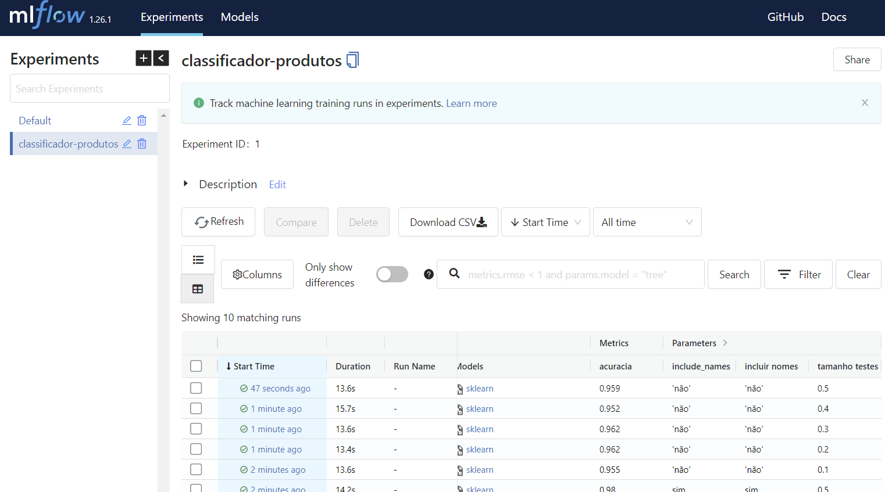

Experimente navegar pela interface e ver os resultados obtidos, as visualizações disponíveis. Veja como os _commits_ no GitLab aparecem nessa interface também, para possibilitar a identificação da versão do código que originou cada experimento. Aparentemente, podemos retreinar com um tamanho de teste 0.25, pois o gráfico nos indica que há uma possibilidade de melhoria aqui. Experimente com esse parâmetro, se quiser.

## 10.4.3 Registrando modelos

Agora podemos registrar um modelo. Na tela de visualização dos experimentos, ordene pela métrica de acurácia, decrescentemente, e depois selecione o experimento clicando sobre o link indicado na figura.

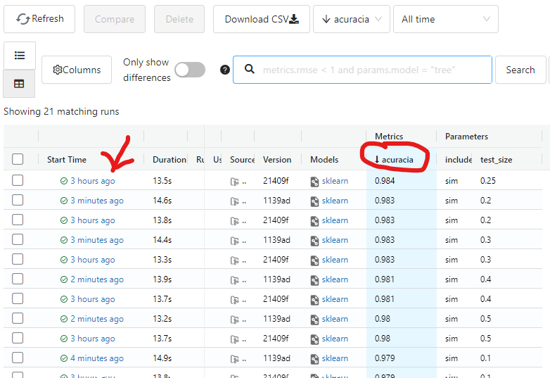

Na visualização dos detalhes da execução, é possível conferir o comando executado, os parâmetros, as métricas, o dataset, e demais registros. É também possível registrar o modelo. Faça isso clicando no botão "Register Model".

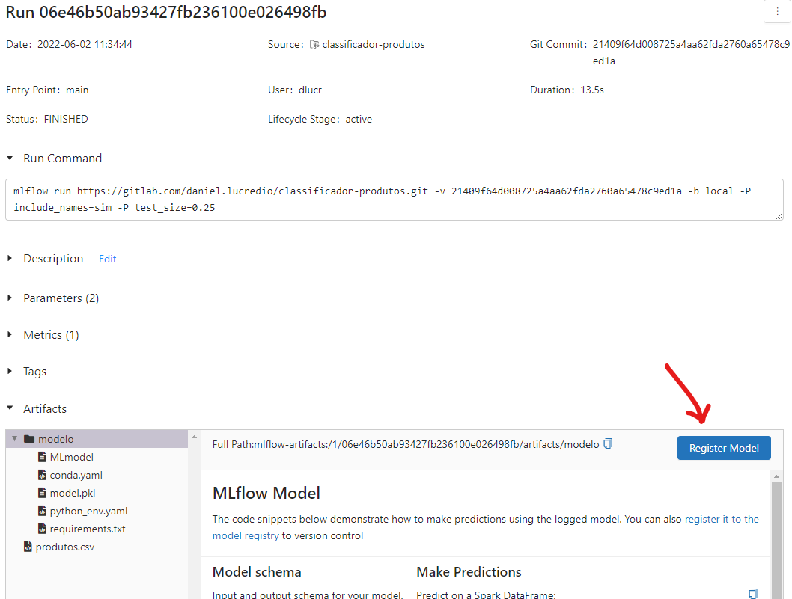

Na janela aberta, escolha a opção "Create New Model" e escolha um nome para ele. No caso, escolhemos "classificador-produtos".

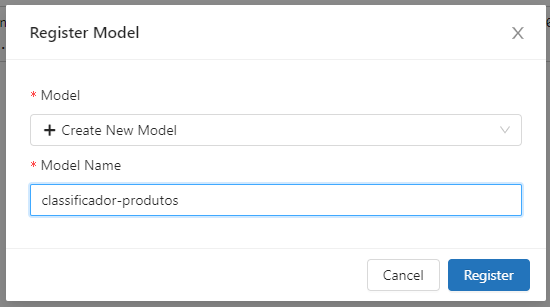

Quando uma execução gera um modelo, isso fica indicado na interface principal, por meio de um link.

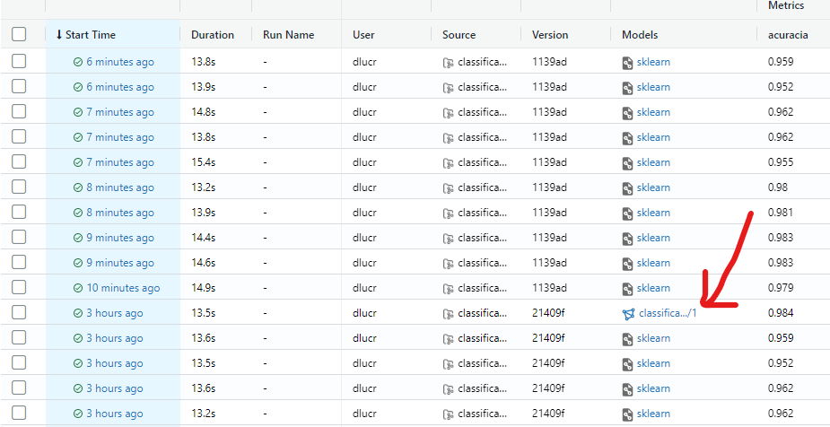

Também é possível ver todos os modelos registrados clicando na aba "Models", no topo da página:

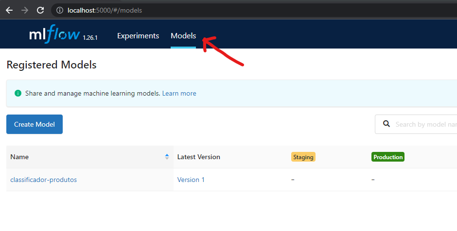

Note como, neste caso, só temos um modelo e uma versão. Em breve criaremos outra versão do modelo.

## 10.4.4 Subindo uma API HTTP para servir o modelo registrado

<span style="background-color:#AA0000;color:#FFFFFF">Obs: O conteúdo desta seção encontra-se desatualizado. Os exemplos podem não funcionar corretamente nas versões mais recentes das ferramentas</span>

Agora vamos servir esse modelo como uma API HTTP, utilizando o servidor embutido do MLflow. Faremos isso usando Docker.

Na pasta `mlflow-server`, que criamos na seção anterior, crie uma pasta chamada `classificador-produtos`. Dentro dela, crie um `Dockerfile`:

```
FROM continuumio/miniconda3:latest

RUN pip install mlflow

ADD . /app
WORKDIR /app

COPY wait-for-it.sh wait-for-it.sh 
RUN chmod +x wait-for-it.sh
```

Essa imagem servirá para rodarmos apenas o MLflow para subir o modelo como uma API, então precisamos apenas prepará-la. Veja como não há nada exceto a instalação do mlflow em uma imagem miniconda, e o script `wait-for-it.sh` (o mesmo que já utilizamos antes). Agora modifique o arquivo `compose.yml`:

```diff
services:
  s3:
    image: minio/minio:RELEASE.2022-05-26T05-48-41Z.hotfix.15f13935a
    restart: unless-stopped
    ports:
      - "9000:9000"
      - "9001:9001"
    environment:
      - MINIO_ROOT_USER=${AWS_ACCESS_KEY_ID}
      - MINIO_ROOT_PASSWORD=${AWS_SECRET_ACCESS_KEY}
    command: server /data --console-address ":9001"
    networks:
      - internal
      - public
    volumes:
      - minio_volume:/data
  create_s3_buckets:
    image: minio/mc
    depends_on:
      - "s3"
    entrypoint: >
      /bin/sh -c "
      until (/usr/bin/mc alias set minio http://s3:9000 '${AWS_ACCESS_KEY_ID}' '${AWS_SECRET_ACCESS_KEY}') do echo '...waiting...' && sleep 1; done;
      /usr/bin/mc mb minio/${AWS_BUCKET_NAME};
      exit 0;
      "
    networks:
      - internal
  db:
    image: mysql/mysql-server:5.7.38
    restart: unless-stopped
    container_name: mlflow_db
    expose:
      - "3306"
    environment:
      - MYSQL_DATABASE=${MYSQL_DATABASE}
      - MYSQL_USER=${MYSQL_USER}
      - MYSQL_PASSWORD=${MYSQL_PASSWORD}
      - MYSQL_ROOT_PASSWORD=${MYSQL_ROOT_PASSWORD}
    volumes:
      - db_volume:/var/lib/mysql
    networks:
      - internal
  mlflow:
    container_name: mlflow-server-container
    image: mlflow-server
    restart: unless-stopped
    build:
      context: .
      dockerfile: Dockerfile
    ports:
      - "5000:5000"
    environment:
      - AWS_ACCESS_KEY_ID=${AWS_ACCESS_KEY_ID}
      - AWS_SECRET_ACCESS_KEY=${AWS_SECRET_ACCESS_KEY}
      - AWS_DEFAULT_REGION=${AWS_REGION}
      - MLFLOW_S3_ENDPOINT_URL=http://s3:9000
    networks:
      - public
      - internal
    entrypoint: bash ./wait-for-it.sh db:3306 -t 90 -- mlflow server --backend-store-uri mysql+pymysql://${MYSQL_USER}:${MYSQL_PASSWORD}@db:3306/${MYSQL_DATABASE} --artifacts-destination s3://${AWS_BUCKET_NAME}/ --serve-artifacts -h 0.0.0.0
+  classificador-produtos:
+    build:
+      context: .
+      dockerfile: classificador-produtos/Dockerfile
+    environment:
+      - MLFLOW_TRACKING_URI=http://mlflow:5000
+    ports:
+      - "8080:8080"
+    networks:
+      - public
+      - internal
+    entrypoint: bash ./wait-for-it.sh mlflow:5000 -t 90 -- mlflow models serve -m 'models:/classificador-produtos/1' -p 8080 -h 0.0.0.0
networks:
  internal:
  public:
    driver: bridge
volumes:
  db_volume:
  minio_volume:
```

Iniciaremos um novo serviço, responsável por subir a API com o modelo registrado. Veja como definimos o endereço do servidor do MLflow na variável de ambiente `MLFLOW_TRACKING_URI`. Isso é a única coisa necessária para que possamos recuperar o modelo.

Veja agora o conteúdo de `entrypoint`:

* `bash ./wait-for-it.sh mlflow:5000 -t 90`: espera que o MLflow esteja funcionando para subir a API
* `mlflow models serve`: comando do MLflow para servir um modelo
* `-m 'models:/classificador-produtos/1'`: indica ao MLflow que é para recuperar o modelo chamado `classificador-produtos` em sua versão 1 (a única que temos até agora, que registramos há pouco)
* `-p 8080 -h 0.0.0.0`: escuta na porta 8080 requisições de qualquer origem

Interrompa a execução do `docker-compose` e rode-o novamente. Lembre-se de incluir a opção `--build` para forçar a reconstrução das imagens, se necessário.

```sh
docker-compose up --build
```

Acompanhe enquanto os serviços são executados um a um. Veja como o serviço da API demora para subir. Isso acontece pois ele irá criar todo o ambiente Conda novamente para hospedar o modelo, agora dentro do contêiner Docker. Para isso, irá instalar as dependências, entre as tarefas de criação do ambiente.

Quando estiver tudo rodando, podemos fazer um teste, enviando uma requisição POST:

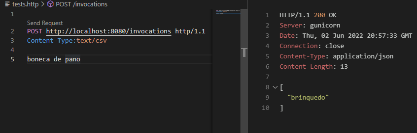

Fazemos uma requisição com conteúdo `text/csv` pois estamos enviando texto. O MLflow tem suporte a esse formato.

## 10.4.5 Utilizando modelos em tarefas _offline_

Vamos criar um novo ambiente Conda e uma nova pasta, chamada `classificador-produtos-batch`:

```sh
conda create --name classificador-produtos-batch python=3.10.4
conda activate classificador-produtos-batch
pip install mlflow
pip install scikit-learn
```

Crie um arquivo chamado `batch.py`:

```Python
import mlflow.pyfunc
import os

model_name = "classificador-produtos"
model_version = 1
os.environ['MLFLOW_TRACKING_URI']='http://localhost:5000'

model = mlflow.pyfunc.load_model(
    model_uri=f"models:/{model_name}/{model_version}"
)

data = ["boneca de pano", "halo", "senhor dos anéis", "senhor dos aneis"]

categorias = model.predict(data)

print(categorias)
```

O código é extremamente simples, e ilustra como o registro de modelos facilita a busca e uso de modelos. Execute-o e veja as predições sendo produzidas em lote (_batch_). Poderíamos fazer o mesmo que fizemos na [Seção 2.1](../2-desenvolvimento/2-1-do-notebook-para-aplicacao-parte-1.md), salvando as predições em um banco de dados.

## 10.4.6 Utilizando versões _Staging_ e _Production_

Também é possível trabalhar com versões preparadas como _Staging_ e _Production_. Dessa forma, os usuários dos modelos não precisam se preocupar com qual é a melhor versão. Basta saber que é a versão em produção. Fica a cargo dos desenvolvedores e avaliadores dos modelos decidir qual é a melhor versão. Vamos fazer isso agora. Mas antes, vamos criar uma nova versão. Vamos fazer a já famigerada mudança para ignorar acentos no treinamento. No projeto `classificador-produtos`, que é onde fazemos o treinamento, vamos fazer as modificações necessárias. Primeiro, no arquivo `conda.yaml`:

```diff
name: classificador-produtos
channels:
  - conda-forge
dependencies:
  - python=3.10.4
  - pip
  - pip:
    - jupyter==1.0.0
    - pandas==1.4.2
    - nltk==3.7
    - matplotlib==3.5.2
    - seaborn==0.11.2
    - scikit-learn==1.1.1
    - mlflow==1.26.1
+    - unidecode==1.3.4
```

Agora vamos modificar o código de `train.py`:

```diff
import sys

import pandas as pd
import nltk
from nltk.corpus import stopwords
from sklearn.feature_extraction.text import CountVectorizer
from sklearn.naive_bayes import MultinomialNB
from sklearn.model_selection import train_test_split
from sklearn.pipeline import Pipeline
from sklearn.metrics import accuracy_score
import mlflow
+from unidecode import unidecode

...

stop_words=set(stopwords.words("portuguese"))
# transforma a string em caixa baixa e remove stopwords

-products_data['sem_stopwords'] = products_data['informacao'].str.lower().apply(lambda x: ' '.join([word for word in x.split() if word not in (stop_words)]))
+products_data['sem_stopwords'] = products_data['informacao'].str.lower().apply(lambda x: ' '.join([unidecode(word) for word in x.split() if word not in (stop_words)]))

...
```

Para treinar novamente, basta fazer um novo _commit_:

```
git commit -am "Corrigindo modelo para tratamento de acentos" 
git push
```

Agora, no terminal Anaconda, execute o comando que faz mais seis treinamentos com a nova versão (nem testaremos com a opção sem nomes, pois já vimos que são todas piores). Caso necessário, reative o mesmo ambiente de antes e exporte as variáveis de ambiente necessárias:

```sh
conda activate MLflow
export MLFLOW_TRACKING_URI=http://localhost:5000
export MLFLOW_EXPERIMENT_NAME=classificador-produtos
mlflow run -v main https://gitlab.com/daniel.lucredio/classificador-produtos.git -P test_size=0.1 -P include_names=sim
mlflow run -v main https://gitlab.com/daniel.lucredio/classificador-produtos.git -P test_size=0.2 -P include_names=sim
mlflow run -v main https://gitlab.com/daniel.lucredio/classificador-produtos.git -P test_size=0.25 -P include_names=sim
mlflow run -v main https://gitlab.com/daniel.lucredio/classificador-produtos.git -P test_size=0.3 -P include_names=sim
mlflow run -v main https://gitlab.com/daniel.lucredio/classificador-produtos.git -P test_size=0.4 -P include_names=sim
mlflow run -v main https://gitlab.com/daniel.lucredio/classificador-produtos.git -P test_size=0.5 -P include_names=sim
```

A nova execução irá demorar pois, lembre-se, modificamos o ambiente (`conda.yaml`), que precisará ser recriado antes da execução. Ao término da execução, teremos seis novas execuções para analisar. Veja como elas tem uma versão de código diferente, pois fizemos a alteração no GitLab, e isso fica registrado no MLflow.

Aparentemente, nossa alteração não alterou a acurácia dos modelos, portanto podemos mais uma vez apenas selecionar a opção com maior acurácia:

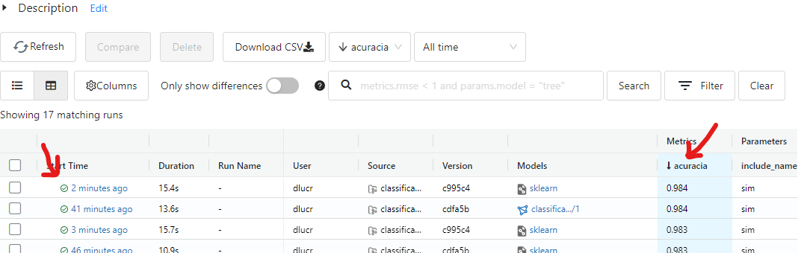

Veja como a outra execução já está registrada como modelo, na versão 1. Agora vamos registrar essa nova execução como a versão 2 desse mesmo modelo:

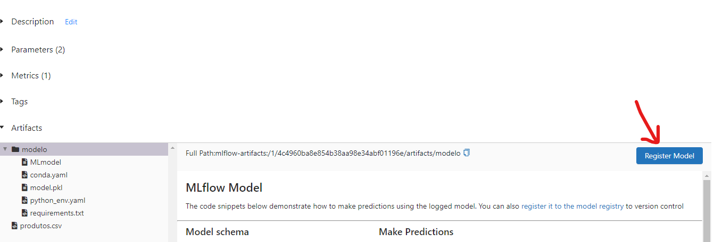

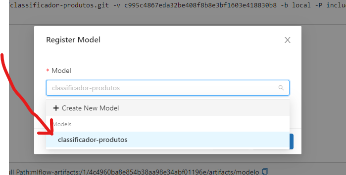

Ao escolher o mesmo modelo que antes, será criada a versão 2. Clique na aba "Models" no topo da página, e depois em "classificador-produtos" para ver as duas versões:

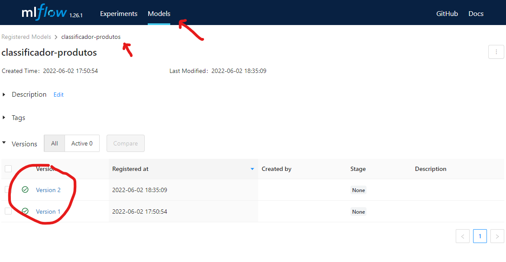

Como discutido anteriormente, poderíamos simplesmente nos referir aos números das versões para utilizar esses modelos, seja ao subir uma API ou ao realizar uma tarefa em _batch_, como já fizemos até agora. Mas podemos também usar o conceito de _Stage_. Vamos colocar a versão 1 como _Production_ e a versão 2 como _Staging_. Isso pode ser feito clicando-se na versão e escolhendo a opção "Transition to":

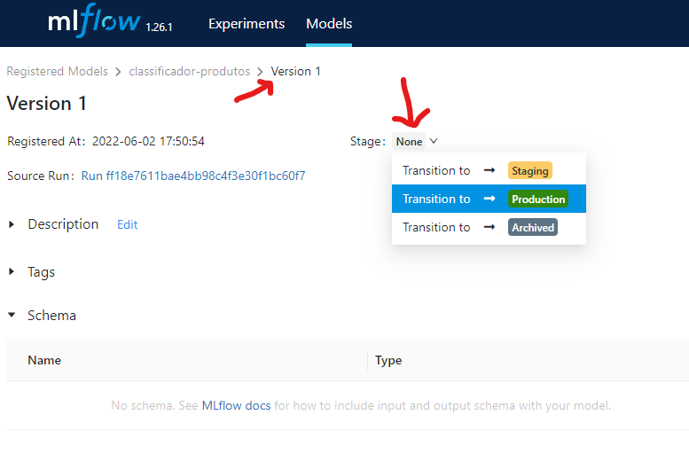

Faça isso agora. Coloque a versão 1 em estágio de _Production_ e a versão 2 em estágio de _Staging_.

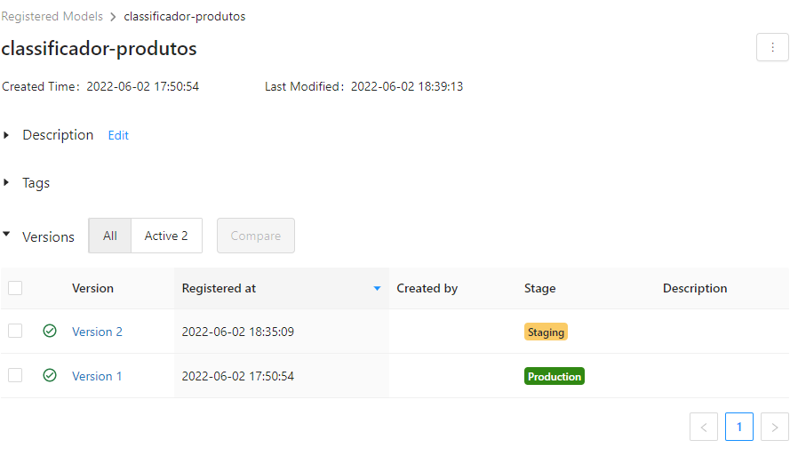

Agora vamos modificar o arquivo `batch.py` para recuperar os modelos utilizando fases ao invés de números:

```diff
import mlflow.pyfunc
import os

model_name = "classificador-produtos"
-model_version = 1
os.environ['MLFLOW_TRACKING_URI']='http://localhost:5000'

-model = mlflow.pyfunc.load_model(
+staging_model = mlflow.pyfunc.load_model(
+    model_uri=f"models:/{model_name}/Staging"
+)
+production_model = mlflow.pyfunc.load_model(
+    model_uri=f"models:/{model_name}/Production"
+)

data = ["boneca de pano", "halo", "senhor dos anéis", "senhor dos aneis"]

-categorias = model.predict(data)
+categorias_staging = staging_model.predict(data)
+categorias_production = production_model.predict(data)

-print(categorias)
+print("Modelo Staging: ")
+print(categorias_staging)
+print("Modelo Production: ")
+print(categorias_production)
```

O resultado irá mostrar os resultados de cada versão. Veja como a versão de _Staging_ prediz corretamente a categoria sem acentos. Vamos trocar as versões para ver como é fácil? Na interface do MLflow, troque as versões de _Staging_ para _Production_ e vice-versa. Cuidado para não arquivar automaticamente as versões ao fazer as alterações (será exibida uma opção para fazer isso, desmarque). Caso tenha arquivado, porém, basta resgatá-las e reativá-las com as transições desejadas.

Re-execute o script e veja que as mudanças se refletiram sem a necessidade de mudar o código. Ou seja, os usuários dos modelos não precisam sempre ficar sabendo das escolhas dos melhores modelos, podem apenas utilizar a versão marcada como _Production_ ou _Staging_, confiando nos desenvolvedores dos modelos.

## 10.4.7 Considerações finais

O MLflow é uma ferramenta que pode ser muito útil para diferentes cenários, desde pequenas equipes até grandes empresas. Não é uma ferramenta que resolve todos os problemas de MLOps, mas ela ajuda em diferentes momentos. Além de ser de fácil instalação e configuração, o MLflow pode ser utilizado em partes. Caso queira usar somente o componente de rastreamento de experimentos, é possível. Caso queira usar o componente de projetos, também é possível. O registro de modelos também facilita bastante a vida quando a quantidade de modelos e versões é muito grande.

Há muitas outras funções e possibilidades de configuração e uso do MLflow. A [documentação oficial](https://mlflow.org/docs/latest/index.html#) é bastante rica e cheia de exemplos. Vale a pena estudar!


