# 2.1 Do notebook para aplicação - parte 1

Recapitulando a figura do Capítulo 1 que ilustra um fluxo DevOps, esse capítulo tem como objetivo abordar o item 1 da figura, ou seja, o ambiente de desenvolvimento.


Porém, o objetivo do livro é ensinar conceitos de DevOps para Machine Learning e não de desenvolvimento de modelos de Machine Learning. Assim, assume-se que o leitor já seja capaz de construir um experimento usando um [notebook Jupyter](https://jupyter.org). Mas um notebook não é apropriado para muitas das tarefas necessárias para um negócio ou uma organização. Portanto, é preciso migrar aquela solução experimental, exploratória, para uma solução que tenha um objetivo de negócio bem estabelecido.

Imagine um administrador de um site de _e-commerce_, que recebe uma lista de produtos, salva-os em um banco de dados, mas ao fazê-lo descobre que estes não têm uma categoria definida. O administrador precisa categorizá-los antes de cadastrá-los para venda. Seria ótimo se existisse uma forma de, automaticamente, definir as categorias, com base em um modelo de _Machine Learning_, não?

Imagine então que um cientista de dados desenvolva uma solução que tem resultados excelentes, mas que funciona somente em um notebook. O cientista então poderia, manualmente, carregar essa lista em um arquivo `.csv` em seu notebook, executá-lo, exportar o resultado em outro arquivo `.csv` e posteriormente substituir os valores no banco de dados.

Pode até ser que isso aconteça uma ou duas vezes sem maiores problemas. Mas depois da décima ou vigésima ocasião, a tarefa já terá se tornado extremamente tediosa e inoportuna.

Por isso, uma opção melhor seria construir um aplicativo que faça tudo isso diretamente no banco de dados de produtos. É isso que faremos neste capítulo, em particular nesta primeira seção.

Utilizaremos como exemplo um modelo de classificação de produtos baseado em um _dataset_ disponibilizado como parte da documentação da ferramenta [Apache Marvin](https://marvin.apache.org), e que faz uso das bibliotecas [NLTK](https://www.nltk.org), [Pandas](https://pandas.pydata.org) e [scikit-learn](https://scikit-learn.org).

## 2.1.1 Preparando o ambiente para abrir o notebook

A primeira coisa a fazer é reproduzir o notebook original, para garantir que está funcionando corretamente. Para isso, vamos criar um ambiente virtual. Como [discutido anteriormente](../1-introducao/1-4-configuracao-do-ambiente-python.md), a criação de um ambiente virtual não é obrigatória, mas facilita o gerenciamento das dependências e evita conflitos, além de dar um controle maior sobre quais bibliotecas serão posteriormente instaladas no ambiente de produção, minimizando assim o uso de memória.

Também como [já explicado](\(../1-introducao/1-4-configuracao-do-ambiente-python.md\)), procure seguir as mesmas versões dos comandos aqui, mesmo que haja versões mais recentes, pois os exemplos foram testados nessas versões.

Vamos criar um ambiente virtual que servirá exclusivamente para abrir e executar notebooks. Nele instalaremos a ferramenta [notebook Jupyter](https://jupyter.org). Ele vai ser diferente do ambiente onde criaremos a aplicação, e que servirá de base para o ambiente de produção. Onde não será necessária a ferramenta notebook, nem outros pacotes que podem ser instalados de forma exploratória.

Execute os seguintes comandos:

1. Criar o ambiente virtual

```
pyenv virtualenv 3.10.2 jupyter-dev
```

1. Ativar o ambiente virtual (note como o nome vai começar a aparecer no prompt, entre parêntesis, a partir deste momento)

```
pyenv activate jupyter-dev
```

1. Instalar a ferramenta Jupyter notebook

```
pip install notebook
```

## 2.1.2 Executando o modelo de classificação de produtos

Crie uma pasta qualquer em seu computador, e nela salve os seguintes arquivos:

* [produtos.csv](codigo/classificador-produtos/produtos.csv) - conjunto de dados anotado contendo produtos e sua classificação. Existem quatro categorias de produtos neste conjunto: game, maquiagem, brinquedo e livro
* [produtos.ipynb](codigo/classificador-produtos/produtos.ipynb) - notebook com a solução para classificação de produtos

Abra um terminal e navegue até a pasta criada e, certificando-se que o ambiente "jupyter-dev" está ativado, execute o seguinte comando:

```
jupyter notebook
```

Será aberta uma janela do navegador, onde são visíveis os dois arquivos salvos:

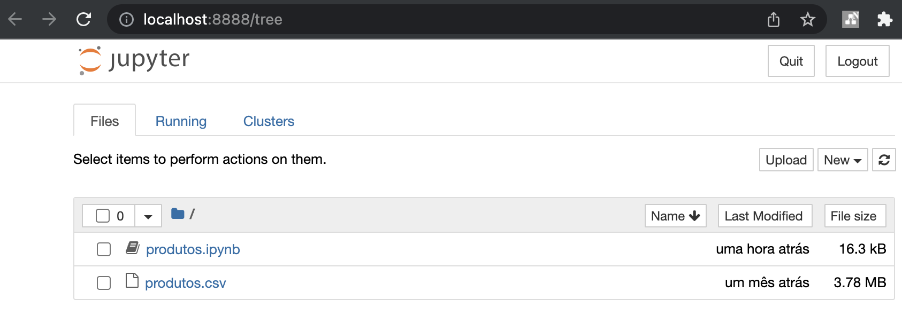

Caso haja algum problema, como a porta estar ocupada, [procure na documentação oficial maneiras de resolver esse problema](https://docs.jupyter.org/en/latest/running.html#how-do-i-start-the-notebook-using-a-custom-ip-or-port).

Clique no arquivo `produtos.ipynb` para abri-lo. Para executá-lo, clique no botão indicado na figura abaixo (ou execute "Kernel" -> "Restart & Run All").

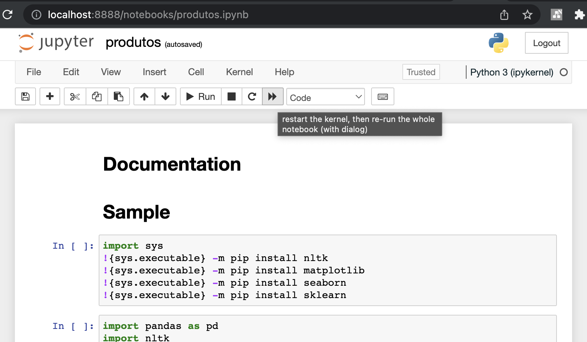

Se tudo der certo, o notebook será executado, o que irá disparar a instalação das bibliotecas necessárias, importação e limpeza dos dados, treinamento do modelo e uma predição de exemplo. Veja, na figura abaixo, o resultado final, onde a predição indicou que o texto se refere a um brinquedo.

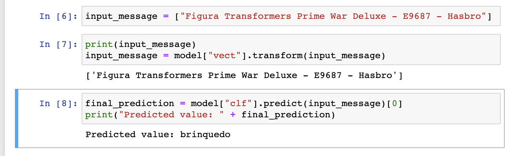

## 2.1.3 Aplicação Python 1 - classificando produtos automaticamente em um banco de dados

A primeira aplicação que faremos será uma aplicação _offline_, ou seja, ela irá executar de maneira esporádica, por solicitação de um usuário administrador. A princípio, executaremos a tarefa manualmente, mas mais adiante mostraremos como isso pode ser feito de forma automática, para ser executada periodicamente (uma vez por dia, uma vez por semana, etc).

Nosso banco de dados será bastante simples. Temos uma coleção com duas colunas:

* Descrição de produtos: iremos preencher com alguns exemplos de brinquedos, maquiagens, games e livros
* Categoria: inicialmente estará em branco

A aplicação irá ler a descrição de cada produto e preencher sua categoria automaticamente, com base no modelo treinado anteriormente.

O primeiro passo, portanto, será criar o banco de dados. Para este exemplo, criaremos um banco de dados no [Firebase](https://firebase.google.com), um serviço de nuvem que possui uma cota gratuita e de fácil configuração. É perfeitamente possível reproduzir esse exemplo com um banco de dados local, como [MySQL](https://www.mysql.com), mas o código precisará ser adaptado nos locais apropriados. Deixamos isso mais para a frente.

Por enquanto, acesse o endereço [https://console.firebase.google.com/](https://console.firebase.google.com) no navegador.

Depois de fazer login com uma conta do Google, clique em `Criar um projeto`.

Como nome do projeto, escolha `bookdevopsml1`. Desative a opção para utilizar Google Analytics e prossiga. Assim que o projeto for criado, você será redirecionado para a página inicial do projeto:

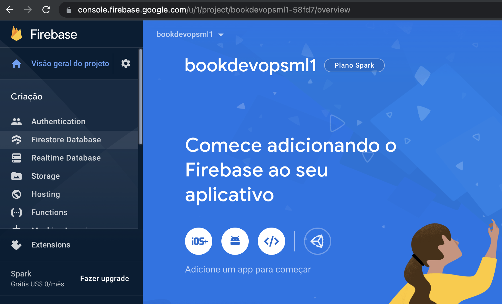

Selecione a opção `Firestore Database`, depois `Criar banco de dados`. Escolha a opção `Iniciar no modo de teste`. Esse modo não é seguro, mas é ideal para você conseguir rapidamente colocar a solução para funcionar.

Na página a seguir, é preciso escolher uma região para implantar o banco de dados. Escolha a mais próxima de você (no Brasil, a escolha provavelmente será `southamerica-east1`).

Depois de algum tempo, seu banco de dados estará criado, e você verá uma página parecida com essa aqui:

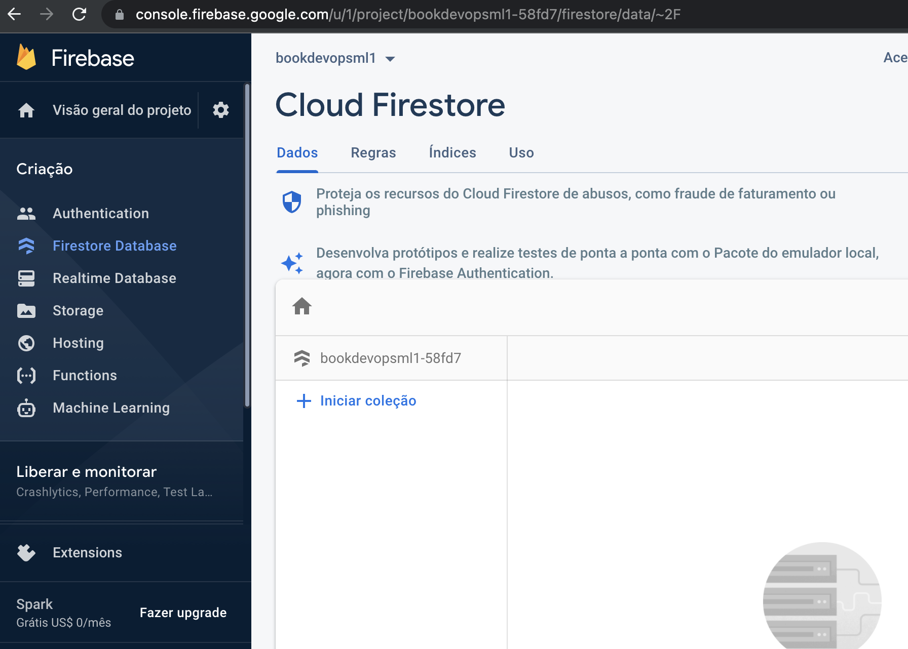

Vamos agora adicionar nossa primeira coleção, clicando em `+ Iniciar coleção`. Escolha o nome `produtos` para essa coleção, e prossiga. A seguir é necessário incluir pelo menos um documento nessa coleção. Vamos inserir um documento de exemplo, com os campos `descricao` (pode copiar de algum site de e-commerce, ou do arquivo `produtos.csv`, ou de sua própria cabeça. Lembre-se que apenas quatro categorias de produtos são previstas) e `categoria` (deixe vazio). No campo `id`, pode selecionar a opção `código automático`, assim o novo documento terá uma string aleatória como identificador:

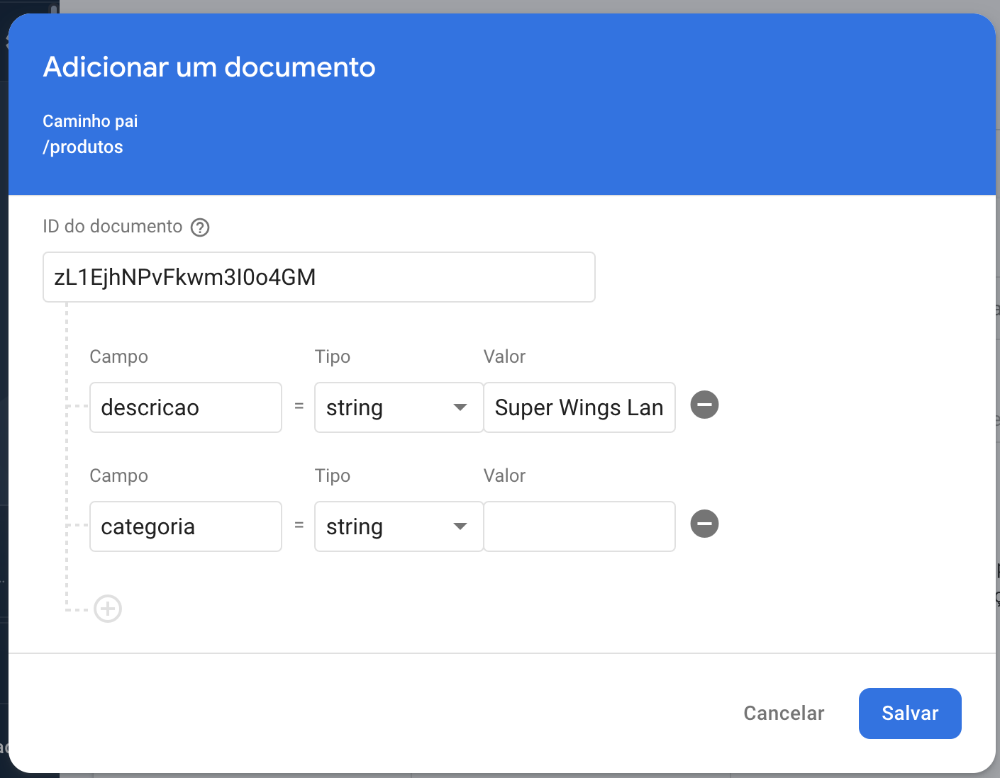

Adicione quatro ou cinco documentos, todos eles com uma descrição qualquer e a categoria vazia.

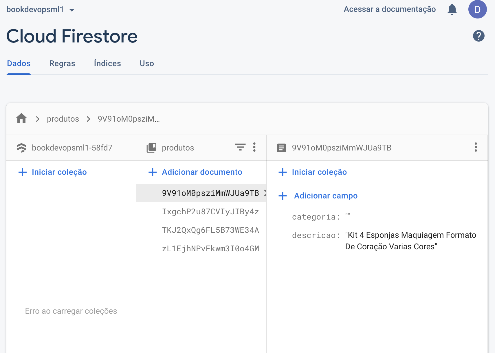

Agora que já temos o banco de dados, estamos quase prontos para partir para a codificação em Python. Mas ainda resta uma última configuração para fazer no Firebase. Precisamos adicionar um token de autenticação para podermos fazer o acesso remoto ao banco de dados (lembre-se, o Firestore é um banco de dados que roda na nuvem, portanto para acessá-lo a partir de outro local, como sua máquina pessoal, é preciso autorização).

Retornando à página inicial do Firebase, acesse o menu `Configurações do projeto` (que fica na engrenagem, ao lado da visão geral do projeto). Em seguida, acesse `Contas de serviço`, depois `SDK Admin do Firebase`, escolhendo a opção Python. Clique em `Gerar nova chave privada`, o que forçará seu navegador a baixar um arquivo `.json` contendo a chave de acesso. Em seguida, copie o trecho de código em Python que faz a configuração de acesso, e estamos prontos para começar a codificar.

Agora vamos criar um novo ambiente virtual para começarmos a programar o aplicativo. Nesse novo ambiente, não utilizaremos jupyter notebook, apenas as bibliotecas necessárias para acessar o Firebase e realizar as predições com base no modelo salvo. Falaremos mais sobre dependências daqui a pouco. Faça isso com os comandos:

```
pyenv virtualenv 3.10.2 classificador1     
pyenv activate classificador1
```

Em seguida, crie uma pasta qualquer em seu computador, onde iremos colocar os arquivos do aplicativo. Salve a chave de acesso (o arquivo .JSON baixado do Firebase console) nesta pasta.

Crie um arquivo chamado `app.py`, com o seguinte conteúdo:

```python
import firebase_admin
from firebase_admin import credentials
from firebase_admin import firestore

# substitua o nome do arquivo .json a seguir pela chave .json que você baixou
# do console do Firebase
cred = credentials.Certificate("bookdevopsml1-58fd7-firebase-adminsdk-azzsg-09b08b05c0.json")
firebase_admin.initialize_app(cred)

db = firestore.client()

produtos_ref = db.collection('produtos')
docs = produtos_ref.stream()

for doc in docs:
    d = doc.to_dict()
    print('Descrição = {}\n   Categoria = {} '.format(d['descricao'], d['categoria']))
```

Salve o arquivo e execute o script, não esquecendo de antes instalar o módulo do Firebase:

```
pip install firebase_admin
python app.py
```

Se tudo der certo, você verá na saída da execução os produtos que cadastrou no banco de dados (ainda sem categoria). Isso significa que o nosso código Python conseguiu acessar a base de dados com sucesso. Mas por enquanto, estamos apenas LENDO o banco de dados.

Agora precisamos dar o passo seguinte: que é migrar nosso modelo de classificação de produtos para esse aplicativo Python, para poder ESCREVER a categoria (que está em branco e será automaticamente inferida pelo modelo). Para isso, vamos retornar ao notebook original. Volte ao ambiente virtual do notebook, volte à pasta onde está o notebook, e inicie o notebook:

```
pyenv activate jupyter-dev
cd <caminho para a pasta onde está produtos.ipynb>
jupyter notebook
```

Este notebook, como muitos outros que são desenvolvidos, fazem todo o processamento dentro do escopo do próprio notebook, ou seja, são códigos feitos para serem executados aqui e somente aqui. Para que o modelo treinado possa ser utilizado em outro local, como é nosso objetivo aqui, é necessário de alguma forma exportá-lo para reutilização posterior. Vamos fazer isso usando o [pickle](https://docs.python.org/3/library/pickle.html), um formato padrão do Python para serialização de objetos (transformá-los em um formato que pode ser salvo em disco, ou transmitido via rede).

Vamos modificar o seguinte trecho do notebook, que é o trecho que faz o treinamento do modelo de classificação. Adicione as seguintes linhas de código e execute o notebook.

```diff
from sklearn.naive_bayes import MultinomialNB
+ # Biblioteca para salvar objetos Python em disco
+ import pickle

clf = MultinomialNB()
clf.fit(dataset["X_train"], dataset["y_train"])

model = {
    "clf" : clf,
    "vect": dataset["vect"]
}
+ # Salva o modelo em um arquivo
+ pickle.dump(model, open("model.sav", 'wb'))
```

Após a execução, veja que no diretório atual, será criado o arquivo `model.sav`. Copie este arquivo para a mesma pasta do aplicativo Python que estamos construindo (a pasta onde você criou o arquivo `app.py`).

Agora vamos alterar o aplicativo para:

* Carregar o modelo a partir do arquivo `model.sav`
* Realizar a predição para cada produto da base de dados
* Salvar a categoria de cada produto no banco de dados

Podemos fechar o notebook agora, e retornar ao ambiente virtual `classificador1`:

```
pyenv activate classificador1
cd <caminho para a pasta onde está o aplicativo Python>
vim app.py (ou outro editor de sua preferência)
```

Vamos modificar o código que fizemos antes para refletir as três alterações acima:

```diff
import firebase_admin
from firebase_admin import credentials
from firebase_admin import firestore
+ import pickle # Importa pickle

+ model = pickle.load(open('model.sav', 'rb')) # Carrega o modelo do disco

# substitua o nome do arquivo .json a seguir pela chave .json que você baixou
# do console do Firebase
cred = credentials.Certificate("bookdevopsml1-58fd7-firebase-adminsdk-azzsg-09b08b05c0.json")
firebase_admin.initialize_app(cred)

db = firestore.client()

produtos_ref = db.collection('produtos')
docs = produtos_ref.stream()

for doc in docs:
    d = doc.to_dict()
    print('Descrição = {}\n   Categoria = {} '.format(d['descricao'], d['categoria']))
+     input_message = [d['descricao']] # Monta a mensagem para servir de entrada ao modelo
+     input_message = model["vect"].transform(input_message) # Aplica o preprocessamento na entrada
+     final_prediction = model["clf"].predict(input_message)[0] # Realiza a predição
+     doc_ref = db.collection('produtos').document(doc.id) # Obtém uma referência para o documento no BD
+     doc_ref.update({"categoria": final_prediction}) # Salva o resultado no banco de dados
```

O código está pronto, mas ele ainda não vai funcionar, pois o modelo tem uma dependência implícita para a biblioteca `scikit-learn`, e aqui vale a pena discutir sobre o gerenciamento correto de dependências.

Voltando ao notebook original, veja os comandos no início:

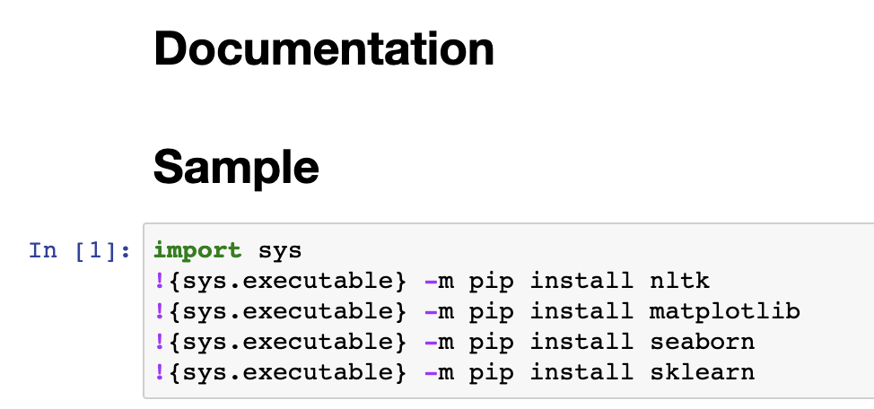

Esse tipo de comando é muito comum, pois muitas vezes o cientista de dados quer ter à sua disposição várias opções e bibliotecas para trabalhar e explorar os dados. Neste caso, está sendo instalada, por exemplo, a biblioteca [NLTK](https://www.nltk.org), para o preprocessamento dos dados textuais. Também está sendo instalada a biblioteca [matplotlib](https://matplotlib.org), que de fato nem está sendo utilizada! Novamente, isso é comum. Talvez o código tenha sido herdado de outro notebook, ou talvez o cientista de dados tinha imaginado usá-la, a princípio, mas depois decidiu que não era necessária.

Aqui entra a importância do isolamento dos ambientes. Lembre-se: o notebook está rodando em um ambiente virtual chamado `jupyter-dev`, e a aplicação está rodando em um ambiente virtual chamado `classificador1`.

O ambiente `jupyter-dev` fica na máquina de desenvolvimento, então há maior liberdade para experimentar, testar.

Já o ambiente `classificador1` é onde vai rodar a solução final, o aplicativo, que vamos querer colocar em um ambiente de produção. Neste cenário, saber exatamente quais dependências são necessárias, e minimizar a quantidade de bibliotecas utilizadas, restringindo-se ao mínimo necessário, é crucial para evitar problemas. É também muito importante saber exatamente quais versões estão sendo utilizadas.

Por isso, vamos pensar muito bem antes de sair instalando pacotes usando `pip install` ou simplesmente copiando tudo o que tem no ambiente de desenvolvimento para o ambiente de produção. Certamente não precisamos do `jupyter notebook` (a solução vai rodar em linha de comando). Também não precisamos do `matplotlib` ou `NLTK` (pois o modelo treinado independe do preprocessamento). Mas vamos precisar do `scikit-learn`. Também vamos precisar do `firebase_admin` (que instalamos antes, usando `pip install`).

Para ter um controle preciso sobre esse processo, vamos usar um recurso do `pip`, que é um arquivo chamado `requirements.txt`. Crie esse arquivo, na mesma pasta do projeto, e vamos começar a colocar o conteúdo nele.

Vamos começar pelo `scikit-learn`. Para adicioná-lo ao arquivo `requirements.txt`, precisamos saber exatamente qual versão utilizar. O notebook original não define uma versão específica, então ele automaticamente utiliza a última versão. Novamente, isso não é tão importante em um ambiente de desenvolvimento, mas para a versão de produção é crucial definir a versão exata em que o código foi testado.

Para descobrir a última versão de um pacote, acesse o [repositório oficial de pacotes Python, o PyPI - Python Package Index](https://pypi.org), e procure por scikit-learn. O resultado da busca irá indicar a versão mais recente. Na figura a seguir, a versão é 1.0.2:

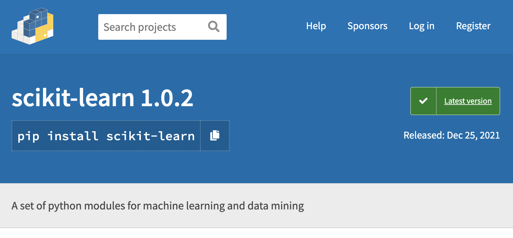

Portanto, vamos adicionar essa versão específica no arquivo `requirements.txt`:

```
scikit-learn==1.0.2
```

Bastante simples, não é?

Mas ainda não está pronto. Lembremos que, antes, instalamos o `firebase_admin` usando `pip install`. Você pode repetir o processo, pesquisando no [PyPI](https://pypi.org), ou você pode, alternativamente, verificar qual é a versão instalada no ambiente atual, usando o comando:

```
pip freeze
```

O resultado desse comando, porém, vai listar TODOS os pacotes instalados, ou seja, aqueles que de fato instruímos explicitamente, e também aqueles pacotes requeridos indiretamente por estes. O resultado desse comando vai ser mais ou menos esse:

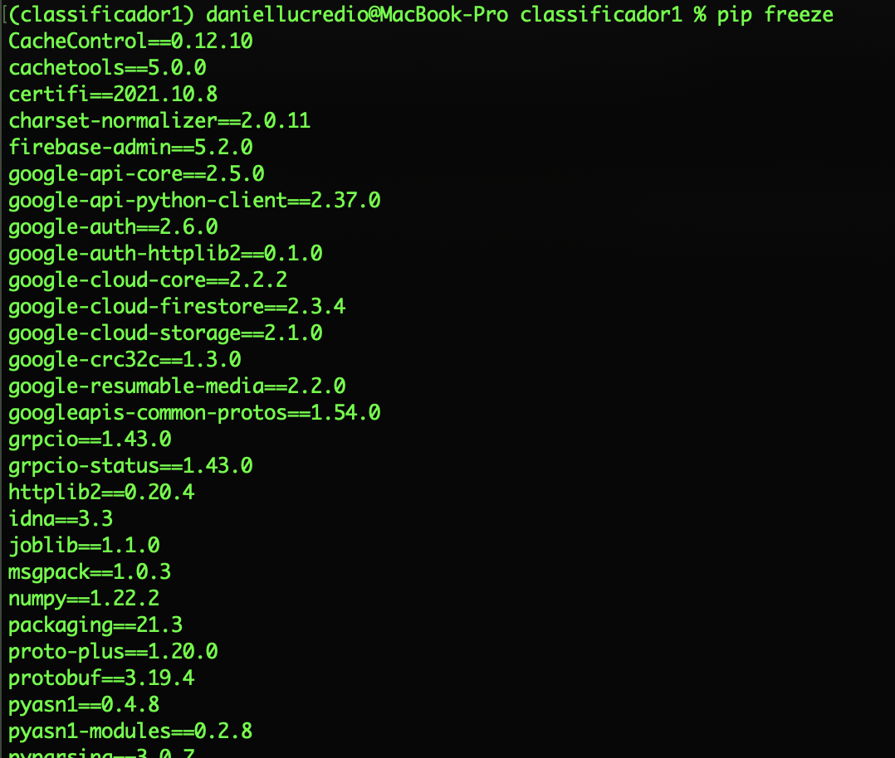

Veja como essa lista tem o pacote `firebase-admin` (que instalamos explicitamente), mas também tem, por exemplo, o pacote `protobuf` (que não instalamos, e que foi automaticamente instalado pelo `pip`).

Seria possível simplesmente copiar todo o resultado do comando `pip freeze` para o arquivo `requirements.txt`, e alguns tutoriais por aí ensinam exatamente isso. Mas essa abordagem [pode gerar problemas](https://medium.com/@tomagee/pip-freeze-requirements-txt-considered-harmful-f0bce66cf895), poluindo o nosso arquivo `requirements.txt` com coisas desconhecidas, e potencialmente introduzindo incompatilidades entre versões menores, que poderiam já ter sido solucionadas pelos pacotes originais. Uma solução melhor (apesar de ser um pouco mais trabalhosa) é manter esse arquivo cuidadosamente à mão! Devemos selecionar somente aquelas bibliotecas que queremos utilizar, e apenas estas. Deixe o `pip` fazer o trabalho de procurar por outras.

Em resumo, vamos adicionar somente o `firebase_admin`, na versão atual (no exemplo, 5.2.0, conforme revelou o `pip freeze`), ao arquivo `requirements.txt`, que ficará assim no final:

```
scikit-learn==1.0.2
firebase-admin==5.2.0
```

Mas apenas colocar uma linha no arquivo `requirements.txt` não é suficiente para instalar o pacote no ambiente. Para isso, execute o comando:

```
pip install -r requirements.txt
```

Esse comando irá instalar (se necessário), os pacotes especificados no arquivo `requirements.txt`.

Além de deixar explícitas as dependências exatas do nosso aplicativo, essa abordagem tem outros benefícios importantes:

* Quando formos implantar essa solução em um ambiente de produção, temos uma maior certeza de que somente os pacotes necessários e suas dependências serão instalados, evitando assim pacotes desnecessários e não utilizados, que ocupariam espaço à toa;
* Há maior certeza de compatibilidade e corretude, pois estamos fixando as versões dos pacotes que provavelmente já foram bem testadas no ambiente de desenvolvimento. Claro, estaremos desprezando novidades e novas funções que aparecerem depois destas, mas o desenvolvedor tem a obrigação de testar tudo muito bem, sempre que uma nova versão surge, ANTES de colocá-la em produção;
* A abordagem também ajuda no trabalho colaborativo. Outro desenvolvedor poderá rapidamente reinstalar as mesmas dependências em sua própria máquina, e a certeza de que o código será compatível (já que estamos fixando as versões) será maior.

Agora que está tudo instalado, podemos rodar o código:

```
python app.py
```

Se a execução for bem sucedida, o banco de dados terá sido atualizado, e cada produto agora tem uma categoria preenchida (lembre-se, antes tínhamos deixado em branco). Confira no console do Firebase e veja você mesmo. No exemplo a seguir, veja como a categoria foi corretamente preenchida com `maquiagem`:

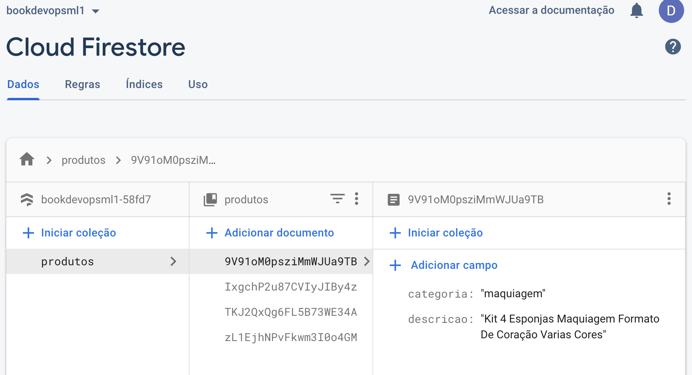

## 2.1.4 Considerações finais

Com isso, terminamos o primeiro aplicativo, onde conseguimos:

* Migrar o código que só funcionava em um notebook para um aplicativo real; e
* Aplicar a predição em um banco de dados real (na nuvem).

Lembrando que essa aplicação foi projetada para funcionar de modo _offline_, ou seja, é um administrador quem irá executá-la manualmente. Futuramente, veremos como tornar esse aplicativo mais fácil de ser implantado, executado e atualizado, inclusive migrando também a parte que se refere ao treinamento do modelo para fora do notebook. Tudo isso é importante no processo de DevOps para Machine Learning.

Exercite sua imaginação agora, e pense nos modelos que já desenvolveu. Você vê uma aplicação parecida com esta, para atender a algum requisito importante de negócio? O que faria diferente?

***

### Contribuições a esta seção

* O modelo de classificação de produtos foi desenvolvido por [Letícia Bossatto Marchezi](https://www.linkedin.com/in/letmarchezi/)
* Os autores também agradecem às orientações e dicas valiosas de Lucas Cardoso Silva
