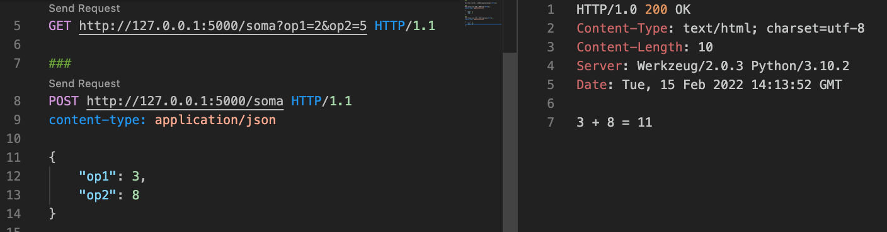

# 2.2 Do notebook para aplicação - parte 2

Nesta seção utilizaremos o mesmo modelo da seção anterior, porém de um jeito diferente. Ao invés de criarmos uma aplicação _offline_, que executa uma tarefa de atualização em lote diretamente em um banco de dados, faremos uma API que pode ser consumida para fazer predições individuais em tempo real, ou seja: dada uma descrição textual, essa aplicação irá retornar sua categoria inferida. 

Imagine a seguinte situação: em um site de e-commerce, um vendedor deseja cadastrar um produto para venda. Ele começa a digitar a descrição de seu produto, e assim que termina, a categoria é automaticamente preenchida. O vendedor confere a informação e prossegue com o cadastro.

Vamos dar início a esse desenvolvimento? Será necessário, inicialmente, uma breve introdução aos conceitos de desenvolvimento de software para web e criação de APIs web, mas nada muito aprofundado ou demorado. Logo em seguida iremos construir essa API, reutilizando o mesmo modelo que criamos na seção anterior. Por fim, demonstraremos seu uso em um exemplo real de um aplicativo web.

# 2.2.1 Uma breve introdução ao desenvolvimento web

Este livro não se propõe a ensinar todos os detalhes sobre o desenvolvimento web, mas a implantação de um modelo de Machine Learning para acesso _online_, na prática, sempre será feita por meio de tecnologias web.

Mas não se preocupe! Não ficaremos aqui explicando detalhes dos protocolos HTTP, ou sobre as diferentes arquiteturas do tipo cliente-servidor que podem ser construídas, ou os padrões de projeto comumente utilizados no desenvolvimento web. Vamos lhe explicar os conceitos mínimos necessários para que você consiga colocar esse modelo em produção de uma forma que ele possa ser acessado por uma aplicação web ou mesmo uma aplicação móvel. Para isso, vamos focar no exemplo mencionado no início da seção.

A Figura a seguir ilustra a arquitetura geral da solução que iremos construir.


Essa é uma arquitetura cliente servidor típica:

* O cliente é um aplicativo web feito em Javascript + HTML que roda dentro de um navegador web
* O servidor é um servidor web Python, configurado para responder a diferentes tipos de requisições

Cliente e servidor se comunicam pela Internet. Neste exemplo, a comunicação acontecerá sobre o protocolo [HTTP](https://developer.mozilla.org/pt-BR/docs/Web/HTTP/Overview), que é a opção mais comumente utilizada, apesar de existirem [alternativas interessantes](https://grpc.io/).

Sendo uma comunicação baseada em HTTP, normalmente há uma requisição (_HTTP Request_) e uma resposta (_HTTP Response_). Isso é o mais comum, apesar de existirem [alternativas a esse modelo](https://developer.mozilla.org/pt-BR/docs/Web/API/WebSockets_API).

Neste exemplo, a requisição será enviada assim que o vendedor terminar de digitar a descrição de seu produto. A requisição consiste de uma "pergunta" simples neste caso: qual é a categoria do produto sendo descrito? Essa "pergunta" vai ser respondida por um serviço web. E a "resposta", neste caso, é a categoria do produto sendo descrito.

Um conjunto de serviços relacionados pode ser agrupado em uma única interface, que pode ser utilizada por programadores de aplicações, sendo por isso chamada de Interface de Programação de Aplicações (ou API - _Application Programming Interface_).

Então agora você já sabe o que significa API HTTP - É uma API (um conjunto de serviços para se programar aplicativos) baseada no protocolo HTTP. É isso que faremos neste exemplo.

Construir o lado do cliente desta aplicação vai além do escopo deste livro, pois isso envolve programação HTML e Javascript, e não tem nada a ver com Machine Learning.

Mas o lado do servidor, que neste caso vai ter essencialmente uma API para fazer a predição (e você já deve saber como fazer uma predição), faz parte do escopo deste livro. Na verdade, é o *ponto central* deste livro, não é? Queremos justamente fazer que nossos modelos de alta precisão e revocação, que construímos com muito esforço e dedicação, sirvam a algum propósito de negócio, que neste caso consiste na integração a uma aplicação que será utilizada por pessoas no mundo real.

Volte à figura e repare no seguinte: no lado do servidor, existem basicamente duas coisas: código Python que faz o preprocessamento e predição (reutilizando um modelo já treinado), e a parte referente à API, ou seja, código responsável por expor essa funcionalidade para ser utilizada pela Internet, por meio de HTTP.

O código Python que faz o preprocessamento e predição, reutilizando um modelo já treinado, é essencialmente o mesmo da seção anterior, portanto já temos metade do caminho andado. O restante nós veremos a seguir.

# 2.2.2 Uma API calculadora

Nesta seção vamos mostrar um exemplo concreto de como construir uma API HTTP. O exemplo usa a linguagem Python (como todo o livro, por ser a linguagem mais utilizada em projetos de Machine Learning), e se baseia em um framework chamado [Flask](https://flask.palletsprojects.com/). Como sempre, não é a única opção, mas é de longe a mais utilizada, pelo menos no momento da escrita deste livro.

Primeiro vamos fazer uma API HTTP que não tem nada de Machine Learning, servindo para você entender a essência do que estamos construindo. E não vamos mais perder tempo com explicações, indo direto ao código. Comece, [como já discutimos antes](../1-introducao/1-4-configuracao-do-ambiente-python.md), criando um novo ambiente virtual para o exemplo:

```sh
pyenv virtualenv 3.10.2 http-api-flask
pyenv activate http-api-flask
```

Aproveite e crie uma nova pasta para o exemplo, e crie um arquivo chamado ```app.py```, com o seguinte conteúdo:

```python
from flask import Flask
app = Flask(__name__)

@app.route('/soma')
def soma():
    x = 2
    y = 2
    res = x + y
    return '{} + {} = {}'.format(x,y,res)

@app.route('/subtracao')
def subtracao():
    x = 2
    y = 2
    res = x - y
    return '{} - {} = {}'.format(x,y,res)
```

Pronto! Nossa API tem dois serviços (cada função é um serviço), um para realizar somas e outro para realizar subtrações. Por enquanto não são muito úteis, como você deve estar imaginando (os operandos estão fixos, e a resposta é uma cadeia). Mas faremos melhorias logo a seguir.

Antes de executar, é necessário instalar as dependências, que neste caso é apenas o Flask, por enquanto. Você pode instalar diretamente executando um comando ```pip install```, mas aqui recomendamos que você sempre utilize o arquivo ```requirements.txt```. Crie-o, com o seguinte conteúdo (você pode verificar a versão no [pypi.org](pypi.org)):

```
Flask==2.0.2
```

Agora vamos instalar, executando:

```sh
pip install -r requirements.txt
```

E para rodar, basta executar o seguinte comando:

```sh
export FLASK_DEBUG=1
flask run
```

Ou, se estiver no Windows PowerShell:

```sh
$env:FLASK_DEBUG=1
flask run
```

A variável ```FLASK_DEBUG=1``` indica que o servidor será iniciado em modo de depuração. Além de um maior controle sobre a execução, esse modo automaticamente detecta mudanças feitas no código-fonte. Assim, sempre que mudar algo, basta salvar o arquivo e o servidor automaticamente irá recarregar a nova versão.

O resultado será algo parecido com isto:


Note o aviso alertando sobre esta não ser a forma correta de se colocar o servidor em produção. Trataremos disso mais adiante. Note que também é exibido um endereço web: ```http://127.0.0.1:5000/```. Sem entrar em muitos detalhes, a explicação é simples:

* ```127.0.0.1``` é um [endereço IP](https://pt.wikipedia.org/wiki/Endere%C3%A7o_IP). Endereços IP servem para localizar uma máquina em uma rede, no caso a Internet. Este endereço em particular não é um endereço real, e sim um atalho para a máquina local (a sua máquina, onde você executou o comando ```flask run```)
* ```5000``` é uma porta de comunicação, utilizada pelo sistema operacional para saber para onde enviar os pacotes que chegam pela rede (ou neste caso, como tudo está rodando localmente, não chega a trafegar pela rede)

Esse endereço é necessário para sabermos para onde enviar a nossa requisição HTTP (volte na Figura do início desta seção, e encontre o pequeno pacote marcado com "HTTP Request"). Sem um endereço, não é possível enviar pacote algum.

Vamos então testar nossa API, enviando um pacote para ela. Uma forma de fazer isso é abrir um navegador e digitar esse endereço na barra de endereços. Ao fazer isso, o navegador irá efetivamente enviar uma requisição HTTP para o endereço digitado. Mas veja o que acontece:


A mensagem diz que a [URL](https://pt.wikipedia.org/wiki/URL) não foi encontrada neste servidor. E faz sentido, não faz? Lembre-se, nós temos 2 serviços no servidor: um para soma e um para subtração. Qual dos dois estamos requisitando?

A resposta pode ser encontrada no código da aplicação. Veja as linhas destacadas:

```diff
from flask import Flask
app = Flask(__name__)

+@app.route('/soma')
def soma():
    x = 2
    y = 2
    res = x + y
    return '{} + {} = {}'.format(x,y,res)

+@app.route('/subtracao')
def subtracao():
    x = 2
    y = 2
    res = x - y
    return '{} - {} = {}'.format(x,y,res)
```

Essa anotação ```app.route``` indica ao ```Flask``` como encontrar, dentro do único servidor, os diferentes serviços, por meio de uma cadeia que deve ser concatenada ao endereço para formar a URL completa. Em outras palavras;

* Se quisermos mandar uma requisição para o serviço de soma, devemos enviá-la para o endereço ```http://127.0.0.1:5000/soma``` (note o "/soma" concatenado após o endereço)
* Se quisermos mandar uma requisição para o serviço de subtração, devemos enviá-la para o endereço ```http://127.0.0.1:5000/subtracao``` (note o "/subtracao" concatenado após o endereço)

Neste caso, a rota (route) está igual ao nome das funções (a rota "soma" está associada à função "soma()"), mas isso não é obrigatório.

Refazendo o teste, agora indicando corretamente o serviço, vemos o resultado esperado:


É possível ver que os serviços estão funcionando, mas usar um navegador para os testes é ruim, pois normalmente apenas um tipo de requisição é permitido (requisições do tipo GET).

Outra forma de testar nossos serviços é utilizando alguma ferramenta para o envio de requisições HTTP, como o [Postman](https://www.postman.com/), ou o plugin [REST Client para VSCode](https://marketplace.visualstudio.com/items?itemName=humao.rest-client). Também é possível utilizar o [curl](https://curl.se/), que já vem instalado em muitos sistemas operacionais. Nos exemplos a seguir, utilizaremos o plugin para o VSCode. Veja o resultado para o serviço de soma:


Neste caso, como não temos a interface do navegador escondendo os detalhes, podemos até ver exatamente o conteúdo da requisição (no lado esquerdo) e a resposta (no lado direito), na íntegra! Sim, requisições e respostas HTTP nada mais são do que um monte de texto razoavelmente legível! Essas informações são muito úteis para teste e depuração.

Pronto, já temos nossa primeira API em Python rodando. Ainda falta mais um pouquinho para podermos colocar o código de Machine Learning aí dentro. Duas coisas, essencialmente:

* Como eu especifico parâmetros para os serviços (quero conseguir somar/subtrair quaisquer operandos que eu quiser)?
* Como eu gero uma resposta que seja mais facilmente consumida por uma aplicação (a resposta, atualmente, é uma cadeia, que precisa de um certo processamento para ser lida)

Faremos essas duas melhorias agora.

# 2.2.3 Uma API calculadora mais útil

A primeira mudança que faremos será parametrizar os nossos serviços. Queremos que o consumidor dessa API seja capaz de especificar os operandos da soma ou da subtração. Para isso, vamos modificar o código da seguinte maneira:

```diff
+from flask import Flask, request

app = Flask(__name__)

@app.route('/soma')
def soma():
+    if 'op1' in request.args:
+        x = int(request.args['op1'])
+    else:
+        return "op1 não informado", 400
+    if 'op2' in request.args:
+        y = int(request.args['op2'])
+    else:
+        return "op2 não informado", 400
    res = x + y
    return '{} + {} = {}'.format(x,y,res)

@app.route('/subtracao')
def subtracao():
+    if 'op1' in request.args:
+        x = int(request.args['op1'])
+    else:
+        return "op1 não informado", 400
+    if 'op2' in request.args:
+        y = int(request.args['op2'])
+    else:
+        return "op2 não informado", 400
    res = x - y
    return '{} - {} = {}'.format(x,y,res)
```

Muita coisa mudou, então vamos às explicações:

```python
from flask import Flask, request
```

Nessa linha, acrescentamos o pacote ```request```. Ele será utilizado para podermos acessar informações que chegarão junto com o ```HTTP Request``` (no caso, os operandos).

A próxima mudança aconteceu aqui:

```python
    if 'op1' in request.args:
        x = int(request.args['op1'])
    else:
        return "op1 não informado", 400
```

Esse código acessa o objeto ```request.args```, em busca dos argumentos que foram passados dentro do request. Neste caso, ele está em busca de um argumento chamado "op1" (o primeiro operando). Caso esse argumento exista, ele será convertido em inteiro e seu valor será atribuído à variável "x".

Caso o argumento não exista, o serviço irá retornar uma mensagem de erro, junto com o código 400. Esses códigos são padronizados para facilitar a integração de APIs HTTP com diversos clientes, e são herdados das tecnologias web. Neste caso, o código 400 representa um erro na requisição (o cliente montou o pacote de um jeito errado, esqueceu algum argumento, etc). Uma explicação detalhada sobre os possíveis códigos de retorno pode ser encontrada [nesta página da fundação Mozilla sobre desenvolvimento web](https://developer.mozilla.org/pt-BR/docs/Web/HTTP/Status).

Com essa explicação, as demais mudanças feitas no código não devem ser difíceis de compreender. Vamos executar e ver o resultado. Na Figura a seguir, veja o que acontece quando executamos a requisição da linha 1 (lado esquerdo). Note como a resposta (lado direito) contém o código 400 (BAD REQUEST). A mensagem no corpo da resposta indica que não especificamos o operador 1.


Agora veja, na Figura a seguir, o que acontece quando executamos a requisição da linha 5 (lado esquerdo). A requisição está completa, com os dois operadores especificados corretamente. A resposta (lado direito) contém o código 200 (SUCESSO) e a mensagem no corpo da resposta tem o resultado correto da operação.


Agora é um bom momento para entender um pouco mais sobre a requisição:

```GET http://127.0.0.1:5000/soma?op1=3&op2=5 HTTP/1.1```

A requisição começa com a palavra-chave ```GET```, que indica o tipo dessa requisição. Existem vários tipos, como ```GET```, ```POST```, ```UPDATE```, entre outros tipos. Mais informações sobre eles podem ser encontradas na [página da Mozilla sobre esse assunto](https://developer.mozilla.org/pt-BR/docs/Web/HTTP/Methods).

Em seguida, temos o endereço, que você já entendeu como funciona: ```http://127.0.0.1:5000/soma```. Quando não tínhamos a necessidade de passar nenhum parâmetro, era suficiente. Mas agora, veja que existe mais informação a seguir: ```?op1=3&op2=5```

O símbolo "?" indica que o endereço irá conter parâmetros de URL. São informações enviadas do cliente para o servidor, que ficarão embutidas na própria URL. Depois do "?", vem uma lista de parâmetros em formato de _string_, seguindo a estrutura ```nome=valor```. Cada par nome-valor é separado pelo símbolo "&". Neste caso, temos dois parâmetros: op1 (valor 3) e op2 (valor 5), então isso tudo, codificado na URL, vira ```?op1=3&op2=5```

Por último, temos a string ```HTTP/1.1```. Isso é um indicativo de que essa requisição segue o padrão 1.1 do protocolo HTTP. Não entraremos em detalhes sobre essa nomenclatura, basta saber que a requisição termina com esse trecho.

Nossa API já tem suporte básico para aceitar parâmetros, mas antes de prosseguir faça as seguintes reflexões, como exercício:

* Teste com diferentes valores para op1 e op2 e veja o resultado
* O que acontece se você esquecer apenas op2?
* O que acontece se você passar um valor não-numérico em op1 ou op2? A API está respondendo como deveria? Qual deveria ser a respsota? Como fazer a API responder de acordo com os padrões HTTP?

Existe ainda um problema com essa forma de se passar parâmetros. Quando o parâmetro é um valor numérico simples, o modo apresentado funciona bem. Mas volte ao início desta seção e lembre-se do seguinte: temos que passar um longo texto via parâmetro. Será que funcionaria desse jeito?

```GET http://127.0.0.1:5000/soma?textoLongo=Uma boneca de pano feita em várias cores diferentes e tamanhos diversos para muita diversão envolvendo os amigos HTTP/1.1```

Como deve ter imaginado, passar um longo texto na URL não é o mais adequado. Além de existir uma limitação de tamanho (cerca de 2000 caracteres), espaços em branco não podem fazer parte de uma URL, devendo ser substituídos por uma cadeia especial. Isso significa mais trabalho para o cliente.

Uma forma melhor de resolver isso é mudando o método de ```GET``` para ```POST```. Além de não ter a mesma limitação de tamanho, o ```POST``` foi feito para o envio de dados, portanto é mais adequado. Vamos modificar nosso código para aceitar requisições do tipo ```POST``` também.

Modifique o código do arquivo ```app.py``` da seguinte forma:

```diff
from flask import Flask, request

app = Flask(__name__)

+@app.route('/soma', methods=['GET','POST'])
def soma():
+    if request.method == 'GET':
        if 'op1' in request.args:
            x = int(request.args['op1'])
        else:
            return "op1 não informado", 400
        if 'op2' in request.args:
            y = int(request.args['op2'])
        else:
            return "op2 não informado", 400
+    else:
+        request_data = request.get_json()
+        if 'op1' in request_data:
+            x = int(request_data['op1'])
+        else:
+            return "op1 não informado", 400
+        if 'op2' in request_data:
+            y = int(request_data['op2'])
+        else:
+            return "op2 não informado", 400

    res = x + y
    return '{} + {} = {}'.format(x,y,res)

+@app.route('/subtracao', methods=['GET','POST'])
def subtracao():
+    if request.method == 'GET':
        if 'op1' in request.args:
            x = int(request.args['op1'])
        else:
            return "op1 não informado", 400
        if 'op2' in request.args:
            y = int(request.args['op2'])
        else:
            return "op2 não informado", 400
+    else:
+        request_data = request.get_json()
+        if 'op1' in request_data:
+            x = int(request_data['op1'])
+        else:
+            return "op1 não informado", 400
+        if 'op2' in request_data:
+            y = int(request_data['op2'])
+        else:
+            return "op2 não informado", 400

    res = x - y
    return '{} - {} = {}'.format(x,y,res)
```

As mudanças nos métodos ```soma()``` e ```subtracao()``` são as mesmas, portanto vamos analisar apenas uma delas. A primeira mudança está na definição das rotas:

```python
+@app.route('/soma', methods=['GET','POST'])
```

Note como foi acrescentado um novo parâmetro ```methods=['GET','POST']```. Antes, esse parâmetro (methods) não existia. O que ele informa é o método (ou os métodos) que serão associados a essa função. Caso o parâmetro não seja especificado (como a versão anterior), assume-se que será sempre o método ```GET```. Neste caso, queremos que tanto ```GET``` como ```POST``` sejam suportados, portanto especificamos dessa forma.

Note que nem sempre é vantajoso juntar dois métodos diferentes em uma mesma rota. Para uma melhor clareza, quase sempre é preferível que cada serviço tenha um método apenas, pois cada método tem uma [semântica bem definida](https://developer.mozilla.org/pt-BR/docs/Web/HTTP/Methods) que deve ser respeitada. Mas para este exemplo, vamos manter os dois métodos.

Por causa dessa união, é necessária uma separação, o que é feita aqui com o comando ```if request.method == 'GET'```, cuja função deve ser bastante óbvia: separar o tratamento de requisições ```GET``` de requisições ```POST```. Isso é necessário pois o formato dos dados que chegam é diferente.

Caso seja um ```GET```, continua o tratamento anterior, ou seja, vamos pegar os parâmetros que chegam pela URL (```?op1=10&op2=15```), através do objeto ```request.args```.

Mas caso seja um ```POST```, o tratamento é diferente. Um ```POST``` consiste de uma sequência de bytes, que deve ser processada antes de ser consumida. Caso seja um texto simples, basta converter os bytes em caracteres e tudo irá funcionar. Mas neste exemplo, temos dois parâmetros: ```op1``` e ```op2```. Um jeito fácil e padronizado de estruturar essa informação é utilizar [JSON](https://developer.mozilla.org/pt-BR/docs/Web/JavaScript/Reference/Global_Objects/JSON).

JSON (_JavaScript Object Notation_) tornou-se um padrão amplamente utilizado para tráfego de informações estruturadas. Trata-se de uma estrutura baseada em cadeias separadas em chave-valor, com a possibilidade de se incluir objetos aninhados. Apesar de originalmente ter sido concebido para JavaScript, hoje todas as linguagens possuem suporte para essa notação. Veja como isso é feito dentro do Flask:

```python
request_data = request.get_json()
```

O objeto ```request``` já dispõe de uma função chamada ```get_json()``` que automaticamente carrega objetos JSON para acesso como um dicionário. Isso significa que é possível acessar campos individuais da mesma forma que antes:

```python
if 'op1' in request_data:
    x = int(request_data['op1'])
else:
    return "op1 não informado", 400
```

O trecho de código simplesmente acessa o valor associado com o campo ```op1``` e o salva na variável ```x```, retornando um erro caso não exista.

Agora já podemos testar a nova versão da aplicação, cujos serviços possuem suporte tanto para ```GET``` quanto para ```POST```. Veja como o resultado é o mesmo, independente do método utilizado.



Agora conseguimos passar parâmetros de um jeito mais estruturado e controlado. Não precisamos mais nos ater a valores simples. Podemos enviar documentos complexos, textos maiores, sem limitação de tamanho.

Ainda falta um último ajuste: o resultado dos serviços é um texto. Nos testes feitos, aparentemente o resultado está aceitável: ```3 + 8 = 11``` parece realmente ser uma soma. Mas na prática, queremos que o resultado seja algo mais passível de processamento, pois a exibição da informação não deve ficar a cargo da API e sim do cliente (um aplicativo Web ou Android). Imagine, por exemplo, que eu não queira mostrar o resultado nesse formato, e sim usando uma notação diferente? Ou imagine que eu não queira repetir os operandos, e sim mostrar apenas a soma ou subtração?

Para isso, vamos novamente utilizar um formato padrão, o JSON. Modificando o arquivo

```diff
+ from flask import Flask, request, jsonify

app = Flask(__name__)

@app.route('/soma', methods=['GET','POST'])
def soma():
    if request.method == 'GET':
        if 'op1' in request.args:
            x = int(request.args['op1'])
        else:
            return "op1 não informado", 400
        if 'op2' in request.args:
            y = int(request.args['op2'])
        else:
            return "op2 não informado", 400
    else:
        request_data = request.get_json()
        if 'op1' in request_data:
            x = int(request_data['op1'])
        else:
            return "op1 não informado", 400
        if 'op2' in request_data:
            y = int(request_data['op2'])
        else:
            return "op2 não informado", 400

    res = x + y
+    response = {
+        'op1': x,
+        'op2': y,
+        'operacao': 'soma',
+        'resultado': res
+    }
+    return jsonify(response)

@app.route('/subtracao', methods=['GET','POST'])
def subtracao():
    if request.method == 'GET':
        if 'op1' in request.args:
            x = int(request.args['op1'])
        else:
            return "op1 não informado", 400
        if 'op2' in request.args:
            y = int(request.args['op2'])
        else:
            return "op2 não informado", 400
    else:
        request_data = request.get_json()
        if 'op1' in request_data:
            x = int(request_data['op1'])
        else:
            return "op1 não informado", 400
        if 'op2' in request_data:
            y = int(request_data['op2'])
        else:
            return "op2 não informado", 400

    res = x - y
+    response = {
+        'op1': x,
+        'op2': y,
+        'operacao': 'subtracao',
+        'resultado': res
+    }
+    return jsonify(response)
```

A primeira linha modificada importa o pacote ```jsonify```, que como o próprio nome sugere, serve para converter objetos Python para o formato JSON. As próximas linhas modificadas (que se repetem nas funções ```soma()``` e ```subtracao()```) simplesmente criam um objeto onde as informações são estruturadas:

```python
    response = {
        'op1': x,
        'op2': y,
        'operacao': 'subtracao',
        'resultado': res
    }
```

Por último, basta retornar esse objeto convertido para JSON:

```python
return jsonify(response)
```

Agora nossa API está pronta, veja o resultado na Figura a seguir. Note como a resposta vem estruturada, de forma que um cliente possa decidir como processar ou exibir essa informação.


# 2.2.4 Uma API para classificação de produtos

Agora sim, você já tem os conhecimentos suficientes para fazer uma API para classificação de produtos. Nossa API terá um único serviço, que aceita um texto longo e retorna uma categoria. Utilizaremos JSON como formato de entrada e saída de dados, e utilizaremos o método ```POST```.

Mantendo a filosofia de separar os projetos e os ambientes, vamos começar um novo projeto em um novo ambiente virtual:


```sh
pyenv virtualenv 3.10.2 http-api-classificacao-produtos
pyenv activate http-api-classificacao-produtos
```

Aproveite e crie uma nova pasta para o exemplo, e crie um arquivo chamado ```requirements.txt```, com o seguinte conteúdo (vamos precisar do ```Flask```, para a API, e do ```scikit-learn``` para o modelo de classificação):

```
Flask==2.0.2
scikit-learn==1.0.2
```

Já pode instalar os pacotes também:

```sh
pip install -r requirements.txt
```

Também vamos precisar (como deve ter imaginado), do modelo salvo. É exatamente o mesmo modelo da [seção anterior](./2-1-do-notebook-para-aplicacao-parte-1.md), que chamamos de ```model.sav```. Copie-o para essa nova pasta que criou.

Por fim, vamos criar o aplicativo principal, em um arquivo chamado ```app.py```:

```python
from flask import Flask, request, jsonify
import pickle

app = Flask(__name__)

model = pickle.load(open('model.sav', 'rb'))

@app.route('/predizer_categoria', methods=['POST'])
def predizer_categoria():
    request_data = request.get_json()
    input_message = [request_data['descricao']]
    input_message = model["vect"].transform(input_message)
    final_prediction = model["clf"].predict(input_message)[0]

    response = {
        'categoria': final_prediction
    }

    return jsonify(response)
```

Você já deve ser capaz de compreender o que faz cada linha de código deste programa! Como exercício, descreva uma a uma.

Para rodar, basta executar os seguintes comandos:

```sh
export FLASK_DEBUG=1
flask run
```

Pronto, nossa API já está no ar, e é capaz de fazer predições mediante requisições do tipo ```POST```. Faça os testes, como por exemplo esse da Figura a seguir, e veja o resultado:


A última coisa que precisamos fazer é habilitar [CORS (_Cross-Origin Resource Sharing_)](https://developer.mozilla.org/pt-BR/docs/Web/HTTP/CORS). Sem entrar em muitos detalhes (você pode compreender melhor esse conceito nesse link), CORS é uma forma de controlar o acesso a um recurso web a partir de um navegador web. Por padrão, os navegadores implementam um mecanismo de segurança que previne que uma página web envie uma requisição (como um ```HTTP Request```) para um endereço diferente daquele onde a página está hospedada. Como na próxima seção faremos testes usando uma página local, precisamos configurar nossa API para permitir tal acesso. Isso também é útil para deixar nossa API acessível a qualquer cliente. Mas tenha em mente que, caso queira restringir esse acesso a apenas um subdomínio, por exemplo, é necessária uma configuração diferente da que faremos aqui.

Primeiro, modifique o arquivo ```requirements.txt``` para incluir um pacote que habilita CORS:

```diff
Flask==2.0.2
scikit-learn==1.0.2
+Flask-Cors==3.0.10
```

Em seguida, faça a instalação:

```sh
pip install -r requirements.txt
```

O código precisa de poucas modificações:

```diff
from flask import Flask, request, jsonify
import pickle
+from flask_cors import CORS

app = Flask(__name__)
+CORS(app)

model = pickle.load(open('model.sav', 'rb'))

@app.route('/predizer_categoria', methods=['POST'])
def predizer_categoria():
    request_data = request.get_json()
    input_message = [request_data['descricao']]
    input_message = model["vect"].transform(input_message)
    final_prediction = model["clf"].predict(input_message)[0]

    response = {
        'categoria': final_prediction
    }

    return jsonify(response)
```

A primeira modificação apenas importa o objeto CORS do pacote instalado, e a segunda diz ao Flask para permitir o acesso _cross-origin_ irrestrito a todos os serviços (neste caso temos apenas um).

Com isso, basta executar novamente e a API estará aberta para acesso _cross-origin_.

Caso queira entender melhor essa configuração de segurança, [esta página da Mozilla](https://developer.mozilla.org/pt-BR/docs/Web/HTTP/CORS) tem uma explicação bem detalhada.

# 2.2.5 Um cliente para nossa API

A sua parte, enquanto engenheiro de Machine Learning, já está funcionando. Ainda falta muita coisa, como preparar o ambiente de DevOps, incluir o suporte para integração contínua, entrega contínua, containerização, monitoramento... enfim, estamos apenas no início do livro. Mas basicamente, já está funcionando.

Antes de encerrar a seção, porém, queremos lhe dar um gostinho do potencial daquilo que foi desenvolvido. Mais do que uma tela de depuração e conteúdos crus de ```HTTP Requests``` e códigos 200 de ```HTTP Response```, queremos ver essa API em ação. Para isso, vamos desenvolver um cliente web, para concretizarmos o exemplo do início do capítulo. Não se preocupe, vamos dar-lhe o código praticamente pronto, restando apenas completar algumas coisas.

Não vamos criar uma aplicação completa, usando um framework robusto, nada disso. Faremos uma página simples, que sequer será hospedada em um servidor. Acessaremos tudo localmente.

Crie um novo arquivo (em qualquer lugar), chamado ```cadastro.html```, com o seguinte conteúdo:

```html
<!DOCTYPE html>
<html>

<head>
    <!--Import Google Icon Font-->
    <link href="https://fonts.googleapis.com/icon?family=Material+Icons" rel="stylesheet">
    <!-- Compiled and minified CSS -->
    <link rel="stylesheet" href="https://cdnjs.cloudflare.com/ajax/libs/materialize/1.0.0/css/materialize.min.css">

    <!--Let browser know website is optimized for mobile-->
    <meta name="viewport" content="width=device-width, initial-scale=1.0" />
    <meta charset="UTF-8">
</head>

<body>
    <nav>
        <div class="nav-wrapper">
            <a href="#" class="brand-logo">Meu e-commerce</a>
            <ul id="nav-mobile" class="right hide-on-med-and-down">
                <li><a href="#">Olá, Vendedor</a></li>
                <li><a href="#"><i class="material-icons">exit_to_app</i></a></li>
            </ul>
        </div>
    </nav>

    <div class="container">
        <form>
            <div class="section no-pad-bot" id="index-banner">
                <div class="container">
                    <br><br>
                    <h3 class="header center">Cadastro de produto</h3>
                    <br><br>

                </div>
            </div>

            <div class="container">
                <div class="input-field">
                    <input placeholder="Título" id="titulo" type="text" class="validate">
                    <label for="titulo">Título</label>
                </div>
                <div class="input-field">
                    <textarea placeholder="Descrição" id="descricao" class="materialize-textarea" onfocusout="buscarCategoria()"></textarea>
                    <label for=" descricao ">Descrição</label>
                </div>
                <div class="input-field ">
                    <input placeholder="Categoria" id="categoria" type="text" class="validate">
                    <label for="categoria ">Categoria</label>
                </div>
            </div>
            <div class="container ">
                <button class="btn waves-effect waves-light " type="submit " name="action ">Enviar
                    <i class="material-icons right ">send</i>
                </button>
            </div>

        </form>
    </div>

    <!--JavaScript at end of body for optimized loading-->
    <!-- Compiled and minified JavaScript -->
    <script src="https://cdnjs.cloudflare.com/ajax/libs/materialize/1.0.0/js/materialize.min.js "></script>
    <script>
        function buscarCategoria() {
        }
    </script>
</body>

</html>
```

Não se esqueça de salvar o arquivo com codificação UTF-8, pois foi definido assim dentro do código HTML.

Abra esse arquivo em um navegador, e veja o que é exibido:


Ainda não tem nada funcionando, mas vamos entender bem por cima como essa página foi construída, e o que ela deve fazer. Em primeiro lugar, ela utiliza componentes do framework [materialize CSS](https://materializecss.com/), que dá esse aspecto moderno e responsivo. Tente identificar, no código HTML, os principais elementos visuais.

Agora retorne ao início da seção e lembre-se o que estamos tentando fazer: assim que o usuário terminar de digitar a descrição, a categoria deverá ser automaticamente preenchida. Consegue identificar, no código HTML, onde isso está programado?

A resposta está nesta linha aqui:

```html
<textarea placeholder="Descrição" id="descricao" class="materialize-textarea" onfocusout="buscarCategoria()"></textarea>
```

Esse componente do tipo ```textarea``` é onde o usuário irá digitar a descrição do produto. Veja como existe um atributo chamado ```onfocusout```. Esse atributo amarra um evento, que no caso é disparado quando o usuário termina a digitação em um campo e muda para o próximo. Neste exemplo, será chamada a função ```buscarCategoria()```. Procure-a no código:

```javascript
    <script>
        function buscarCategoria() {
        }
    </script>
```

Note como a função está vazia! É por isso que nada acontece. Mas vamos inserir um código para enviar a requisição à nossa API. Copie o código abaixo e cole no local correto. Não vamos entrar em detalhes sobre esse código JavaScript, mas analise os comentários e tente compreender o que está acontecendo.

```javascript
    <script>
        function buscarCategoria() {
            // Primeiro vamos construir um objeto JSON para enviar para a API
            // O objeto tem um campo "descricao", cujo conteúdo vem do formulário,
            // sendo obtido do "input" cujo "id" é "descricao" (procure-o no HTML)
            let data = {
                "descricao": document.getElementById("descricao").value
            };

            // Em seguida, vamos enviar uma requisição
            // Note como o endereço aponta para o servidor local
            fetch("http://127.0.0.1:5000/predizer_categoria", {
                // Vamos usar método POST
                method: "POST",
                // Estamos enviando um JSON
                headers: {
                    'Content-Type': 'application/json'
                },
                // Aqui vai o conteúdo, que é o objeto JSON convertido para
                // string (lembre-se, um HTTP Request é uma string)
                body: JSON.stringify(data)
            }).then(res => {
                // Essa função "then" é chamada assim que o serviço responder
                res.json().then(function(json) {
                    // Vamos converter o resultado para JSON e salvar
                    // a categoria no formulário, no "input" cujo "id" é "categoria"
                    document.getElementById("categoria").value = json.categoria;

                    // E pronto!
                })
            });
        }
    </script>
```

Para testar, basta abrir essa página em um navegador (não esqueça de rodar a API - ```flask run```). Experimente! Cadastre algumas descrições e veja se o modelo consegue acertar a categoria!


# 2.2.6 Considerações finais

Parabéns! Você conseguiu colocar um modelo em formato de API, e utilizá-lo em uma aplicação real (uma página web). Veja a quantidade de desenvolvimento que foi necessária. Isso ilustra bem o fato de que desenvolver um modelo com qualidade não é suficiente. Quase sempre é necessário ir além, pensar em como integrá-lo a um negócio, para agregar valor a algum produto ou serviço.

Mas mesmo com todos os avanços, ainda há muito o que fazer. No mundo de APIs web, por exemplo, há questões referentes a segurança, autenticação, padronização, tratamento de erros, documentação, entre outros. Não iremos entrar em muitos detalhes nesse assunto, pois o foco do livro não é desenvolvimento web. Mas há outras coisas que veremos, como automatizar melhor o processo todo, gerenciar a integração e a entrega, realizar monitoramento, entre outras tarefas relacionadas a DevOps.

Mas antes de seguirmos nessa direção, vamos encerrar o capítulo mostrando um terceiro exemplo de aplicação, bastante comum atualmente: o processamento de informações em fluxo.
