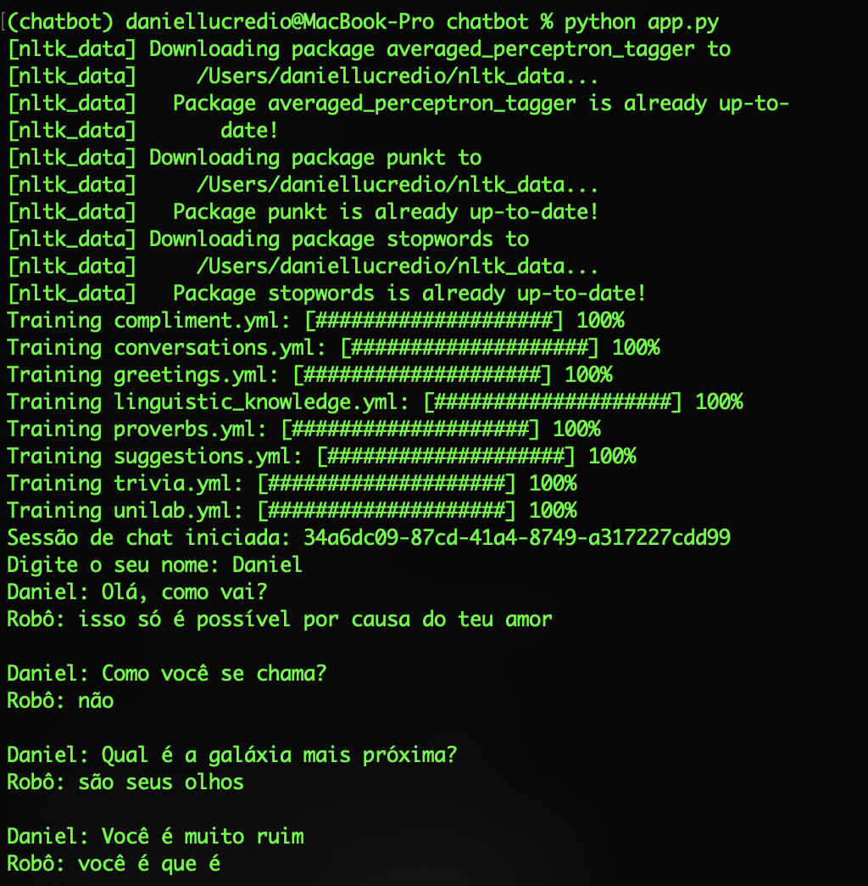
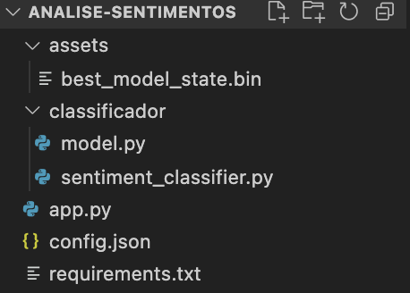
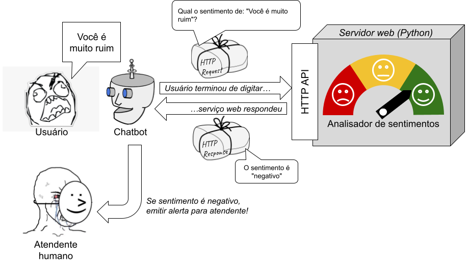
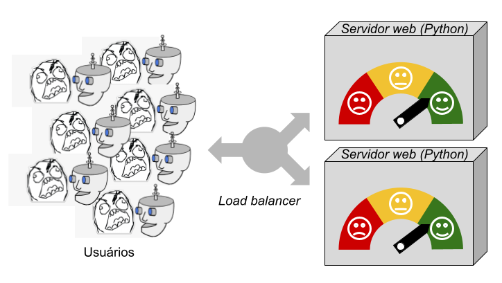
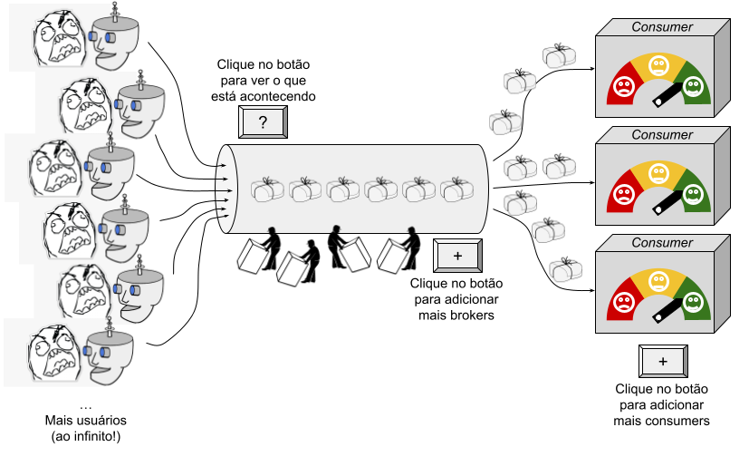
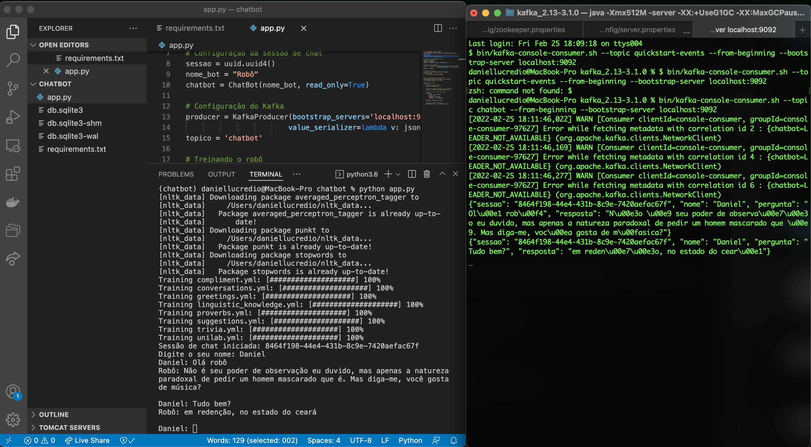
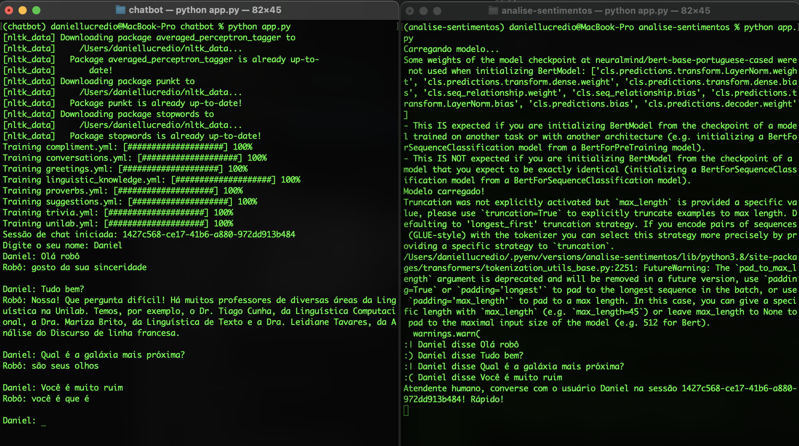

# 2.3 Do notebook para aplicação - parte 3

Nesta terceira parte sobre o desenvolvimento de uma aplicação com base em um notebook, exploraremos um tipo diferente de arquitetura, preparada para alta escalabilidade e processamento de dados em grande volume. Como nos outros casos, utilizaremos um exemplo com fins didáticos.

Imagine que você trabalha em uma empresa que desenvolve uma solução para atendimento ao cliente que utiliza uma tecnologia de "chatbot". A ideia por trás dessa solução é tentar resolver os problemas mais simples sem a necessidade de um atendente humano, tais como o acompanhamento de status de pedidos, consulta de informações cadastrais, entre outras ações que podem ser perfeitamente realizadas por um sistema conversacional.

Após os testes iniciais, identificou-se um prolema: às vezes durante o atendimento, o cliente fica frustrado pois o chatbot não consegue resolver o problema. É comum, inclusive, que o cliente comece a escrever de maneira agressiva e irritada com o chatbot. É aí que você entra. Sendo um estudioso de Machine Learning, você sabe ser possível realizar a [análise automática de sentimentos](https://medium.com/data-hackers/an%C3%A1lise-de-sentimentos-em-portugu%C3%AAs-utilizando-pytorch-e-python-91a232165ec0). Aí você sugere o seguinte:

_"E se pudéssemos analisar automaticamente as falas do cliente, e caso seja detectada alguma fala com sentimento negativo, emitimos um alerta para que um atendente ou gerente humano possa entrar na sala de chat e tentar acalmar o cliente?"_

A ideia agrada a todos, e você fica encarregado de montar um protótipo. Vamos lá?

## 2.3.1 Um chatbot

Neste livro queremos que você pratique e veja as coisas todas funcionando. Então a primeira coisa que faremos é construir um chatbot. Não será nada muito elaborado, e certamente nada bonito quando comparado às inúmeras opções existentes no mercado, muito mais eficientes e inteligentes. Mas não tem problema. Assim como nas seções anteriores, nosso foco está na arquitetura, em colocar um protótipo conceitual, feito provavelmente em um [notebook Jupyter](https://jupyter.org), em produção.

Para esse componente da solução, faremos uso de um pacote Python chamado [ChatterBot](https://chatterbot.readthedocs.io), um pacote que já implementa um sistema de conversação básico com suporte a múltiplas linguagens, inclusive Português do Brasil. Não faremos uma interface visual, usando tecnologias Web, nada disso. Tentaremos deixar a solução crua, porém ilustrativa, para que você consiga se concentrar nos pontos principais. Também utilizaremos Python como linguagem, apenas para manter os exemplos mais familiares para você, leitor, já que a maioria dos exemplos desse livro está em Python. Mas lembre-se, esse chatbot poderia estar implementado em qualquer linguagem ou qualquer plataforma, ok?

Vamos lá, como sempre, começaremos criando um ambiente virtual usando `pyenv`:

```
pyenv virtualenv 3.8.12 chatbot
pyenv activate chatbot
```

Note que estamos criando um ambiente baseado no Python 3.6.15, que é uma versão antiga, devido às dependências do pacote ChatterBot. Caso você não tenha instalado essa versão do Python, basta fazê-lo por meio do seguinte comando:

```
pyenv install 3.8.12
```

Em seguida, crie uma pasta chamada `chatbot` e vamos começar a codificar. Começaremos pelo arquivo `requirements.txt`:

```
# Tested on Python 3.8.12
ChatterBot==1.0.4
pytz==2021.3
```

Vamos precisar do pacote `ChatterBot` e `pytz` (usado pelo ChatterBot). Procure seguir as mesmas versões, pois já foram testadas.

Agora, basta instalar os pacotes:

```
pip install -r requirements.txt
```

Após a instalação, já podemos criar o código do nosso chatbot. Crie um arquivo chamado `app.py`:

```python
from chatterbot import ChatBot
from chatterbot.trainers import ChatterBotCorpusTrainer
import uuid

# Configuração da sessão de chat
sessao = uuid.uuid4()
nome_bot = "Robô"
chatbot = ChatBot(nome_bot, read_only=True)

# Treinando o robô
trainer = ChatterBotCorpusTrainer(chatbot)
trainer.train(
    "chatterbot.corpus.portuguese"
)

# Início da interação com o usuário
print("Sessão de chat iniciada: "+str(sessao))
nome = input('Digite o seu nome: ')

# Conversa principal
while True:
    # Lê pergunta do usuário
    pergunta = input(nome+': ')

    # Envia pergunta ao chatbot e obtém resposta
    resposta = chatbot.get_response(pergunta)

    # Imprime a conversa na tela
    print(nome_bot+': '+str(resposta)+'\n')
```

O código é bastante simples, graças ao pacote `ChatterBot`, que faz praticamente todo o trabalho. Os comentários são auto-explicativos, mas, resumidamente:

1. Primeiro fazemos as importações do `chatterbot`, dos componentes de treinamento `trainers`, e do pacote `uuid` (usaremos para gerar um número de sessão).
2. Em seguida, inicializamos a sessão de chat. Criamos um id de sessão, damos um nome ao robô ("Robô"), e inicializamos o componente conversacional no modo "Read Only" (ele não aprende com novas conversas).
3. É necessário treinar o robô com alguns diálogos. Neste caso, estamos usando um corpus simples, que faz parte do próprio projeto do `ChatterBot`. É um corpus simples, apenas para teste. No mundo real, você deveria colocar aqui conversas do seu domínio de interesse (e-commerce, por exemplo).
4. Em seguida, podemos dar início à interação com o usuário. Primeiro perguntamos o nome do usuário, e em seguida começamos um loop infinito, onde o usuário faz uma pergunta, e obtemos a resposta do chatbot por meio da função: `chatbot.get_response`. Ela faz exatamente o que sugere: dada uma pergunta, uma resposta é obtida. Enfim, imprimimos a resposta ao usuário

Ao executar (verifique se está no ambiente virtual correto), você deverá ver algo parecido com isso:



Como é possível verificar, o chatbot não é muito bom em um bate-papo sem sentido, sendo mais apropriado para tarefas mais focadas. Por isso, as soluções normalmente trazem diálogos de escopo fechado, e o chatbot normalmente instrui o usuário a dizer exatamente o que ele espera ouvir. Mas não tem problema. Veja, na imagem, como o usuário Daniel parece ter ficado irritado. Será que conseguimos detectar isso automaticamente?

## 2.3.2 Um analisador de sentimentos em Português

[Neste artigo](https://medium.com/data-hackers/an%C3%A1lise-de-sentimentos-em-portugu%C3%AAs-utilizando-pytorch-e-python-91a232165ec0) o autor mostra como é possível construir um analisador de sentimentos em português, utilizando [BERT (_Bidirectional Encoder Representations from Transformers_)](https://arxiv.org/abs/1810.04805) e [PyTorch](https://pytorch.org). Trata-se de um classificador treinado com base em opiniões coletadas do Google Play Store.

Não entraremos aqui em detalhes sobre como construir e treinar o modelo, pois isso, como já explicado, está fora do escopo deste livro. Além disso, já está [detalhado no artigo](https://medium.com/data-hackers/an%C3%A1lise-de-sentimentos-em-portugu%C3%AAs-utilizando-pytorch-e-python-91a232165ec0). Caso não queira seguir os mesmos passos você mesmo, o resultado principal deste treinamento é o modelo pré-treinado, que foi salvo em um arquivo. Você pode encontrá-lo no link a seguir:

[Modelo pré-treinado BERT para classificação de sentimentos com base em opiniões do Google Play Store](https://drive.google.com/file/d/1d4RBMWwnzFBaPL2TSu-X1lfb3GLv1Pz5/view?usp=sharing)

O primeiro passo é colocar esse modelo para funcionar fora do notebook (no caso do artigo, os exemplos são mostrados no [Google Colab](https://colab.research.google.com)). Já fizemos isso [antes aqui no livro](2-1-do-notebook-para-aplicacao-parte-1.md), mas era um modelo mais simples, baseado no [scikit-learn](https://scikit-learn.org). Agora, como o modelo usa [BERT](https://arxiv.org/abs/1810.04805) e [PyTorch](https://pytorch.org) é um pouco mais complicado, mas nem tanto assim. Vamos lá!

Mais uma vez, vamos criar um novo ambiente virtual para esse projeto:

```
pyenv virtualenv 3.8.12 analise-sentimentos
pyenv activate analise-sentimentos
```

Mais uma vez, utilizaremos uma versão mais antiga do Python, devido à compatibilidade com PyTorch. Caso não tenha a versão certa instalada, é só executar o comando:

```
pyenv install 3.8.12
```

Agora vamos começar a preparar a solução. Crie a seguinte estrutura de pastas, com os seguintes diretórios e arquivos:



Note que, até o momento, você deve ter apenas o arquivo `best_models_state.bin`, que resultou do treinamento do modelo. Os demais, pode criar arquivos em branco, por enquanto.

Começando, como já de costume, pelo `requirements.txt`:

```
# Tested on Python 3.8.12

# Para análise de sentimentos
torch==1.10.2
torchaudio==0.10.2
torchvision==0.11.3
transformers==4.16.2
```

Feito isso, podemos instalar os pacotes:

```
pip install -r requirements.txt
```

Os próximos três arquivos foram copiados quase integralmente dos artigos originais sobre esse modelo. O [primeiro](https://medium.com/data-hackers/an%C3%A1lise-de-sentimentos-em-portugu%C3%AAs-utilizando-pytorch-e-python-91a232165ec0), que explica sobre a construção do modelo, e também um [segundo](https://medium.com/data-hackers/deploy-de-um-modelo-de-an%C3%A1lise-de-sentimentos-como-uma-rest-api-878c175ad24f), com o autor mostra como subir uma API para esse modelo, muito parecido com o que fizemos na [seção anterior](2-2-do-notebook-para-aplicacao-parte-2.md).

O próximo arquivo `config.json`, que contém, como o nome sugere, algumas configurações para o modelo ser inicializado e posteriormente ajustado, caso necessário:

```json
{
    "BERT_MODEL": "neuralmind/bert-base-portuguese-cased",
    "PRE_TRAINED_MODEL": "assets/best_model_state.bin",
    "CLASS_NAMES": [
        "negative",
        "neutral",
        "positive"
    ],
    "MAX_SEQUENCE_LEN": 160
}
```

Entre as configurações, destacamos aqui o item `PRE_TRAINED_MODEL`, que é o arquivo resultante do treinamento, e que está salvo na pasta `assets`. Sobre as demais configurações não entraremos em detalhes.

O próximo arquivo é o `sentiment_classifier.py`:

```python
import json

from torch import nn
from transformers import BertModel

with open("config.json") as json_file:
    config = json.load(json_file)

class SentimentClassifier(nn.Module):
    def __init__(self, n_classes):
        super(SentimentClassifier, self).__init__()
        self.bert = BertModel.from_pretrained(config["BERT_MODEL"],
                                              return_dict=False)
        self.drop = nn.Dropout(p=0.3)
        self.out = nn.Linear(self.bert.config.hidden_size, n_classes)

    def forward(self, input_ids, attention_mask):
        _, pooled_output = self.bert(input_ids=input_ids, attention_mask=attention_mask)
        output = self.drop(pooled_output)
        return self.out(output)
```

Este arquivo, que veio copiado [diretamente do notebook original do artigo](https://medium.com/data-hackers/an%C3%A1lise-de-sentimentos-em-portugu%C3%AAs-utilizando-pytorch-e-python-91a232165ec0), define uma classe chamada `SentimentClassifier` que encapsula o BERT para uso dentro do PyTorch. Após as importações e abertura do arquivo de configuração, a função `__init__` inicializa o BERT, com algumas definições básicas, e a função `forward` configura as etapas de execução durante o treinamento.

O próximo arquivo é o `model.py`:

```python
import json
import torch
import torch.nn.functional as F
from transformers import BertTokenizer

from .sentiment_classifier import SentimentClassifier

with open("config.json") as json_file:
    config = json.load(json_file)


class Model:
    def __init__(self):
        self.device = torch.device("cuda:0" if torch.cuda.is_available()
                                    else "cpu")
        self.tokenizer = BertTokenizer.from_pretrained(config["BERT_MODEL"])

        classifier = SentimentClassifier(len(config["CLASS_NAMES"]))
        classifier.load_state_dict(
            torch.load(config['PRE_TRAINED_MODEL'], map_location=self.device)
        )
        classifier = classifier.eval()
        self.classifier = classifier.to(self.device)

    def predict(self, text):
        encoded_text = \
            self.tokenizer.encode_plus( text,
                                        max_length = config["MAX_SEQUENCE_LEN"],
                                        truncation=True,
                                        padding="longest",
                                        add_special_tokens = True,
                                        return_token_type_ids = False,
                                        pad_to_max_length = True,
                                        return_attention_mask = True,
                                        return_tensors = "pt")
        input_ids = encoded_text["input_ids"].to(self.device)
        attention_mask = encoded_text["attention_mask"].to(self.device)

        with torch.no_grad():
            #Getting the prediction
            probabilities = F.softmax(self.classifier(input_ids, attention_mask),
                            dim = 1)

        #Taking the most confident result
        confidence, predicted_class = torch.max(probabilities, dim = 1)
        predicted_class = predicted_class.cpu().item()
        probabilities = probabilities.flatten().cpu().numpy().tolist()

        return(
            config["CLASS_NAMES"][predicted_class],
            confidence,
            dict(zip(config["CLASS_NAMES"], probabilities))
        )
```

Este arquivo é um pouco mais extenso, mas também não precisaremos entrar em muitos detalhes, pois a maior parte de seu conteúdo também foi copiado do [diretamente do notebook original do artigo](https://medium.com/data-hackers/an%C3%A1lise-de-sentimentos-em-portugu%C3%AAs-utilizando-pytorch-e-python-91a232165ec0). Porém, aqui ele foi estruturado em uma classe, chamada `Model`, para facilitar seu uso.

A função `__init__` da classe inicializa o PyTorch, usando um tokenizador BERT para o português, e o classificador treinado anteriormente, e salvo no arquivo `assets/best_model_state.bin` (que chega aqui indiretamente pelo arquivo `config.json`).

Já a função `predict` faz o que se espera, ou seja, dado um texto qualquer, retorna uma classificação de sentimento. Inicialmente, a função aplica algumas etapas de codificação. Em seguida, a predição é obtida e convertida no seguinte formato:

```json
{
    "probabilities": {
        "negative": 0.00025397917488589883,
        "neutral": 0.0015819837572053075,
        "positive": 0.9981639981269836
    },
    "sentiment": "positive",
    "confidence": 0.9981639981269836
}
```

Ou seja, será gerado o sentimento (positive, negative ou neutral), um nível de confiança, e as probabilidades individuais obtidas pela predição. Cabe ao chamador dessa função usar o atributo mais conveniente.

Por fim, vamos construir um código para testar, no arquivo `app.py`:

```python
from classificador.model import Model

# Carrega o modelo BERT pré-treinado (demora um tempinho)
print('Carregando modelo...')
model = Model()
print('Modelo carregado!')

# Vamos testar um exemplo qualquer
texto = "Você é muito ruim"
sentiment, confidence, probabilities = model.predict(texto)
print(sentiment)
```

Execute o código e veja o resultado. Provavelmente será exibido "negative", ainda que o resultado pode ser outro dependendo do treinamento e dos dados de teste.

Pronto, já temos um programa capaz de, dado um texto, determinar se o sentimento é positivo, negativo ou neutro. Obviamente, a precisão não é de 100%, mas isso não importa para nós. Queremos mais é juntar tudo para entregar a solução proposta para o chatbot.

## 2.3.3 Integrando o chatbot e o analisador de sentimentos usando uma API HTTP

A princípio, somente com o que aprendeu neste livro até agora, você já deveria saber como integrar os dois componentes usando uma API HTTP. Veja a figura a seguir e tente imaginar como poderia implementar a arquitetura descrita.



Comece pelo lado direito. Veja como o analisador de sentimentos foi encapsulado em uma API HTTP, sendo inserido em um servidor web Python, como o [Flask](https://flask.palletsprojects.com). Foi exatamente isso o que fizemos na [seção anterior](2-2-do-notebook-para-aplicacao-parte-2.md). Com isso, o servidor passa a responder a requisições HTTP, emitindo respostas HTTP com o sentimento de um texto qualquer.

Agora vá para o lado esquerdo da figura. O código do chatbot foi modificado para enviar as mensagens digitadas pelo usuário para essa API, e para olhar a resposta. Caso a resposta seja a de um sentimento negativo, o chatbot pode emitir um alerta para outro sistema, solicitando que um atendente humano entre na sala e assuma a conversação.

Essa solução funciona! É mais ou menos isso que o autor do artigo original no qual estamos nos baseando faz, em um [segundo artigo](https://medium.com/data-hackers/deploy-de-um-modelo-de-an%C3%A1lise-de-sentimentos-como-uma-rest-api-878c175ad24f). Mas queremos ir adiante, e pensar em diferentes cenários de uso.

Vamos supor que o tempo para realizar a predição (já com o modelo carregado) seja de 0,33 segundos (faça os testes em sua máquina, para perceber que esse é um tempo razoável para um PC doméstico comum, pois o BERT é um modelo computacionalmente custoso). Isso significa que nossa API, se instalada nesse PC, é capaz de responder a aproximadamente 3 requisições por segundo, se não consideramos questões como a latência de rede e outros processamentos que existem no meio do caminho. Mas vamos ignorar esses custos adicionais por enquanto.

Imaginemos agora que um usuário em um atendimento envia, em média, uma mensagem a cada 30 segundos. Fazendo as contas, isso significa que nossa API poderá atender aproximadamente até 90 usuários simultaneamente. Obviamente, não usaremos um PC comum para isso, e sim um servidor em nuvem, devidamente configurado para demandas maiores.

Mas conceitualmente, isso não importa. Caso a sua empresa almeje atender às demandas de um grande varejista, de alcance nacional, por exemplo, onde pode haver milhares de usuários no SAC simultaneamente, será necessário pensar na escalabilidade dessa arquitetura. Neste caso, o principal recurso é o servidor onde roda a API. Veja na figura a seguir uma possível solução.



Um _load balancer_ recebe requisições e as distribui entre diferentes destinos, normalmente seguindo uma política igualitária (uma fila circular, por exemplo). Assim, com dois servidores, é possível (novamente, vamos desconsiderar aqui os _overheads_, latência, etc) atender ao dobro de requisições, e portanto o dobro de usuários.

Problema resolvido?

Longe disso!

Veja algumas outras questões que estão envolvidas nessa arquitetura, referentes à sua escalabilidade:

* E se o número de usuários for tão grande, mas tão grande, a ponto de o próprio _load balancer_ parar de responder? Será que basta adicionar mais um outro _load balancer_ na frente, formando uma cadeia de _load balancers_?
* E se um dos servidores começar a travar, e as requisições começarem a se perder?
* E se, de repente, o número de usuários cair? Custa caro manter um servidor no ar. Devemos pensar, portanto em "elasticidade" (crescer e diminuir conforme a demanda) e não apenas "escalabilidade" (crescer conforme a demanda)?
* Quanto tempo demora manter essa arquitetura funcionando? E se eu precisar subir um novo servidor, quanto tempo demora? Lembre-se que é necessário informar ao _load balancer_, caso contrário o servidor ficará ocioso.
* Como saber a quantidade de requisições que está passando pelo sistema, para poder medir se a demanda está sendo atendida, ou se está havendo sobra/falta de recursos?

Esses são apenas alguns aspectos importantes, referentes à operação (_Ops_). Mas mesmo quando pensamos apenas no desenvolvimento (_Dev_) ainda há uma questão importante: o código do chatbot precisou ser modificado para tratar da questão do sentimento. Ele está parcialmente separado dos detalhes do modelo, e não precisa conhecer nada sobre BERT ou PyTorch. Mas ainda há um aspecto ali referente à análise de sentimentos e notificação do atendente humano. Isso poderia ser delegado a outros componentes e deixar a arquitetura com um desacoplamento maior.

Em resumo, caso essas questões sejam irrelevantes para o contexto da sua empresa, tudo bem! Pode seguir com essa solução baseada em API. Na verdade, pode pular o restante desta seção, pois ela não se aplica a você.

É claro, isso provavelmente significa que não há muitos clientes usando a solução. Mas caso as vendas decolem, e a empresa assine um contrato com uma gigante de alcance nacional (deixando os acionistas muito felizes), então provavelmente você precisará lidar com tudo isso. Continue lendo para ver como podemos adotar uma tecnologia de fluxo (_streaming_) para ajudar nesses desafios.

## 2.3.4 Integrando o chatbot e o analisador de sentimentos usando Apache Kafka

Vamos usar o [Apache Kafka](https://kafka.apache.org). Trata-se de uma ferramenta amplamente utilizada para o processamento de grandes volumes de dados, por [grandes empresas](https://kafka.apache.org/powered-by), justamente por tratar de maneira robusta de questões como aquelas mencionadas na seção anterior. Mas o Kafka vai além, trazendo funcionalidades para outros cenários que estão fora do escopo deste livro.

Obviamente, não conseguiremos aqui, com este exemplo simples, simular a demanda real desse tipo de sistema. Em outras palavras, não poderemos ver o Kafka em sua força total. Na verdade, não vamos nem "fazer cosquinha" em seu potencial. Mas o exemplo servirá para ilustrar como é possível fazer uma arquitetura elástica com pouca necessidade de código.

Não faremos aqui um curso completo de Kafka, mas faremos uma ilustração simples sobre como o nosso exemplo utilizará os conceitos do Kafka. Veja a figura a seguir.



Está bem, está bem! Na verdade estamos exagerando um pouco na simplificação. Mas acreditamos que o objetivo é abstrair um pouco dos detalhes para você capturar a essência da arquitetura. Há muitos detalhes omitidos, funções do Kafka que não estão aqui, entre outras coisas. Mas permita-nos o exagero da simplicidade, em prol da didática. Depois, você sempre pode recorrer a tutoriais e livros sobre o assunto, que existem em abundância.

Mais uma vez, vamos começar pelo lado direito. O analisador de sentimentos, ao invés de ser encapsulado em um servidor web, agora fica dentro do que é conhecido no Kafka como _consumer_ (consumidor). Cada _consumer_, essencialmente, fica recebendo mensagens, ou melhor, eventos. Kafka serve, no final das contas, para implementar [arquiteturas dirigidas por eventos](https://www.confluent.io/resources/event-driven-microservices/). De maneira resumida, nesse tipo de arquitetura deve-se pensar primeiramente em produtores e consumidores de eventos (uma compra finalizada, um "like" em um vídeo, etc).

No nosso exemplo, o evento que estamos interessado é o usuário enviando alguma coisa no chat, um texto. Portanto, o _consumer_ irá receber esses eventos para fazer seu trabalho. Ainda no exemplo, o _consumer_ irá analisar o sentimento daquela mensagem do chat.

Aqui já vemos uma primeira diferença da arquitetura baseada em eventos em relação à arquitetura anterior (HTTP API). Na anterior, o chatbot deliberadamente solicitava a uma API para que analisasse o sentimento de um texto. Agora, o chatbot simplesmente informa, A QUEM POSSA INTERESSAR (e aqui está a diferença), que aquele evento ocorreu. Se ALGUÉM QUISER FAZER ALGO COM AQUELE EVENTO, que faça. Mas para o chatbot, o trabalho termina aqui. Isso promove um grande desacoplamento na arquitetura. O chatbot pode se concentrar no que faz de melhor, que é conversar - e bem sabemos que nosso chatbot precisa se concentrar um pouquinho melhor em sua tarefa, afinal de contas ele não está se saindo muito bem! Outros interesses, outras funções da solução, como analisar o sentimento do usuário e alertar um atendente humano, pode ficar em um componente completamente separado. Isso facilita manutenção, entre outros benefícios que normalmente buscamos em uma arquitetura orientada a microsserviços.

Pois bem, voltemos à figura, ainda no lado direito. Novamente, pedimos desculpas pela simplificação exagerada. Não, o Kafka não tem um botão que você clica e novos _consumers_ são adicionados à arquitetura. Mas a ideia da simplicidade por trás do botão, essa sim está no Kafka! Adicionar novos _consumers_ significa rearranjar toda a estrutura da arquitetura, ou seja: notificar o restante do Kafka que entrou um novo _consumer_, atualizar as filas de envio, redistribuir partições, entre outros detalhes dos quais não falaremos aqui. Mas há muito trabalho sendo feito, pelo Kafka.

Agora voltemos nossa atenção para lado esquerdo da figura. No Kafka, as mensagens (ou eventos) são enviadas pelos _producers_ (produtores). No nosso caso, os _producers_ são as instâncias do chatbot - uma para cada usuário. Então, se o sistema tiver 1000 usuários, significa que existem 1000 _producers_ produzindo eventos a qualquer momento. Os eventos, no nosso caso, são as mensagens enviadas pelos usuários, como já discutido. E aqui, para alegria dos seus acionistas, imagine que o número de usuários pode crescer infinitamente. Não no sentido literal da palavra "infinito". Mas pense em [Netflix, LinkedIn e outras empresas que usam Kafka](https://kafka.apache.org/powered-by). Eles chegam o mais próximo do que podemos assumir como sendo "infinito". Então não se acanhe, o Kafka foi concebido para isso!

Por último, chegamos ao centro da figura. Todos os eventos de um mesmo tipo passam por um mesmo "cano" conceitual (no Kafka, chamado de "tópico"). Para os _producers_ a analogia funciona bem. Basta ele produzir um evento, enviá-lo a um tópico/cano, e ele vai chegar a um _consumer_. Dentro desse cano, há uma fila de eventos, que segue ordenadamente (ou desordenadamente, em prol do desempenho), até ser entregue a um _consumer_.

O "cano" é persistente de acordo com a vontade do usuário. Os eventos podem ficar lá por segundos, minutos, horas, dias ou eternamente.

E o "cano", assim como o restante da arquitetura, é elástico. Para aumentar a capacidade de processamento, basta adicionar mais _brokers_ (os trabalhadores responsáveis pelo recebimento/envio de eventos). Cada _broker_ pode ser uma máquina física, dedicada ao seu trabalho, ou pode ser uma máquina virtual. Mais uma vez, pedimos desculpas, pois não existe um botão no Kafka para adicionar _brokers_ (por favor, não nos processe por propaganda enganosa). Ao invés disso, entenda que esse botão significa que o Kafka está simplificando muitas coisas para os usuários. Sempre que um novo _broker_ é adicionado, é necessário rearranjar as filas, distribuir partições, e outras tarefas importantes. Isso tudo é feito pelo Kafka.

Imagine-se responsável por essa arquitetura. Se o número de _consumers_ está insuficiente (pois o processamento está muito pesado), basta acrescentar um ou dois. Se o número de eventos está muito grande (pois há muitos usuários, por exemplo, ou você está implementando uma rede de cem mil sensores em um estádio de futebol), basta acrescentar mais _brokers_. Daria para fazer a mesma coisa com _load balancing_ simples e _API HTTP_? Sim, mas o trabalho seria muito maior.

Mas como saber quando é necessário aumentar/reduzir os _consumers_/_brokers_? Kafka também tem um "botão" para monitorar o status de execução. É possível visualizar a carga do sistema, quantidade de mensagens, e outros tipos de informação.

Parece muita coisa, mas isso ainda não é tudo! E se disséssemos que o Kafka ainda faz tudo isso e é altamente configurável? Quer manter o sistema tolerante a falhas, suportando a queda de até dois brokers? Simples, configure o Kafka para manter três cópias de cada evento. Quer garantir que os eventos sejam entregues exatamente uma vez a um _consumer_, evitando duplicações? Basta configurar! Ou quer tolerar duplicações, mas quer um desempenho melhor? Novamente, é apenas uma questão de configuração!

Já está cansado de ficar lendo tudo o que o Kafka pode fazer? (de fato, estamos parecendo uma agência de marketing para o Kafka) Está imaginando que tudo isso vem com uma enorme carga de desenvolvimento e configuração? Bom, é claro que não se trata de uma tecnologia simples, então uma certa complexidade é esperada. Mas vamos para a próxima seção, onde esperamos que ao menos você perceba que programar dessa forma não é tão difícil assim, pelo menos no cenário do nosso exemplo.

## 2.3.5 Integrando o chatbot e o analisador de sentimentos usando Apache Kafka - mão na massa

Começamos esta seção prática lembrando o leitor que o exemplo que estamos fazendo aqui não chega a exercitar tudo o que o Kafka proporciona. Lembre-se que esse tipo de problema só vai começar a aparecer se você estiver em cenários com grande volumes de dados e de processamento.

Vamos começar transformando nosso chatbot em um _producer_ Kafka. Abra a pasta do chatbot, não se esquecendo de ativar o ambiente virtual `chatbot`!

Modifique o arquivo `requirements.txt` para incluir o cliente Python para o Kafka (não esqueça de executar `pip install -r requirements.txt`):

```diff
# Tested on Python 3.6.15
ChatterBot==1.0.4
pytz==2021.3
+kafka-python==2.0.2
```

Vamos usar esse cliente pois ele é mais simples de usar, e requer menos instalações. Mas ele não é o mais eficiente. Caso queira utilizar um cliente com melhor desempenho, prefira o pacote `confluent-kafka` (que exige uma instalação adicional).

Agora vamos alterar o arquivo `app.py`. As mudanças são auto-explicativas e mostram como é simples enviar eventos para um tópico Kafka:

```diff
from chatterbot import ChatBot
from chatterbot.trainers import ChatterBotCorpusTrainer
import uuid
+from kafka import KafkaProducer
+import json

# Configuração da sessão de chat
sessao = uuid.uuid4()
nome_bot = "Robô"
chatbot = ChatBot(nome_bot, read_only=True)

+# Configuração do Kafka
+producer = KafkaProducer(bootstrap_servers='localhost:9092',
+                        value_serializer=lambda v: json.dumps(v).encode('utf-8'))
+topico = 'chatbot'

# Treinando o robô
trainer = ChatterBotCorpusTrainer(chatbot)
trainer.train(
    "chatterbot.corpus.portuguese"
)

# Início da interação com o usuário
print("Sessão de chat iniciada: "+str(sessao))
nome = input('Digite o seu nome: ')

# Conversa principal
while True:
    # Lê pergunta do usuário
    pergunta = input(nome+': ')

    # Envia pergunta ao chatbot e obtém resposta
    resposta = chatbot.get_response(pergunta)

+    # Monta o evento e envia ao Kafka
+    evento = {
+        'sessao': str(sessao),
+        'nome': nome,
+        'pergunta': pergunta,
+        'resposta': str(resposta)
+    }
+    producer.send(topico, evento)

    # Imprime a conversa na tela
    print(nome_bot+': '+str(resposta)+'\n')
```

Há apenas três pontos a se destacar neste código:

1. Estamos configurando o Kafka para acessar um servidor local, na porta 9092. Essa é a configuração padrão do servidor simples para testes que vem pré-configurado no Kafka
2. Estamos configurando um serializador de eventos que converte objetos JSON para string. Ou seja, um evento será um dicionário Python que será convertido em JSON
3. O evento consiste de quatro valores: a sessão (para que o atendente humano possa ser direcionado à sala correta, quando notificado), o nome do usuário, a pergunta que ele fez (e que tem o texto para análise do sentimento), e a resposta dada pelo robô (talvez o atendente já possa entrar na sala sabendo o que foi que o robô disse depois da suposta mensagem nervosa enviada pelo usuário).

O envio, propriamente dito, está na chamada `producer.send(topico,evento)`. Mais simples e auto-explicativo é impossível.

Já podemos testar nosso cliente. Mas antes, vamos instalar o Kafka e colocá-lo para rodar. Após baixar e instalar, siga as instruções no [site oficial](https://kafka.apache.org/quickstart) para subir o `ZooKeeper` (um gerenciador de _brokers_) e um _broker_. São necessários dois terminais, conforme as instruções oficiais:

```
# Start the ZooKeeper service
# Note: Soon, ZooKeeper will no longer be required by Apache Kafka.
$ bin/zookeeper-server-start.sh config/zookeeper.properties

Open another terminal session and run:

# Start the Kafka broker service
$ bin/kafka-server-start.sh config/server.properties
```

Em seguida vamos criar um _consumer_ simples, apenas para ver se o chatbot está funcionando. Execute o seguinte comando, em um novo terminal:

```
$ bin/kafka-console-consumer.sh --topic chatbot --from-beginning --bootstrap-server localhost:9092
```

Esse comando irá começar a consumir eventos no tópico chamado "chatbot", enviados para o sevidor "localhost:9092" (endereço do _broker_ que subimos agora há pouco).

Agora podemos rodar nosso chatbot com o comando `python app.py`. Veja o resultado na figura a seguir.



Tem muita informação nessa tela, mas olhe com atenção: no lado esquerdo (dentro do terminal do VSCode, veja a conversa acontecendo entre o usuário Daniel e o robô). Agora olhe, no terminal do lado direito, como as conversas aparecem em formato JSON. Essas conversas foram enviadas pelo chatbot, para um tópico no Kafka, e foram entregues a um _consumer_ simples, que apenas imprime os eventos no terminal. Isso significa que o lado do _producer_ já está funcionando! Vamos agora adicionar nosso _consumer_ que analisa os sentimentos. Se quiser, pode parar o consumer simples, apertando `Ctrl-C` no terminal onde ele está rodando. Mas mantenha o `ZooKeeper` e o _broker_ rodando, por enquanto.

Abra a pasta do projeto de análise de sentimentos. Não se esqueça de ativar o ambiente virtual `analise-sentimentos`!

Vamos começar pelo `requirements.txt`:

```diff
# Tested on Python 3.8.12

# Para análise de sentimentos
torch==1.10.2
torchaudio==0.10.2
torchvision==0.11.3
transformers==4.16.2

+# Para acessar Kafka
+kafka-python==2.0.2
```

Sim, é o mesmo pacote que o utilizado no chatbot. Rode `pip install -r requirements.txt`.

Agora vamos modificar o `app.py`:

```diff
from classificador.model import Model
+from kafka import KafkaConsumer
+import json

+# Conecta o classificador ao Kafka, em servidor local, no tópico "chatbot"
+consumer = KafkaConsumer('chatbot', bootstrap_servers='localhost:9092')

# Carrega o modelo BERT pré-treinado (demora um tempinho)
print('Carregando modelo...')
model = Model()
print('Modelo carregado!')

-# Vamos testar um exemplo qualquer
-texto = "Você é muito ruim"
-sentiment, confidence, probabilities = model.predict(texto)
-print(sentiment)

+# Enquanto houver mensagens, analisa o sentimento
+for msg in consumer:
+    obj = json.loads(msg.value)
+    sentiment, confidence, probabilities = model.predict(obj['pergunta'])
+    sentimento = ':|'
+    if sentiment == 'negative':
+        sentimento = ':('
+    elif sentiment == 'positive':
+        sentimento = ':)'
+    print (sentimento + ' ' + obj['nome']+' disse '+obj['pergunta'])
+    if sentiment == 'negative':
+        print('Atendente humano, converse com o usuário '+obj['nome']+' na sessão '+obj['sessao']+"! Rápido!")
```

Deixamos como exercício para o leitor entender o que esse novo código faz. Dica: É exatamente o que você queria fazer no início desta seção. Claro, não estamos de fato fazendo uma integração com um sistema de alertas, para que um atendente humano possa entrar na conversa. Mas deu para pegar a ideia!

Não entendeu o código? Veja o que acontece quando ele roda (lembre-se, o resultado pode variar caso o modelo tenha sido treinado de um jeito diferente):



## 2.3.6 Considerações finais

Esta seção foi longa, mas esperamos que você tenha conseguido chegar até o fim com uma boa ideia de como é possível adicionar um modelo de machine learning a uma arquitetura escalável. Modelos baseados em aprendizado profundo, como o BERT, tendem a ser custosos, e esse tipo de questão que abordamos aqui, que a maioria dos cientistas de dados não precisa lidar, passa a ser essencial para que a solução seja de fato útil em cenários reais.

Chegamos também ao fim deste capítulo, onde você viu três formas de se colocar um notebook Jupyter em produção:

* [Como uma tarefa _offline_ para ser executada em lote](2-1-do-notebook-para-aplicacao-parte-1.md);
* [Como uma tarefa _online_ para ser consumida via API HTTP](2-2-do-notebook-para-aplicacao-parte-2.md);
* Como uma tarefa de processamento de fluxos, em uma arquitetura escalável montada em cima do Apache Kafka (esta seção).

Existem muitas variações sobre esses temas, muitas configurações e nuances que podem ser necessárias. Não conseguiríamos cobrir tudo aqui, e nem é o objetivo. Mas esperamos que, agora, você saiba que existe vida fora do notebook, e demos algumas formas para isso. Não são as únicas. Existem outros servidores web além do Flask, outras ferramentas para eventos além do Kafka. Deixamos a você a tarefa de estudar tecnologias alternativas às vistas aqui.

Existem também formas melhores de se colocar tudo isso em produção. Melhores do que ficar abrindo terminais, configurando ambientes virtuais manualmente, etc. É essencialmente isso que veremos a seguir.

Assim, seu aprendizado não termina aqui, na verdade está apenas começando. O que vimos neste capítulo é apenas parte do processo. Permanecemos essencialmente dentro da parte _Dev_ de _DevOps_. A seguir começaremos a explorar aspectos mais operacionais (a parte _Ops_ de _DevOps_), do processo de se construir soluções de Machine Learning que irão rodar em sistemas do mundo real.

Continue conosco.

***

#### Contribuições a esta seção

O analisador de sentimentos utilizado nesta seção foi obtido a partir das seguintes referências:

* [https://medium.com/data-hackers/an%C3%A1lise-de-sentimentos-em-portugu%C3%AAs-utilizando-pytorch-e-python-91a232165ec0](https://medium.com/data-hackers/an%C3%A1lise-de-sentimentos-em-portugu%C3%AAs-utilizando-pytorch-e-python-91a232165ec0)
* [https://medium.com/data-hackers/deploy-de-um-modelo-de-an%C3%A1lise-de-sentimentos-como-uma-rest-api-878c175ad24f](https://medium.com/data-hackers/deploy-de-um-modelo-de-an%C3%A1lise-de-sentimentos-como-uma-rest-api-878c175ad24f)
