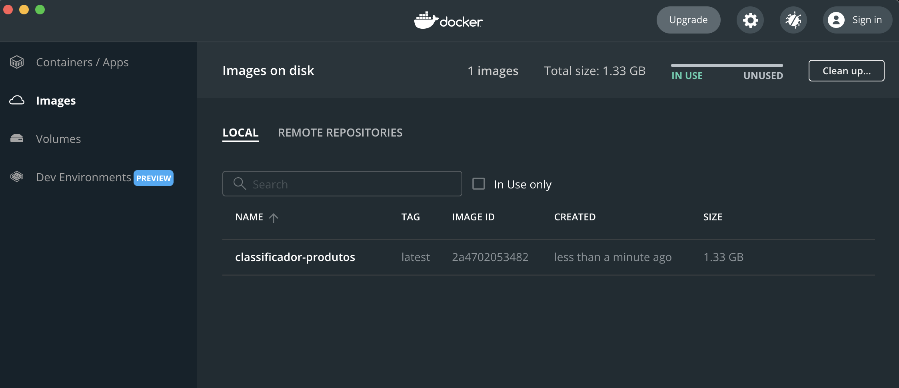

# 3.2 Ambiente de Produção - parte 1

Nessa seção será apresentada uma forma de utilizar contêineres Docker para mais facilmente instanciar e implantar uma das aplicações do capítulo anterior. Há inúmeras maneiras de fazer isso com a tecnologia Docker. Vamos iniciar com uma mais simples e mais fácil de colocar em execução. Posteriormente, nos capítulos mais adiante, utilizaremos recursos mais avançados para o gerenciamento e instanciação dos diversos contêineres que compõem não apenas o ambiente de produção, mas todos os demais ambientes necessários para colocar o DevOps em prática.

Nesse ponto, assume-se que o Docker já está instalado e que você conseguiu executar com sucesso o Hello-World do Docker, apresentado no Capítulo 1.

Ainda no Capítulo 1 você viu, de uma forma mais abstrata, o que é uma imagem, e o que é um contêiner. Agora veremos de uma maneira concreta, e utilizando um exemplo. Vamos começar pela aplicação da [Seção 2.1](../2-desenvolvimento/2-1-do-notebook-para-aplicacao-parte-1.md).

# 3.2.1. Exemplo 1 - teoria

Recordando: nós começamos a [Seção 2.1](../2-desenvolvimento/2-1-do-notebook-para-aplicacao-parte-1.md) com um [notebook Jupyter](https://jupyter.org) e terminamos com um aplicativo feito em Python, que roda a partir da linha de comando, e faz a leitura/escrita em um banco de dados na nuvem (no caso, utilizamos o [Firebase](https://firebase.google.com)). A Figura a seguir ilustra a arquitetura deste aplicativo.


Vamos relembrar cada um desses elementos, começando de baixo para cima:

* Assumimos que você tenha executado todo aquele código em sua própria máquina pessoal, então é isso que está na base da figura - o hardware;
* Uma máquina precisa de um sistema operacional, seja ele Windows, Linux, MacOS, ou algum outro;
* Instalamos no sistema operacional um ambiente [Python](https://www.python.org/). No caso, utilizamos ambientes virtuais para facilitar o gerenciamento e a instalação simultânea de várias versões de Python. Mas conceitualmente, isso não importa. Para a aplicação rodar, precisamos de um ambiente Python (interpretador, gerenciador de pacotes, etc);
* Acoplado ao ambiente Python instalamos dois pacotes (e suas dependências): ```firebase-admin```: para acesso ao banco de dados na nuvem e ```scikit-learn```: para execução do modelo pré-treinado. Utilizamos para isso o comando ```pip``` e um arquivo ```requirements.txt```, [lembra?](../2-desenvolvimento/2-1-do-notebook-para-aplicacao-parte-1.md)
* A solução também precisava de dois arquivos auxiliares. Um deles é a chave para acesso remoto ao banco de dados na nuvem. Na Figura, representamos pelo nome ```key-firebase.json```, mas na verdade o nome real é um pouco maior. Isso também fizemos lá na [Seção 2.1](../2-desenvolvimento/2-1-do-notebook-para-aplicacao-parte-1.md);
* O segundo arquivo é o modelo salvo (```model.sav```). [Fizemos isso diretamente do notebook Jupyter](../2-desenvolvimento/2-1-do-notebook-para-aplicacao-parte-1.md);
* Por último, temos um código Python (```app.py```) que tem a lógica da aplicação:
    1. Carregar o modelo;
    2. Ler no banco de dados uma coleção de produtos, sem categoria;
    3. Para cada produto, determinar a categoria com base no modelo;
    4. Salvar a categoria de cada produto.

Tudo isso está funcionando normalmente, mas lembre-se que estamos em um ambiente de desenvolvimento. Para colocar isso em produção, é preciso reproduzir a mesma arquitetura, instalar o mesmo ambiente Python (a mesma versão testada, se possível), instalar os mesmos pacotes, e copiar os mesmos arquivos para os locais corretos. Em seguida, sempre que quisermos executar, é preciso rodar o comando certo.

A princípio, não há nenhuma dificuldade em fazer isso. Basta obter uma máquina física ou virtual, obter o acesso a ela via terminal (pois esse aplicativo roda em linha de comando), obter as permissões necessárias para instalar software nela, e executar o procedimento. Mas algumas questões podem surgir:

* E se surgir uma nova versão do Python, ou de um pacote, que incorpora uma correção ou melhoria importante? Preciso acessar a máquina e atualizar? Mas é preciso testar antes.
* E se a máquina precisar ser reiniciada, por algum travamento?
* E se eu precisar criar uma cópia dessa máquina, para promover maior redundância e disponibilidade? Preciso repetir todo o procedimento?
* Vou deixar essa máquina dedicada para rodar um único mísero script? E se eu quiser colocar outros scripts na mesma máquina? E se cada script precisar de uma versão do Python diferente? Usando ambientes virtuais eu consigo resolver?
* E se eu quiser ligar essa máquina por um curto período de tempo, para poupar recursos financeiros?
* E se a máquina sofrer um problema e precisar ser formatada? Preciso repetir todos os passos?
* E se eu esquecer qual é o comando exato para rodar a aplicação?

Nenhum desses problemas impede a utilização do aplicativo da forma como descrito. Mas somados, esses percalços podem acrescentar um esforço considerável ao já abarrotado rol de tarefas que a maioria dos funcionários de TI e desenvolvedores carregam a tiracolo.

Os benefícios do uso de contêineres vão justamente na direção de aliviar esse esforço, como discutimos no [Capítulo 1](../1-introducao/1-1-maquinas-virtuais-e-conteineres.md). É possível criar uma imagem, que nada mais é do que uma espécie de descritivo de uma configuração de máquina, que combina um sistema operacional e um conjunto de bibliotecas, ferramentas, interpretadores e arquivos para serem instalados. Com base nesse descritivo, é possível automaticamente e rapidamente recriar todo aquele ambiente, garantindo assim a compatibilidade com o ambiente de testes e desenvolvimento, além de agilizar todos esses processos descritos anteriormente.

Vamos então ver como criar uma imagem para o aplicativo em questão. A Figura a seguir ilustra o que acontece ao se criar uma imagem.


Mais uma vez, vamos descrever as coisas de baixo para cima:

* A criação de uma imagem requer uma máquina com sistema operacional
* Também é necessário ter o [Docker instalado](../1-introducao/1-3-configuracao-do-ambiente-docker.md)
* Neste caso, o aplicativo tem três artefatos essenciais. Os três são arquivos que devem estar salvos no sistema de arquivos da máquina. Há ainda o arquivo ```requirements.txt```, mas ele só serve para instalar os pacotes, e falaremos dele mais tarde. Os outros três são:
    1. O arquivo ```app.py``` - código-fonte principal
    2. O arquivo ```model.sav``` - modelo treinado
    3. O arquivo ```key-firebase.json``` - credenciais de acesso ao firebase
* A criação de uma imagem será feita pelo Docker. Mas para isso, ele precisa de um arquivo descrevendo como criar aquela imagem. Esse arquivo, conhecido como ```Dockerfile```, contém instruções sobre como configurar uma máquina para rodar a aplicação. Veja, na figura acima, as instruções e compare com o processo que fizemos na [Seção 2.1](../2-desenvolvimento/2-1-do-notebook-para-aplicacao-parte-1.md). Exceto pela instalação do sistema operacional, que você provavelmente não fez pois já tinha um instalado em sua máquina, o restante são os passos que você seguiu;
* De posse dessas instruções, o Docker pode criar a imagem. Para isso, ele vai precisar de alguns recursos:
    1. Alguns recursos podem vir do [Docker Hub](https://hub.docker.com/), um repositório de imagens prontas criadas e mantidas pela comunidade e pela equipe do Docker. São imagens já pré-configuradas para diferentes tarefas, otimizadas para economizar espaço, ou memória, ou outra característica qualquer. Existem milhares de imagens prontas para serem utilizadas. Por exemplo, na Figura (passo 1), o ```Dockerfile``` está instalando uma imagem que já vem com Debian e Python já instalados. Essa imagem vem do ```Docker Hub```;
    2. Outros recursos podem vir de repositórios de gerenciadores de pacotes, como o [PyPI](https://pypi.org/). Na Figura (passos 2 e 3), o ```Dockerfile``` está instalando os pacotes ```firebase-admin``` e ```scikit-learn```; e
    3. É também possível copiar para a imagem arquivos salvos no sistema operacional local. Na Figura (passos 4, 5 e 6), os três arquivos que compõem a aplicação estão sendo copiados para a imagem.
* A imagem também pode conter um comando para iniciar algum serviço ou executar algum comando no sistema operacional. Neste caso, como a aplicação é executada em linha de comando, o ```Dockerfile``` mostrado na Figura (passo 7) termina com uma instrução para rodar o código-fonte principal (```app.py```).

Assim, é possível executar um comando e o Docker irá ler o arquivo ```Dockerfile``` e construir a imagem. Compare, na Figura, a imagem construída e o ambiente mostrado anteriormente, nesta seção. São idênticos, não? Exceto pelo hardware, é claro, pois a imagem não está rodando em lugar nenhum ainda.

O que nos leva ao próximo passo. A imagem é apenas uma representação, um arquivo, que contém as instalações e arquivos necessários para execução. Para executar a imagem, é preciso inicializar um contêiner, que é uma instância de uma imagem. Esse contêiner pode ser executado em qualquer lugar, como uma máquina física ou virtual, local ou na nuvem, em uma máquina única ou um cluster. Além disso, é possível manter múltiplos contêineres em uma mesma máquina, monitorar sua execução, criar réplicas, reiniciá-los, tudo de forma mais simples do que quando tínhamos que fazer tudo manualmente. Essa é a grande vantagem da arquitetura baseada em contêineres.

Para inicializar um contêiner, basta enviar a imagem para algum ambiente com suporte a Docker e solicitar sua execução. Esse envio pode ser feito copiando-se o arquivo da imagem para a máquina onde o Docker está rodando, que é a abordagem que faremos a seguir. Mas também é possível facilitar essa etapa utilizando algum serviço de nuvem, como veremos depois. É possível utilizar o próprio [Docker Hub](https://hub.docker.com/) como meio para armazenar e distribuir as nossas imagens, ou algum serviço proprietário compatível com Docker, como o [serviço de registro de contêiner da Azure](https://azure.microsoft.com/pt-br/services/container-registry/), o [Amazon ECR](https://aws.amazon.com/pt/ecr/) ou o [Container Registry Heroku](https://devcenter.heroku.com/articles/container-registry-and-runtime). Sim, praticamente todas as plataformas de nuvem tem um, não se preocupe!

# 3.2.2. Exemplo 1 - mão na massa

Então chega de teoria e vamos colocar tudo isso em prática. Para esse exemplo, assumimos que você já concluiu com sucesso o exemplo da [Seção 2.1](../2-desenvolvimento/2-1-do-notebook-para-aplicacao-parte-1.md), portanto deve ter em mãos os seguintes artefatos:

* ```app.py``` - código-fonte
* ```key-firebase.json``` - credenciais de acesso ao Firebase (lembre-se, o nome do arquivo não é esse, é um nome longo)
* ```model.sav``` - modelo treinado
* ```requirements.txt``` - pacotes utilizados pelo código-fonte

O que falta fazer agora é criar o arquivo ```Dockerfile```. Mas antes, precisamos decidir qual será o sistema operacional da imagem que iremos construir. Na grande maioria dos casos, a opção pelo Linux é a melhor, por ser um dos sistemas mais abrangentes e suportados pela comunidade, e aí se inclui a comunidade Docker. Caso você tenha desenvolvido e testado todo o código usando outro sistema, como Windows ou MacOS, recomenda-se que, em produção, seja utilizado Linux, a não ser que você esteja utilizando recursos específicos de um sistema diferente. No caso, estamos criando um código Python, que roda de maneira praticamente idêntica em qualquer sistema operacional.

Em segundo, precisamos decidir sobre a versão do Python. No desenvolvimento, trabalhamos com a versão 3.10.2, [lembra?](../2-desenvolvimento/2-1-do-notebook-para-aplicacao-parte-1.md). Então devemos tentar utilizar a mesma aqui, ou o mais próximo disso.

Com isso definido, temos que instalar esses dois elementos (Linux + Python). Por sorte, essa é uma combinação muito comum para aplicativos, portanto é provável que já exista uma imagem configurada e otimizada para reutilizarmos. Você pode procurar diretamente no [Docker Hub](https://hub.docker.com/). Veja o que acontece quando pesquisamos por ```python```:


O primeiro resultado tem tudo o que procuramos: o símbolo do Python oficial e um certificado que diz que essa é uma imagem oficial. A imagem tem mais de um bilhão de downloads e milhares de estrelas. Certamente podemos confirar que esta é uma imagem testada e garantida. Clicando sobre a imagem, é possível ver as instruções de uso, detalhes e versões. Será que a versão que utilizamos nos testes está disponível? Fazendo uma busca por "3.10.2", veja o que aparece:


Sim, temos várias versões marcadas com 3.10.2, mas qual usar? Descendo um pouco mais a documentação, vemos que essas são diferentes variantes de Linux, caso você queira especificar uma. No nosso caso, estamos usando puramente Python em nossa aplicação, portanto a imagem que queremos é ```python:3.10.2``` (sem necessidade de especificar a variante Linux). Mas caso precisássemos instalar alguma outra coisa, seria bom sabermos qual a versão do Linux, e aí poderíamos ver se uma dessas atende. Em qualquer situação, recomenda-se a leitura do documentação para compreender as diferentes formas de uso das imagens.

Outra forma de pesquisar por uma imagem é o seguinte comando: ```docker search python```, que irá mostrar os resultados no console. Porém, recomendamos utilizar o site, pois lá é possível consultar a documentação, o que é essencial para uso correto das imagens.

Agora que já temos uma imagem pronta para utilizar como base, podemos seguir adiante e começar a construir o ```Dockerfile```. Crie um arquivo, na mesma pasta que os outros arquivos do aplicativo, e salve-o com o nome ```Dockerfile``` (sem extensão). O conteúdo é o seguinte:


```
# Primeiro definimos qual imagem usar como base.
# Para isso, utilizamos o comando "FROM" e o nome da imagem obtido do Docker Hub
FROM python:3.10.2

# Em seguida, definimos uma pasta de trabalho. É aqui que os comandos a seguir
# serão executados.
# Normalmente, cada imagem tem um valor pré-definido, procure na documentação.
# Esta aqui é a pasta padrão da imagem que escolhemos.
# Caso queira utilizar outro, fique à vontade, mas é preciso conhecer exatamente
# a estrutura de arquivos da imagem utilizada.
WORKDIR /usr/src/app

# Agora vamos instalar os pacotes necessários. Por sorte, já temos tudo
# definido no arquivo "requirements.txt", incluindo as versões já testadas
# Basta copiar o arquivo para a pasta de trabalho
COPY requirements.txt ./

# E executar o comando "pip install"
RUN pip install --no-cache-dir -r requirements.txt

# Agora vamos copiar o restante dos arquivos
COPY . .

# A partir de agora, já temos tudo instalado
# O último comando instrui o Docker sobre como rodar nossa aplicação.
# No caso, basta rodar "python app.py". No Docker, isso fica estruturado
# dentro do comando "CMD"
CMD [ "python", "./app.py" ]
```

Compare esse ```Dockerfile``` com o que você fez anteriormente. Além do sistema operacional, que provavelmente não é exatamente o mesmo da imagem, há uma diferença grande, já percebeu qual é?

No ambiente de desenvolvimento, nós utilizamos um ambiente virtual, por meio do comando ```pyenv```, para criar uma área separada para cada projeto, [lembra?](../1-introducao/1-4-configuracao-do-ambiente-python.md). Fizemos isso para poder controlar cuidadosamente qual versão do Python usar em cada projeto, e para manter as instalações dos pacotes também isoladas entre diferentes projetos. E agora, isso não é mais necessário?

A resposta deveria ser bastante óbvia para você, leitor mais atento. Um sonoro e retumbante NÃO!

Utilizamos ```pyenv``` e ```virtualenv``` para manter as coisas separadas, dentro do mundo Python, certo? Mas o Docker leva isso a outro nível. Ele mantém não somente um isolamento do Python e os pacotes instalados, mas também de **todo o sistema operacional**, o que é muito mais do que conseguíamos fazer com ```pyenv```! Portanto, podemos simplificar as coisas e instalar os pacotes diretamente no ambiente único da imagem! 

Pronto, agora abra um terminal, vá até a pasta onde estão todos os arquivos (os quatro do aplicativo e o recém-criado ```Dockerfile```) e execute o seguinte comando:

```sh
docker build -t classificador-produtos .
```

Esse comando irá construir uma imagem com base na pasta atual (por isso o ponto no final, significa o diretório corrente). Ele vai procurar por um arquivo chamado ```Dockerfile``` (e vai encontrar!), e vai marcar a imagem com a etiqueta "classificador-produtos".

Se tudo for bem-sucedido, você verá na saída os comandos sendo executados. Verá ele executando o ```pip install```, por exemplo. E no final, algo parecido com isto será exibido:


A imagem está agora salva em seu computador, mas você não tem acesso direto ao arquivo. Tudo é feito por meio do Docker, seja na linha de comando ou pela interface gráfica. Se você estiver usando Windows ou Mac, a instalação do Docker inclui o "Docker Desktop", e você poderá ver a imagem recém-criada:



Mas também é possível ver as imagens criadas pela linha de comando. Execute o seguinte comando:

```sh
docker image ls
```

E o resultado será parecido com o anterior:


De qualquer forma, o importante é saber que a imagem foi criada com sucesso. Vamos agora executar a imagem:

```sh
docker run -it --rm --name classificador-produtos-container classificador-produtos
```

Há muitas opções para esse comando, e não conseguiremos explicar todas. Estamos usando as seguintes:

* ```-it```: aloca um terminal para o contaier
* ```--rm```: remove o contêiner antes, caso já exista
* ```--name```: nomeia o contêiner (neste caso, como "classificador-produtos-container")

A última opção é a etiqueta da imagem, que criamos anterioremente ("classificador-produtos").

A execução então vai acontecer, e o resultado será o mesmo que o obtido na [Seção 2.1](../2-desenvolvimento/2-1-do-notebook-para-aplicacao-parte-1.md). Acesse o banco de dados, apague as categorias e rode de novo, para certificar-se de que deu tudo certo. Veja como o script rodou corretamente, acessou o banco, fez as predições e atualizou as categorias.

# 3.2.3. Exemplo 1 - mão na massa - mas com deploy na nuvem

Muito bom, está tudo funcionando, mas rodar tudo em uma máquina local não é exatamente o cenário que queremos. Todas as promessas e vantagens do Docker simplesmente não se mostram em um ambiente assim. Na realidade, era muito mais simples rodar o aplicativo diretamente, sem a necessidade de se criar uma imagem ou instalar Docker e tudo o mais.

Por isso, vamos fazer um exemplo um pouco mais real. Vamos implantar nossa aplicação em uma nuvem. É claro que existe um problema aqui. Não existem muitas opções gratuitas para podemos fazer testes. E mesmo as que são gratuitas exigem um cadastro completo, com número de cartão de crédito (e a promessa de que você não será cobrado!), e outras barreiras. Por sorte, no momento da escrita deste livro existem algumas opções que são realmente simples. Uma delas é a plataforma [Heroku](www.heroku.com). A opção gratuita, obviamente, é bastante limitada. Mas para testes é suficiente.

Acesse o [site oficial da Heroku](www.heroku.com) e crie uma conta. Após as confirmações e passos iniciais, você será redirecionado para o dashboard:


Clique em ```Create new app```. Dê um nome para ele (por exemplo "classificador-produtos") escolha uma região qualquer (como Estados Unidos) e clique em ```Create app```. A aplicação está criada, agora precisamos enviar nossa imagem para lá.

Uma diferença importante irá acontecer agora, em relação à execução local. No exemplo anterior, após a criação da imagem, a mesma já estava na máquina local, criada e disponível. Bastou um comando para executá-la. Agora, como iremos rodar a imagem em uma plataforma na nuvem, é preciso - obviamente - enviar a imagem para lá primeiro. Isso será feito através do [Container Registry Heroku](https://devcenter.heroku.com/articles/container-registry-and-runtime). A boa notícia é que tudo isso será gerenciado pela própria plataforma e por suas ferramentas.

Primeiro, você precisará instalar o [Heroku CLI](https://devcenter.heroku.com/articles/heroku-cli). Siga as instruções.

Em seguida, vamos enviar nossa imagem para o Heroku. Execute os seguintes comandos:

Primeiro, vamos fazer login:

```sh
heroku login
```

Em seguida, vamos fazer login no registro de imagens:

```sh
heroku container:login
```

Agora vamos enviar a imagem:

```sh
heroku container:push worker --app classificador-produtos
```

Esse comando faz o "push", que é o termo que significa que a imagem está sendo enviada. A opção ```worker``` diz que estamos enviando um script, para execução única, e não uma aplicação _online_. A opção ```--app``` identifica em qual aplicação (deve ser o mesmo nome cadastrado no Heroku) iremos fazer a implantação.

O comando poderá levar alguns minutos para completar, pois será necessário enviar toda a imagem. Assim que for concluído, temos que fazer o _release_:

```sh
heroku container:release worker --app classificador-produtos
```

Pronto, se tudo correr bem, na página inicial do _dashboard_ do Heroku teremos um novo _worker_ (uma tarefa offline), ainda inativo (veja a indicação "OFF" no lado direito do comando que inicia a tarefa):


Agora basta pedir para o Heroku executar nosso _worker_:

```sh
heroku run worker --type worker --app classificador-produtos
```

Como se trata de uma tarefa _offline_, o script será executado e você verá a saída no próprio terminal. A diferença é que agora a tarefa rodou no Heroku, e não em sua máquina local. Faça os testes, experimente apagar as categorias do banco de dados antes de executar, e veja como elas foram atualizadas.

O Heroku (assim como outras plataformas de nuvem) tem funções para você agendar a execução desses scripts. É possível, por exemplo, deixar uma tarefa pronta para executar uma vez por dia, mantendo assim o banco de dados sempre com as categorias preenchidas.

# 3.2.4. Considerações finais

Nesta seção explicamos como é possível utilizar contêineres para encapsular uma aplicação de um jeito que fica fácil a sua implantação e execução em qualquer ambiente. Fizemos um teste em dois ambientes: a máquina local e uma plataforma de nuvem (Heroku), e a aplicação rodou do mesmo jeito.

Essa é uma das vantagens dos contêineres. Há uma enorme garantia de que a aplicação vai rodar sem erros no ambiente de produção, pois ele pode ser reproduzido quase que em sua totalidade em uma máquina local. Também há facilidade na implantação e troca de ambiente. Se você não estiver satisfeito com o serviço de um provedor, basta escolher outro que seja compatível com Docker, e a migração deverá transcorrer sem problemas.

Por fim, executamos a tarefa da [Seção 2.1](../2-desenvolvimento/2-1-do-notebook-para-aplicacao-parte-1.md), que consistia em um script de execução única. A seguir veremos como implantar o exemplo da [Seção 2.2](../2-desenvolvimento/2-2-do-notebook-para-aplicacao-parte-2.md), onde construímos uma API que responde de maneira _online_ a requisições.
