# 3.3 Ambiente de Produção - parte 2

Nesta seção faremos o mesmo exercício que a seção anterior, ou seja, iremos colocar uma aplicação para executar em um contêiner. E também será uma aplicação de Machine Learning. Mas agora será uma tarefa _online_. Faremos a execução do código da [Seção 2.2](../2-desenvolvimento/2-2-do-notebook-para-aplicacao-parte-2.md).

Lembrando: naquela seção, construímos uma API HTTP, utilizando [Flask](https://flask.palletsprojects.com/). Essa API permite que sejam submetidas requisições contendo um texto que descreve um produto, e a API responde com a categoria daquele produto. A comunicação ocorre pela Internet, utilizando HTTP, e as mensagens são trocadas utilizando formato JSON.

## 3.3.1 Migrando a aplicação para Docker

Assim como no exemplo da seção anterior, o trabalho aqui começa com a definição de um `Dockerfile` que instrui o Docker sobre como construir uma imagem para hospedar a aplicação. E também como na seção anterior, a primeira etapa é escolher uma imagem como base, para reutilizar.

Como já discutido anteriormente, nesse momento é necessário tomar cuidado para escolher uma versão bem testada e atualizada. Assim como na seção anterior, a versão testada do Python é 3.10.2. Portanto, podemos utilizar a mesma imagem que o exemplo anterior. Mas vamos aproveitar este momento para introduzir uma variação. Vamos utilizar uma variante de Linux um pouco mais leve. Veja, na imagem a seguir, o tamanho da imagem criada na seção anterior:

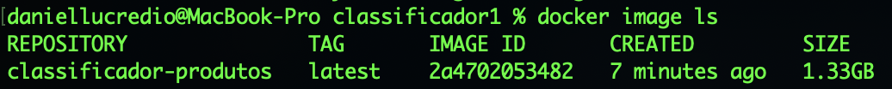

Considerando que uma imagem contém uma instalação completa do Linux, 1.33 Gb é um tamanho razoável. Mas é preciso lembrar que essa imagem precisará ser transmitida pela rede, possivelmente. Você deve ter reparado que, ao enviar a imagem para o Heroku, no final da seção anterior, houve uma certa demora devido ao envio de uma grande quantidade de dados. E se pudéssemos instalar uma versão mais enxuta do Linux? Afinal, não estaremos utilizando muita coisa desse sistema, não é mesmo?

Olhando a documentação da imagem [python no Docker Hub](https://hub.docker.com/\_/python), vemos que existe uma variante mais magra (ocupa menos espaço de armazenamento), porém que tem suporte básico para muitas coisas. Vamos utilizá-la aqui e ver qual será o tamanho final da imagem?

Então vamos ao `Dockerfile`! Lembre-se que ele precisa ser salvo na mesma pasta que os demais arquivos. Aqui, são 3 os arquivos: `app.py`, `model.sav` e `requirements.txt` Veja como é muito parecido com o exemplo da seção anterior. Consegue ver as diferenças?

```
FROM python:3.10.2-slim

WORKDIR /usr/src/app

COPY requirements.txt ./

RUN pip install --no-cache-dir -r requirements.txt

COPY . .

ENTRYPOINT ["flask", "run", "--host=0.0.0.0"]
```

Exceto pelos comentários (aqui não tem comentários, pois você já é capaz de entender tudo o que está escrito nesse arquivo), as diferenças são duas. A primeira é a imagem utilizada como base. Aqui estamos utilizando a variante "slim". E há também uma diferença no comando, no final do arquivo. Ao invés da entrada "CMD", estamos usando "ENTRYPOINT". Há [algumas diferenças, que podem ser compreendidas lendo-se a documentação detalhada do Dockerfile](https://docs.docker.com/engine/reference/builder/), e não entraremos em muitos detalhes. Mas a principal é que, com "ENTRYPOINT", temos uma maior flexibilidade para executar outros comandos após o servidor ter sido iniciado, caso necessário. Isso porque "ENTRYPOINT" é sempre executado, mesmo que o usuário especifique algum comando ao iniciar um contêiner. Já o "CMD", caso o usuário especifique um novo comando ao iniciar o contêiner, é ignorado. Novamente, não entraremos em muitos detalhes. Basta saber que, no exemplo anterior, o objetivo era executar uma tarefa _offline_, feita para ser executada esporadicamente. Agora queremos que o servidor fique rodando sempre, assim que o contêiner for executado. Nestes casos, geralmente "ENTRYPOINT" é recomendado.

Também estamos especificando um endereço para o "host", no caso `0.0.0.0`. [Conforme a documentação do Flask](https://flask.palletsprojects.com/en/2.0.x/api/), isso indica que a aplicação estará apta a receber requisições de qualquer endereço, ou seja, estará atuando como um servidor para outros acessarem. Isso pode ser alterado para restringir o acesso a apenas um endereço específico, por razões de maior segurança. No momento não faremos isso.

Vamos então construir a imagem. Com o Docker executando, rode o seguinte comando:

```
docker build -t http-api-classificacao-produtos .
```

Se tudo der certo, execute o seguinte comando e veja se a imagem foi criada:

```
docker image ls
```

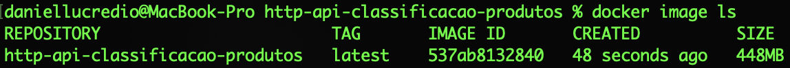

Como podemos ver, o tamanho reduziu para 448Mb. Nada mau! Ainda existe uma versão mais enxuta, baseada no [alpine](https://hub.docker.com/\_/alpine), uma distribuição minimalista do Linux. Mas o scikit-learn depende de algumas bibliotecas que não estão no alpine, então seria necessário acrescentar mais alguns comandos no Dockerfile para funcionar. Não faremos isso aqui.

Agora já podemos rodar nosso aplicativo. Execute o seguinte comando:

```
docker run -d -p 5000:5000 --rm --name http-api-classificacao-produtos-container http-api-classificacao-produtos
```

Aqui temos duas novas opções, em comparação com o exemplo da seção anterior:

* `-d`: roda o contêiner em [modo desacoplado](https://docs.docker.com/engine/reference/run/#detached--d), ou seja, sem um terminal para exibir a entrada/saída. É diferente do caso anterior, quando queríamos de fato enxergar a saída, no terminal, da execução dos comandos. Como aqui queremos deixar o contêiner rodando (e respondendo a requisições), é melhor deixar ele desacoplado.
* `-p`: publica uma porta que está aberta dentro do contêiner para o sistema hospedeiro (a sua máquina). Dessa forma, é possível acessar a porta de fora do contêiner. Como é exatamente isso que queremos (acessar a API HTTP pela porta), precisamos dessa opção. Neste caso, estamos expondo a porta 5000 do contêiner (aberta pelo Flask) para a mesma porta 5000 da máquina hospedeira, para acessá-la.

Ao executar esse comando, o terminal imediatamente devolve o controle para você, e não estamos mais vendo a saída original (por causa do modo desacoplado). Para saber se o contêiner está rodando, basta executar o comando:

```
docker ps
```

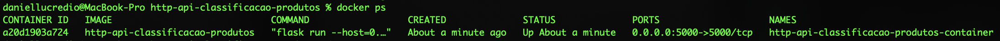

Podemos ver que o contêiner está rodando. Para testar, basta submeter uma requisição do tipo POST ao endereço local, como já havíamos feito na [Seção 2.2](../2-desenvolvimento/2-2-do-notebook-para-aplicacao-parte-2.md):

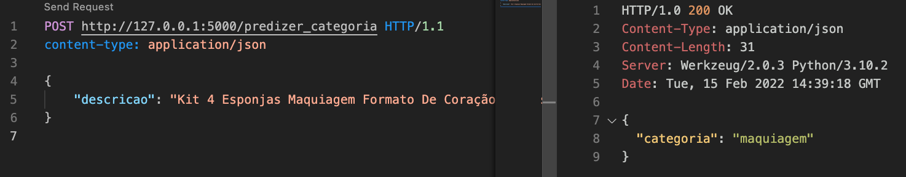

Tudo funcionando, ou seja, sucesso, certo?

Quase!

Vamos modificar um pouco nosso comando e executar o servidor sem estar no modo desacoplado, apenas para ver as mensagens que estão sendo exibidas pelo contêiner. Vamos primeiro parar o contêiner:

```
docker container stop http-api-classificacao-produtos-container
```

E vamos rodar de novo, agora sem a opção `-d`:

```
docker run -p 5000:5000 --rm --name http-api-classificacao-produtos-container http-api-classificacao-produtos
```

Agora podemos ver as mensagens exibidas pelo Flask ao iniciar o servidor, inclusive essa mensagem assustadora aqui:

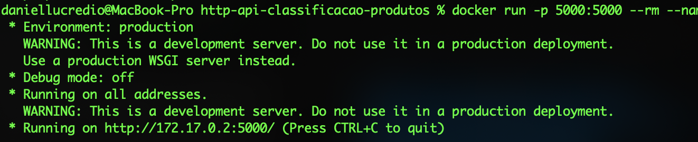

Enquanto estávamos apenas testando as coisas, no desenvolvimento, podíamos ignorar essa mensagem: "WARNING: This is a development server. Do not use it in a production deployment. Use a production WSGI server instead". Traduzindo: "AVISO: Este é um servidor de desenvolvimento. Não utilize-o em uma implantação em produção. Ao invés disso, use um servidor WSGI de produção."

De forma resumida, o servidor padrão do Flask não escala bem, portanto recomenda-se uma opção mais robusta. A [documentação oficial do Flask](https://flask.palletsprojects.com/en/2.0.x/deploying/) lista uma série de opções para execução, e vamos aqui explorar duas delas: uma para ambiente local e uma para ambiente em nuvem. Mas antes, é preciso falar rapidamente de um conceito interessante, que são os padrões Python para aplicações web.

## 3.3.2 WSGI

Não queremos ficar aqui dando aula de desenvolvimento Web, mas você precisa saber algumas coisas básicas. Já falamos o que é uma API HTTP na [Seção 2.2](../2-desenvolvimento/2-2-do-notebook-para-aplicacao-parte-2.md), e esperamos que agora você já tenha uma mínima noção do que se trata. Não nos aprofundamos muito no assunto, focamos apenas em colocar uma API no ar para que você possa ver o resultado de um modelo de Machine Learning implantado como uma API. E funcionou! Mas agora apareceu uma pedra no sapato. Aquele aviso chato no final da seção anterior: "AVISO: Este é um servidor de desenvolvimento. Não utilize-o em uma implantação em produção. Ao invés disso, use um servidor WSGI de produção." - não podemos deixar isso passar em branco! Então vamos explicar, mas será rápido e apenas o essencial. Obviamente, se quiser se aprofundar no assunto você precisará buscar outros materiais e estudar mais um pouco.

Vamos começar a explicação voltando um pouco no tempo, para quando surgiu a World-Wide Web (www). E cuidado, não estamos falando da Internet! Se ainda não sabe, www e Internet são coisas distintas: a Internet é a "rede" (_net_), e www é a "teia" (_web_). Internet cuida da integração de redes distintas. E www é uma aplicação que funciona na Internet.

Você já deve ter ouvido falar de Tim-Bernes Lee. Ele é normalmente [creditado como o inventor da www](https://en.wikipedia.org/wiki/World\_Wide\_Web). Mas o que ele de fato criou?

* Ele criou um sistema de informação distribuído;
* que possibilita que documentos (e outros recursos) sejam armazenados em diferentes locais (chamados servidores web);
* e possam ser localizados por uma cadeia ou string, chamada de URL - _Uniform Resource Locator_;
* possibilitando também a inserção de links entre documentos (hiperlinks);
* a comunicação entre os componentes distribuídos acontece de forma padronizada (o padrão se chama HTTP - _HyperText Transfer Protocol_);
* e tem também uma aplicação para o usuário, capaz de desenhar documentos e links de um jeito bem "navegável" (daí o nome - navegador).

A existência dos links, e da leitura não-linear (chamada de navegação web) dão essa característica de "teia", pois a informação fica toda interligada. É daí que vem o nome "web". E é uma **World-Wide** Web porque o sistema funciona sobre a Internet (rede mundial).

Pois bem, nada disso deve ser novidade para você. Também não deve ser novidade como isso revolucionou a forma como as pessoas acessam e compartilham informações. Literalmente, essa invenção mudou o mundo! A quantidade de informações na web cresceu, surgiu a necessidade de mecanismos de busca, surgiu um mecanismo de busca que dominou os outros e, bem, a história está sendo escrita ainda!

Mas não queremos nos alongar no assunto. Vamos voltar ao início, para onde queremos de fato chegar. A www foi criada entre 1989 e 1991, e o importante é saber que nessa época, os recursos web eram arquivos. Documentos de texto (formatados em HTML, para uma exibição mais rica do que texto simples), imagens, vídeos e sons. Ou seja, arquivos estáticos. Quando alguém abria um navegador e solicitava um recurso, o mesmo era simplesmente copiado de seu local original e enviado para quem o solicitou. Era um conteúdo estático. O servidor não fazia nada além de encontrar e enviar arquivos. Era um desperdício, pois um servidor era um computador, capaz de... computar!

Não demorou para que as pessoas percebessem que o conteúdo não precisava ser estático. Por que não utilizar a padronização e a infraestrutura recém criada da www para pedir que o servidor executasse alguma coisa? Poderia ser um cálculo, um processamento, um acesso a banco de dados, qualquer coisa. E foi para isso que surgiu o CGI (_Common Gateway Interface_)

Não demorou muito. [Em 1993](https://en.wikipedia.org/wiki/Common\_Gateway\_Interface) surgiu uma especificação para possibilitar a execução de programas de linha de comando por meio de uma requisição web. Aos poucos os servidores foram adotando essa especificação, que se tornou um padrão (o padrão CGI) [em 1997](https://en.wikipedia.org/wiki/Common\_Gateway\_Interface).

Não precisamos entrar em detalhes sobre o que é CGI. Basta saber que ela define um "jeito" para que um servidor web consiga executar um script, ao invés de apenas copiar e enviar um arquivo para quem pediu. Originalmente, as implementações CGI eram feitas na linguagem C. Não demorou para que surgisse PERL, uma linguagem um pouco mais simplificada e apropriada para execução de scripts mais simples, o que popularizou ainda mais esse estilo de escrita de aplicações distribuídas.

E enfim chegamos ao WSGI, mencionado naquela mensagem de aviso emitida pelo Flask. O que é WSGI? A resposta simples: é o CGI para Python! _Web Server Gateway Interface_ (WSGI), em português Interface de Porta de Entrada do Servidor Web, é uma especificação que define um "jeito" para que um servidor web consiga executar um script em Python. A Figura a seguir ilustra o papel do WSGI na arquitetura final:

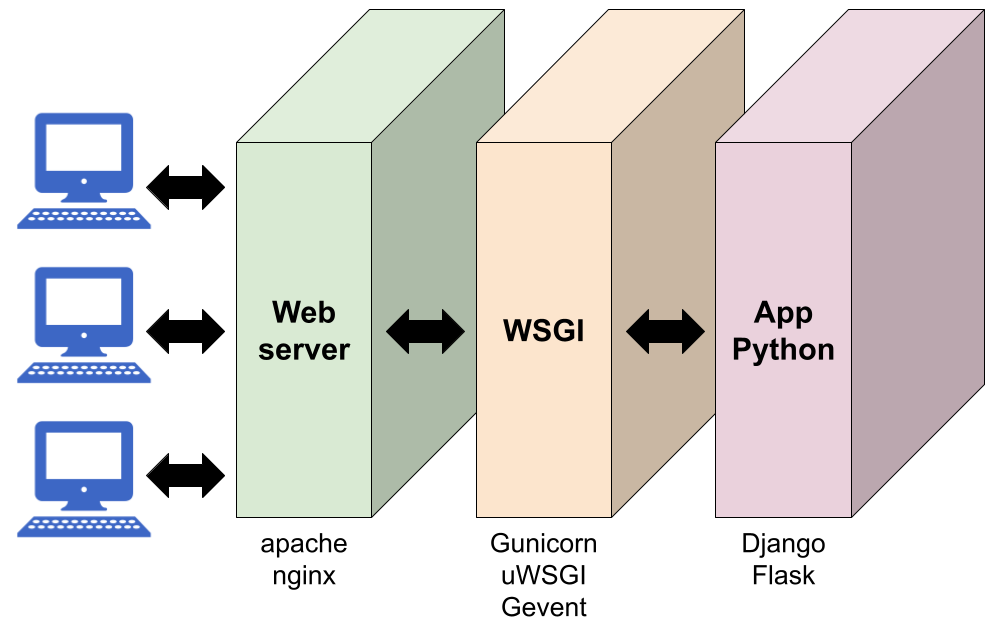

Nessa arquitetura, existem 3 componentes. Da direita para a esquerda, temos:

* A aplicação web, feita em Python, utilizando algum framework, como Flask ou Django. Ou pode ser feita completamente do zero, sem framework nenhum (obviamente, essa opção é mais trabalhosa). Aqui, utilizamos o Flask;
* A camada WSGI, responsável por intermediar a comunicação entre o servidor web e a aplicação. Exemplos são [gunicorn](https://gunicorn.org/), [uWSGI](https://uwsgi-docs.readthedocs.io/en/latest/) e [Gevent](http://www.gevent.org/); e
* O servidor web, tradicional, que fica responsável por receber e enviar as requisições aos clientes. Exemplos são o [Apache HTTP server](https://httpd.apache.org/) e o [Nginx](https://nginx.org/).

Para explicar o papel de cada componente, vamos explicar o fluxo de execução rapidamente. Quando chegar uma requisição web, o servidor web faz o seguinte:

1. Primeiro ele decide se aquela requisição é do tipo simples (do tipo "copia e envia" um arquivo). Se for, ele mesmo faz o serviço. Mas se for uma requisição para um script Python, ele repassa para a WSGI;
2. A WSGI processa a requisição, faz o _parsing_ dos seus elementos, headers, etc. É esse componente que lida com todos os detalhes e complexidades do protocolo HTTP. Ela então entrega tudo isso na forma de um objeto Python;
3. A aplicação web recebe esse objeto Python, faz o que tem que fazer e responde também com um objeto Python;
4. A WSGI traduz esse objeto Python de volta para o protocolo HTTP (escrevendo os headers, no formato correto), repassando para o servidor web; e
5. O servidor web responde para quem fez a requisição.

A vantagem desse padrão é bastante óbvia. Você, programador, não quer ficar lidando com detalhes do HTTP, correto? Você quer se preocupar com a lógica da aplicação, não? Você está atuando no passo 3 acima. E olha só que legal: já vai chegar, prontinho para você, um objeto Python. E você só tem que responder gerando outro objeto Python. Nada de lidar com HTTP!

A outra vantagem vai para a conta dos desenvolvedores dos servidores web: para que um servidor possa ter suporte a Python, basta ele implementar a compatibilidade com a camada WSGI. Dessa forma, um servidor tem maior aceitação, maior uso, pois Python é uma linguagem bastante popular.

Por esse motivo, pelo fato de que a WSGI isola a aplicação da parte referente a rede, ela também é chamada de um servidor de aplicações. Em outras palavras, aplicações (scripts) são hospedadas em um servidor de aplicações, que por sua vez é hospedado em um servidor HTTP.

Então agora que você sabe o que é WSGI, vamos finalmente nos livrar daquela mensagem chata. Vamos seguir [a documentação oficial do Flask](https://flask.palletsprojects.com/en/2.0.x/deploying/), e você vai ver que a resolução vai ser muito mais rápida do que ler essa explicação toda (mas conhecimento a mais sempre vale a pena).

A documentação divide as opções em "hosted" e "self-hosted". A primeira se refere a uma plataforma de nuvem, onde contratamos serviços de hospedagem. A segunda é quando queremos hospedar por conta própria. Faremos das duas maneiras, começando pela segunda. E vamos utilizar o [gunicorn](https://gunicorn.org/), um servidor WSGI.

Primeiro, vamos ter que modificar nosso arquivo `requirements.txt` para instalar o gunicorn, sempre lembrando de fixar a versão.

```diff
Flask==2.0.2
scikit-learn==1.0.2
Flask-Cors==3.0.10
+gunicorn==20.1.0
```

Vamos aproveitar que estamos usando Docker e vamos testar tudo direto no Docker, ao invés de usar ambientes virtuais. Para rodar o gunicorn, basta trocar, no `Dockerfile`, o `ENTRYPOINT`. Onde antes rodávamos o Flask diretamente, agora vamos rodar o gunicorn, apontando para o módulo da aplicação Flask:

```diff
FROM python:3.10.2-slim

WORKDIR /usr/src/app

COPY requirements.txt ./

RUN pip install --no-cache-dir -r requirements.txt

COPY . .

-ENTRYPOINT ["flask", "run", "--host=0.0.0.0"]
+ENTRYPOINT ["gunicorn", "-w", "4", "-b", "127.0.0.1:5000", "app:app"]
```

Os parâmetros são:

* `-w 4`: configura o servidor para alocar 4 "workers" (ou processos) para atender às requisições;
* `-b 0.0.0.0:5000`: configura o servidor para escutar requisições locais, na porta 5000;
* `app:app`: configura o servidor para procurar no arquivo `app.py`, pelo módulo `app` (o nome do objeto Python que declaramos dentro de `app.py`, para criar a aplicação Flask).

Construindo a imagem:

```
docker build -t http-api-classificacao-produtos .
```

E rodando:

```
docker run -p 5000:5000 --rm --name http-api-classificacao-produtos-container http-api-classificacao-produtos
```

Não há nenhuma diferença visível, exceto pelo fato de que agora não temos mais aquele aviso, pois o gunicorn é mais apropriado para se colocar em produção. Também temos uma maior garantia de que a nossa API será mais capaz de responder a uma quantidade maior de requisições e funcionar de maneira mais estável. Veja, na saída, como os quatro "workers" são inicializados:

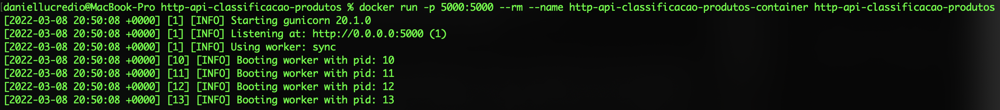

Para rodar em modo desacoplado, basta incluir a opção `-d`. Assim, o servidor rodará em background, sem ficar amarrado a um terminal.

A configuração atual já é suficientemente robusta para atender a uma quantidade considerável de cenários e diferentes cargas e demandas. Mas volte à figura onde explicamos o que é WSGI. Está faltando um servidor web na frente, correto?

O gunicorn, na verdade, já consegue atuar como servidor web, mas ele tem um único propósito de executar scripts Python. Outras tarefas, como um suporte mais robusto para atender a requisições simultâneas, configuração de segurança, entre outras, são melhores resolvidas por um servidor mais dedicado, como Apache ou nginx. Por isso, [na própria documentação do gunicorn](https://gunicorn.org/#deployment), recomenda-se adicionar um servidor nginx na frente. Faremos isso a seguir.

## 3.3.3 nginx + WSGI na mesma imagem (não recomendado)

[Nginx](https://nginx.org/) (pronuncia-se "engine x", em inglês) é, na verdade, várias coisas ao mesmo tempo:

* Um servidor HTTP;
* Um servidor proxy reverso;
* Um servidor proxy de email;
* Um servidor proxy genérico TCP/UDP.

Uma dessas coisas é justamente a que queremos - um servidor HTTP. E o nginx é um servidor muito bom. Ele é MUITO utilizado (mesmo). [Dropbox](https://dropbox.tech/infrastructure/optimizing-web-servers-for-high-throughput-and-low-latency), [Netflix](https://openconnect.netflix.com/pt\_br/appliances/#software) e [Wordpress](https://www.nginx.com/success-stories/nginx-wordpress-com/) contam suas histórias de sucesso com nginx. Então dá para usar sem medo.

Um servidor HTTP tem duas funções básicas: hospedar arquivos estáticos e se comunicar com um servidor de aplicações (como WSGI). Claro que tem outras coisas ali dentro, como medidas de segurança, otimizações visando desempenho, entre outras coisas. Vamos utilizar as duas aqui.

Uma das formas que podemos utilizar para acrescentar um servidor web à nossa aplicação é colocar tudo na mesma imagem. Neste caso, teríamos dois serviços rodando: nginx e gunicorn. Isso [não é recomendado](https://docs.docker.com/config/containers/multi-service\_container/), pois idealmente queremos que cada contêiner tenha uma responsabilidade bem definida, dessa forma conseguimos fazer um controle melhor, monitoramento melhor, melhor escalabilidade, versionamento, separação de instalações, entre uma série de benefícios. Então, repetindo, [não é recomendado!](https://docs.docker.com/config/containers/multi-service\_container/)

Mas porque não tentar? Afinal de contas, nunca sabemos quando podemos precisar de uma solução mais simples. E estamos aqui para aprender, não? Vamos lá!

Antes de começar a codificar, vamos entender o que estaremos fazendo. Como comentado, o nginx vai receber dois tipos de requisição:

* Requisições para URLs que seguem o padrão `http://127.0.0.1/arquivo.html`. É uma requisição simples, do tipo copia-e-envia-arquivo. Neste caso, ele vai encontrar o `arquivo.html` em uma pasta local e enviar para onavegador. Como o nginx é um HTTP server, ele vai dar conta de fazer isso sozinho (sem precisar solicitar ao gunicorn);
* Requisições para URLS que seguem o padrão `http://127.0.0.1/api/endpoint`. Note a cadeia "api" na URL. Isso vai dizer ao nginx que esse tipo de requisição deve ser redirecionada para o gunicorn, para que ele possa executar a função que está associada ao _endpoint_ especificado. No nosso exemplo, será uma requisição tipo `http://127.0.0.1/api/predizer_categoria`, lembra?

Em ambos os casos, note que não há uma porta específica nas URLs. Isso significa que será utilizada a porta 80, que é a porta padrão para os navegadores. Internamente, o gunicorn continuará rodando na porta 5000, como antes, e o nginx fará o processo de encaminhar e mudar a porta.

A primeira coisa que vamos fazer é modificar o `Dockerfile` para instalar o nginx em nossa imagem. Veja o arquivo a seguir, comentado:

```
FROM python:3.10.2-slim

# Instalação do nginx

# Vamos rodar apt update sem precisar interagir. Essa flag diz isso.
ENV DEBIAN_FRONTEND=noninteractive

# Agora vamos instalar nginx, passando a opção -y para aceitar os prompts
# Após a instalação, vamos remover os caches criados pelo apt update,
# Assim nossa imagem fica mais limpa
RUN apt update && apt install -y nginx && rm -rf /var/lib/apt/lists/*

# Vamos copiar os arquivos estáticos para www (pasta configurada para o nginx)
COPY webclient/* /www/

# E agora vamos copiar o arquivo de configuração do nginx
COPY default /etc/nginx/sites-available/default

# A porta 80 será a utilizada pelo nginx. Vamos expô-la
EXPOSE 80/tcp

# Agora vamos às configurações do nosso app original
WORKDIR /usr/src/app

# Aqui vamos copiar os arquivos um a um, pois agora temos outros
# arquivos que não fazem parte da aplicação e não faz sentido copiar
COPY requirements.txt ./
COPY model.sav ./
COPY app.py ./
RUN pip install --no-cache-dir -r requirements.txt

# Agora vamos copiar um script que roda as duas coisas
# nginx e gunicorn

COPY entrypoint.sh ./
RUN chmod 755 ./entrypoint.sh

CMD ["./entrypoint.sh"]
```

Deve ser relativamente tranquilo entender o que está acontecendo. Estamos basicamente instalando nginx por meio de um comando "apt", muito comum no Linux.

Também estamos copiando todos os arquivos da pasta `webclient`, do sistema local, para a pasta `/www` da imagem. É aí que vão ficar os arquivos estáticos. Isso significa que todos os arquivos estáticos que quisermos mandar para a imagem devem ficar na pasta `webclient`. No exemplo da [Seção 2.2](../2-desenvolvimento/2-2-do-notebook-para-aplicacao-parte-2.md), tínhamos um arquivo HTML com um formulário de cadastro de produtos, lembra? Então vamos lá: salve esse arquivo (lá chamamos de `cadastro.html`, mas pode ser qualquer nome) em uma pasta chamada `webclient`.

Também tem um novo arquivo, chamado `default` (sem extensão mesmo). Esse arquivo é a configuração do nginx. Veja seu conteúdo:

```
server {
    listen 80;

    location / {
        root /www;
    }

    location /api/ {
        rewrite /api/(.*)$ /$1 break;
        proxy_pass http://127.0.0.1:5000;
        proxy_set_header Host $host;
        proxy_set_header X-Forwarded-For $proxy_add_x_forwarded_for;
    }
}
```

Não entraremos em detalhes sobre como configurar o nginx, mas é simples de entender, veja:

* Esse server escuta na porta 80;
* Requisições que chegarem na URL raiz ("/") serão redirecionadas para a pasta `www` da imagem, que é onde mandamos copiar os arquivos estáticos. É o primeiro caso de uso que explicamos acima (arquivos estáticos que são tratados pelo nginx sozinho); e
* Requisições que chegarem em URLs que tem "/api/" serão reescritas (rewrite) para suprimir esse trecho, e em seguida redirecionadas para o gunicorn, que vai rodar na porta 5000. É o segundo caso (requisições que serão repassadas para o gunicorn, para serem tratadas pelo nosso aplicativo Python).

Por último, estamos criando um novo arquivo que inicia o contêiner. Trata-se do `entrypoint.sh`:

```
#!/bin/bash

gunicorn -w 4 -b 127.0.0.1:5000 app:app &
nginx -g 'daemon off;' &
  
wait -n
  
exit $?
```

É um script bash que inicia os dois serviços (gunicorn e nginx).

O gunicorn vai rodar na porta 5000, e apenas vai aceitar requisições locais (127.0.0.1). Isso significa que requisições vindas de fora não serão aceitas, mas tudo bem, pois quem vai fazer as requisições será sempre o nginx, que está rodando no mesmo contêiner.

O nginx vai rodar no modo `daemon off`, o que significa que ele rodará em modo _foreground_.

As últimas duas linhas apenas dizem que esse script deve esperar pelos dois processos terminarem antes de ele terminar também. É uma forma de manter o contêiner rodando até que todos os processos terminem.

Depois de criar todos esses arquivos, é assim que a estrutura de diretórios deve ficar;

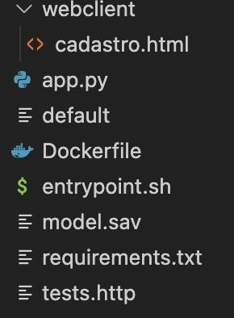

Talvez você não tenha o arquivo `tests.http`. Neste caso temos pois ele faz parte de um plugin do VSCode para fazer testes na API HTTP. Mas se você estiver usando [Postman](https://www.postman.com/) para isso, não terá, e não tem problema.

Com tudo isso configurado, podemos criar nossa imagem e subir o contêiner. Estando na pasta do projeto, execute:

```
docker build -t http-api-classificacao-produtos .
```

E para subir o contêiner, execute:

```
docker run -d -p 80:80 --rm --name http-api-classificacao-produtos-container http-api-classificacao-produtos 
```

Se tudo der certo, agora podemos testar dois tipos de requisições. Primeiro, abra o navegador e digite `http://127.0.0.1/cadastro.html`, e veja a página HTML sendo exibida:

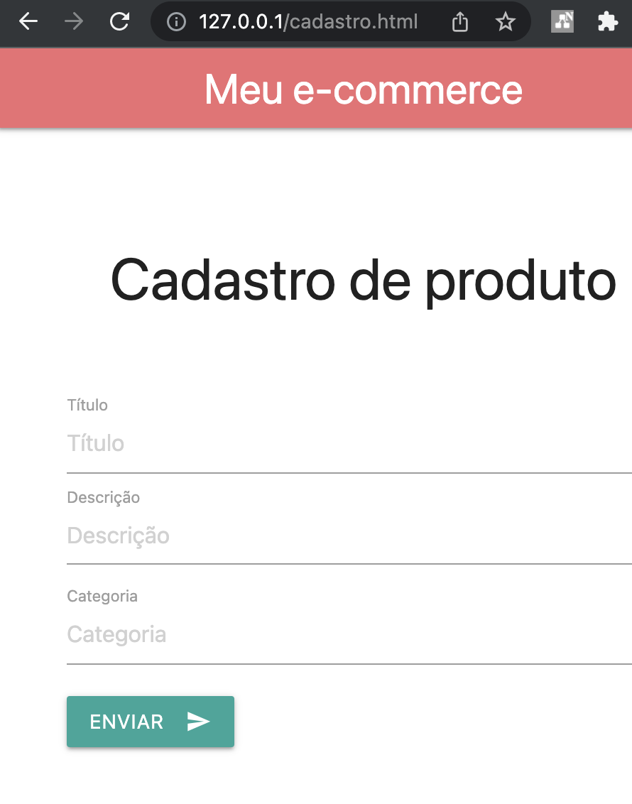

> Obs: caso haja problema na execução, verifique se os arquivos estão sendo salvos com terminação de linha padrão Linux. Caso seja padrão Windows, pode ocorrer erro.

Essa é a requisição sendo atendida pelo nginx diretamente. Ele achou o arquivo `cadastro.html` e enviou-o para o navegador. A Figura a seguir ilustra o que está acontecendo:

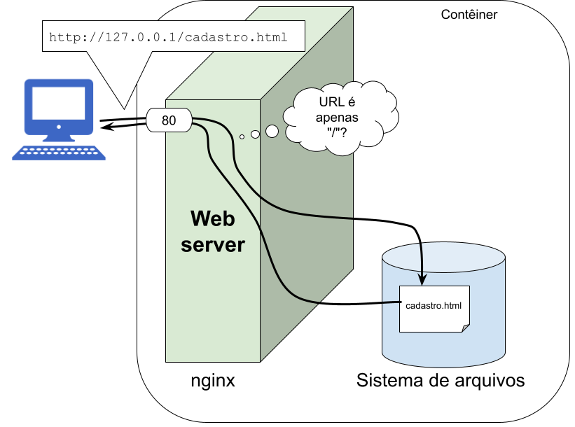

Agora vamos testar a API:

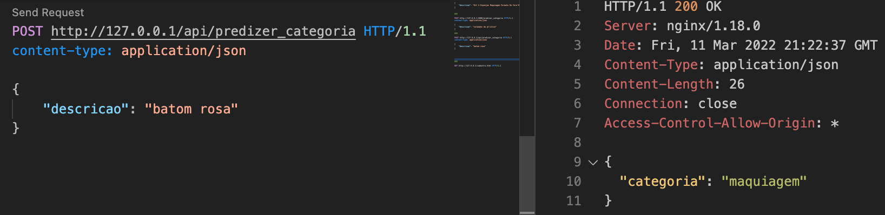

O endereço que chamamos do _endpoint_ (`http://127.0.0.1/api/predizer_categoria`) primeiro chegou no nginx (via porta 80), que o traduziu para `http://127.0.0.1:5000/predizer_categoria`, e enviou para o gunicorn (via porta 5000), que executou o código Python e respondeu com a categoria. Tudo isso rodando no mesmo contêiner. A Figura a seguir ilustra o que está acontecendo:

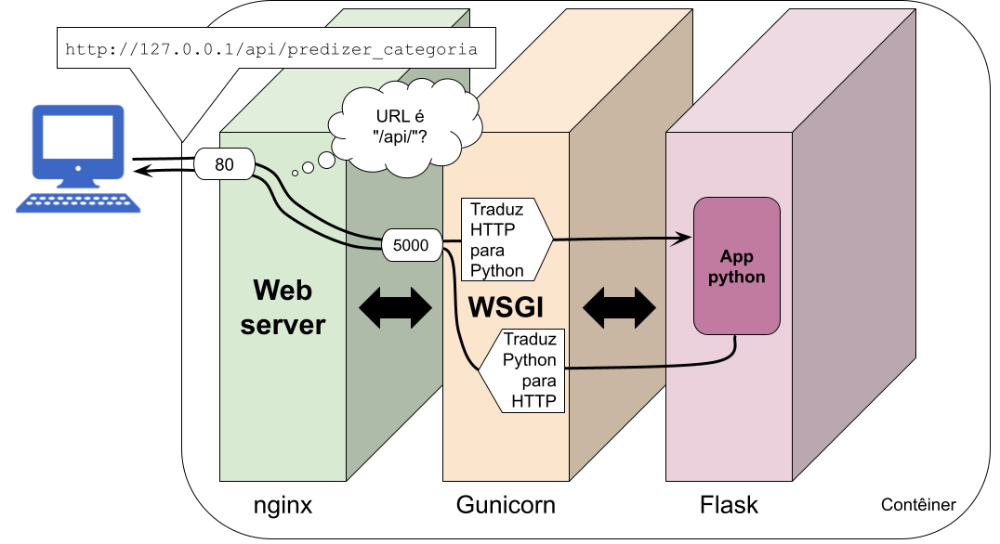

Em ambos os casos, a decisão sobre como tratar a requisição foi feita com base na URL. Se for apenas "/", trata do primeiro jeito. Se tiver "/api/", trata do segundo. Veja nas figuras, nos balões de pensamento do nginx, isso acontecendo.

Para nosso exemplo ficar completo, vamos alterar o arquivo HTML para fazer as requisições para o local correto. Altere apenas o endereço (linhas 74/75), conforme segue:

```diff
<!DOCTYPE html>
<html>

<head>
    <!--Import Google Icon Font-->
    <link href="https://fonts.googleapis.com/icon?family=Material+Icons" rel="stylesheet">
    <!-- Compiled and minified CSS -->
    <link rel="stylesheet" href="https://cdnjs.cloudflare.com/ajax/libs/materialize/1.0.0/css/materialize.min.css">

    <!--Let browser know website is optimized for mobile-->
    <meta name="viewport" content="width=device-width, initial-scale=1.0" />
    <meta charset="UTF-8">
</head>

<body>
    <nav>
        <div class="nav-wrapper">
            <a href="#" class="brand-logo">Meu e-commerce</a>
            <ul id="nav-mobile" class="right hide-on-med-and-down">
                <li><a href="#">Olá, Daniel</a></li>
                <li><a href="#"><i class="material-icons">exit_to_app</i></a></li>
            </ul>
        </div>
    </nav>

    <div class="container">
        <form>
            <div class="section no-pad-bot" id="index-banner">
                <div class="container">
                    <br><br>
                    <h3 class="header center">Cadastro de produto</h3>
                    <br><br>

                </div>
            </div>

            <div class="container">
                <div class="input-field">
                    <input placeholder="Título" id="titulo" type="text" class="validate">
                    <label for="titulo">Título</label>
                </div>
                <div class="input-field">
                    <textarea placeholder="Descrição" id="descricao" class="materialize-textarea" onfocusout="buscarCategoria()"></textarea>
                    <label for=" descricao ">Descrição</label>
                </div>
                <div class="input-field ">
                    <input placeholder="Categoria" id="categoria" type="text" class="validate">
                    <label for="categoria ">Categoria</label>
                </div>
            </div>
            <div class="container ">
                <button class="btn waves-effect waves-light " type="submit " name="action ">Enviar
                    <i class="material-icons right ">send</i>
                </button>
            </div>

        </form>
    </div>

    <!--JavaScript at end of body for optimized loading-->
    <!-- Compiled and minified JavaScript -->
    <script src="https://cdnjs.cloudflare.com/ajax/libs/materialize/1.0.0/js/materialize.min.js "></script>
    <script>
        function buscarCategoria() {
            // Primeiro vamos construir um objeto JSON para enviar para a API
            // O objeto tem um campo "descricao", cujo conteúdo vem do formulário,
            // sendo obtido do "input" cujo "id" é "descricao" (procure-o no HTML)
            let data = {
                "descricao": document.getElementById("descricao").value
            };

            // Em seguida, vamos enviar uma requisição
            // Note como o endereço aponta para o servidor local
-            fetch("http://127.0.0.1:5000/predizer_categoria", {
+            fetch("http://127.0.0.1/api/predizer_categoria", {
                // Vamos usar método POST
                method: "POST",
                // Estamos enviando um JSON
                headers: {
                    'Content-Type': 'application/json'
                },
                // Aqui vai o conteúdo, que é o objeto JSON convertido para
                // string (lembre-se, um HTTP Request é uma string)
                body: JSON.stringify(data)
            }).then(res => {
                // Essa função "then" é chamada assim que o serviço responder
                res.json().then(function(json) {
                    // Vamos converter o resultado para JSON e salvar
                    // a categoria no formulário, no "input" cujo "id" é "categoria"
                    document.getElementById("categoria").value = json.categoria;

                    // E pronto!
                })
            });
        }
    </script>
</body>

</html>
```

Refaça todo o processo (pare o contêiner, construa a imagem, execute o contêiner, e abra o navegador). Agora temos nossa aplicação completa, com _front-end_ e _back-end_, tudo no mesmo contêiner!

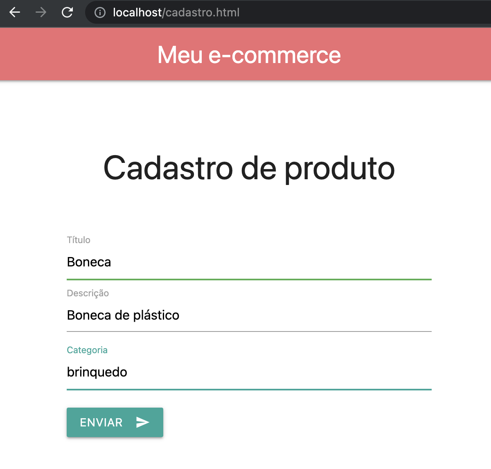

Dá até para tirar a definição de CORS usada no arquivo `app.py`, pois agora a página que faz a requisição está na mesma origem que o recebedor, então a [restrição _cross-origin_](https://developer.mozilla.org/pt-BR/docs/Web/HTTP/CORS) não existe mais (desde que você acesse a página pelo endereço `127.0.0.1`, que é o mesmo que aparece dentro do arquivo HTML):

```diff
from flask import Flask, request, jsonify
import pickle
-from flask_cors import CORS

app = Flask(__name__)
-CORS(app)

model = pickle.load(open('model.sav', 'rb'))

@app.route('/predizer_categoria', methods=['POST'])
def predizer_categoria():
    request_data = request.get_json()
    input_message = [request_data['descricao']]
    input_message = model["vect"].transform(input_message)
    final_prediction = model["clf"].predict(input_message)[0]

    response = {
        'categoria': final_prediction
    }

    return jsonify(response)
```

Pronto, terminamos essa seção, e agora nossa API está funcionando em um contêiner, e está mais segura e robusta do que antes, pronta para ser colocada em produção. Mas como comentado, essa forma que fizemos (nginx + gunicorn na mesma imagem) pode não ser o ideal, pois estamos desprezando vários dos benefícios do uso de contêiners. Caso não esteja interessado neles e queira prezar pela simplicidade na implantação, tudo bem! Mas o ideal é que cada contêiner rode um único serviço. Por isso veremos uma alternativa, na próxima seção.

## 3.3.4 nginx + WSGI em imagens separadas (recomendado)

Apesar de parecer que esta solução é mais complicada, você verá que isso não é verdade. Além de praticamente reaproveitar tudo o que já fizemos, tem um benefício a mais: O Docker Hub já tem uma [imagem oficial nginx](https://hub.docker.com/\_/nginx), mantida pela comunidade. Ou seja, não precisaremos nos preocupar com a instalação do nginx.

Vamos começar com uma figura desta vez:

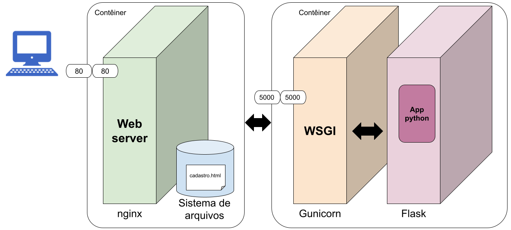

O funcionamento é praticamente o mesmo, exceto que agora nginx vai rodar em um contêiner próprio, e buscar os arquivos estáticos dentro desse contêiner, e o gunicorn + Flask vão rodar em outro contêiner. Cada contêiner irá expor as respectivas portas de seus serviços (80 para o nginx e 5000 para o gunicorn).

A única complicação que teremos é a comunicação entre os contêiners. A princípio, você pode imaginar que eles conseguem se comunicar pela rede local, pois ambos estarão rodando na mesma máquina real (mesmo _host_). Porém, o Docker promove um isolamento completo, portanto cada contêiner precisa ser configurado para acessar uma determinada rede virtual, diferente da real.

O Docker, por padrão, já inicializa uma rede, chamada _bridge_. Mas conforme a [documentação oficial](https://docs.docker.com/network/network-tutorial-standalone/), ela não é recomendada. Então vamos criar uma nova rede para que os contêineres possam rodar. Execute o seguinte comando:

```
docker network create minharede
```

Esse comando irá criar uma nova rede, chamada de `minharede`. Para saber se deu certo, execute o comando:

```
docker network inspect minharede
```

O resultado irá mostrar detalhes da rede, incluindo a faixa de endereços a ser utilizada.

Vamos agora para a imagem da nossa aplicação Python. Crie um arquivo chamado `Dockerfile-wsgi` (assim não precisamos apagar o `Dockerfile` que já tem lá no diretório):

```
FROM python:3.10.2-slim

WORKDIR /usr/src/app
COPY requirements.txt ./
COPY model.sav ./
COPY app.py ./
RUN pip install --no-cache-dir -r requirements.txt
EXPOSE 5000

ENTRYPOINT ["gunicorn", "-w", "4", "-b", "0.0.0.0:5000", "app:app"]
```

Não deve ter nenhuma novidade aqui, certo? Pelo menos esperamos que não, pois todo esse conteúdo já foi explicado antes. O que fizemos foi pegar a imagem do exemplo anterior e tirar tudo o que se referia à instalação e execução do nginx. Agora temos um contêiner que faz apenas uma coisa: executar o gunicorn. É exatamente o que tínhamos feito antes de começar a brincar com nginx!

Uma diferença é o comando `EXPOSE 5000`. Esse comando diz ao Docker que esse contêiner terá um serviço escutando na porta 5000. Isso será importante mais adiante.

Outra diferença é o endereço permitido para acesso ao gunicorn. Antes, como ele rodava junto com o nginx no mesmo container, fazia sentido restringir a acesso local (127.0.0.1). Agora, como queremos o acesso de outro container, tivemos que abrir para todos (0.0.0.0).

Vamos construir a imagem e rodar. Os comandos a seguir também devem ser familiares para você, exceto por duas opções novas:

1. Primeiro, agora estamos especificando o nome do `Dockerfile`. Isso porque estamos um nome diferente, já que não queremos apagar o anterior;
2. Segundo, temos a opção `--network minharede`. Ela diz ao docker para conectar o contêiner à rede recém-criada.

```
docker build -f Dockerfile-wsgi -t wsgi-app .
docker run -d --rm --name wsgi-app-container --network minharede wsgi-app
```

Repare que, agora, não precisamos publicar a porta (parâmetro `-p`). Isso porque o gunicorn não precisa ficar visível fora do ambiente Docker, apenas internamente. Lembre-se, quem vai responder às requisições é o nginx. E os contêineres vão se comunicar pela rede virtual. O comando `EXPOSE 5000` diz ao Docker que isso irá acontecer.

Agora execute novamente o comando a seguir, e veja como o novo contêiner está conectado à rede:

```
docker network inspect minharede
```

Em particular, veja como o nome desse contêiner (`wsgi-app-container`) aparece junto com seu endereço. Isso será importante!

Vamos agora criar uma imagem para o nginx. Crie um arquivo chamado `Dockerfile-nginx`:

```
FROM nginx
COPY webclient/* /usr/share/nginx/html
COPY default /etc/nginx/conf.d/default.conf
```

Ele é extremamente simples, como pode ver, pois já está tudo pronto e configurado na imagem oficial do nginx (obtida na primeira linha: `FROM nginx`). Só o que precisamos é copiar os arquivos estáticos (no caso, temos um arquivo chamado `cadastro.html`), e o arquivo de configuração, que no nosso caso se chama `default`. Basta copiar esses arquivos para os locais corretos, conforme a [documentação da imagem](https://hub.docker.com/\_/nginx) e pronto!

Mas antes de construir a imagem, precisamos modificar o arquivo `default`:

```diff
server {
    listen 80;
    server_name example.org;
    access_log  /var/log/nginx/example.log;

    location / {
-        root /www;
+        root /usr/share/nginx/html;
    }

    location /api/ {
        rewrite /api/(.*)$ /$1 break;
-        proxy_pass http://127.0.0.1:5000;
+        proxy_pass http://wsgi-app-container:5000;
        proxy_set_header Host $host;
        proxy_set_header X-Forwarded-For $proxy_add_x_forwarded_for;
    }
}
```

Primeiro modificamos a pasta onde os arquivos estáticos estão salvos, para a pasta padrão do nginx. Não era de fato necessário, mas estamos seguindo a sugestão de localização padrão da documentação oficial. Além disso, agora modificamos o endereço de redirecionamento. Quando chegar uma requisição para a localização `/api`, ao invés de `127.0.0.1` ele vai redirecionar para o _host_ `wsgi-app-container`, que é o nome do container que está rodando o servidor WSGI, e que será traduzido para o endereço dele na rede criada.

Agora é só construir a imagem e rodar. Nenhuma novidade nos comandos a seguir. Note como, novamente, estamos especificando a rede:

```
docker build -f Dockerfile-nginx -t custom-nginx .
docker run -d -p 80:80 --rm --name my-custom-nginx-container --network minharede custom-nginx
```

Desta vez precisamos do parâmetro `-p`, pois o nginx precisa ficar visível para nós. E o nginx vai conseguir enxergar o gunicorn, pois estão ambos na mesma rede, e a porta 5000 do contêiner do gunicorn aparece no `EXPOSE` daquele `Dockerfile`.

Agora, basta abrir um navegador e acessar `http://127.0.0.1/cadastro.html` e tudo vai funcionar da mesma forma. Porém agora temos dois contêineres, melhor isolamento, melhor controle de cada componente e serviço, e outras vantagens da conteinerização!

## 3.3.4 Deploy seguindo a opção "hosted"

Conforme discutido anteriormente, a [documentação oficial do Flask](https://flask.palletsprojects.com/en/2.0.x/deploying/) divide as opções de deploy em "hosted" e "self-hosted". Fizemos até agora a opção "self-hosted", na qual geramos imagens Docker que podem ser implantadas em qualquer máquina. Obviamente, testamos na máquina local. Agora vamos para a opção "hosted", e novamente vamos utilizar o [heroku](https://www.heroku.com).

Poderíamos seguir as [orientações oficiais do heroku](https://devcenter.heroku.com/articles/getting-started-with-python) sobre como implantar um aplicativo Python. Mas essa opção só funciona no heroku. Trata-se, portanto, de uma solução proprietária e que não funciona em outras opções de nuvem. Como aqui estamos aprendendo a usar contêineres, e a liberdade é uma das principais vantagens, vamos seguir por esse caminho. Muito legal. O passo-a-passo é muito parecido com o que fizemos na [Seção 3.2](3-2-ambiente-de-producao-parte-1.md). E a princípio, tudo deveria funcionar da mesma forma que no ambiente local. Só que para executar na nuvem a coisa muda um pouco de figura. Mas calma que vamos chegar lá.

Antes de começar, um aviso: vamos usar a opção de imagem única aqui (nginx + gunicorn na mesma imagem). Isso porque configurar uma rede para comunicação entre contêineres é uma tarefa mais complicada e que varia dependendo da nuvem. O heroku até possui uma solução proprietária para isso, mas na verdade estaríamos entrando no assunto de orquestração na nuvem. Ainda não queremos entrar nesse assunto, portanto seguiremos com a opção mais simples.

Primeiro, acesse o [dashboard do heroku](https://dashboard.heroku.com/) e crie uma nova aplicação. Dê um nome a ela (por exemplo: `cadastro-produto`). Não pode ser um nome já utilizado por outra pessoa, então tente colocar alguma informação única, como seu nome e sobrenome: `cadastro-produto-dlucredio`, por exemplo.

Para os passos a seguir, você precisará instalar o [Heroku CLI](https://devcenter.heroku.com/articles/heroku-cli). Siga as instruções.

Em seguida, vamos enviar nossa imagem para o Heroku. Execute os seguintes comandos:

Primeiro, vamos fazer login:

```
heroku login
```

Em seguida, vamos fazer login no registro de imagens:

```
heroku container:login
```

Agora está na hora de enviar a imagem. Mas não vai funcionar, por um motivo: o heroku [não deixa que você escolha a porta da sua aplicação](https://help.heroku.com/PPBPA231/how-do-i-use-the-port-environment-variable-in-container-based-apps). Você precisa definir a porta usando uma variável de ambiente, chamada `PORT`, que fica disponível para ser utilizada no `Dockerfile`. E isso não é exclusividade do heroku, o mesmo acontece com o [Google, por exemplo (acesse a página em inglês para ver a configuração da variável PORT)](https://cloud.google.com/run/docs/container-contract).

Até aí tudo bem. Mas lembrando: a porta atualmente aparece em 3 lugares diferentes (confira lá):

* No `Dockerfile`, na linha com o comando `EXPOSE`
* No `default`, que configura o nginx
* No `entrypoint.sh`, que roda os serviços gunicorn e nginx

Então precisaremos atualizar esses três arquivos antes de construir a imagem.

Além disso, lembre-se que em nosso arquivo `cadastro.html` tem um endereço para onde o front-end vai enviar as requisições. Vamos ter que alterar também, pois agora tudo vai rodar na nuvem. Vamos começar pelo `cadastro.html`. Altere a linha onde tem a chamada para a API, para trocar o endereço. Lembre-se de substituir o nome do app pelo que você cadastrou (no nosso exemplo, o nome é `cadastro-produto-dlucredio`). Também muda o protocolo. Antes era `http` e agora é `https`:

```diff
-fetch("http://127.0.0.1/api/predizer_categoria", {
+fetch("https://cadastro-produto-dlucredio.herokuapp.com/api/predizer_categoria", {
```

Agora vamos alterar os demais arquivos. Começando pelo `Dockerfile`, onde tem a linha com o comando `EXPOSE`, é só comentar ou apagar:

```diff
-EXPOSE 80/tcp
+#EXPOSE 80/tcp
```

Agora vamos para o arquivo `default`, que configura o nginx. Ao invés de fixar a porta como 80, vamos mudar para usar a variável $PORT:

```diff
-listen 80;
+listen $PORT;
```

Porém, temos um problema aqui. A variável $PORT não vai chegar até o arquivo `default` dessa forma. Como sugerido na [documentação do próprio nginx](http://nginx.org/en/docs/faq/variables\_in\_config.html), deve-se usar alguma expansão em tempo de inicialização. Em outras palavras, deve-se modificar o arquivo `default` antes de rodar o nginx, para substituir as variáveis de ambiente por seus valores. A documentação sugere o uso do comando `sed` do Linux. Vamos fazer isso, no arquivo `entrypoint.sh`, modificando conforme segue:

```diff
#!/bin/bash

gunicorn -w 4 -b 127.0.0.1:5000 app:app &

-nginx -g 'daemon off;' &
+sed -i -e 's/$PORT/'"$PORT"'/g' /etc/nginx/sites-available/default && nginx -g 'daemon off;' &
  
wait -n
  
exit $?
```

O que esse comando `sed` está fazendo é, antes de rodar o nginx, modificando o arquivo `default` e substituindo a string `$PORT` pelo seu valor, conforme lido do ambiente. Assim, o nginx vai ser inicializado com a variável escolhida pelo heroku!

Veja que não precisamos alterar a porta onde o gunicorn roda. Isso porque essa porta ficará disponível apenas internamente, visível ao nginx, mas não ao mundo exterior. Portanto, podemos escolher a porta sem problemas. Na verdade, existe uma pequena chance de o heroku sortear a porta 5000 para ser exposta, e aí poderá haver um conflito! Conforme a [documentação do heroku](https://help.heroku.com/BXGG53I6/what-is-the-range-of-the-dynamic-port-environment-variable), esse sorteio pode variar de 3000 a 60000, então você poderia mudar aqui (e no `default`) para 60001, por exemplo, e esse problema não aconteceria. Mas não faremos isso aqui, pois gostamos de viver perigosamente! (e não temos medo de descobrir que isso aconteceu depois, olhando nos logs!)

Agora está tudo pronto, Podemos finalmente construir e enviar a imagem para o heroku:

```
heroku container:push web --app cadastro-produto-dlucredio
```

Esse comando irá ler o arquivo `Dockerfile` (sem nenhum sufixo), que é o arquivo com as instruções para criar a imagem com nginx + gunicorn, já levando em consideração a existência da variável $PORT. Ele então constrói a imagem e faz o "push", que é o termo que significa que a imagem está sendo enviada. A opção `web` diz que estamos enviando uma aplicação _online_ (na seção anterior tínhamos usado outra opção, volte lá se não estiver lembrado). A opção `--app` identifica em qual aplicação (deve ser o mesmo nome cadastrado no Heroku) iremos fazer a implantação.

O comando poderá levar alguns minutos para completar, pois será necessário enviar toda a imagem. Assim que for concluído, temos que fazer o _release_:

```
heroku container:release web --app cadastro-produto-dlucredio
```

Pronto, se tudo correr bem, na página inicial do _dashboard_ do Heroku teremos um novo aplicativo _web_ rodando (veja a indicação "ON" no lado direito do comando que inicia a tarefa):

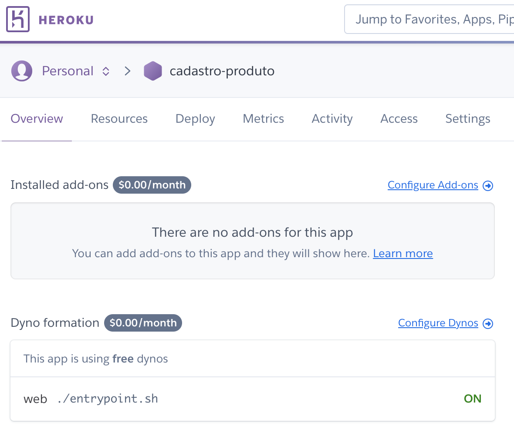

Para executar, basta abrir no navegador o endereço: `https://cadastro-produto-dlucredio.herokuapp.com/cadastro.html` (substituindo o nome da aplicação pelo que você cadastrou) e tudo deve funcionar:

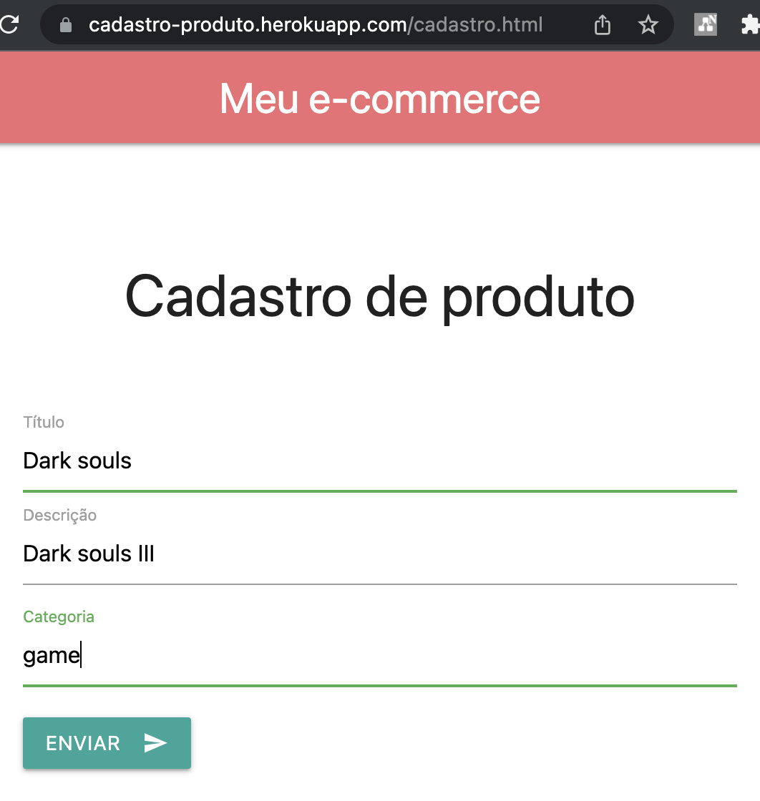

Muito bem, agora temos uma aplicação _online_, que pode ser acessada por qualquer um com acesso à Internet!

## 3.3.5 Considerações finais

Terminamos esta seção e esperamos que você tenha aprendido um pouco mais sobre Docker e contêineres.

Como exercício, tente migrar a aplicação do Flask para outro servidor, como [FastAPI](https://fastapi.tiangolo.com/), um servidor mais rápido e moderno do que o Flask. Você verá que existe muita documentação, e que o código Python permanecerá praticamente o mesmo!

Além disso, tem outra coisa que deixamos como exercício. Mas explicando antes: quando fazemos a implantação em uma nuvem gerenciada, como heroku, mutas vezes já existe um servidor web padrão que atende às requisições. Portanto, não precisaríamos ter um nginx configurado, pois seria redundante. Claro, se estivéssemos trabalhando com um modelo mais baixo nível, como um [servidor _bare metal_](https://pt.wikipedia.org/wiki/Bare-metal\_server), pode ser interessante [em alguns casos](https://dockerlabs.collabnix.com/beginners/docker-on-bare-metal.html). Mas aqui estamos usando heroku. Então o exercício é o seguinte:

Faça a implantação de uma imagem, no heroku, sem nginx, apenas gunicorn + Flask (ou FastAPI, se já tiver concluído o exercício anterior).

Ainda vai faltar um local para hospedar o arquivo `cadastro.html`, pois isso era feito pelo nosso nginx. Mas não tem problema. Usar um serviço de aplicações para hospedar o front-end, que na verdade é conteúdo estático, pronto para ser enviado ao navegador, é um exagero de custo. É muito mais fácil e barato colocar um site no ar na [AWS](https://onebitcode.com/deploy-react-s3-aws/) ou no [Google firebase](https://firebase.google.com/docs/hosting). Mas aí, lembre-se que é preciso re-configurar o CORS, pois nesse cenário estaremos com front e back-end em _hosts_ diferentes!
