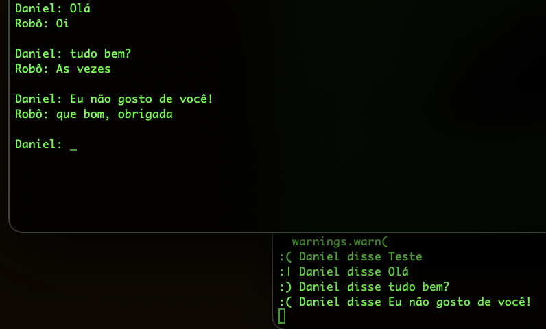

# 3.4 Ambiente de Produção - parte 3

Nesta terceira parte deste capítulo, vamos atacar o aplicativo desenvolvido na [Seção 2.3](../2-desenvolvimento/2-3-do-notebook-para-aplicacao-parte-3.md). Trata-se de uma solução que processa informações em fluxo usando [Apache Kafka](https://kafka.apache.org/), lembra? Tínhamos uma aplicação simples de um chatbot, onde cada mensagem era enviada para ser processada. O processamento consiste em detectar o sentimento: positivo, negativo ou neturo. Caso seja detectado um sentimento negativo, o que pode indicar que o cliente não está feliz, é disparado um evento para que um atendente humano assuma a conversa. Como pode imaginar, nosso trabalho aqui consiste em encapsular essa aplicação em contêineres Docker.

# 3.4.1 Rodando localmente

A primeira parte consiste em rodar os componentes do Kafka: o ```zookeeper``` e um _broker_ pelo menos. Uma das vantagens de usarmos Docker é que já existem imagens prontas, como [fizemos para o nginx na seção anterior](./3-3-ambiente-de-producao-parte-2.md). Vamos usar duas aqui:

* [confluentinc/cp-zookeeper](https://hub.docker.com/r/confluentinc/cp-zookeeper)
* [confluentinc/cp-kafka](https://hub.docker.com/r/confluentinc/cp-kafka)

Essas são imagens oficiais criadas e mantidas pela [Confluent](https://www.confluent.io/), uma das principais contribuidoras do projeto, portanto podemos confiar.

Seguindo [essas instruções do site da Confluent para um _quick start_](https://developer.confluent.io/quickstart/kafka-docker/), subir o ```zookeeper``` e um broker é fácil. Mas as instruções utilizam o ```docker-compose``` (que ainda não aprendemos). Portanto, vamos rodar as imagens manualmente. Basta especificar as variáveis de ambiente solicitadas e tudo deve funcionar.

Para os comandos a seguir, é preciso já ter criado uma rede virtual, chamada ```minharede```, como [fizemos na seção anterior](./3-3-ambiente-de-producao-parte-2.md). Se ainda não fez, volte lá e faça agora.

Para subir o ```zookeeper```, execute o seguinte comando:

```sh
docker run -d --rm --name zookeeper --network minharede -e ZOOKEEPER_CLIENT_PORT=2181 -e ZOOKEEPER_TICK_TIME=2000 confluentinc/cp-zookeeper:7.0.1
```

Veja como ele não vai encontrar a imagem localmente. Ele fará o _download_ diretamente do Docker Hub.

Agora, suba um _broker_, rodando o seguinte comando:

```sh
docker run -d --rm --name broker --network minharede -p 9092:9092 -e KAFKA_BROKER_ID=1 -e KAFKA_ZOOKEEPER_CONNECT='zookeeper:2181' -e KAFKA_LISTENER_SECURITY_PROTOCOL_MAP=PLAINTEXT:PLAINTEXT,PLAINTEXT_INTERNAL:PLAINTEXT -e KAFKA_ADVERTISED_LISTENERS=PLAINTEXT://localhost:9092,PLAINTEXT_INTERNAL://broker:29092 -e KAFKA_OFFSETS_TOPIC_REPLICATION_FACTOR=1 -e KAFKA_TRANSACTION_STATE_LOG_MIN_ISR=1 -e KAFKA_TRANSACTION_STATE_LOG_REPLICATION_FACTOR=1 confluentinc/cp-kafka:7.0.1
```

Os parâmetros do comando ```docker run``` não devem ser novidade para você. O que tem a mais são variáveis de ambiente utilizadas pelas imagens do Kafka para configuração do ```zookeeper``` e do _broker_. Atenção especial para o endereço ```localhost:9092```. Esse é o endereço onde nosso _producer_ vai encontrar o _broker_ (ele vai rodar no _host_). E o endereço ```broker:29092``` é onde o _consumer_ vai encontrar o _broker_ (ele vai rodar no Docker).

Confuso? Sim! O Kafka está no meio de vários componentes aqui! Veja a figura a seguir, e tentaremos explicar melhor:


Nosso chatbot é o _producer_ na arquitetura usando Kafka. E ele vai rodar fora do Docker. Isso porque a ideia é que ele rode na web, ou em algum componente real, melhor do que o que construímos. No nosso exemplo, estamos rodando um programa muito simples em linha de comando, então nem vale a pena configurar um contêiner!

Teremos três contêineres Docker rodando, todos eles na rede chamada ```minharede```, portanto eles podem se enxergar utilizando seus respectivos nomes de contêineres como _hostnames_.

* Um deles vai rodar o ```zookeeper```, com base na imagem ```cp-zookeeper```. Ele só precisa ser acessado internamente, pois é um controlador de _brokers_. Portanto não precisamos publicar suas portas. Mas internamente, ele é acessível pela porta 2181.
* Outro será um _broker_, com base na imagem ```cp-kafka```. Ele vai acessar o ```zookeeper``` na porta 2181. Essa porta do ```zookeeper``` não foi publicada, mas é acessível dentro de ```minharede``` (basta usar o nome "zookeeper" como _hostname_).
* Temos também o analisador de sentimentos, que é uma aplicação Python rodando em contêiner. Ele é o _consumer_ Kafka nessa arquitetura.

A complicação fica por conta do _broker_. Ele precisará ser acessado tanto pelo _producer_ como pelo _consumer_, certo? Só que como o _producer_ (chatbot) está rodando fora de ```minharede``` e o _consumer_ (analisador de sentimentos) está rodando dentro de ```minharede```, são necessários endereços/portas diferentes:

* Para "fora" de ```minharede```, o _broker_ é acessado pelo endereço ```localhost:9092```. É isso que é especificado na variável ```KAFKA_ADVERTISED_LISTENERS```: ```PLAINTEXT://localhost:9092```, no comando que sobe esse contêiner;
* Para "dentro" de ```minharede```, o _broker_ é acessado pelo endereço ```broker:29092```. É isso que é especificado na variável ```KAFKA_ADVERTISED_LISTENERS```: ```PLAINTEXT_INTERNAL://broker:29092```, no comando que sobe esse contêiner.

Com isso, _producers_ e _consumers_ podem se comunicar com toda a arquitetura.

Bom, vamos continuar. Já temos os dois componentes Kafka rodando. Vamos agora rodar nosso analisador de sentimentos, também dentro de um contêiner.

Abra o projeto do analisador de sentimentos, e crie um ```Dockerfile```:

```
FROM python:3.8.12-slim

WORKDIR /usr/src/app

COPY requirements.txt ./

RUN pip install --no-cache-dir -r requirements.txt

COPY . .

ENTRYPOINT ["python", "app.py"]
```

Nenhuma novidade não é? Note como estamos usando uma imagem do Python para a versão 3.8.12 (a mesma que testamos na [Seção 2.3](../2-desenvolvimento/2-3-do-notebook-para-aplicacao-parte-3.md)).

Agora, antes de rodar, precisamos alterar o endereço onde o _consumer_ irá encontrar o _broker_. Como estamos rodando tudo na mesma rede virtual, podemos usar os nomes dos contêineres como hosts. Altere a seguinte linha do arquivo ```app.py``` (confira, na figura anterior, essa comunicação acontecendo):

```diff
from kafka import KafkaConsumer
import json
from classificador.model import Model

# Conecta o classificador ao Kafka, em servidor local, no tópico "chatbot"
-consumer = KafkaConsumer('chatbot', bootstrap_servers='localhost:9092')
+consumer = KafkaConsumer('chatbot', bootstrap_servers='broker:29092')

# Carrega o modelo BERT pré-treinado (demora um tempinho)
print('Carregando modelo...')
model = Model()
print('Modelo carregado!')

# Enquanto houver mensagens, analisa o sentimento
for msg in consumer:
    obj = json.loads(msg.value)
    sentiment, confidence, probabilities = model.predict(obj['pergunta'])
    sentimento = ':|'
    if sentiment == 'negative':
        sentimento = ':('
    elif sentiment == 'positive':
        sentimento = ':)'
    print (sentimento + ' ' + obj['nome']+' disse '+obj['pergunta'])

```

Em seguida, vamos construir a imagem:

```sh
docker build -t analise-sentimentos-consumer .
```

Para rodar, execute o seguinte comando:

```sh
docker run -it --rm --name analise-sentimentos-consumer-container --network minharede analise-sentimentos-consumer
```

Estamos rodando sem a opção ```-d``` e com ```-it```, pois queremos ver o consumidor recebendo as mensagens. Como não fizemos nenhum tipo de tratamento exceto imprimir uma mensagem no terminal, precisamos disso para saber se funcionou.

A execução vai demorar, pois é preciso aguardar enquanto os modelos BERT são baixados e carregados. Espere até que a mensagem "Modelo carregado!" apareça nos logs.

E está tudo pronto! Acesse a pasta do chatbot, ative o ambiente virtual e rode:

```sh
pyenv activate chatbot
python app.py
```

Não precisa mexer nada, pois ele já está configurado para acessar o endereço ```localhost:9092```. Só que antes, era um processo normal, e agora é um processo dentro do Docker cuja porta foi publicada (volte na figura e veja essa comunicação). Se tudo der certo, as mensagens chegarão no consumidor normalmente e terão seu sentimento analisado.



# 3.4.2 Rodando na nuvem

Agora que conseguimos executar a solução localmente, vamos executar o Kafka na nuvem. O Kafka é o tipo de serviço que demanda uma configuração e monitoramento cuidadoso, para atender às demandas de maneira adequada. Mostramos aqui como rodar localmente, e como rodar usando Docker. Até poderíamos seguir o mesmo processo de antes, e subir os contêineres para rodar no heroku, ou outro serviço parecido, mas isso não faz muito sentido. Caso a demanda cresça demais, sempre podemos subir novas instâncias do ```zookeeper```, novos _brokers_ e novos _consumers_. Mas aí o trabalho começa a ficar excessivo, além de ficar caro.

Em um cenário desses, onde provavelmente a nossa empresa está lucrando muito, pode fazer sentido contratar um serviço gerenciado por terceiros, seja do Kafka, ou outro serviço parecido. Claro, o custo final pode ser maior do que manter uma infraestrutura manualmente, mas a facilidade de implantação e gerenciamento pode valer a pena. Além, é claro, de uma maior garantia de que o serviço ficará funcionando o tempo todo, pois há uma empresa trabalhando nisso.

Um problema para demonstrar esse tipo de serviço aqui, em um livro didático, é o custo. Como demonstrar uma solução que, tipicamente, custa caro? Por sorte, existe (pelo menos quando este livro foi escrito) o [cloudkarafka](https://www.cloudkarafka.com/), que oferece um pacote de testes gratuito para o Kafka, baseado em serviços contratados na AWS e Google Cloud. Ainda que essa opção gratuita não esteja mais disponível quando você estiver lendo este livro, você poderá ter uma boa ideia de como funciona.

Primeiro, vamos criar uma conta. Entre na página e procure pelos planos de serviços. Tente encontrar a opção "Developer Duck":


Como pode ver, é uma opção bem limitada, apenas para testes mesmo. Mas é suficiente para entender como esse tipo de serviço funciona.

Depois de concluir seu registro, você deverá ver uma página onde pode ver suas instâncias do Kafka:


Clicando em "Create new instance", você será guiado pelos passos até concluir a criação:


Não foi nada difícil. Apenas escolhemos um nome (```analise-sentimentos```) e uma região (```US-East-1```), e pronto, nossa instância do Kafka está criada.

Novamente, se essa opção não existir mais quando estiver lendo este livro, não se preocupe! Certamente outras opções existirão e será bem parecido. Concentre-se em entender os conceitos aqui. E perceba como esse fabricante está fazendo de tudo para facilitar a sua vida!

Em seguida a nova instância vai aparecer na página principal:


Clicando no nome da instância, seremos levados à página com os detalhes. O importante aqui são as informações para conexão:


Anote esses dados e vamos em frente! Clique em "Topics" e veja que já existe um tópico criado. Anote-o também:


Pronto, já está tudo pronto, basta modificar nosso código do _producer_ e _consumer_. Vamos lá?

Abra o projeto ```analise-sentimentos``` (o mesmo que foi conteinerizado no início deste capítulo), e troque no arquivo ```app.py``` apenas a linha onde fazemos a conexão com o Kafka:

```diff
from kafka import KafkaConsumer
import json
from classificador.model import Model

# Conecta o classificador ao Kafka, em servidor local, no tópico "chatbot"
-consumer = KafkaConsumer('chatbot', bootstrap_servers='broker:29092')
+consumer = KafkaConsumer('qszh831s-default', bootstrap_servers=['tricycle-01.srvs.cloudkafka.com:9094','tricycle-02.srvs.cloudkafka.com:9094', 'tricycle-03.srvs.cloudkafka.com:9094'],
+   group_id='qszh831s-consumer',
+   session_timeout_ms=6000,
+   security_protocol='SASL_SSL',
+   sasl_mechanism='SCRAM-SHA-256',
+   sasl_plain_username='qszh831s',
+   sasl_plain_password='gLJHf3zQLUnyUaHtmmE5ktb037_AJKtO')

# Carrega o modelo BERT pré-treinado (demora um tempinho)
print('Carregando modelo...')
model = Model()
print('Modelo carregado!')

# Enquanto houver mensagens, analisa o sentimento
for msg in consumer:
    obj = json.loads(msg.value)
    sentiment, confidence, probabilities = model.predict(obj['pergunta'])
    sentimento = ':|'
    if sentiment == 'negative':
        sentimento = ':('
    elif sentiment == 'positive':
        sentimento = ':)'
    print (sentimento + ' ' + obj['nome']+' disse '+obj['pergunta'])
```

A mudança deve incluir os detalhes de conexão que aparecem lá na página da instância no cloudkarafka. Mudamos o nome do tópico, os servidores. Também especificamos um ```group_id```, que é um grupo de consumidores Kafka. Esse valor é composto pelo username concatenado com a cadeia "-consumer". O restante também veio direto da página de detalhes.

Também precisaremos mudar o _producer_. Altere o arquivo ```app.py``` do projeto do ```chatbot```:

```diff
-producer = KafkaProducer(bootstrap_servers='localhost:9092',
-                        value_serializer=lambda v: json.dumps(v).encode('utf-8'))
-topico = 'chatbot'
+producer = KafkaProducer(bootstrap_servers=['tricycle-01.srvs.cloudkafka.com:9094','tricycle-02.srvs.cloudkafka.com:9094','tricycle-03.srvs.cloudkafka.com:9094'],
+   security_protocol='SASL_SSL',
+   sasl_mechanism='SCRAM-SHA-256',
+   sasl_plain_username='qszh831s',
+   sasl_plain_password='gLJHf3zQLUnyUaHtmmE5ktb037_AJKtO',
+   value_serializer=lambda v: json.dumps(v).encode('utf-8'))
+   topico = 'qszh831s-default'
```

Agora é só rodar esse aplicativo, e tudo irá funcionar exatamente como antes, talvez agora um pouco mais lentamente, pois as mensagens estão trafegando até a nuvem, entre _producer_ e _consumer_.

Poderíamos rodar o _producer_ e o _consumer_ na nuvem, no heroku, por exemplo. Mas o heroku não roda aplicativos que consomem muita memória, como é o caso do nosso analisador que utiliza o BERT. Na verdade, poucas ofertas gratuitas tem suporte para mais do que poucas centenas de Megabytes! Portanto, não conseguiremos rodar de forma gratuita. Mas já rodamos tudo no Docker, então não deve ser difícil para o leitor (caso queira experimentar) contratar um serviço com mais memória e subir a imagem e rodar.

# 3.4.3 Considerações finais

Chegamos ao fim desta seção, e deste capítulo. Mostramos como rodar três tipos de aplicativos de Machine Learning usando contêineres. Também mostramos como é simples implantar esses contêineres em uma plataforma de nuvem, tornando as soluções disponíveis.

Mas o aprendizado não para por aqui. A seguir veremos como é possível acompanhar e monitorar a execução desses contêineres, visando sua operação.
