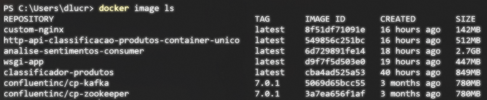
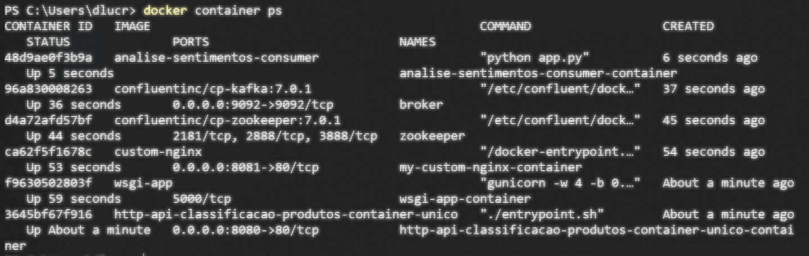

# 4.1 Introdução

No [Capítulo 3](broken-reference) fizemos o deploy de nossas aplicações no ambiente de produção. Para isso foram criados vários contêineres, e em várias configurações diferentes:

* Na [Seção 3.2](../3-producao/3-2-ambiente-de-producao-parte-1.md), criamos um contêiner para executar uma tarefa _offline_, ou seja, um script que começa e termina assim que seu trabalho é concluído.
* Na [Seção 3.3](../3-producao/3-3-ambiente-de-producao-parte-2.md), fizemos de duas maneiras diferentes:
  1. Primeiro subimos um servidor web (nginx) e um servidor WSGI (gunicorn + Flask) em um mesmo contêiner.
  2. Depois subimos dois contêineres: um para o nginx e outro para o servidor WSGI. Colocamos os dois na mesma rede Docker para que eles pudessem se comunicar entre si.
* Na [Seção 3.4](../3-producao/3-4-ambiente-de-producao-parte-3.md), criamos três contêineres:
  1. Um para o zookeeper, que controla os _brokers_ do Kafka
  2. Um _broker_, responsável por lidar com a fila de eventos
  3. Um consumidor, que faz a tarefa de analisar o sentimentos das mensagens enviadas pelo usuário do chatbot.

Em qualquer um dos casos, os serviços devem estar operacionais o tempo todo, ou pelo menos na maior parte do tempo. Isso se refere à qualidade de serviço ou QoS (_Quality of Service_) e, em geral, é representada por uma notação do tipo 24x7, que significa que desejamos a aplicação operacional 24 horas por dia nos 7 dias da semana.

Nesse ponto é que entra em ação a equipe de Operação, na garantia da qualidade do serviço a ser prestado.

Para saber se há algo errado com nossa aplicação ou com os serviços e servidores que viabilizam sua execução é necessário um monitoramento constante dos mesmos para que, na ocorrência de algum evento que impossibilite a operação dos serviços, ações sejam tomadas para colocá-la no ar novamente.

Retomando a figura que apresentamos no início deste livro, estamos falando do item 6. Ou seja, conseguimos colocar a aplicação em ambiente de produção, e agora queremos saber se é necessário alguma ação para retomar o ciclo DevOps.


Claramente, realizar esse monitoramento de forma manual é praticamente impossível e, desse modo, são necessárias ferramentas que realizam esse monitoramento de forma automatizada e, havendo ocorrências que mereçam a ação humana, elas comunicarão a equipe de operações para intervir e corrigir o problema, restaurando o serviço e colocando a aplicação no ar novamente, no menor tempo possível.

O [Nagios](https://www.nagios.org) é uma dessas ferramentas de monitoramento que temos disponível. Tal ferramenta possui uma versão paga, com uma interface de configuração gráfica, e uma versão gratuita, denominada [Nagios Core](https://www.nagios.org/projects/nagios-core/), que pode ser configurada por arquivos de configuração. Trata-se de uma ferramenta que está há um bom tempo no mercado, é bastante robusta e, apesar de não ter uma interface muito amigável, faz o trabalho que se propõe.

A título de ilustração, no restante deste capítulo vamos instanciar o [Nagios Core](https://www.nagios.org/downloads/nagios-core/) para oferecer o suporte de monitoramento ao nossos ambiente de produção e, posteriormente, aos demais ambientes conteinerizados que forem criados. Para isso, vamos subir todos esses contêineres que mencionamos no início da seção. Faça download de todas as pastas [desse link aqui](../exemplos/aplicativos/). Você deve ter os seguintes diretórios:

* `classificador-produtos`:
  * Tarefa offline para classificação de produtos acessando banco de dados na nuvem
* `http-api-classificacao-produtos-container-unico`:
  * Tarefa online para classificação de produtos via API HTTP (contêiner único)
* `http-api-classificacao-produtos-dois-containers`:
  * Tarefa online para classificação de produtos via API HTTP (dois contêineres)
* `analise-sentimentos`:
  * Consumidor Kafka que analisa sentimentos
* `chatbot`:
  * Produtor Kafka que produz conversas com um chatbot

Estando no diretório anterior a todos estes, basta executar os seguintes comandos para construir todas as imagens necessárias:

```
docker build -t classificador-produtos ./classificador-produtos

docker build -t http-api-classificacao-produtos-container-unico ./http-api-classificacao-produtos-container-unico

docker build -f ./http-api-classificacao-produtos-dois-containers/Dockerfile-wsgi -t wsgi-app ./http-api-classificacao-produtos-dois-containers/

docker build -f ./http-api-classificacao-produtos-dois-containers/Dockerfile-nginx -t custom-nginx ./http-api-classificacao-produtos-dois-containers/

docker build -t analise-sentimentos-consumer ./analise-sentimentos
```

Os seguintes comandos instanciam todos os contêineres. Não iremos executar o classificador _offline_, pois ele irá rodar e encerrar sozinho, portanto não faz sentido monitorar sua execução neste momento. Além disso, iremos executar o consumidor Kafka em modo desacoplado, apenas para não ocupar o terminal. Não veremos as mensagens sendo consumidas, mas não importa, pois já vimos isso rodando no capítulo anterior. E iremos colocar todos os contêineres na mesma rede, chamada `minharede`. Os comandos a seguir executam as  ações descritas.

```
docker network create minharede

docker run -d -p 8080:80 --network minharede --rm --name http-api-classificacao-produtos-container-unico-container http-api-classificacao-produtos-container-unico

docker run -d --rm --name wsgi-app-container --network minharede wsgi-app

docker run -d -p 8081:80 --rm --name my-custom-nginx-container --network minharede custom-nginx

docker run -d --rm --name zookeeper --network minharede -e ZOOKEEPER_CLIENT_PORT=2181 -e ZOOKEEPER_TICK_TIME=2000 confluentinc/cp-zookeeper:7.0.1

docker run -d --rm --name broker --network minharede -p 9092:9092 -e KAFKA_BROKER_ID=1 -e KAFKA_ZOOKEEPER_CONNECT='zookeeper:2181' -e KAFKA_LISTENER_SECURITY_PROTOCOL_MAP=PLAINTEXT:PLAINTEXT,PLAINTEXT_INTERNAL:PLAINTEXT -e KAFKA_ADVERTISED_LISTENERS=PLAINTEXT://localhost:9092,PLAINTEXT_INTERNAL://broker:29092 -e KAFKA_OFFSETS_TOPIC_REPLICATION_FACTOR=1 -e KAFKA_TRANSACTION_STATE_LOG_MIN_ISR=1 -e KAFKA_TRANSACTION_STATE_LOG_REPLICATION_FACTOR=1 confluentinc/cp-kafka:7.0.1

docker run -d --rm --name analise-sentimentos-consumer-container --network minharede analise-sentimentos-consumer
```

Se tudo rodar corretamente, devemos ter as seguintes imagens sendo exibidas após um comando `docker image ls`:



Exceto pela primeira tarefa, que é _offline_, todas essas imagens estarão rodando em contêineres, como mostra a saída do comando `docker container ps`:



Alguns desses têm portas abertas para o host, outros tem portas internas, disponíveis apenas para outros contêineres que rodam na mesma rede. A figura abaixo ilustra o ambiente de produção onde será incluído o Servidor de Monitoramento.


Animados para mais esse desafio? Então vamos iniciar a configuração dessa ferramenta.

Ao longo deste capítulo, iremos aos poucos construir a solução que se encontra pronta [aqui](../exemplos/DockerProjects/nagios/). Mas tente construi-la aos poucos, compreendendo cada etapa cuidadosamente. Use esse repositório apenas como uma referência.
