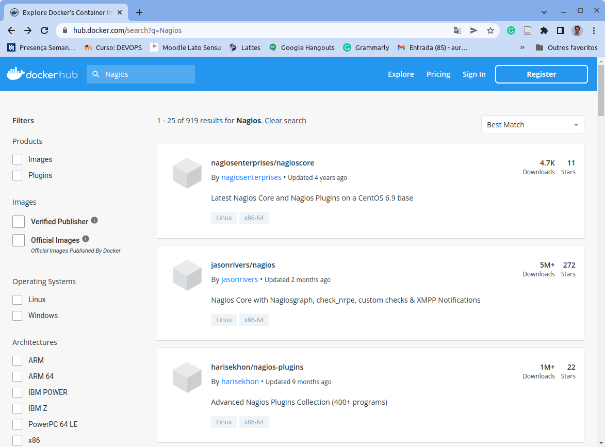
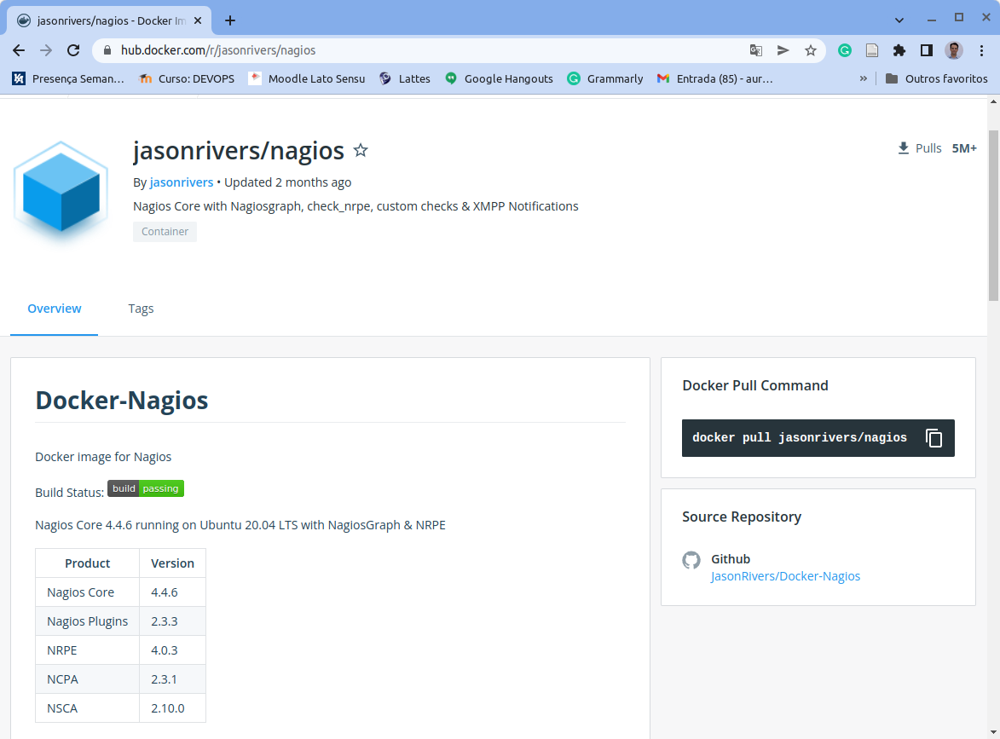
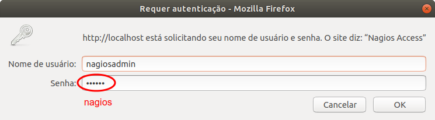
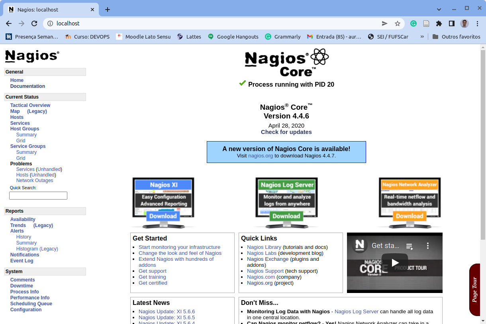
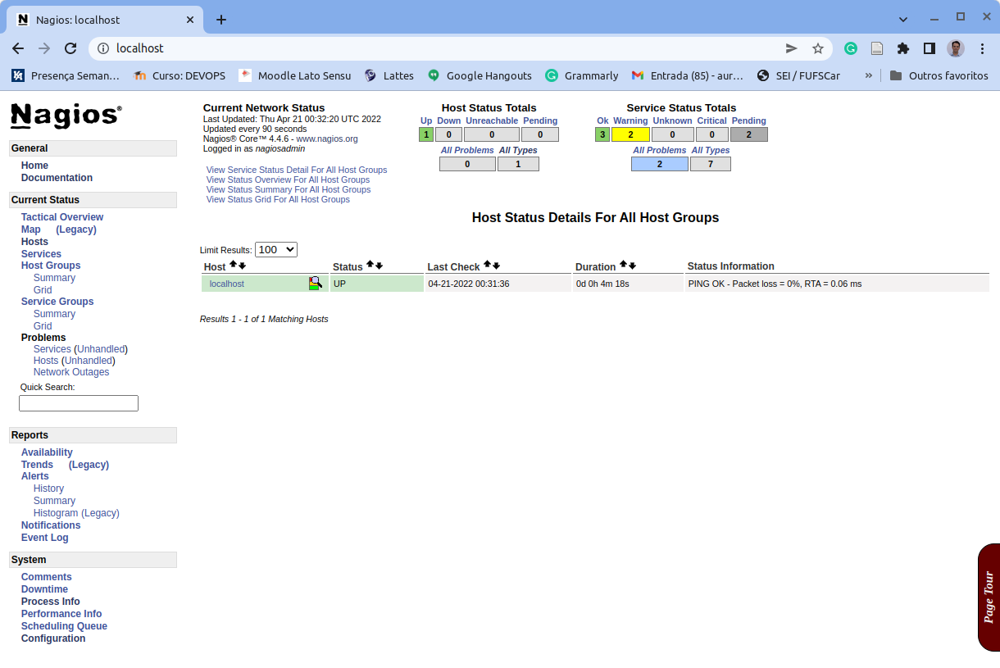
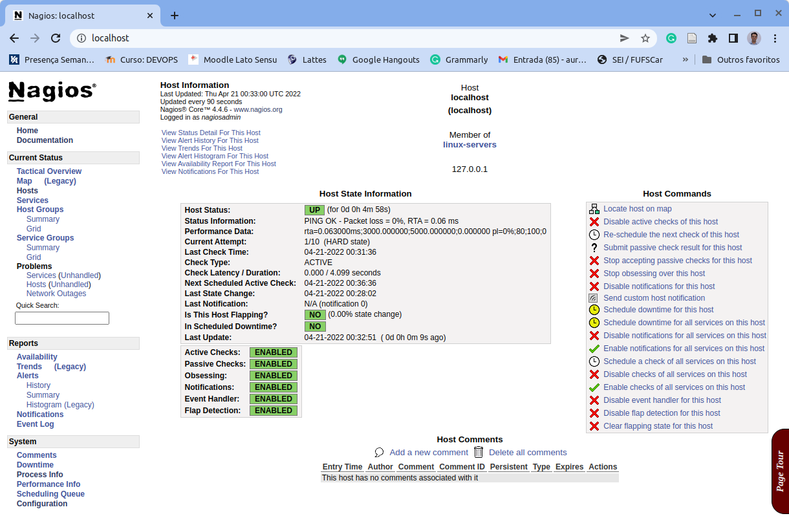
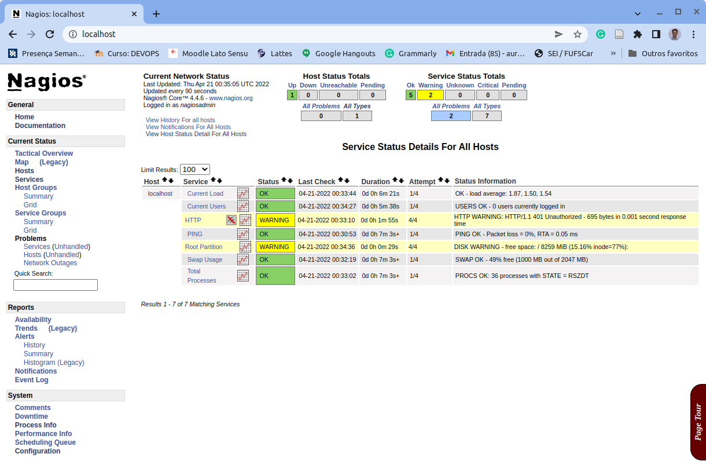

# 4.2 Configurando o Servidor de Monitoramento

Nesta sessão iremos configurar o nosso supervisor. Existem dois papéis principais quando se fala em sistemas de monitoramento, um deles é o de **supervisor**, ou seja, aquele elemento que é responsável pelo monitoramento em si de todos os demais elementos, que são os chamados **supervisionados**. No exemplo da figura a seguir (a mesma do final da seção anterior), o Servidor de Monitoramento Nagios seria o supervisor e os demais serviços os supervisionados.


Para a sua instalação é possível seguir os passos descritos na [documentação oficial](https://assets.nagios.com/downloads/nagioscore/docs/nagioscore/4/en/quickstart.html). Porém, essas instruções se destinam a uma instalação feita diretamente no sistema operacional. Como estamos utilizando contêineres, vamos procurar para ver se já existe alguma instalação pronta para ser utilizada. Vamos ao Docker Hub!

Ao pesquisar por [Nagios no Docker Hub](https://hub.docker.com/search?q=nagios\&type=image), aparecem várias imagens disponíveis. Vamos utilizar a mais popular, listando em segundo na imagem abaixo.



Novamente, recomenda-se a leitura de toda a documentação da imagem para facilitar o seu uso. Além disso, é possível também consultar diferentes fóruns na Internet pesquisando sobre como usar ou personalizar a imagem `jasonrivers/nagios`, que é a que utilizaremos aqui.



Conforme pode ser observado na documentação, no momento da escrita deste capítulo essa imagem continha o Nagios Core 4.4.6 executando sobre um Ubuntu 20.04 LTS. Caso no momento da leitura seja outra versão, é necessário ler a documentação para ver se existe alguma diferença significativa em relação ao que está descrito a seguir.

Para carregarmos a imagem e fazermos uso da mesma iremos proceder como fizemos com os demais servidores. Inicialmente vamos executar um `docker run` na imagem original e, posteriormente, iremos redigir um `Dockerfile` para configurá-la de forma a atender as nossas necessidades específicas.

```
docker run -p 80:80 --name nagios jasonrivers/nagios
```

O comando acima fará o download da imagem `jasonrivers/nagios` e irá mapear a porta `80`, exposta pelo contêiner na porta local `80` de nossa máquina hospedeira de modo que, após iniciar o contêiner, o Nagios estará disponível na URL: [`http://localhost:80/`](http://localhost) (ou [`http://localhost/`](http://localhost), pois a porta 80 é a padrão para os navegadores). Note como a porta 80 do host não está sendo utilizada por nenhum dos contêineres da figura.

Se tudo correr bem, a saída do comando acima será similar a essa:

```
Adding password for user nagiosadmin
Started runsvdir, PID is 10
checking permissions for nagios & nagiosgraph
rsyslogd: [origin software="rsyslogd" swVersion="8.16.0" x-pid="18" x-info="http://www.rsyslog.com"] start
postfix/master[16]: daemon started -- version 3.1.0, configuration /etc/postfix

Nagios Core 4.4.5
Copyright (c) 2009-present Nagios Core Development Team and Community Contributors
Copyright (c) 1999-2009 Ethan Galstad
Last Modified: 2019-08-20
License: GPL

Website: https://www.nagios.org
Nagios 4.4.5 starting... (PID=17)
Local time is Tue Sep 22 19:42:19 UTC 2020
nagios: Nagios 4.4.5 starting... (PID=17)
nagios: Local time is Tue Sep 22 19:42:19 UTC 2020
nagios: LOG VERSION: 2.0
nagios: qh: Socket '/opt/nagios/var/rw/nagios.qh' successfully initialized
nagios: qh: core query handler registered
nagios: qh: echo service query handler registered
nagios: qh: help for the query handler registered
wproc: Successfully registered manager as @wproc with query handler
nagios: wproc: Successfully registered manager as @wproc with query handler
wproc: Registry request: name=Core Worker 37;pid=37
...
...
Successfully launched command file worker with pid 49
nagios: Successfully launched command file worker with pid 49
```

Ao digitar o endereço [http://localhost:80/](http://localhost) no navegador, será aberta uma janela para autenticar no Servidor de Monitoramento. Conforme a documentação da imagem, o login padrão é `nagiosadmin` e a senha padrão é `nagios`.



Ao preencher esses campos com as informações acima tem-se acesso ao painel do Nagios Core, conforme ilustrado na figura abaixo.



Observa-se no centro da figura acima que o processo do Nagios está em execução e a versão do Nagios Core em uso é a 4.4.6. Ao clicar na opção Hosts do menu lateral, tem-se acesso aos dados dos hosts supervisionados pelo Nagios até o momento.

Como pode ser observado, o único host monitorado é o próprio `localhost`, que seria, no caso, um auto monitoramento, ou seja, o Nagios é tanto o supervisor quanto o supervisionado até o momento.



Ao clicar no nome do host, `localhost`, são exibidos mais detalhes do mesmo, conforme apresentado a seguir.



Observa-se que a tela traz uma série de informações sobre o host supervisionado e ainda, na parte superior, apresenta outros links com mais detalhes sobre o host em questão. Navegue à vontade por ela e descubra informações adicionais disponibilizadas pela ferramenta.

No menu lateral, é possível também explorar a opção **Services** e, desse modo, descobrir quais serviços são monitorados no host e o status de cada um deles.

Como pode ser observado no host em questão, há dois avisos, um no serviço HTTPe outro no Root Partition. Sobre o serviço `http`, está indicando um erro 401 relacionado a um problema de autenticação. Veremos como resolver isso mais adiante. Sobre o Root Partition, o Nagios está alertando sobre a disponibilidade de espaço inferior ao configurado no monitoramento.



Os serviços com status `OK` indicam que os mesmos estão operacionais e funcionando dentro dos limites estabelecidos. Pode ocorrer que um serviço esteja com status `PENDING` e, nesse caso, significa que a verificação desse serviço ainda não finalizou. Outros status possíveis são os de `WARNING`, que indicam que determinado serviço atingiu um limite definido para alertas de aviso; `CRITICAL`,  que indicam que determinado serviço atingiu um limite definido para alertas de criticalidade; e os de `ERROR` que, nesse caso, indicam a falha no serviço em questão.

No caso desta configuração do Nagios, por padrão, são verificados os serviços listados acima, cujo significado é dado abaixo:

* _**Current Load**_\*\* (Carga Atual)\*\*: indica quão ocupada está a CPU do host. Segundo [Sato (2018)](https://www.casadocodigo.com.br/products/livro-devops), a carga é medida pela média móvel do tamanho da fila de processo aguardando para executar. Em situações de sobrecarga da CPU, a fila de processos em espera aumenta e, consequentemente, o tempo de execução também, gerando um alerta caso esse valor de carga atinja determinado limite definido na verificação.
* _**Current Users**_\*\* (Usuários Atuais)\*\*: indica quando usuários logados há no sistema, sendo uma maneira simples para a detecção de ataques de intrusão no nosso servidor.
* **HTTP**: verifica se o servidor esta aceitando conexões do tipo HTTP sendo que o padrão é verificar a conexão na porta 80, mas é possível também verificar a execução de serviços em portas diferentes, como será visto mais adiante.
* **PING**: verificação simples se o servidor está em atividade, respondendo ao comando `ping`.
* _**Root Partition**_\*\* (Partição Principal)\*\*: faz uma verificação da partição principal do sistema, identificando o espaço disponível. Caso essa partição encha, certamente o servidor enfrentará problemas na execução de suas atividades.
* _\*\*Swap Usage \*\*_**(Uso da Partição de Troca)**: a partição de troca é utilizada, dentre outras coisas, para salvar o contexto de processos em execução e para paginação quando o espaço disponível na RAM não permite comportar a demanda de memória de todos os processos em execução. Assim sendo, monitorar a partição de troca permite identificar a carência de memória RAM ou seu esgotamento para que o servidor execute adequadamente suas atividades.
* _**Total Process**_\*\* (Total de Processos)\*\*: permite avaliar a sobrecarga no servidor monitorando o número total de processos em execução no servidor. Quanto maior esse número, pior o desempenho do servidor.

Esses são apenas alguns dos serviços de verificação realizados por padrão nessa configuração do contêiner do Nagios que estamos fazendo uso. Posteriormente, faremos uso de outras rotinas de verificação. O Nagios é extensível por meio de plugins e existem vários plugins que podem ser configurados para estender a capacidade de monitoramento do Nagios. No contêiner atual, a lista de rotinas de verificação disponível está localizada em `/opt/nagios/libexec`. É possível, por exemplo, testar o uso das mesmas via linha de comando, após conectar no prompt do servidor em execução.

Por exemplo, ao executar o comando `docker exec` abaixo, abrimos um prompt `bash` no contêiner em execução. Primeiro precisamos descobrir o `Continer ID` para podermos nos conectar ao mesmo.

```
docker ps
```

A saída desse comando é semelhante a exibida abaixo. No seu caso, o Conteiner ID será um numero diferente deste. Opcionalmente podemos referenciar o contêiner pelo nome atribuído no comando `docker run` acima. Basta copiar esse número e utilizá-lo no final do comando `docker exec` abaixo.

```
CONTAINER ID        IMAGE                COMMAND                  CREATED             STATUS              PORTS                NAMES
9d519167e198   jasonrivers/nagios        "/usr/local/bin/star…"   27 seconds ago   Up 26 seconds   0.0.0.0:80->80/tcp, :::80->80/tcp, 5667/tcp   nagios
```

```
docker exec -it nagios bash
```

Estando no prompt do contêiner em execução, a lista de comandos de verificação disponível pode ser consultada em `/opt/nagios/libexec`. Há verificações dos mais diversos tipos para garantirem a execução dos serviços que desejamos.

Por exemplo, uma verificação disponível nesse diretório, `check_apt`, faz a verificação do `apt`, gerenciador de pacotes das distribuições Debian. Ao chamar `check_apt -u`, é executado o comando `apt update` no host e, posteriormente, o resultado é exibido.

Ao executar essa verificação em dado host é possível descobrir se há pacotes que necessitam ser atualizados. No caso abaixo, como pode ser observado, existem 76 pacotes que poderiam ser atualizados na imagem desse contêiner.

```
$ cd /opt/nagios/libexec
$ ./check_apt -u
APT CRITICAL: 76 packages available for upgrade (65 critical updates). |available_upgrades=76;;;0 critical_updates=65;;;0
```

É por meio desses verificadores que o Nagios consegue realizar o monitoramento e, posteriormente, exibir informações de alerta na sua interface. Nas seções a seguir iremos utilizar alguns deles para supervisionar nossos contêineres, responsáveis pela execução de nossas aplicações.

Antes de irmos para a próxima seção podemos executar os comandos abaixo para parar e remover o contêiner do Nagios.

```
$ docker stop nagios
nagios
$ docker rm nagios
nagios
```

Os passos acima executam as seguintes tarefas: 1) o `docker stop`, interrompe a execução contêiner `nagios`; e 2) o `docker rm` remove o contêiner `nagios`. Na próxima seção vamos realizar a personalizações dessa imagem genérica para iniciar a supervisão do ambiente de produção de nossas aplicações.
