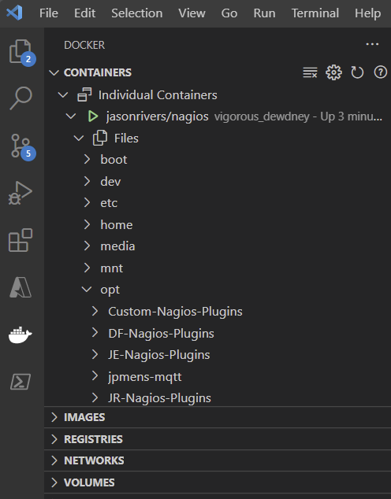
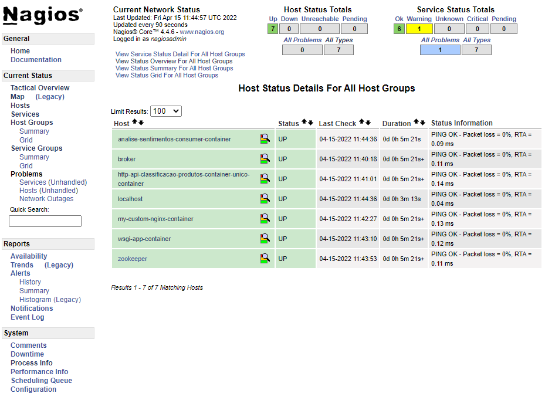
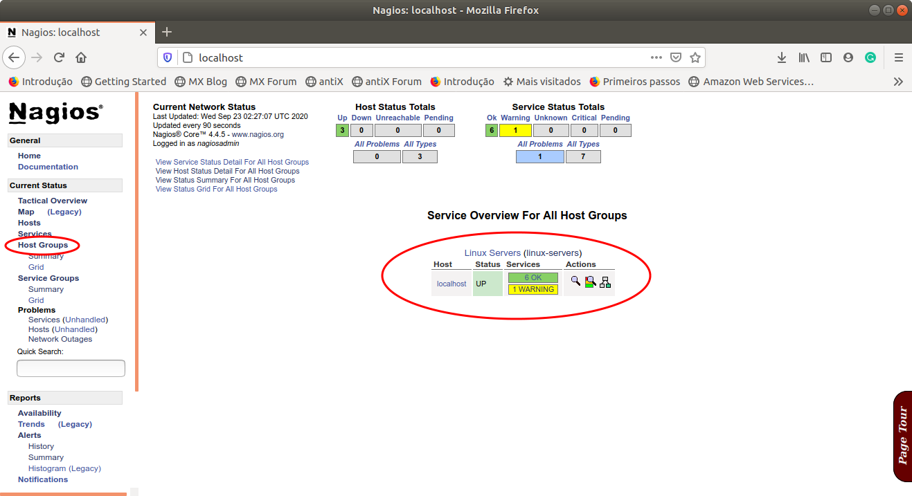
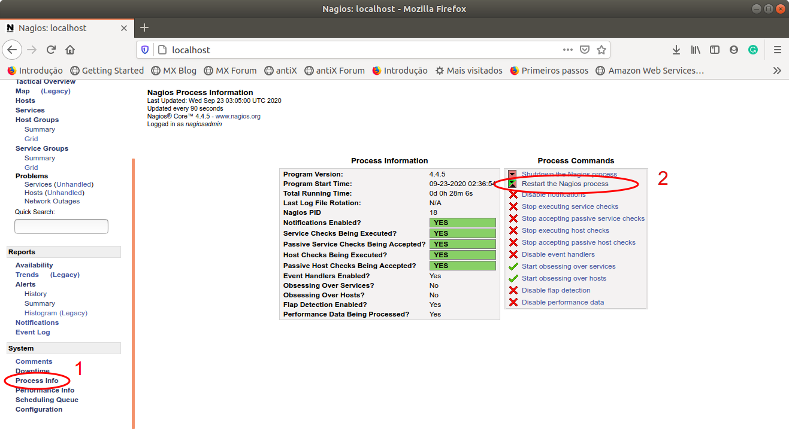
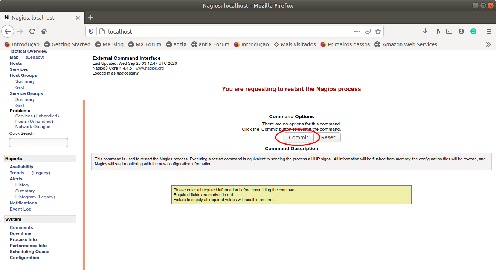
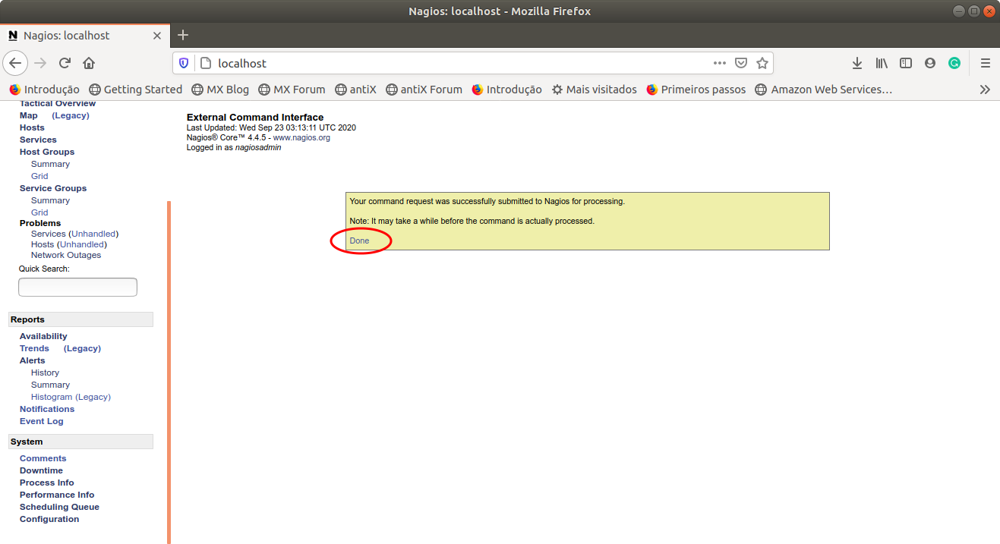
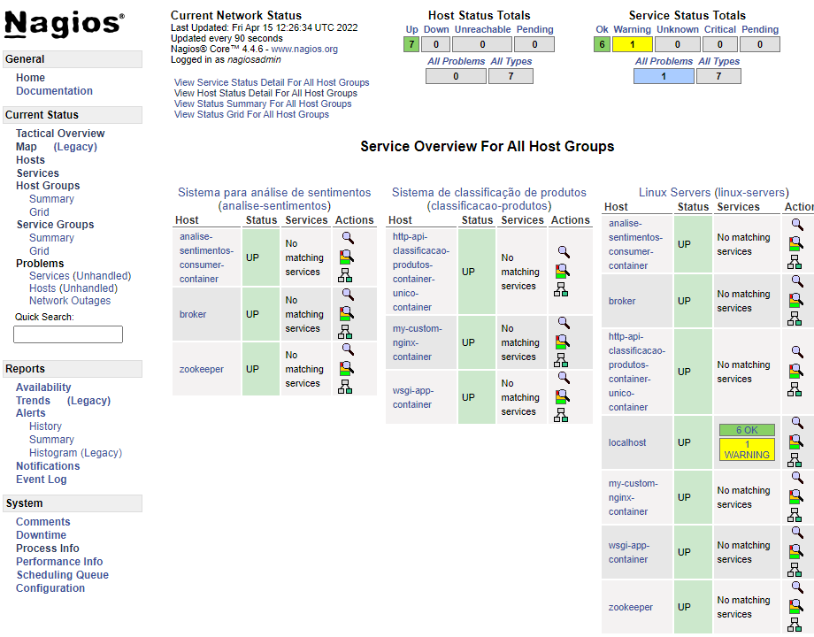

# 4.3 Monitorando Servidores do Ambiente de Produção

Uma vez instalado e em funcionamento é possível agora alterar as configurações do Nagios para monitorar os servidores de nosso interesse, ou seja, aqueles responsáveis por compor o nosso ambiente de produção.

A configuração do Nagios Core é feita por meio de arquivos de configuração que devem ser colocados em locais específicos. Considerando o contêiner criado, a instalação do Nagios está localizada em `/opt/nagios` e a estrutura de diretórios de primeiro nível é dada abaixo

```
/opt/nagios
|-- bin
|-- etc
|-- libexec
|-- sbin
|-- share
`-- var
```

Dessa estrutura, nesse primeiro momento, o diretório mais importante para nós é o `etc`, o qual contém os arquivos de configuração, conforme detalhado na estrutura abaixo:

```
/opt/nagios/etc
|-- cgi.cfg
|-- conf.d
|-- htpasswd.users
|-- monitor
|-- nagios.cfg
|-- objects
|   |-- commands.cfg
|   |-- contacts.cfg
|   |-- localhost.cfg
|   |-- printer.cfg
|   |-- switch.cfg
|   |-- templates.cfg
|   |-- timeperiods.cfg
|   `-- windows.cfg
`-- resource.cfg
```

Você pode conferir essa estrutura de diretórios abrindo um terminal dentro do contêiner em execução e navegando pela linha de comando, conforme demonstrado no final da seção anterior.

Outra opção mais interessante é instalar um _front-end_ mais amigável, como o [plugin oficial da Microsoft para Docker no Visual Studio Code](https://marketplace.visualstudio.com/items?itemName=ms-azuretools.vscode-docker). Nele, é possível acessar a estrutura de arquivos de qualquer contêiner de maneira mais simples, como mostra a figura abaixo:



A figura mostra a aba Docker aberta no Visual Studio code. Note, no topo, como o contêiner chamado `vigorous_dewdney` (nome criado aleatoriamente, já que não definimos um), para a imagem `jasonrivers/nagios`, está sendo inspecionado, sendo possível visualizar toda a sua estrutura de arquivos facilmente. É possível inclusive visualizar os arquivos clicando diretamente sobre eles, como faremos a seguir.

Uma forma simples de tentar compreender como são compostos os arquivos de configuração do Nagios é dando uma olhada nos exemplos presentes na pasta `objects`. Inclusive, um dos arquivos é chamado de `templates.cfg` e pode nos ajudar na criação dos nossos próprios arquivos `.cfg`.

Para adicionar novos arquivos de configuração, basta salvá-los na pasta `conf.d`, que nesta imagem que obtivemos do Docker Hub já vem criada e configurada como uma pasta válida para novas configurações.

Há duas formas de se fazer isso:

1. Podemos utilizar uma imagem pronta do Docker Hub, e mapear a pasta `conf.d` para um volume na máquina hospedeira (_host_), assim é possível ajustar as configurações de maneira independente do contêiner.
2. Podemos criar um arquivo `Dockerfile` que adiciona os arquivos de configuração já no local correto, assim teremos uma imagem customizada, já preparada para monitorar os serviços em nosso ambiente.

A primeira opção resulta em maior flexibilidade, pois podemos alterar dinamicamente os arquivos de configuração. Já a segunda opção produz uma solução mais auto-contida, pois basta subir a imagem e ela estará pronta para realizar os monitoramentos necessários. Mostraremos as duas formas aqui, e o leitor poderá decidir qual abordagem seguir em cada situação.

### 4.3.1 Configurando o Nagios utilizando um volume

Vamos começar criando uma pasta local `nagios` para armazenar os arquivos de configuração. Dentro dessa pasta, crie uma pasta chamada `conf.d`. Ela será mapeada para a pasta correspondente do Nagios. Por exemplo, a estrutura de diretórios pode ser a seguinte:

```
C:\Users\dlucr\DockerProjects\nagios\conf.d
```

Agora vamos seguir as [instruções oficiais](https://assets.nagios.com/downloads/nagioscore/docs/nagioscore/3/en/configobject.html). Vamos começar definindo quais servidores iremos monitorar em um arquivo chamado `hosts.cfg`. Crie o seguinte conteúdo:

```
# HOST DEFINITIONS
define host {
    use linux-server
    host_name http-api-classificacao-produtos-container-unico-container
    alias http-api-classificacao-produtos-container-unico-container
    address http-api-classificacao-produtos-container-unico-container
}

define host {
    use linux-server
    host_name wsgi-app-container
    alias wsgi-app-container
    address wsgi-app-container
}

define host {
    use linux-server
    host_name my-custom-nginx-container
    alias my-custom-nginx-container
    address my-custom-nginx-container
}

define host {
    use linux-server
    host_name zookeeper
    alias zookeeper
    address zookeeper
}

define host {
    use linux-server
    host_name broker
    alias broker
    address broker
}

define host {
    use linux-server
    host_name  analise-sentimentos-consumer-container
    alias analise-sentimentos-consumer-container
    address analise-sentimentos-consumer-container
}
```

O caractere # indica comentário. Em seguida há seções de definição de hosts (`define host`). Nessa seção, circundada por chaves, indicamos se tal host se utiliza de alguma definição de host já definida. No caso, o host faz uso (`use linux-server`) da definição de host de um `linux-server`, cuja definição se encontra no arquivo `template.cfg`, disponível em `/opt/nagios/etc/objects`, qual o seu nome (`host_name`), qual o seu apelido (`alias`) e qual o seu endereço (`address`). Como estamos utilizando uma rede Docker, não é necessário especificar os endereços IP, pois cada contêiner poderá ser identificado na rede pelo seu nome. Assim, o exemplo acima utiliza nomes como endereços. Mas caso você precise especificar endereços, também é possível, seguindo o formato `address 172.17.0.3`. Caso queira usar endereços dentro de uma rede Docker, é possível descobri-los pelo comando `docker network inspect minharede`.

Agora basta executar o contêiner para o Nagios, lembrando de colocá-lo para rodar na mesma rede que os serviços supervisionados (lembre-se de utilizar a pasta correta no seu computador, na configuração do volume):

```
docker run -p 80:80 --rm --name nagios-server --network minharede -v C:\Users\dlucr\DockerProjects\nagios\conf.d:/opt/nagios/etc/conf.d jasonrivers/nagios 
```

A figura abaixo ilustra a tela do Nagios incluindo agora os seis servidores do nosso ambiente de produção. O acesso aos mesmos foi feito clicando-se no item Hosts do menu lateral. Inicialmente, os servidores aparecerão com status `PENDING`. Após um tempo, à medida que o Nagios faz as consultas, os status deverão aparecer como `UP`.



Uma vez inicializados todos os hosts que compõem o ambiente de produção, é possível navegar pelas demais opções disponíveis para tentar entender um pouco melhor o potencial da ferramenta Nagios. Aproveite nosso ambiente recém-configurado para navegar pela interface, e conhecer um pouco da [documentação](https://assets.nagios.com/downloads/nagioscore/docs/nagioscore/4/en/toc.html). O Nagios é uma ferramenta complexa, que demora um pouco para compreender em sua totalidade.

Antes de seguir adiante, vamos melhorar um pouco nossa configuração, fazendo uso de recursos adicionais do Nagios.

**Agrupamento de hosts**

No nosso arquivo de configuração original (`hosts.cfg`) criamos seis hosts para serem monitorados. A medida que o ambiente de produção cresce é interessante agruparmos os hosts por tipo de serviço oferecido e, desse modo, fica mais fácil atribuir o gerenciamento desse grupo de hosts para diferentes especialistas, por exemplo. Ou então, definir um conjunto de regras de monitoramento que não se aplica a um host individual, mas sim a todos os hosts de determinado tipo.

No momento, como não incluímos os hosts em qualquer grupo, se entrarmos no menu lateral na opção de **Host Groups**, o resultado é semelhando ao exibido na figura abaixo:



Vamos criar dois grupos: um para monitorar os serviços referentes à classificação de produtos (servidores WSGI e nginx) e outro para monitorar os serviços referentes à análise de sentimentos (zookeeper, broker e consumer). Crie um novo arquivo na mesma pasta `conf.d`, chamado `hostgroups.cfg`: ):

```
# HOST GROUPS
define hostgroup {
	hostgroup_name classificacao-produtos
	alias Sistema de classificação de produtos
	members http-api-classificacao-produtos-container-unico-container,wsgi-app-container,my-custom-nginx-container

}

define hostgroup {
	hostgroup_name analise-sentimentos
	alias Sistema para análise de sentimentos
	members zookeeper,broker,analise-sentimentos-consumer-container
}
```

Antes de explicarmos o conteúdo, uma observação: poderá ser solicitado acesso de administrador da máquina. Isso porque quando fizemos a associação do diretório local com o diretório do contêiner, durante a execução do `docker run`, o proprietário do diretório local mudou de dono e, desse modo, para escrever dentro dele é necessária permissão adicional.

O conteúdo do arquivo deve ser bastante intuitivo, assim como quais serviços pertencem a quais grupos. Observa-se que um `hostgroup` tem o seu nome (`hostgroup_name`), um apelido (`alias`) e uma lista de membros (`members`) formada por nomes de hosts separados por vírgula.

Vamos também definir que todos os nossos serviços pertencem a um grupo predefindo, chamado `linux-servers`. Assim poderemos, por exemplo, definir um conjunto de políticas e diretrizes específicas para linux, outro específicos para windows, e assim por diante. No nosso caso, todos os servidores são linux. Para isso, modifique o arquivo `hosts.cfg` conforme a seguir:

```diff
# HOST DEFINITIONS
define host {
    use linux-server
    host_name http-api-classificacao-produtos-container-unico-container
    alias http-api-classificacao-produtos-container-unico-container
    address http-api-classificacao-produtos-container-unico-container
+    hostgroups linux-servers
}

define host {
    use linux-server
    host_name wsgi-app-container
    alias wsgi-app-container
    address wsgi-app-container
+    hostgroups linux-servers
}

define host {
    use linux-server
    host_name my-custom-nginx-container
    alias my-custom-nginx-container
    address my-custom-nginx-container
+    hostgroups linux-servers
}

define host {
    use linux-server
    host_name zookeeper
    alias zookeeper
    address zookeeper
+    hostgroups linux-servers
}

define host {
    use linux-server
    host_name broker
    alias broker
    address broker
+    hostgroups linux-servers
}

define host {
    use linux-server
    host_name  analise-sentimentos-consumer-container
    alias analise-sentimentos-consumer-container
    address analise-sentimentos-consumer-container
+    hostgroups linux-servers
}
```

Após salvar, vamos verificar se os novos arquivos foram alterados dentro do contêiner? Você pode fazer isso utilizando aquele [plugin do Visual Studio Code](https://marketplace.visualstudio.com/items?itemName=ms-azuretools.vscode-docker). Ou pode abrir um terminal, com o comando:

```
docker exec -it nagios-server bash
```

Em seguida, o comando abaixo mostra o conteúdo da pasta `/opt/nagios/etc/conf.d`:

```
ls /opt/nagios/etc/conf.d/
```

Se tudo der certo, devem aparecer os dois arquivos: `hostgroups.cfg` e `hosts.cfg`. Vamos também ver se o conteúdo deles é o que acabamos de salvar, executando os comandos:

```
cat /opt/nagios/etc/conf.d/hostgroups.cfg
cat /opt/nagios/etc/conf.d/hosts.cfg
```

Tudo conferido, resta agora aplicar as alterações no servidor Nagios. Para isso, basta reiniciarmos o processo que controla o Nagios e isso pode ser feito de forma mais fácil direto via a interface do servidor conforme ilustra a sequência de telas a seguir.

1\) Navegar até o final do menu lateral e escolher a opção: **Process Info**.



2\) Na tela que irá abrir, escolher a opção **Restart the Nagios process**, conforme destacado na figura.





3\) Se tudo correr bem, os dados dos novos arquivos de configuração serão recarregados e as informações sobre **Host Groups** serão atualizados, conforme ilustrado na tela a seguir.



\*\*IMPORTANTE: \*\*caso alterarmos nosso arquivo `.cfg` de forma indevida ou com algum erro de sintaxe, ao tentar reinicializar o servidor podemos não conseguir e, nesse caso, teremos que descobrir o que está errado e tentarmos reiniciar o processo. Se não for possível pela interface do navegador, a solução é reiniciar o contêiner em _attached mode_ (sem o parâmetro `-d` do comando `docker run`).

No caso acima, conforme pode ser observado, a reinicialização ocorreu com sucesso e os três grupos de hosts foram formados.

### 4.3.2 Configurando o Nagios utilizando um Dockerfile personalizado

A opção de configuração da seção anterior tem a vantagem da flexibilidade. Foi possível alterar a configuração do Nagios e recarregar os arquivos sem a necessidade de derrubar o contêiner. Porém, a solução é menos autocontida, pois há uma dependência entre o contêiner e uma pasta na máquina hospedeira.

Agora faremos uma solução alternativa. Criaremos uma imagem Docker personalizada, já com os arquivos de configuração previamente copiados para os locais corretos. Essa opção é mais autocontida, pois a imagem já estará pronta para ser utilizada, sem nenhuma dependência externa.

Essa opção também dá a possibilidade interessante de alterarmos algum arquivo pré-existente na imagem original. Um exemplo é o arquivo `nagios.cfg`, que tem uma série de definições que podem ser alteradas. Também faremos esse exemplo para demonstrar esse potencial.

Vamos começar obtendo uma cópia do arquivo original `nagios.cfg`. Ele já existe na imagem, basta copiá-lo para a máquina local. Faça isso com o seguinte comando (o contêiner deve estar rodando):

```
docker cp nagios-server:/opt/nagios/etc/nagios.cfg C:\Users\dlucr\DockerProjects\nagios\
```

Lembre-se de substituir o caminho da sua máquina. Neste exemplo, copiamos o arquivo `nagios.cfg` para uma pasta superior à pasta `conf.d` na qual estivemos trabalhando. A estrutura, no nosso caso, ficou assim:

```
C:\Users\dlucr\DockerProjects\nagios\
|-- nagios.cfg
|-- conf.d
|   |-- hostgroups.cfg
|   |-- hosts.cfg
```

Agora vamos interromper a execução do contêiner nagios-server:

```
docker stop nagios-server
```

Em seguida, vamos modificar o arquivo `nagios.cfg`. Existem muitas configurações possíveis, [como mostra a documentação oficial](https://assets.nagios.com/downloads/nagioscore/docs/nagioscore/4/en/configmain.html). Vamos aqui adicionar duas linhas, no final, para que o Nagios consiga encontrar nossos arquivos de configuração de hosts e hostgroups:

```
cfg_file=/opt/nagios/etc/objects/customconfig/hostgroups.cfg
cfg_file=/opt/nagios/etc/objects/customconfig/hosts.cfg
```

Poderíamos utilizar a mesma pasta que antes (`conf.d`), mas aí perderíamos a liberdade de, no futuro, utilizar essa pasta com um volume, como anteriormente. Isso porque quando um volume é mapeado, o conteúdo original da imagem é perdido. Desse jeito, temos o melhor dos dois mundos: podemos colocar nossas configurações iniciais na pasta `customconfig`, e mantemos a pasta `conf.d` livre para mapear para um volume e adicionar novas configurações caso necessário.

Salve o arquivo.

Agora vamos criar o arquivo `Dockerfile`. Vamos colocar na mesma pasta de antes, ao lado do arquivo `nagios.cfg`. O conteúdo será o seguinte:

```
FROM jasonrivers/nagios:latest

LABEL maintainer="auri@ufscar.br, daniel.lucredio@ufscar.br"

ENV NAGIOS_TIMEZONE="America/Sao_Paulo"

ADD conf.d/hostgroups.cfg /opt/nagios/etc/objects/customconfig/
ADD conf.d/hosts.cfg /opt/nagios/etc/objects/customconfig/
ADD nagios.cfg /opt/nagios/etc/

EXPOSE 80
```

Em relação ao que já aprendemos sobre `Dockerfile` nas outras seções, esse arquivo não apresenta novidades. Basicamente, a partir da imagem original, 1) fizemos uso de uma das variáveis de ambiente `NAGIOS_TIMEZONE`, declarada na documentação da imagem, para alterar o timezone do servidor, mostrando os horários no nosso fuso; 2) incluímos na imagem um novo diretório e dentro dele colocamos os dois arquivos de configuração com as informações dos servidores desejados; 3) indicamos ao Nagios que há um novo arquivo de configuração a ser utilizado fornecendo para a imagem um novo arquivo `nagios.cfg`; e 4) expomos a porta `80` para permitir a conexão externa com o contêiner.

Agora vamos construir a imagem e executar o contêiner. Em um terminal, navegue até a pasta onde está o `Dockerfile` e execute os seguintes comandos:

```
docker build -t custom-nagios-server .

docker run -p 80:80 --rm --name nagios-server --network minharede custom-nagios-server
```

Se tudo der certo, o servidor estará funcionando como antes. A diferença é que agora não temos dependência com nenhuma pasta na máquina hospedeira.

Vamos aproveitar que estamos com um controle maior, e vamos agora fazer algo que já deveríamos ter feito antes: alterar a senha padrão do Nagios, para que seu acesso seja mais seguro. Faremos isso usando o comando `htpasswd`, presente na imagem Linux, e argumentos do comando `docker build`.

Altere o arquivo `Dockerfile`, da seguinte forma:

```diff
FROM jasonrivers/nagios:latest

+ARG SENHA

LABEL maintainer="auri@ufscar.br, daniel.lucredio@ufscar.br"

ENV NAGIOS_TIMEZONE="America/Sao_Paulo"

ADD conf.d/hostgroups.cfg /opt/nagios/etc/objects/customconfig/
ADD conf.d/hosts.cfg /opt/nagios/etc/objects/customconfig/
ADD nagios.cfg /opt/nagios/etc/

EXPOSE 80

+RUN htpasswd -b -c /opt/nagios/etc/htpasswd.users nagiosadmin ${SENHA}
```

Note como foi especificado que existe um argumento para a criação dessa imagem. O argumento se chama `SENHA`, e seu valor padrão é "mudar". Também foi adicionada uma linha para a execução do comando `htpasswd`, que irá alterar a senha do usuário `nagiosadmin`. A nova senha vem do argumento `${SENHA}`, que deverá ser especificado na construção da imagem:

```
docker build --build-arg SENHA=secreta -t custom-nagios-server .
```

Execute novamente e veja como agora a nova senha está funcionando. Esta configuração é segura, pois dentro da imagem (que será compartilhada) a senha é armazenada de maneira criptografada (graças ao comando `htpasswd`), portanto mesmo que alguém inspecione a imagem, não saberá qual é a senha. Porém, a senha ficará fixa para aquela imagem. Caso isso não seja desejado, é necessário outra forma de se configurar, como o uso de volumes, ou mesmo a criação de um script personalizado para ser executado via terminal.

## 4.3.3 Considerações finais

Nesta seção fizemos uma configuração inicial do Nagios e conseguimos fazer com que ele enxergasse os contêineres da aplicação. Até o momento, não fizemos nada além de permitir que o administrador saiba quais contêineres estão rodando.

Como exercício para fixação, tente fazer as seguintes modificações:

1. No comando `docker build`, caso o usuário não especifique o argumento `SENHA`, veja o que acontece. Por que?
2. Caso o usuário não especifique uma senha no comando `docker build`, exiba uma mensagem ensinando a usar o comando corretamente (Dica: adicione o seguinte comando no Dockerfile: `#RUN test -n "$SENHA" || (echo "SENHA não foi definida" && false)`
3. Modifique a solução para que o comando `docker build` inclua também um novo usuário, ao invés do padrão `nagiosadmin`. Dica: pesquise sobre o comando `htpasswd` do Linux para saber como fazer isso
4. Altere o arquivo `nagios.cfg` para que, ao invés de especificar um por um os arquivos de configuração por meio do comando `cfg_file`, ele especifique um diretório inteiro usando o comando `cfg_dir`. Leia na [documentação oficial](https://assets.nagios.com/downloads/nagioscore/docs/nagioscore/4/en/configmain.html) sobre essa configuração. Qual é a vantagem? E a desvantagem?
