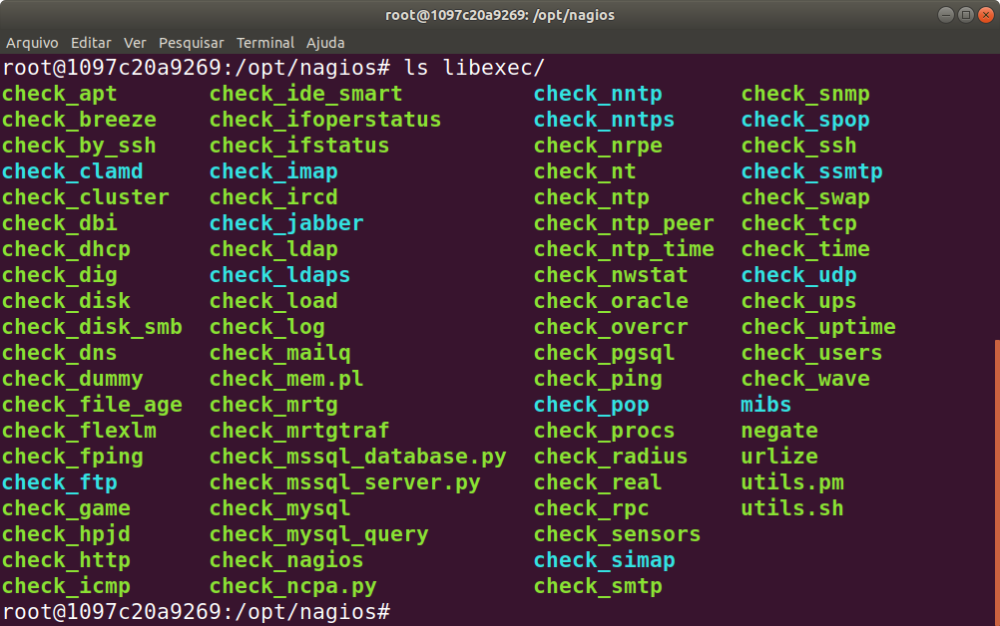

# 4.4 Comandos de Verificação do Nagios

A verificação do status de servidores e serviços oferecidos pelo Nagios é feita por meio de comandos. A interface padrão do Nagios já dispõe de checagens simples, como PING e atividade. Mas idealmente devem ser utilizados comandos específicos para cada tipo de verificação desejada. Por exemplo, um servidor HTTP pode ser verificado para saber se uma determinada página está acessível. Uma API HTTP pode ser vefificada para saber se seus serviços estão funcionando. Um cluster Kafka pode ser verificado para saber se o zookeeper, os brokers e os consumers estão respondendo corretamente.

Um comando nada mais é do que um script que executa determinadas ações e devolve para o Sistema Operacional (SO) um código de retorno indicando como foi seu encerramento. São vários scripts de verificação disponíveis e outros podem ser incluídos por meio de plugins ou até mesmo desenvolvidos por nós mesmos para realizar verificações específicas.

No contêiner com a instalação do Nagios que fizemos uso, os programas de verificação já disponíveis estão listados em `/opt/nagios/libexec`. Conforme mostra a figura abaixo.



Desse modo, ao executar cada script desses, com seus respectivos parâmetros, o Nagios coleta o código de retorno do mesmo e sinaliza em sua interface qual o status do host ou serviço em monitoramento. Cada código de retorno do script apresenta um significado para o SO e para o Nagios e é por meio dele que o Nagios indica que algo está operacional ou não no sistema.

Por exemplo, estando no prompt de comando do Servidor Nagios é possível consultar se o servidor nginx está respondendo na porta correta com o seguinte comando `check_http`. Abra um terminal dentro do contêiner onde o nagios está rodando e execute o seguinte comando (você precisa navegar até a pasta indicada na figura anterior):

```
./check_http -H my-custom-nginx-container
```

Por padrão, esse comando verifica se é possível a conexão via HTTP no host informado como parâmetro (`my-custom-nginx-container`) no porta `80` que, no caso do Servidor nginx está disponível. Desse modo, o script retorna um código indicador de sucesso para o SO. Para verificar qual o código de retorno do último comando em execução no `bash`, basta digitar `echo $?` e o código é exibido, conforme sequência de comandos e saídas abaixo. No caso, a consulta à conexão HTTP foi bem sucedida e o código de retorno foi 0.

```
$ cd /opt/nagios/libexec
$ ./check_http -H my-custom-nginx-container
HTTP OK: HTTP/1.1 200 OK - 848 bytes in 0.002 second response time |time=0.001639s;;;0.000000 size=848B;;;0

$ echo $?
0
```

Ao realizar a mesma consulta, mas agora no porta 81 (que não é exposta pelo nginx), o resultado é diferente, conforme ilustrado na sequência de comandos e saídas abaixo:

```
$./check_http -H my-custom-nginx-container -p 81
connect to address my-custom-nginx-container and port 81: Connection refused
HTTP CRITICAL - Unable to open TCP socket
$ echo $?
2
```

O código de retorno 2 indica que o comando não conseguiu encontrar um serviço que responde na porta 81.

Agora vamos tentar outro contêiner, que também roda o nginx na porta 80:

```
./check_http -H http-api-classificacao-produtos-container-unico-container
HTTP WARNING: HTTP/1.1 403 Forbidden - 303 bytes in 0.001 second response time |time=0.000871s;;;0.000000 size=303B;;;0
$ echo $?
1
```

O código de retorno 1 indica que o primeiro estágio de verificação foi concluído, mas o comando não foi executado com 100% de sucesso. Isso porque, nesse contêiner não há permissão para acessar o caminho raiz (`http://localhost/`), o que era permitido no outro contêiner. Veja o código de erro 403, que indica isso. Isso acontece porque cada contêiner foi configurado diferentemente. Na versão `my-custom-nginx-container` utilizamos uma imagem pronta, pré-configurada, para o nginx. Nessa imagem, o caminho raiz é aberto. Na versão `http-api-classificacao-produtos-container-unico-container` utilizamos uma imagem Linux com Python e fizemos a instalação do nginx por meio do comando `apt install`, que, por padrão, deixa o caminho raiz proibido.

Não está lembrando da diferença? Abra os arquivos `Dockerfile` em cada aplicativo, na pasta [exemplos](../exemplos/aplicativos/) e confira lá antes de continuar.

Cabe agora explicar esses valores. O código de retorno dos comandos de verificação, segundo [Sato (2018)](https://www.casadocodigo.com.br/products/livro-devops), resumem-se a:

* 0 – OK: verificação ocorreu com sucesso, representado pelo status verde na interface web;
* 1 – WARNING: verificação passou parcialmente, representado pelo status amarelo na interface web;
* 2 – CRITICAL: verificação falhou ou há algo de errado, representado pelo status vermelho na interface web; e
* 3 – UNKNOWN: verificação não é capaz de definir se o serviço está bem ou não, representado pelo status laranja na interface web.

Como podemos então testar pelo caminho correto no nginx? Lembre-se, na verdade, não era para ter nenhum arquivo no caminho raiz. Criamos um arquivo chamado `cadastro.html`, portanto o nosso comando de verificação deveria ser um pouco mais específico. Assim, independentemente da forma de instalação do nginx, conseguiremos detectar se de fato ele está rodando como gostaríamos. Para isso, basta especificar a URL específica, incluindo o caminho para essa página. Aí, tanto faz o contêiner, e o comando irá funcionar em ambos os casos:

```
$./check_http -H http-api-classificacao-produtos-container-unico-container -u /cadastro.html
HTTP OK: HTTP/1.1 200 OK - 4268 bytes in 0.001 second response time |time=0.000978s;;;0.000000 size=4268B;;;0

$./check_http -H my-custom-nginx-container -u /cadastro.html
HTTP OK: HTTP/1.1 200 OK - 4268 bytes in 0.002 second response time |time=0.001946s;;;0.000000 size=4268B;;;0
```

É também possível testar APIs HTTP com esse comando. Por exemplo, podemos testar nosso classificador de produtos da seguinte maneira:

```
./check_http -H http-api-classificacao-produtos-container-unico-container -u /api/predizer_categoria --content-type=application/json --method="POST" --post="{\"descricao\":\"kit 4 esponjas\"}"
HTTP OK: HTTP/1.1 200 OK - 175 bytes in 0.014 second response time |time=0.013532s;;;0.000000 size=175B;;;0
$ echo $?
0
```

Neste caso, é possível verificar que a requisição completou e retornou código 200, significando sucesso. É também possível adicionar um teste de conteúdo simples. Por exemplo, para essa descrição é esperado que a categoria retornada seja "maquiagem". Podemos adicionar um teste simples através do parâmetro `-s`:

```
$./check_http -H http-api-classificacao-produtos-container-unico-container -u /api/predizer_categoria --content-type=application/json --method="POST" --post="{\"descricao\":\"kit 4 esponjas\"}" -s maquiagem
HTTP OK: HTTP/1.1 200 OK - 175 bytes in 0.003 second response time |time=0.002808s;;;0.000000 size=175B;;;0
$ echo $?
0


$ ./check_http -H http-api-classificacao-produtos-container-unico-container -u /api/predizer_categoria --content-type=application/json --method="POST" --post="{\"descricao\":\"kit 4 esponjas\"}" -s brinquedo
HTTP CRITICAL: HTTP/1.1 200 OK - string 'brinquedo' not found on 'http://http-api-classificacao-produtos-container-unico-container:80/api/predizer_categoria' - 175 bytes in 0.003 second response time |time=0.002871s;;;0.000000 size=175B;;;0
$ echo $?
2
```

Note como o primeiro comando retorna sucesso (código 200), e o resultado do comando é o valor 0, pois dissemos ser esperado que o texto "maquiagem" aparecesse na resposta. No segundo comando dissemos que o texto "brinquedo" deveria aparecer na resposta. O resultado também foi código 200, o que significa que a API rodou, mas o comando final retornou código 2, pois o texto não continha a cadeia esperada. Dessa forma podemos testar não apenas se a API está respondendo, mas também se ela está realizando as predições como esperado.

Um teste mais genérico que pode ser feito em qualquer servidor é o do `check_ping`. Esse comando recebe três argumentos obrigatórios, conforme demonstrado abaixo:

```
$ ./check_ping -H my-custom-nginx-container -w 10,2% -c 20,5%
PING OK - Packet loss = 0%, RTA = 0.07 ms|rta=0.067000ms;10.000000;20.000000;0.000000 pl=0%;2;5;0
$ echo $?
0

$ ./check_ping -H zookeeper -w 10,2% -c 20,5%
PING OK - Packet loss = 0%, RTA = 0.08 ms|rta=0.080000ms;10.000000;20.000000;0.000000 pl=0%;2;5;0

$ echo $?
0
```

Veja como esse comando pode ser usado para testar tanto um servidor web (nginx) como um servidor que trabalha de outra forma, como o zookeeper do Kafka.

O primeiro argumento `-H` define o host a receber o ping. O segundo, `-w 10,2%`, indica que o Nagios irá emitir um _warning_ caso o tempo de resposta seja superior a `10ms` e haja mais de `2%` de perda de pacotes na comunicação. O terceiro, `-c 20,5%`, é o limite considerado crítico de tempo de resposta acima de `20ms` com mais de `5%` de perda de pacotes. No exemplo acima, como pode ser observado, tanto o Servidor web nginx quanto o zookeeper do Kafka respeitaram os limites estabelecidos e o código de retorno foi de sucesso `0`.

Finalmente, cabe aqui uma ressalva. Conforme destacado por [Sato (2018)](https://www.casadocodigo.com.br/products/livro-devops), nem todos os comandos de verificação podem ser utilizados para consultar informações em hosts remotos. Um deles é o `check_disk`, por exemplo, que não possui o parâmetro `-H`. Entretanto, caso seja necessário utilizar alguma verificação desse tipo, o Nagios oferece três possibilidades conforme mencionado a seguir ([Sato, 2018](https://www.casadocodigo.com.br/products/livro-devops)):

* [Checagem por SSH](https://nagios-plugins.org/doc/man/check\_by\_ssh.html): nesse caso, a verificação de informações no host remoto supervisionado é feita por meio do comando `check_by_ssh`. Com isso, o Nagios é capaz de conectar-se remotamente ao servidor supervisionado e executar as verificações que devem ser feitas localmente;
* [Checagem ativa com NRPE](https://assets.nagios.com/downloads/nagioscore/docs/nrpe/NRPE.pdf): trata-se de um plugin, denominado _Nagios Remote Plugin Execution_ (NRPE) que viabiliza a execução de verificadores que só podem ser utilizados localmente. O plugin executa de forma ativa, a partir da requisição do Nagios;
* [Checagem passiva com o NCSA](https://assets.nagios.com/downloads/nagiosxi/docs/How-to-Use-the-NSCA-Addon.pdf): trata-se de um plugin, denominado _Nagios Service Check Acceptor_ (NCSA), que executa de forma passiva no host supervisionado, e, de tempos em tempos, executa as verificações locais, encaminhando os resultados para o Nagios.

Caso necessite fazer uso desses recursos do Nagios, recomenda-se consultar a documentação oficial sobre os mesmos, indicadas acima, ou ainda realizar pesquisa na Internet sobre o assunto. Há muita documentação disponível sobre os mesmos. No que se refere a esse curso, faremos uso apenas dos verificadores que possam ser utilizados diretamente, sem a necessidade de execução de forma remota.

Há ainda a possibilidade de se instalar plugins para diferentes situações. O site [exchange.nagios.org](https://exchange.nagios.org) permite realizar buscas por plugins. Por exemplo, é possível encontrar um plugin para processar conteúdo JSON, monitorar nós do zookeeper, entre outros. Neste curso também não entraremos nos detalhes de uso e configuração de plugins, pois trata-se de um assunto mais avançado.

A seguir, faremos usos de algumas verificações adicionais nos nossos servidores do ambiente de produção e veremos como tais verificadores podem ser incluídos nos arquivos de configuração.
