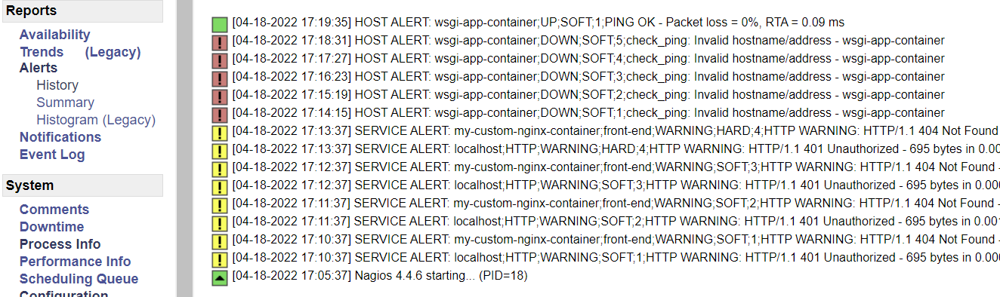
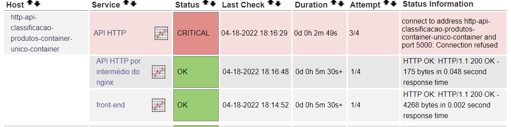

# 4.5 Criando Verificações Mais Específicas

Como observamos na seção anterior, o Nagios pode ser estendido com uma série de verificadores. Utilizamos alguns via linha de comando para realizar testes nos nossos servidores, mas fizemos isso manualmente. Nesta seção iremos configurar o Nagios para que ele possa realizar monitoramentos mais específicos nos nossos contêineres.

Vamos relembrar nosso setup de monitoramento, mostrado na figura a seguir:


Apenas adicionando os hosts no arquivo `hosts.cfg`, e sem necessidade de nenhuma configuração adicional, o Nagios já irá fazer uma checagem básica usando PING, que é um teste simples de conectividade. Conforme mostra a figura a seguir, todos os servidores passaram no teste do PING:


Não entraremos em muitos detalhes do monitoramento do Apache Kafka, pois é algo bastante trabalhoso e complexo. Existem [ferramentas pagas e gratuitas disponíveis para essa tarefa](https://towardsdatascience.com/overview-of-ui-monitoring-tools-for-apache-kafka-clusters-9ca516c165bd), e deixamos para o leitor a tarefa de estudar a melhor opção. Mas mesmo sem esses detalhes, o Nagios já irá informar quais nós do Kafka (zookeeper, broker, consumer) estão executando. Além disso, depois verificaremos ao menos se as portas estão abertas e ouvindo normalmente.

Vamos então seguir adiante e adicionar verificações mais específicas, referentes aos demais contêineres. Vamos começar pelos servidores web nginx. Temos dois aqui:

1. Um deles está rodando no host `my-custom-nginx-container`, na porta 80 (dentro da rede Docker chamada `minharede`), que é um contêiner que só roda o nginx;
2. O outro está rodando no host `http-api-classificacao-produtos-container-unico`, também na porta 80 (dentro da rede Docker chamada `minharede`), que é um contêiner que roda nginx e também o guvicorn/Flask.

Vamos então adicionar uma checagem simples, para saber se é possível encontrar o arquivo `cadastro.html` que deveria estar localizado no caminho raiz.

Queremos que essa checagem (e outras que fizermos) apareça na interface web do Nagios. Para isso, é preciso declarar os comandos nos arquivos de configuração para serem utilizados como serviços. Para isso, vamos criar um novo arquivo, chamado `commands.cfg`, que deve ser salvo junto com os outros arquivos do nagios (`hosts.cfg` e `hostgroups.cfg`). O conteúdo é o seguinte:

```
# COMMANDS
define command {
    command_name check_html_file
    command_line /opt/nagios/libexec/check_http -H '$HOSTADDRESS$' -u '$ARG1$'
}
```

Definimos um comando simples, chamado `check_html_file`, que roda o comando `check_http` em busca de um host, definido pela variável `HOSTADDRESS` (explicaremos mais adiante), e em busca de um caminho definido pela variável `ARG1` (também explicaremos mais adiante). Veja como esse comando é genérico, e pode ser aplicado a qualquer host. Vamos então adicioná-lo como checagens para os nossos servidores nginx. Para isso, modifique o arquivo `hosts.cfg` conforme segue:

```diff
# HOST DEFINITIONS
define host {
    use linux-server
    host_name http-api-classificacao-produtos-container-unico-container
    alias http-api-classificacao-produtos-container-unico-container
    address http-api-classificacao-produtos-container-unico-container
    hostgroups linux-servers
+    check_command check_html_file!/cadastro.html
}

define host {
    use linux-server
    host_name wsgi-app-container
    alias wsgi-app-container
    address wsgi-app-container
    hostgroups linux-servers
}

define host {
    use linux-server
    host_name my-custom-nginx-container
    alias my-custom-nginx-container
    address my-custom-nginx-container
    hostgroups linux-servers
+    check_command check_html_file!/cadastro.html
}

define host {
    use linux-server
    host_name zookeeper
    alias zookeeper
    address zookeeper
    hostgroups linux-servers
}

define host {
    use linux-server
    host_name broker
    alias broker
    address broker
    hostgroups linux-servers
}

define host {
    use linux-server
    host_name  analise-sentimentos-consumer-container
    alias analise-sentimentos-consumer-container
    address analise-sentimentos-consumer-container
    hostgroups linux-servers
}
```

Neste arquivo estamos dizendo que os dois hosts que rodam nginx precisam executar a verificação definida no comando `check_html_file`. Além disso, estamos dizendo que a verificação deve buscar pelo arquivo `/cadastro.html`. Essa chamada irá substituir as variáveis definidas dentro do comando, assim:

* `$HOSTADDRESS$` será substituído pelo host em questão, no caso `http-api-classificacao-produtos-container-unico-container` e `my-custom-nginx-container`
* `$ARG1$` será substituído pelo que vem após o símbolo de exclamação (`!`) que vem após a chamada do comando. No caso, `check_html_file!/cadastro.html`, o que vem depois da exclamação é a cadeia `/cadastro.html`

Para testar essa configuração, reconstrua a imagem de um dos contêineres de forma a não copiar o arquivo em questão. Por exemplo, modifique o arquivo `Dockerfile-nginx` da pasta `http-api-classificacao-produtos-dois-containers` da seguinte forma:

```diff
FROM nginx
-COPY webclient/* /usr/share/nginx/html
COPY default /etc/nginx/conf.d/default.conf
```

Reconstrua a imagem, interrompa o contêiner e suba-o novamente.

Em seguida, vamos reconstruir a imagem do Nagios. Como estaremos mexendo em vários arquivos de configuração, é mais fácil configurar o `nagios.cfg` para carregar toda uma pasta de arquivos, ao invés de um por um. Modifique-o, no final, da seguinte forma:

```diff
-cfg_file=/opt/nagios/etc/objects/customconfig/hostgroups.cfg
-cfg_file=/opt/nagios/etc/objects/customconfig/hosts.cfg
+cfg_dir=/opt/nagios/etc/objects/customconfig/
```

Dessa forma, qualquer arquivo de configuração existente nessa pasta será carregado. Vamos também modificar o arquivo `Dockerfile` que cria uma imagem customizada do Nagios, para também copiar todos os arquivos de configuração de uma única vez:

```diff
FROM jasonrivers/nagios:latest

-ARG SENHA

LABEL maintainer="auri@ufscar.br, g4briel.4lves@gmail.com, daniel.lucredio@ufscar.br"

ENV NAGIOS_TIMEZONE="America/Sao_Paulo"

-ADD conf.d/hostgroups.cfg /opt/nagios/etc/objects/customconfig/
-ADD conf.d/hosts.cfg /opt/nagios/etc/objects/customconfig/
ADD conf.d/*.cfg /opt/nagios/etc/objects/customconfig/
ADD nagios.cfg /opt/nagios/etc/

EXPOSE 80

-RUN htpasswd -b -c /opt/nagios/etc/htpasswd.users nagiosadmin ${SENHA}
```

Veja como tiramos a opção de customizar a senha para facilitar o processo.

Agora basta reconstruir a imagem e rodar o contêiner novamente:

```
docker build -t custom-nagios-server .

docker run -p 80:80 --rm --name nagios-server --network minharede custom-nagios-server
```

Enquanto o Nagios faz as checagens, vamos verificar se os comandos foram carregados corretamente. Na página inicial, clique em "Configuration", no lado inferior esquerdo da tela principal. Na página que se abrir, verifique que a opção "Hosts" está selecionada, e clique em "Continue". A imagem a seguir ilustra esse passo.


Em seguida, procure pelos dois hosts nos quais adicionamos o comando. Mais para a direita, na coluna "Host Check Command", verifique que os comandos foram de fato carregados (`check_html_file!cadastro.html`). Clique sobre um deles. A imagem a seguir ilustra esse passo.


Clicando sobre o comando, é possível ver o comando final construído para essa checagem, conforme mostra a figura a seguir.


Agora vamos retornar à página de monitoramento dos hosts, clicando em "Hosts" no menu à esquerda. Veja como em um dos hosts apareceu um aviso, dizendo que houve um erro do tipo 404 em uma das checagens. O Nagios continua informando que o servidor está "UP", pois de fato o servidor está rodando. Mas ele nos avisa que tem algo errado, um arquivo faltando, no caso.


Agora vamos testar para ver se o Nagios detecta quando um serviço para de funcionar. Para isso, basta interromper um dos contêineres e aguardar até que o Nagios detecte a sua ausência. Veja, na imagem a seguir, um exemplo de um servidor que parou de funcionar sendo identificado pelo Nagios.


O Nagios também cria alertas que indicam quando algo dá errado. Clicando no menu "Alerts", no lado esquerdo, é possível ver a sequência de problemas que foram sendo detectados enquanto o Nagios faz os monitoramentos.


Detectado o problema, a equipe de operações pode tomar as ações necessárias para reativar os serviços que estão com problemas e o Nagios passa a detectar a volta da normalidade do ambiente de produção.



Como mencionado anteriormente, o comando `check_command` pode ser utilizado em diferentes definições do Nagios. Dentro de um `define host` ele pode aparecer uma única vez. Entretanto, pode ser que tenhamos a necessidade de realizar diferentes verificações num mesmo host ou num grupo de hosts. É nesse caso que utilizamos o conceito de `service`.

Desse modo, diversos tipos de verificações podem ser incluídas nos arquivos de configuração. Vamos alterar as configurações, começando pelo arquivo `hostgroups.cfg`:

```diff
# HOST GROUPS
define hostgroup {
	hostgroup_name classificacao-produtos
	alias Sistema de classificação de produtos
	members http-api-classificacao-produtos-container-unico-container,wsgi-app-container,my-custom-nginx-container

}

define hostgroup {
	hostgroup_name analise-sentimentos
	alias Sistema para análise de sentimentos
	members zookeeper,broker,analise-sentimentos-consumer-container
}

+define hostgroup {
+	hostgroup_name front-end
+	alias Front-end do sistema de classificacao de produtos
+}

+define hostgroup {
+	hostgroup_name wsgi-flask
+	alias Servidor WSGI rodando uma aplicação Flask
+}

+define hostgroup {
+	hostgroup_name zookeeper
+	alias Zookeeper para gerenciamento do cluster Kafka
+}

+define hostgroup {
+	hostgroup_name broker
+	alias Broker usado no cluster Kafka
+}

+define hostgroup {
+	hostgroup_name consumer
+	alias Consumer usado no cluster Kafka
+}
```

Definimos diferentes grupos de hosts para facilitar as verificações de alguns serviços comuns a mais de um host. No caso, temos cópias dos serviços WSGI (duas instâncias) e dos servidores web nginx (duas instâncias). No caso do Kafka, temos apenas uma instância de cada componente (zookeeper, broker e consumer), mas poderíamos ter mais, e assim o monitoramento seria mais simples de configurar.

Agora vamos alterar o arquivo `hosts.cfg` para migrar as checagens para fora dos hosts e também para definir os grupos de cada host. Faça as seguintes modificações:

```diff
# HOST DEFINITIONS
define host {
    use linux-server
    host_name http-api-classificacao-produtos-container-unico-container
    alias http-api-classificacao-produtos-container-unico-container
    address http-api-classificacao-produtos-container-unico-container
-    hostgroups linux-servers
+    hostgroups linux-servers,wsgi-flask,front-end
-    check_command check_html_file!/cadastro.html
}

define host {
    use linux-server
    host_name wsgi-app-container
    alias wsgi-app-container
    address wsgi-app-container
-    hostgroups linux-servers
+    hostgroups linux-servers,wsgi-flask
}

define host {
    use linux-server
    host_name my-custom-nginx-container
    alias my-custom-nginx-container
    address my-custom-nginx-container
-    hostgroups linux-servers
+    hostgroups linux-servers,front-end
-    check_command check_html_file!/cadastro.html
}

define host {
    use linux-server
    host_name zookeeper
    alias zookeeper
    address zookeeper
-    hostgroups linux-servers
+    hostgroups linux-servers,zookeeper
}

define host {
    use linux-server
    host_name broker
    alias broker
    address broker
-    hostgroups linux-servers
+    hostgroups linux-servers,broker
}

define host {
    use linux-server
    host_name  analise-sentimentos-consumer-container
    alias analise-sentimentos-consumer-container
    address analise-sentimentos-consumer-container
-    hostgroups linux-servers
+    hostgroups linux-servers,consumer
}
```

Note como agora o arquivo `hosts.cfg` não tem mais checagens nos servidores individualmente. Isso será definido como serviços. Além disso, cada host agora pertence a um grupo, conforme o que ele tem configurado.

Finalmente, vamos definir os serviços. Crie um arquivo chamado `services.cfg`, com o seguinte conteúdo:

```
define service {
    use local-service,graphed-service
    hostgroup_name front-end
    service_description front-end
    check_command check_html_file!/cadastro.html
}

define service {
    use local-service,graphed-service
    hostgroup_name wsgi-flask
    service_description API HTTP
    check_command check_api_post_json!5000!/predizer_categoria!{"descricao":"kit 4 esponjas"}!maquiagem
}
```

Por enquanto, temos dois serviços: um deles faz a verificação que já tínhamos antes, destinada ao front-end (busca pela página `cadastro.html`). Agora essa verificação está associada a vários hosts. O segundo serviço é um teste da API, destinado a ser feito diretamente no servidor WSGI que roda Flask. Veja como ele foi configurado para utilizar um comando novo, chamado `check_api_post_json`. Esse comando ainda não existe, mas deve ser intuitivo o que ele faz, não? Ele vai fazer um teste da API, na porta 5000 (porta do Flask), vai passar um JSON, e espera que a categoria seja identificada como "maquiagem".

Vamos então criar esse comando. Abra o arquivo `commands.cfg`, e altere-o da seguinte forma:

```diff
# COMMANDS
define command {
    command_name check_html_file
    command_line /opt/nagios/libexec/check_http -H '$HOSTADDRESS$' -u '$ARG1$'
}
+define command {
+    command_name check_api_post_json
+    command_line /opt/nagios/libexec/check_http -H '$HOSTADDRESS$' -p '$ARG1$' -u '$ARG2$' --content-type=application/json --method="POST" --post='$ARG3$' -s '$ARG4$'
}
```

Consegue identificar o que esse novo comando faz? Não? Volte à [Seção anterior](4-4-comandos-de-verificacao-do-nagios.md) e veja que já brincamos com ele antes! Ele faz um POST e verifica se o resultado do POST tem uma string que queremos.

Temos outras configurações para fazer, mas vamos testar o que temos até o momento? Salve os arquivos, reconstrua a imagem e rode o contêiner `nagios-server`. Acesse a interface web, aguarde alguns minutos e vamos lá! A tela inicial deve mostrar que todos os hosts estão "UP". Tudo bem até aqui. Vamos agora clicar no link "Services", no lado esquerdo, e algo parecido com o seguinte deve aparecer:


Temos dois serviços com "WARNING":

* O Host `localhost` apresenta um aviso de acesso não-autorizado. Podemos ignorar esse aviso, pois esse é o próprio Nagios falhando em monitorar a si mesmo.
* O Host `my-custom-nginx-container` também está dando um aviso, dizendo que o problema é o código 404. Isso também é esperado, pois esse serviço espera encontrar um arquivo chamado `/cadastro.html`, que removemos propositalmente para testar. Caso queira que esse serviço volte ao normal, pode consertar aquele `Dockerfile-nginx`:

```diff
FROM nginx
+COPY webclient/* /usr/share/nginx/html
COPY default /etc/nginx/conf.d/default.conf
```

Basta interromper o contêiner, reconstruir a imagem e subir novamente. Aguarde alguns minutos e o serviço voltará ao normal.


Agora vamos prestar atenção no serviço que está marcado como "CRITICAL". Trata-se de um erro ao tentar conectar na porta 5000, para testar a API HTTP, que deveria estar rodando no contêiner `http-api-classificacao-produtos-container-unico-container`. Mas esse erro não deveria existir, pois existe um serviço rodando na porta 5000 nesse contêiner!

Veja também que, no Host `wsgi-app-container` o teste é bem sucedido. Isso significa que o Nagios conseguiu enviar um POST para ele, contendo um JSON, e a resposta veio corretamente.

Sabemos que existe um serviço WSGI rodando nos dois contêineres. Porque o teste falhou em um e foi bem sucedido em outro? Volte à figura no início desta seção e pense um pouco e tente identificar o problema.

Podemos ver naquela figura que a porta 5000 não está exposta para fora do contêiner `http-api-classificacao-produtos-container-unico-container`. É por isso que o Nagios não está encontrando-a. Lembra-se que [falamos que, ao configurar tudo em um único contêiner, seria mais difícil controlar os serviços individualmente?](../3-producao/3-3-ambiente-de-producao-parte-2.md) Então, aqui o problema aparece! Fica menos visível, aqui no Nagios, que aquele contêiner na verdade tem dois serviços rodando.

Podemos resolver o problema expondo a porta 5000 desse contêiner. Não faremos isso aqui (deixamos como exercício para o leitor). Mas para provar que o serviço WSGI está de fato rodando, vamos adicionar mais uma checagem diferente. Vamos testar a API por intermédio do nginx! Para isso, modifique o arquivo `services.cfg`:

```diff
define service {
    use local-service,graphed-service
    hostgroup_name front-end
    service_description front-end
    check_command check_html_file!/cadastro.html
}

define service {
    use local-service,graphed-service
    hostgroup_name wsgi-flask
    service_description API HTTP
    check_command check_api_post_json!5000!/predizer_categoria!{"descricao":"kit 4 esponjas"}!maquiagem
}

+define service {
+    use local-service,graphed-service
+    hostgroup_name front-end
+    service_description API HTTP por intermédio do nginx
+    check_command check_api_post_json!80!/api/predizer_categoria!{"descricao":"kit 4 esponjas"}!maquiagem
+}
```

Interrompa o contêiner, reconstrua a imagem e execute novamente. Aguarde novamente alguns minutos e verifique agora como os serviços estão respondendo:



Com um contêiner único, é impossível acessar a API pela porta 5000 diretamente (pois essa porta não foi exposta), mas por intermédio do nginx a API responde bem.


Com dois contêiners, é possível acessar tanto a API pela porta 5000 diretamente no servidor WSGI, ou por intermédio do nginx.

Lembrando que essa limitação se dá apenas neste exemplo, devido à forma como configuramos esses contêineres. Não é uma regra, e há inúmeras formas de se corrigir isto:

* Podemos expor a porta 5000 de dentro do contêiner único;
* Podemos reconfigurar o Nagios para não chegar pela API HTTP no contêiner único.

Dessa forma, o monitoramento ficaria mais preciso. Caso o nginx pare de responder, pode ser um problema dele, nginx, ou pode ser um problema do servidor WSGI. Com a capacidade de monitorar ambos os serviços temos uma maior capacidade de detecção de problemas. Deixamos para o leitor o exercício de aplicar uma dessas abordagens.

Vamos completar nossa seção adicionando checagens para as portas usadas pelos componentes do Kafka. Para isso, modifique o arquivo `services.cfg` para usar o comando `check_tcp` do Nagios:

```diff
define service {
    use local-service,graphed-service
    hostgroup_name front-end
    service_description front-end
    check_command check_html_file!/cadastro.html
}

define service {
    use local-service,graphed-service
    hostgroup_name wsgi-flask
    service_description API HTTP
    check_command check_api_post_json!5000!/predizer_categoria!{"descricao":"kit 4 esponjas"}!maquiagem
}

define service {
    use local-service,graphed-service
    hostgroup_name front-end
    service_description API HTTP por intermédio do nginx
    check_command check_api_post_json!80!/api/predizer_categoria!{"descricao":"kit 4 esponjas"}!maquiagem
}

+define service {
+    use local-service,graphed-service
+    hostgroup_name zookeeper
+    service_description Porta de conexão do cliente com o zookeeper
+    check_command check_tcp!2181
+}

+define service {
+    use local-service,graphed-service
+    hostgroup_name broker
+    service_description Porta de comunicação dos producers kafka com o broker
+    check_command check_tcp!9092
+}

+define service {
+    use local-service,graphed-service
+    hostgroup_name broker
+    service_description Porta de comunicação dos consumers kafka com o broker
+    check_command check_tcp!29092
+}
```

Veja como não é necessário definir o comando `check_tcp` no arquivo `commands.cfg`, pois o mesmo já está disponível para ser utilizado pelos serviços.

Reiniciando o Nagios, podemos ver como agora conseguimos monitorar que as portas de cada componente do Kafka estão de fato respondendo.


Conforme comentado, monitorar um cluster Kafka é um tópico bastante complexo, e o que fizemos aqui não entra no mérito sobre a capacidade do cluster em responder adequadamente às altas demandas.

E chegamos ao fim desta seção. Neste exemplo, fizemos algumas verificações simples utilizando os comandos `check_http` e `check_tcp`. Na instalação padrão do nosso contêiner, há um arquivo `commands.cfg`, localizado em `/opt/nagios/etc/objects`, contendo outros comandos que podem ser utilizados dentro dos nossos arquivos de configuração para melhorar o monitoramento dos servidores.

Desse modo, observa-se que o Nagios é uma ferramenta de monitoramento bastante versátil. Recomenda-se um estudo dos arquivos de configuração disponíveis em `/opt/nagios/etc/objects` para mais informações sobre o monitoramento de objetos como Nagios. Lá existem exemplos para o monitoramento de _switches_ e impressoras, dentre outros.

Como exercício para o leitor, sugerimos:

* Corrigir o problema com o monitoramento da API HTTP no contêiner único;
* Adicionar um teste para cada categoria de produto, na API HTTP; e
* Adicionar um comando `check_html_file_with_port_and_content`, que aceita mais dois argumentos: uma porta diferente da porta 80, e um conteúdo que deve estar presente no arquivo HTML recuperado, caso contrário será gerado um aviso no Nagios.
