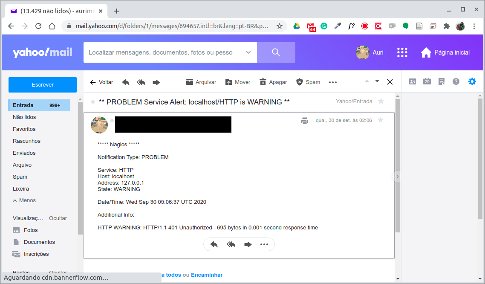

# 4.6 Criando Alertas

Até o momento configuramos o Nagios para que ele detecte e exponha os problemas encontrados em sua interface web. Entretanto, um sistema de monitoramento de qualidade deve ser capaz também de alertar usuários, ou grupos específicos de usuários, sobre tais problemas, mesmo quando eles não estão visualizando o painel do Nagios.

De maneira geral, três configurações são necessárias para o recebimento de alertas.

1. Configuração dos comandos para o envio de alertas, da mesma forma como configuramos os comandos para verificação dos servidores, por exemplo;
2. Configuração do período de tempo em que os alertas devem ser emitidos; e
3. Configuração do usuário, ou grupo de usuários, que será(ão) alertado(s).

#### Comando para o recebimento de alertas

O Nagios permite o envio e alertas de diferentes tipos, desde um e-mail, até o uso de serviços de mensagem de SMS, pager, dentre outras possibilidades. Por padrão, a notificação por e-mail já vem habilitada. Já o uso de SMS, por exemplo, exige outras configurações e um servidor dedicado para o envio de mensagens os quais, em geral, são pagos.

Desse modo, a título de ilustração, faremos uso do comando padrão de notificação por e-mail de possíveis ocorrências em hosts (`notify-host-by-email`) ou serviços (`notify-service-by-email`) monitorados pelo Nagios. Os comandos de notificação estão definidos no arquivo `/opt/nagios/etc/objects/commands.cfg`, conforme apresentados abaixo:

```
...
# 'notify-host-by-email' command definition
define command{
        command_name    notify-host-by-email
        command_line    /usr/bin/printf "%b" "***** Nagios *****\n\nNotification Type: $NOTIFICATIONTYPE$\nHost: $HOSTNAME$\nState: $HOSTSTATE$\nAddress: $HOSTADDRESS$\nInfo: $HOSTOUTPUT$\n\nDate/Time: $LONGDATETIME$\n" | /usr/bin/mail -s "** $NOTIFICATIONTYPE$ Host Alert: $HOSTNAME$ is $HOSTSTATE$ **" $CONTACTEMAIL$
}

# 'notify-service-by-email' command definition
define command{
        command_name    notify-service-by-email
        command_line    /usr/bin/printf "%b" "***** Nagios *****\n\nNotification Type: $NOTIFICATIONTYPE$\n\nService: $SERVICEDESC$\nHost: $HOSTALIAS$\nAddress: $HOSTADDRESS$\nState: $SERVICESTATE$\n\nDate/Time: $LONGDATETIME$\n\nAdditional Info:\n\n$SERVICEOUTPUT$\n" | /usr/bin/mail -s "** $NOTIFICATIONTYPE$ Service Alert: $HOSTALIAS$/$SERVICEDESC$ is $SERVICESTATE$ **" $CONTACTEMAIL$
}
...
```

#### Quando receber alertas

A decisão de quando os alertas devem ser recebidos é feita pelo Nagios a partir da configuração de períodos de tempo. Tais definições estão armazenadas por padrão no arquivo `/opt/nagios/etc/objects/timeperiods.cfg`.

Por exemplo, uma das definições é a do período 24x7 que representa que alertas podem ser emitidos 24 horas por dia nos 7 dias da semana. Esse tipo de período é adequado para equipes que precisam manter sistemas em operação de forma ininterrupta, pois dessa forma alertas podem chegar a qualquer momento. A definição desse padrão de período de alerta, extraída do `timeperiods.cfg`, é apresentada abaixo:

```
...
define timeperiod {

    name                    24x7
    timeperiod_name         24x7
    alias                   24 Hours A Day, 7 Days A Week

    sunday                  00:00-24:00
    monday                  00:00-24:00
    tuesday                 00:00-24:00
    wednesday               00:00-24:00
    thursday                00:00-24:00
    friday                  00:00-24:00
    saturday                00:00-24:00
}
...
```

#### A quem alertar em caso de problemas

Finalmente, resta definir quem será alertado em caso de problemas. Podemos alertar tanto um usuário específico como um grupo de usuários responsáveis pelas operações. No exemplo abaixo vamos considerar que apenas um usuário necessita ser alertado.

Também por padrão, o Nagios traz um arquivo com uma configuração padrão localizado em `/opt/nagios/etc/objects/contacts.cfg`, cujo conteúdo é o seguinte:

```
###############################################################################
# CONTACTS.CFG - SAMPLE CONTACT/CONTACTGROUP DEFINITIONS
#
#
# NOTES: This config file provides you with some example contact and contact
#        group definitions that you can reference in host and service
#        definitions.
#
#        You don't need to keep these definitions in a separate file from your
#        other object definitions.  This has been done just to make things
#        easier to understand.
#
###############################################################################


###############################################################################
#
# CONTACTS
#
###############################################################################

# Just one contact defined by default - the Nagios admin (that's you)
# This contact definition inherits a lot of default values from the
# 'generic-contact' template which is defined elsewhere.

define contact {

    contact_name            nagiosadmin             ; Short name of user
    use                     generic-contact         ; Inherit default values from generic-contact template (defined above)
    alias                   Nagios Admin            ; Full name of user
    email                   nagios@localhost ; <<***** CHANGE THIS TO YOUR EMAIL ADDRESS ******
}


###############################################################################
#
# CONTACT GROUPS
#
###############################################################################

# We only have one contact in this simple configuration file, so there is
# no need to create more than one contact group.

define contactgroup {

    contactgroup_name       admins
    alias                   Nagios Administrators
    members                 nagiosadmin
}
```

O símbolo de ";" no arquivo `cfg` é utilizado para incluir comentário no final das linhas. Algumas dessas informações, como o nome do contato, uso e alias, vamos manter. Além disso, iremos incluir algumas outras configurações e também alterar o endereço de e-mail conforme o desejado.

Crie um arquivo chamado `contacts.cfg` e salve-o junto com os demais arquivos de configuração que estamos utilizando até o momento, na mesma pasta que o arquivo `Dockerfile`. Se você está seguindo os exemplos desde o início do capítulo, a estrutura de diretórios deve ficar assim:

```
C:\Users\dlucr\DockerProjects\nagios\
|-- contacts.cfg  <== arquivo que criamos agora
|-- nagios.cfg
|-- Dockerfile
|-- conf.d
|   |-- commands.cfg
|   |-- hostgroups.cfg
|   |-- hosts.cfg
|   |-- services.cfg
```

Posteriormente alteraremos o arquivo `Dockerfile` para copiar esse arquivo para o local correto, de forma a substituir o conteúdo original.

Vamos então ao conteúdo do arquivo, que deve ser o seguinte:

```
define contact {
    contact_name                    nagiosadmin
    use                             generic-contact
    alias                           Nagios Admin
    service_notification_period     24x7
    host_notification_period        24x7
    service_notification_options    w,u,c,r
    host_notification_options       d,r
    service_notification_commands   notify-service-by-email
    host_notification_commands      notify-host-by-email
    email                           aurimrv@yahoo.com.br
}

define contactgroup {

    contactgroup_name       admins
    alias                   Nagios Administrators
    members                 nagiosadmin
}
```

Observa-se no arquivo alterado que foram incluídos algumas opções em relação à notificação, unindo ao contato as restrições de tempo e tipos de notificações de interesse.

Por exemplo, `service_notification_period` e `host_notification_period` definidos como `24x7` indicam que esse usuário receberá notificações a todo e qualquer momento do dia caso algum dos problemas indicados em `service_notification_options` e `host_notification_options` ocorram. No caso de `service_notification_options`, as opções `w,u,c,r` indicam, respectivamente, os status do serviço de `WARNING (w)`, `UNKNOWN (u)`, `CRITICAL (c)`, ou `RECOVERY (r)`. Já no caso de `host_notification_options`, o `d,r` representam, respectivamente, o status de `DOWN (d)` e `RECOVERY (r)` de um host. Desse modo, havendo qualquer dessas ocorrências em hosts ou serviços um e-mail será encaminhado alertando o respectivo usuário.

Não modificamos a definição existente de `contactgroup`, pois teremos apenas um contato, portanto apenas um grupo é suficiente.

Para que essas alterações se tornem permanentes em nossa imagem, o arquivo `Dockerfile` precisa ser alterado conforme abaixo:

```diff
FROM jasonrivers/nagios:latest

LABEL maintainer="auri@ufscar.br, g4briel.4lves@gmail.com, daniel.lucredio@ufscar.br"

ENV NAGIOS_TIMEZONE="America/Sao_Paulo"

ADD conf.d/*.cfg /opt/nagios/etc/objects/customconfig/
ADD nagios.cfg /opt/nagios/etc/
+ADD contacts.cfg /opt/nagios/etc/objects/

EXPOSE 80
```

Observa-se na linha 9 que enviamos para a imagem original um novo arquivo `contacts.cfg` com o conteúdo alterado e, desse modo, o Nagios passa a encaminhar os alertas conforme definido.

Para testar se tudo está funcionando, basta executar os comandos abaixo que irão interromper a execução do Nagios, gerar novamente a imagem do servidor de Monitoramento e, posteriormente, iremos interromper a execução do Servidor Web e verificar se o alerta surtiu efeito.

```
docker stop nagios-server

docker build -t custom-nagios-server .

docker run -p 80:80 --rm --name nagios-server --network minharede custom-nagios-server
```

Entretanto, para que o envio de mensagens seja efetivado, é necessária a configuração do `postfix` ou do `sendmail` no contêiner. Desse modo, as configurações acima funcionam se um desses mecanismos de envio de e-mails já esteja configurado no contêiner. Como a configuração de servidor de saída `SMTP` de serviços como GMail ou Yahoo utilizam certificados e autenticação por SSL, o processo de configuração é mais trabalhoso. Caso queira configurar utilizando suas credenciais, siga os passos descritos na última seção desse capítulo. Por hora, vamos assumir que as configurações do `postfix` estão corretas e o Nagios é capaz de enviar e-mails de alertas.

Por exemplo, assim que inicializamos nosso servidor Nagios é emitido um `WARNING` no serviço `HTTP` do `localhost`. Tal evento, transcorrido o tempo de notificação, é comunicado ao usuário cadastrado, conforme mensagem de e-mail abaixo:



Experimente repetir os outros testes que fizemos na seção anterior, como interromper um contêiner. Observe os alertas sendo exibidos na interface web do Nagios, e também os alertas chegando por e-mail. Experimente também subir novamente o contêiner, e veja se a notificação da retomada do serviço também chega por e-mail.

#### Passo a passo para a configuração do Postfix para contas GMail

Por padrão, o nosso contêiner padrão já vem com o `Postfix` instalado. O que faremos é atualizá-lo para poder executar as configurações necessárias. A instalação dos pacotes do passo a passo a seguir serão incluídas diretamente no `Dockerfile` para que a imagem gerada passe a ter o servidor `postfix` configurado automaticamente mas, primeiro, é necessária a geração dos arquivos de configuração, e esses dependem das credenciais de login de cada um em sua respectiva conta do GMail ou outro servidor que ofereça recursos de SMTP.

O primeiro passo é a criação de uma conta no GMail e a geração de uma senha de aplicativo para uso no processo. Tal senha pode ser obtida seguindo [esse tutorial](https://support.google.com/accounts/answer/185833?hl=pt-BR). A título de exemplo, assumiremos que `USER` corresponde ao nome de usuário e `PASSWORD` a senha de aplicativo gerada para acesso ao serviço de envio de mensagens via GMail.

Agora faremos o seguinte processo:

1. Entraremos no contêiner via terminal e iremos executar uma série de comandos para configurá-lo para acessar o Gmail;
2. Em seguida, iremos copiar alguns dos arquivos gerados no contêiner para a máquina hospedeira;
3. Finalmente, replicaremos o processo no arquivo `Dockerfile`, para que possamos gerar uma imagem já pré-configurada para a conta do Gmail.

Esse processo serve como um excelente aprendizado, pois esse tipo de configuração (primeiro em um contêiner rodando e depois migrando para o `Dockerfile`) é bastante comum e útil em diferentes ocasiões. Vamos lá!

Vamos abrir um terminal no contêiner que está em execução:

```
docker exec -it nagios-server /bin/bash
```

1.1. Configuração do Postfix

Instalação dos pacotes para utilizar o Postfix com o GMail

```
$ apt update
$ apt install -y vim nano postfix mailutils libsasl2-2 ca-certificates libsasl2-modules
```

1.2. Alterando o arquivo de configuração do Postfix

```
nano /etc/postfix/main.cf
```

Primeiro, elimine desse arquivo a linha com o conteúdo

```
relayhost=
```

Em seguida, inclua as linhas abaixo no final do arquivo

```
relayhost = [smtp.gmail.com]:587
smtp_sasl_auth_enable = yes
smtp_sasl_password_maps = hash:/etc/postfix/sasl/sasl_passwd
smtp_sasl_security_options = noanonymous
smtp_tls_CAfile = /etc/ssl/certs/ca-certificates.crt
smtp_use_tls = yes
```

1.3. Definir o login e a senha do GMail no arquivo abaixo:

```
nano /etc/postfix/sasl/sasl_passwd
```

O conteúdo desse arquivo deve ser conforme abaixo, sendo que `USER` e `PASSWORD` correspondem ao seu login e a senha de app gerada no GMail:

```
[smtp.gmail.com]:587    USER@gmail.com:PASSWORD
```

1.4. Criar o arquivo utilizado pelo Postfix Lookup Table

```
postmap /etc/postfix/sasl/sasl_passwd
```

Esse comando gera o arquivo `sasl_passwd.db` no diretório `/etc/postfix/sasl/`.

1.5. Correção das permissões e proprietários dos arquivos

```
chown -R root:postfix /etc/postfix/sasl
chmod 750 /etc/postfix/sasl
chmod 640 /etc/postfix/sasl/sasl_passwd*
```

Terminamos o passo 1 acima, portanto podemos sair do terminal do contêiner, com o comando `exit`. Agora vamos para o passo 2, que consiste em copiar os arquivos recém-criados para a máquina hospedeira. Utilizaremos o comando `docker cp`.

2.1. Crie uma pasta, dentro da mesma que estamos trabalhando até o momento, chamada `postfix`, e execute os comandos de cópia (lembre-se de substituir pelo seu diretório):

```
mkdir 'C:\Users\dlucr\DockerProjects\nagios\postfix'

docker cp nagios-server:/etc/postfix/main.cf C:\Users\dlucr\DockerProjects\nagios\postfix\

docker cp nagios-server:/etc/postfix/sasl/sasl_passwd C:\Users\dlucr\DockerProjects\nagios\postfix\

docker cp nagios-server:/etc/postfix/sasl/sasl_passwd.db C:\Users\dlucr\DockerProjects\nagios\postfix\
```

A estrutura final de diretórios deve ser a seguinte:

```
C:\Users\dlucr\DockerProjects\nagios\
|-- contacts.cfg  <== arquivo que criamos agora
|-- nagios.cfg
|-- Dockerfile
|-- conf.d
|   |-- commands.cfg
|   |-- hostgroups.cfg
|   |-- hosts.cfg
|   |-- services.cfg
|-- postfix
|-- |-- main.cf
|-- |-- sasl_passwd
|-- |-- sasl_passwd.db
```

Copiados esses arquivos, pode-se encerrar o contêiner:

```
docker stop nagios-server
```

Agora vamos alterar o arquivo `Dockerfile` para reproduzir tudo o que fizemos até o momento. Dessa forma, sempre que a imagem for construída, já teremos tudo o que é necessário para que a configuração feita para o postfix seja permanente.

3.1. Altere o arquivo `Dockerfile`:

```diff
FROM jasonrivers/nagios:latest

LABEL maintainer="auri@ufscar.br, daniel.lucredio@ufscar.br"

ENV NAGIOS_TIMEZONE="America/Sao_Paulo"

+# Configurações do POSTFIX
+RUN apt update
+RUN apt install -y vim nano postfix mailutils libsasl2-2 ca-certificates libsasl2-modules
+ADD postfix/main.cf /etc/postfix/
+ADD postfix/sasl_passwd /etc/postfix/sasl/
+ADD postfix/sasl_passwd.db /etc/postfix/sasl/
+RUN chown -R root:postfix /etc/postfix/sasl
+RUN chmod 750 /etc/postfix/sasl
+RUN chmod 640 /etc/postfix/sasl/sasl_passwd*

ADD conf.d/*.cfg /opt/nagios/etc/objects/customconfig/
ADD nagios.cfg /opt/nagios/etc/
ADD contacts.cfg /opt/nagios/etc/objects/

EXPOSE 80
```

Observe que é a mesma sequência de alterações que fizemos manualmente dentro do contêiner, exceto pelas alterações manuais feitas nos arquivos que foram copiadas para a pasta da máquina hospedeira.

3.2. Reconstrua a imagem e execute novamente o contêiner, para que as alterações sejam efetivadas.

```
docker build -t custom-nagios-server .

docker run -p 80:80 --rm --name nagios-server --network minharede custom-nagios-server
```
