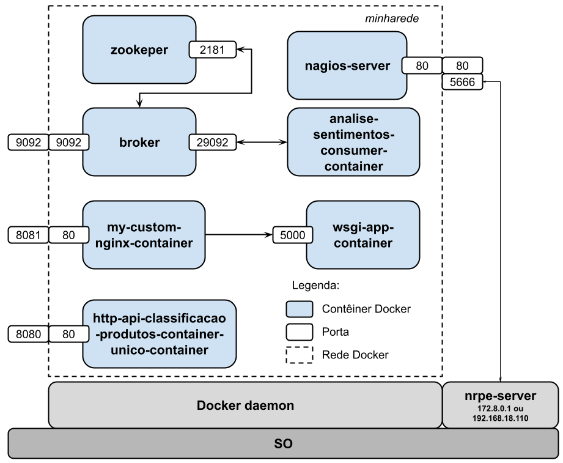
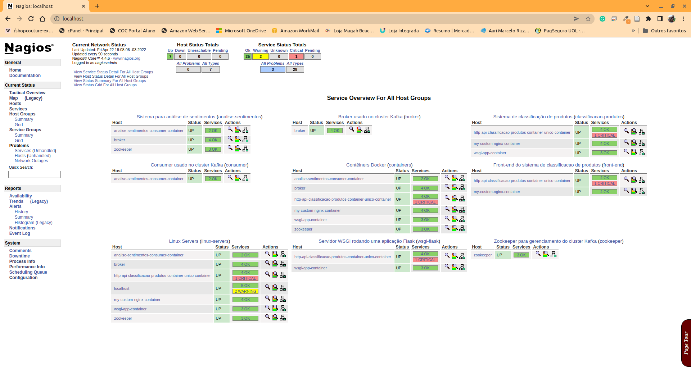
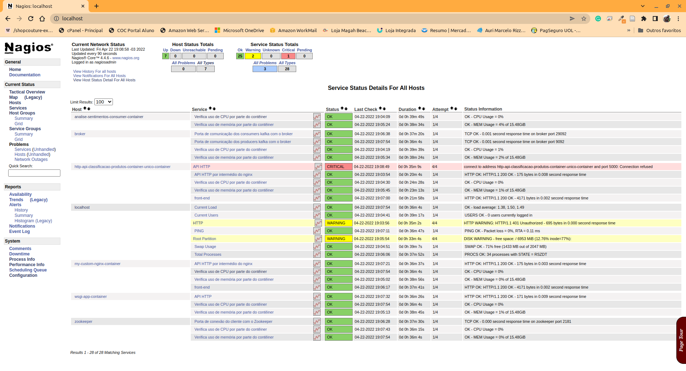

# 4.8 Verificação de Contêineres via NRPE

Conforme comentado no final da, a verificação de informações em hosts executando remotamente ou em rede dependem de serviços executando fora do contêiner do Nagios depende de uma forma de comunicação entre o Nagios e a máquina que viabiliza a execução dos demais elementos. No nosso caso, estamos interessados em nos comunicar com a máquina em que os contêineres Docker estão em execução. No exemplo explorado até o momento, todos os contêineres estão executando sobre a mesma máquina física, mas, em geral, na prática, podemos ter contêineres executando em diferentes hosts, gerenciados por diferentes Docker _daemons_.&#x20;

Nesta seção, usaremos um recurso, denominado checagem ativa por NRPE (Nagios Remote Plugin Execution) para viabilizar a execução de comandos que verifiquem dados sobre os contêineres em execução por meio do Nagios. Para isso, teremos que 1) instalar o servidor NRPE no host que hospeda o Docker _daemon_ e executa os contêineres; 2) criar comandos que façam as verificações que desejamos nos contêineres; e 3) integrar os novos verificadores ao servidor NRPE de modo que o servidor Nagios possa apresentar os dados na sua interface.

A figura a seguir ilustra a configuração que definimos para viabilizar que o servidor Nagios possa coletar dados sobre elementos (contêineres) remotos.



### 4.8.1 Instalação do servidor NRPE na máquina hospedeira

Para que o servidor Nagios (`nagios-server`) possa monitorar recursos existentes numa máquina remota, ou que dependam de comandos que só podem ser executados na máquina que gerencia determinados recursos, é necessário que o servidor Nagios deve se comunicar com essa máquina remota. No nosso exemplo, vamos considerar que a máquina hospedeira que gerencia e controla a execução dos contêineres seja essa máquina. Desse modo, a instalação do servidor de NRPE (`nrpe-server`) na mesma se faz necessário.

Considerando que se trata de uma máquina com SO Linux baseada em Ubuntu/Debian, o processo de instalação desse servidor pode ser feito conforme apresentado nos passos a seguir.

#### Instalação do servidor via repositórios

```
$ sudo apt update
$ sudo apt install nagios-nrpe-server nagios-plugins nagios-nrpe-plugin
```

Ao término deste processo, o servidor NRPE e o conjunto de plugins com comandos que podem ser executados na máquina hospedeira estarão instalados, restando apenas configurar o servidor NRPE.

O arquivo de configuração do NRPE estará localizado em `/etc/nagios/nrpe.cfg`. Ao editar este arquivo devem ser alteradas as configurações padrão conforme abaixo:

```
allowed_hosts=127.0.0.1,::1,172.8.0.2
dont_blame_nrpe=1
allow_bash_command_substitution=1
```

Basta procurar cada um desses elementos no arquivo e substituir com as informações pertinentes. O primeiro (`allowed_hosts`) determina quais hosts remotos podem se conectar com o NRPE server. No nosso caso, queremos que o `nagios-server` se comunique com esse servidor e, desse modo, o IP do `nagios-server` atribuído na `minharede` é utilizado aqui. Para descobrir o UP, basta utilizar o comando `docker network inspect minharede` e verificar o IP atribuído ao `nagios-server`.

O segundo (`dont_blame_nrpe`) indica que os NRPE server podem receber e tratar argumentos vindos do servidor Nagios.

O terceiro (`allow_bash_command_substitution`) indica que os scripts de verificação podem realizar substituição de comandos bash, bastante utilizados em scripts Bash. Demonstraremos isso quando formos implementar os comandos de verificação de uso de CPU e memória pelos contêineres.

Mais informações sobre essas opções podem ser consultadas nos comentários do próprio arquivo `/etc/nagios/nrpe.cfg` e na documentação do próprio Nagios.

#### Configuração do Firewall para acesso ao servidor NRPE

O serviço oferecido pelo NRPE é disponibilizado na porta 5666 conforme indicado na configuração do arquivo `/etc/nagios/nrpe.cfg`. Para isso, precisamos abrir essa porta para viabilizar conexões externas à mesma.

Para isso, considerando uma máquina com SO Linux Mint ou outras distribuições baseadas em Debian, executamos os comandos abaixo:

* Atualizar o arquivo `/etc/services`

O arquivo /etc/services é utilizado para traduzir o nome de uma aplicação para um número de porta para conexão via rede. Nesse caso, estamos traduzindo `nrpe` para a porta `5666` via conexão TCP.

```
sudo sh -c "echo >> /etc/services"
sudo sh -c "sudo echo '# Nagios services' >> /etc/services"
sudo sh -c "sudo echo 'nrpe    5666/tcp' >> /etc/services"
```

* Configurar Firewall

```
sudo mkdir -p /etc/ufw/applications.d
sudo sh -c "echo '[NRPE]' > /etc/ufw/applications.d/nagios"
sudo sh -c "echo 'title=Nagios Remote Plugin Executor' >> /etc/ufw/applications.d/nagios"
sudo sh -c "echo 'description=Allows remote execution of Nagios plugins' >> /etc/ufw/applications.d/nagios"
sudo sh -c "echo 'ports=5666/tcp' >> /etc/ufw/applications.d/nagios"
sudo ufw allow NRPE
sudo ufw reload
```

Feita essa alteração, podemos iniciar o servidor NRPE e testar o seu funcionamento. Para iniciar, consultar o status de execução, ou reiniciar o servidor em caso de alterações no arquivo `/etc/nagios/nrpe.cfg`, basta executar um dos comandos abaixo, respectivamente:

```
$ sudo service nagios-nrpe-server start
$ sudo service nagios-nrpe-server status
$ sudo service nagios-nrpe-server restart
```

Para verificar o status do serviço em execução, utilizamos o mesmo comando, mas com a palavra `status` no final, no lugar de `start`. Se tudo correr bem, o resultado deve ser algo semelhante ao exibido abaixo:

```
$ sudo service nagios-nrpe-server status
● nagios-nrpe-server.service - Nagios Remote Plugin Executor
     Loaded: loaded (/lib/systemd/system/nagios-nrpe-server.service; enabled; vendor preset: enabled)
     Active: active (running) since Fri 2022-04-22 00:40:37 -03; 3s ago
       Docs: http://www.nagios.org/documentation
   Main PID: 96502 (nrpe)
      Tasks: 1 (limit: 18913)
     Memory: 640.0K
     CGroup: /system.slice/nagios-nrpe-server.service
             └─96502 /usr/sbin/nrpe -c /etc/nagios/nrpe.cfg -f

abr 22 00:40:37 av nrpe[96502]: Added command[check_container_mem]=/usr/lib/nagios/plugins/check_container_me>
abr 22 00:40:37 av nrpe[96502]: INFO: SSL/TLS initialized. All network traffic will be encrypted.
abr 22 00:40:37 av nrpe[96502]: Starting up daemon
abr 22 00:40:37 av nrpe[96502]: SETUP_WAIT_CONN FOR: IPv4 address: 0.0.0.0 ((null))
abr 22 00:40:37 av nrpe[96502]: Server listening on 0.0.0.0 port 5666.
abr 22 00:40:37 av nrpe[96502]: SETUP_WAIT_CONN FOR: IPv4 address: :: ((null))
abr 22 00:40:37 av nrpe[96502]: Server listening on :: port 5666.
abr 22 00:40:37 av nrpe[96502]: Warning: Daemon is configured to accept command arguments from clients!
abr 22 00:40:37 av nrpe[96502]: Listening for connections on port 5666
abr 22 00:40:37 av nrpe[96502]: Allowing connections from: 127.0.0.1,::1,172.18.0.2
```

#### Teste do servidor em execução na máquina local

Para verificar se o servidor está respondendo corretamente, basta executarmos os comandos abaixo e observar se a saída é conforme apresentado.

```
$ cd /usr/lib/nagios/plugins
/usr/lib/nagios/plugins$ ./check_nrpe -H localhost
NRPE v4.0.0
```

#### Adicionar o usuário nagios ao grupo docker

Ao terminar essa instalação, é criado um usuário `nagios` no sistema operacional e, para que o mesmo possa executar com sucesso os comandos do Docker sem permissão de superusuário, precisamos que o mesmo seja adicionado ao grupo `docker` e, posteriormente, a máquina seja reinicializada antes de continuar com os próximos passos.

```
$ sudo usermod -a -G docker nagios
$ sudo reboot
```

### 4.8.2 Criando os scripts de monitoramento dos contêineres

No site do [Nagios](https://exchange.nagios.org/directory/Plugins) existe uma grande variedade de [plugings](https://exchange.nagios.org/directory/Plugins) disponíveis para uso na plataforma. Os que aparecem na pasta `/usr/lib/nagios/plugins/` acompanham a ferramenta, mas outros podem ser baixados ou até mesmo desenvolvidos, desde que respeitem as regras estabelecidas para tal, disponíveis em [https://nagios-plugins.org/doc/guidelines.html](https://nagios-plugins.org/doc/guidelines.html).

Basicamente, um plugin executa comandos e expõe os resultados de forma padronizada para que a interface do Nagios server possa apresentá-los adequadamente. O Nagios estabelece que o mesmo deve retornar um código numérico conforme abaixo:

**Plugin Return Codes**

| Valor Numérico | Status do Serviço | Descrição do Status                                                                                                                                                                                                                                                                                                                                                                                    |
| -------------- | ----------------- | ------------------------------------------------------------------------------------------------------------------------------------------------------------------------------------------------------------------------------------------------------------------------------------------------------------------------------------------------------------------------------------------------------ |
| 0              | OK                | O plugin foi capaz de verificar o serviço e parecia estar funcionando corretamente                                                                                                                                                                                                                                                                                                                     |
| 1              | Warning           | O plug-in conseguiu verificar o serviço, mas parecia estar acima de algum limite de "aviso" ou não parecia estar funcionando corretamente                                                                                                                                                                                                                                                              |
| 2              | Critical          | O plug-in detectou que o serviço não estava em execução ou estava acima de algum limite "crítico"                                                                                                                                                                                                                                                                                                      |
| 3              | Unknown           | Argumentos de linha de comando inválidos foram fornecidos ao plug-in ou falhas de baixo nível internas ao plug-in (como incapacidade de abrir um socket tcp) que o impedem de executar a operação especificada. Erros de nível superior (como erros de resolução de nomes, tempos limite de socket, etc.) estão fora do controle de plugins e geralmente NÃO devem ser relatados como estados UNKNOWN. |

#### Saída textual

Já em relação ao formato da saída de texto, a partir do Nagios 3 ela pode ter mais de uma linha de texto, mas nos exemplos abaixo, limitamos a uma linha. Além disso, é recomendado que cada linha não tenha mais de 85 caracteres. O formato da linha é conforme abaixo:

```
SERVICE STATUS: First line of output | First part of performance data
```

Por exemplo, ao executar o comando de verificação `check_users`, que permite consultar quantos usuários estão conectados na máquina, a saída é conforme abaixo:

```
$ ./check_users -w 2 -c 10
USERS OK - 1 users currently logged in |users=1;2;10;0
```

Após implementados, a instalação dos plugins consistem apenas em copiá-los para uma pasta desejada e alterar o arquivo de configuração do NRPE server para que os mesmos possam ser reconhecidos e executados pelo Nagios server via RNPE.

Os que apresentamos a seguir são adaptações de dois dos disponíveis em

O primeiro plugin é uma adaptação do plugin NRPE denominado [`check_container_cpu.sh`](https://github.com/ninoabbate/nrpe-plugins/blob/master/check\_container\_cpu.sh), disponível no repositório [https://github.com/ninoabbate/nrpe-plugins](https://github.com/ninoabbate/nrpe-plugins). O código adaptado é apresentado abaixo:

```
#!/bin/bash
#
# Author: Antonino Abbate
# Version: 1.2
# License: GNU GENERAL PUBLIC LICENSE Version 3
# 
# -----------------------------------------------------------------------------------------------------
#  Plugin Description
# -----------------------------------------------------------------------------------------------------
#
# This script checks the docker container internal CPU usage
#
# Usage:
# ./check_container_cpu.sh <container name> -w <warning threshold> -c <critical threshold>
#
#
# Output:
# OK       - if the CPU usage is under the warning and critical thresholds
# WARNING  - if the CPU usage is equal or over the warning threshold and it is under the critical threshold
# CRITICAL - if the CPU usage is equal or over the critical threshold
# UNKNOWN  - if the container does not exist
#
# ---------------------------------------- License -----------------------------------------------------
# 
# This program is free software: you can redistribute it and/or modify
#   it under the terms of the GNU General Public License as published by
#   the Free Software Foundation, either version 3 of the License, or
#   (at your option) any later version.
#
#  This program is distributed in the hope that it will be useful,
#   but WITHOUT ANY WARRANTY; without even the implied warranty of
#   MERCHANTABILITY or FITNESS FOR A PARTICULAR PURPOSE.  See the
#   GNU General Public License for more details.
#
#   You should have received a copy of the GNU General Public License
#   along with this program.  If not, see <http://www.gnu.org/licenses/>. 
#
#----------------------------------------------------------------------------------------------------------
#   Initialization 
#----------------------------------------------------------------------------------------------------------

CONTAINER=$1

RUNNING=`docker inspect --format="{{ .State.Running }}" $CONTAINER 2> /dev/null`

#----------------------------------------------------------------------------------------------------------
#   Check if container exists
#----------------------------------------------------------------------------------------------------------

if [[ $RUNNING -ne true ]]; then
  echo "UNKNOWN - $CONTAINER not running or does not exist."
  exit 3
fi

if [ "$2" = "-w" ] && [ "$3" -gt "0" ] && [ "$4" = "-c" ] && [ "$5" -gt "0" ] ; then
  warn=$3
  crit=$5

#----------------------------------------------------------------------------------------------------------
#   Check the container internal cpu usage
#----------------------------------------------------------------------------------------------------------

  CPUUSAGE=`docker stats --no-stream $CONTAINER | grep -A1 CONTAINER | grep -v CONTAINER | awk '{print $3}'`

  CPU=$(expr ${CPUUSAGE%%.*} / 1 )

  if [ $warn -lt ${CPU%%.*} ];then
    if [ $crit -lt ${CPU%%.*} ]; then
      echo "CRITICAL - CPU Usage = $CPU% | CPU Usage=$CPU%;$warn;$crit;0;100"
      exit 2
    else
      echo "WARNING - CPU Usage = $CPU% | CPU Usage=$CPU%;$warn;$crit;0;100"
      exit 1
    fi
  else
    echo "OK - CPU Usage = $CPU% | CPU Usage=$CPU%;$warn;$crit;0;100"
    exit 0
fi
else
  echo "$0 - Nagios Plugin for checking CPU usage in a running docker container "
  echo ""
  echo "Usage:    $0 -w <warnlevel> -c <critlevel>"
  echo "  = warnlevel and critlevel is warning and critical value for alerts. "
  echo ""
  echo "EXAMPLE:  $0 <container_name> -w 80 -c 90 "
  echo "  = This will send warning alert when CPU Usage percentage is higher than 80%, and send critical when higher than 90%"
  echo ""
  exit 3
fi
```

Basicamente, o plugin é um script bash que executa os comandos `docker inspect` para descobrir se o contêiner desejado está em execução (linha 44) e o `docker stats` (linha 63) para detectar o consumo de CPU por parte do contêiner em execução.

O outro plugin, denominado `check_container_mem.sh`, é uma adaptação do anterior sendo que, ao invés de se consultar o consumo de CPU, consulta o consumo de memória por parte do contêiner em execução. Para isso, faz uso também do `docker info`. O código completo do plugin é apresentado abaixo:

```
#!/bin/bash
#
# Author: Antonino Abbate
# Version: 1.2
# License: GNU GENERAL PUBLIC LICENSE Version 3
# 
# -----------------------------------------------------------------------------------------------------
#  Plugin Description
# -----------------------------------------------------------------------------------------------------
#
# This script checks the docker container internal Memory usage
#
# Usage:
# ./check_container_mem.sh <container name> -w <warning threshold> -c <critical threshold>
#
#
# Output:
# OK       - if the memory usage is under the warning and critical thresholds
# WARNING  - if the memory usage is equal or over the warning threshold and it is under the critical threshold
# CRITICAL - if the memory usage is equal or over the critical threshold
# UNKNOWN  - if the container does not exist
#
# ---------------------------------------- License -----------------------------------------------------
# 
# This program is free software: you can redistribute it and/or modify
#   it under the terms of the GNU General Public License as published by
#   the Free Software Foundation, either version 3 of the License, or
#   (at your option) any later version.
#
#  This program is distributed in the hope that it will be useful,
#   but WITHOUT ANY WARRANTY; without even the implied warranty of
#   MERCHANTABILITY or FITNESS FOR A PARTICULAR PURPOSE.  See the
#   GNU General Public License for more details.
#
#   You should have received a copy of the GNU General Public License
#   along with this program.  If not, see <http://www.gnu.org/licenses/>. 
#
#----------------------------------------------------------------------------------------------------------
#   Initialization 
#----------------------------------------------------------------------------------------------------------

CONTAINER=$1

TOTALMEM=`docker info | grep -i Memory | awk '{print $3}'`

RUNNING=`docker inspect --format="{{ .State.Running }}" $CONTAINER 2> /dev/null`

#----------------------------------------------------------------------------------------------------------
#   Check if container exists
#----------------------------------------------------------------------------------------------------------

if [[ $RUNNING -ne true ]]; then
  echo "UNKNOWN - $CONTAINER not running or does not exist."
  exit 3
fi

if [ "$2" = "-w" ] && [ "$3" -gt "0" ] && [ "$4" = "-c" ] && [ "$5" -gt "0" ] ; then
  warn=$3
  crit=$5

#----------------------------------------------------------------------------------------------------------
#   Check the container internal cpu usage
#----------------------------------------------------------------------------------------------------------

  MEMUSAGE=`docker stats --no-stream $CONTAINER | grep -A1 CONTAINER | grep -v CONTAINER | awk '{print $7}'`

  MEM=$(expr ${MEMUSAGE%%.*} / 1 )

#echo "DEBUG - CONTAINER: $CONTAINER"
#echo "DEBUG - WARNING: $warn"
#echo "DEBUG - CRITICAL: $crit"
#echo "DEBUG - RUNNING: $RUNNING"
#echo "DEBUG - TOTAL MEMORY: $TOTALMEM"
#echo "DEBUG - MEM USAGE: $MEMUSAGE"
#echo "DEBUG - MEM: $MEM"  

  if [ $warn -lt $MEM ];then
    if [ $crit -lt $MEM ]; then
      echo "CRITICAL - MEM Usage = $MEM% of $TOTALMEM | MEM Usage=$MEM%;$warn;$crit;0;100"
      exit 2
    else
      echo "WARNING - MEM Usage = $MEM% of $TOTALMEM | MEM Usage=$MEM%;$warn;$crit;0;100"
      exit 1
    fi
  else
    echo "OK - MEM Usage = $MEM% of $TOTALMEM | MEM Usage=$MEM%;$warn;$crit;0;100"
    exit 0
fi
else
  echo "$0 - Nagios Plugin for checking MEM usage in a running docker container "
  echo ""
  echo "Usage:    $0 -w <warnlevel> -c <critlevel>"
  echo "  = warnlevel and critlevel is warning and critical value for alerts. "
  echo ""
  echo "EXAMPLE:  $0 <container_name> -w 80 -c 90 "
  echo "  = This will send warning alert when MEM Usage percentage is higher than 80%, and send critical when higher than 90%"
  echo ""
  exit 3
fi
```

### 4.8.3 Instalando os plugins desenvolvidos no NRPE server

Construídos os plugins vamos copiá-los para a pasta de plugins do servidor NRPE, localizado no diretório `/usr/lib/nagios/plugins/`.

```
$ sudo cp check_container_cpu.sh check_container_mem.sh /usr/lib/nagios/plugins
```

Após copiados, podemos testá-los localmente conforme abaixo:

```
$ ./check_container_cpu.sh nagios4 -w 5 -c 15
OK - CPU Usage = 0% | CPU Usage=0%;5;15;0;100
```

```
$ ./check_container_mem.sh nagios4 -w 5 -c 15
WARNING: API is accessible on http://127.0.0.1:2375 without encryption.
         Access to the remote API is equivalent to root access on the host. Refer
         to the 'Docker daemon attack surface' section in the documentation for
         more information: https://docs.docker.com/go/attack-surface/
WARNING: No swap limit support
OK - MEM Usage = 0% of 15.48GiB | MEM Usage=0%;5;15;0;100
```

Para finalizar as configurações do lado do NRPE server é necessário atualizarmos o arquivo `/etc/nagios/nrpe.cfg`. Nesse arquivo, além das configurações já realizadas, são descritos os serviços que poderão ser executados de forma remota. Precisamos indicar isso no servidor. Desse modo, no final deste mesmo arquivo, vamos incluir os comandos abaixo, referentes aos dois verificadores que estamos interessados.

```
### GENERIC SERVICES FOR CONTAINERS ###
command[check_container_cpu]=/usr/lib/nagios/plugins/check_container_cpu.sh $ARG1$
command[check_container_mem]=/usr/lib/nagios/plugins/check_container_mem.sh $ARG1$
```

Observa-se que estamos criando dois comandos, um denominado `check_container_cpu` e outro `check_container_mem` . Eles são baseados nos respectivos scripts `check_container_cpu.sh` e `check_container_mem.sh`. Apesar desses scripts exigirem mais de um argumento quando invocados via linha de comando, observe que, quando configurados no servidor NRPE, um único argumento é fornecido, `ARG1$`. Na verdade, posteriormente, esse argumento único é expandido e desmembrado pelo NRPE antes da invocação do script, conforme demonstraremos a seguir.

### 4.8.4 Configurando o Nagios server para se comunicar via NRPE

Uma vez feita a configuração do servidor NRPE, agora podemos dar início à configuração do lado do servidor Nagios e usar os comandos definidos.

Da mesma forma como apresentado na [Seção 4.5](4-5-criando-verificacoes-mais-especificas.md), podemos criar arquivos de configuração para implementar o uso dos comandos acima de diferentes maneiras. Uma delas, ainda não explorada, seria criarmos uma definição de host no arquivo hosts.cfg.

Um novo `hostgroup` específico para o monitoramento de contêineres e, desse modo, usar os comandos acima.

Assim sendo, faremos as seguintes alterações nos arquivos criados anteriormente. O primeiro será o arquivo de `hostgroups.cfg`. No seu final incluímos a definição de um novo grupo `containers`.

```diff
# HOST GROUPS
define hostgroup {
	hostgroup_name classificacao-produtos
	alias Sistema de classificação de produtos
	members http-api-classificacao-produtos-container-unico-container,wsgi-app-container,my-custom-nginx-container

}

define hostgroup {
	hostgroup_name analise-sentimentos
	alias Sistema para análise de sentimentos
	members zookeeper,broker,analise-sentimentos-consumer-container
}

define hostgroup {
	hostgroup_name front-end
	alias Front-end do sistema de classificacao de produtos
}

define hostgroup {
	hostgroup_name wsgi-flask
	alias Servidor WSGI rodando uma aplicação Flask
}

define hostgroup {
	hostgroup_name zookeeper
	alias Zookeeper para gerenciamento do cluster Kafka
}

define hostgroup {
	hostgroup_name broker
	alias Broker usado no cluster Kafka
}

define hostgroup {
	hostgroup_name consumer
	alias Consumer usado no cluster Kafka
}

+define hostgroup {
+	hostgroup_name containers
+	alias Contêiners Docker
+}
```

Em seguida, colocamos cada `host` desejado associado a esse `hostgroup`.

```diff
# HOST DEFINITIONS
define host {
    use linux-server
    host_name http-api-classificacao-produtos-container-unico-container
    alias http-api-classificacao-produtos-container-unico-container
    address http-api-classificacao-produtos-container-unico-container
+    hostgroups linux-servers,wsgi-flask,front-end,containers
}

define host {
    use linux-server
    host_name wsgi-app-container
    alias wsgi-app-container
    address wsgi-app-container
+    hostgroups linux-servers,wsgi-flask,containers
}

define host {
    use linux-server
    host_name my-custom-nginx-container
    alias my-custom-nginx-container
    address my-custom-nginx-container
+    hostgroups linux-servers,front-end,containers
}

define host {
    use linux-server
    host_name zookeeper
    alias zookeeper
    address zookeeper
+    hostgroups linux-servers,zookeeper,containers
}

define host {
    use linux-server
    host_name broker
    alias broker
    address broker
+    hostgroups linux-servers,broker,containers
}

define host {
    use linux-server
    host_name analise-sentimentos-consumer-container
    alias analise-sentimentos-consumer-container
    address analise-sentimentos-consumer-container
+    hostgroups linux-servers,consumer,containers
}
```

Resta agora configurar o arquivo `commnds.cfg`, criando os comandos desejados usando os recursos do NRPE e, posteriormente, configurarmos o arquivo de `services.cfg`, fazendo uso dos comandos definidos.

```diff
# COMMANDS
define command {
    command_name check_html_file
    command_line /opt/nagios/libexec/check_http -H '$HOSTADDRESS$' -u '$ARG1$'
}

define command {
    command_name check_api_post_json
    command_line /opt/nagios/libexec/check_http -H '$HOSTADDRESS$' -p '$ARG1$' -u '$ARG2$' --content-type=application/json --method="POST" --post='$ARG3$' -s '$ARG4$'
}

+###################################
+# Comandos que fazem uso do NRPE
+###################################
+define command {
+    command_name check_container_cpu_nrpe
+    command_line /opt/nagios/libexec/check_nrpe -H $ARG1$ -c check_container_cpu -a '$ARG2$ -w $ARG3$ -c $ARG4$'
+}

+define command {
+    command_name check_container_mem_nrpe
+    command_line /opt/nagios/libexec/check_nrpe -H $ARG1$ -c check_container_mem -a '$ARG2$ -w $ARG3$ -c $ARG4$'
+}
```

Observa-se nos comandos incluídos acima que foram criados dois novos comandos: `check_container_cpu_nrpe` e `check_container_mem_nrpe`. Ambos utilizam o comando `check_rnpe` do Nagios, indicando que esses comandos serão utilizados para a coleta de dados no host identificado por `$ARG1$.` Em seguida, o parâmetro `-c` identifica quais dos comandos definidos no servidor NRPE (arquivo `/etc/nagios/nrpe.cfg`), ilustrado anteriormente: `check_container_cpu` e `check_container_mem`, respectivamente. E o parâmetro `-a` identifica uma string contendo todos os argumentos necessários para executar os comandos necessários. No exemplo acima, são fornecidas três informações, identificadas por `$ARG2$`, `$ARG3$` e `$ARG4$` que indicam, respectivamente, o nome ou ID do contêiner a ser monitorado, o limite superior para que um warning no uso do recurso seja emitido, e o limite superior para que um alerta crítico seja emitido.

Agora esses comandos podem ser empregados na construção de um serviço de monitoramento.

```diff
# SERVICES
define service {
    use local-service,graphed-service
    hostgroup_name front-end
    service_description front-end
    check_command check_html_file!/cadastro.html
}

define service {
    use local-service,graphed-service
    hostgroup_name wsgi-flask
    service_description API HTTP
    check_command check_api_post_json!5000!/predizer_categoria!{"descricao":"kit 4 esponjas"}!maquiagem
}

define service {
    use local-service,graphed-service
    hostgroup_name front-end
    service_description API HTTP por intermédio do nginx
    check_command check_api_post_json!80!/api/predizer_categoria!{"descricao":"kit 4 esponjas"}!maquiagem
}

define service {
    use local-service,graphed-service
    hostgroup_name zookeeper
    service_description Porta de conexão do cliente com o Zookeeper
    check_command check_tcp!2181
}

define service {
    use local-service,graphed-service
    hostgroup_name broker
    service_description Porta de comunicação dos producers kafka com o broker
    check_command check_tcp!9092
}

define service {
    use local-service,graphed-service
    hostgroup_name broker
    service_description Porta de comunicação dos consumers kafka com o broker
    check_command check_tcp!29092
}

+define service {
+    name container-cpu-usage
+    use local-service,graphed-service
+    hostgroup_name containers
+    service_description Verifica uso de CPU por parte do contêiner
+    check_command check_container_cpu_nrpe!192.168.18.110!$HOSTNAME$!30!60
+}

+define service {
+    name container-mem-usage
+    use local-service,graphed-service
+    hostgroup_name containers
+    service_description Verifica uso de memória por parte do contêiner
+    check_command check_container_mem_nrpe!192.168.18.110!$HOSTNAME$!30!60
+}
```

Observa-se acima que construímos dois novos services: `container-cpu-usage` e `container-mem-usage`. Ambos pertencem ao hostgroup containers e usam os comandos definidos acima para funcionarem. Na frente dos comandos, as strings deliminadas por `!` definem os valores das variáveis `$ARG1$`, `$ARG2$`, `$ARG3$` e `$ARG4$`, respectivamente, e são, dessa forma, utilizados na invocação dos comandos. Nos exemplos acima, o primeiro valor corresponde ao IP do servidor NRPE (`192.168.18.110`) em execução na mesma máquina que o _Docker Daemon_, o segundo ao nome do contêiner, obtido por meio da macro`$HOSTNAME$`, disponível nas [Macros do Nagios](https://assets.nagios.com/downloads/nagioscore/docs/nagioscore/3/en/macrolist.html),  e os demais valores aos limites utilizados para a emissão de avisos do tipo WARNING e CRITICAL.

Encerradas as configurações, resta apenas construir a imagem do servidor do Nagios e disparar sua execução.

```
$ cd nagios
$ docker build -t custom-nagios-server .
$ docker run -p 80:80 --rm --name nagios-server --network minharede custom-nagios-server
```

Em seguida, inicializado o servidor do Nagios, resta apenas iniciar os demais contêineres que serão monitorados.

```
docker run -d -p 8080:80 --network minharede --rm --name http-api-classificacao-produtos-container-unico-container http-api-classificacao-produtos-container-unico

docker run -d --rm --name wsgi-app-container --network minharede wsgi-app

docker run -d -p 8081:80 --rm --name my-custom-nginx-container --network minharede custom-nginx

docker run -d --rm --name zookeeper --network minharede -e ZOOKEEPER_CLIENT_PORT=2181 -e ZOOKEEPER_TICK_TIME=2000 confluentinc/cp-zookeeper:7.0.1

docker run -d --rm --name broker --network minharede -p 9092:9092 -e KAFKA_BROKER_ID=1 -e KAFKA_ZOOKEEPER_CONNECT='zookeeper:2181' -e KAFKA_LISTENER_SECURITY_PROTOCOL_MAP=PLAINTEXT:PLAINTEXT,PLAINTEXT_INTERNAL:PLAINTEXT -e KAFKA_ADVERTISED_LISTENERS=PLAINTEXT://localhost:9092,PLAINTEXT_INTERNAL://broker:29092 -e KAFKA_OFFSETS_TOPIC_REPLICATION_FACTOR=1 -e KAFKA_TRANSACTION_STATE_LOG_MIN_ISR=1 -e KAFKA_TRANSACTION_STATE_LOG_REPLICATION_FACTOR=1 confluentinc/cp-kafka:7.0.1

docker run -d --rm --name analise-sentimentos-consumer-container --network minharede analise-sentimentos-consumer
```




