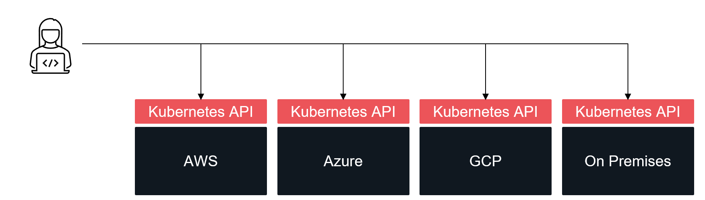
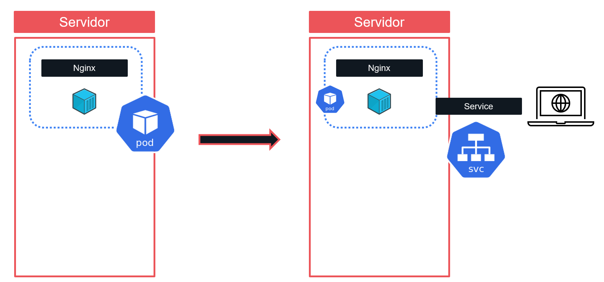
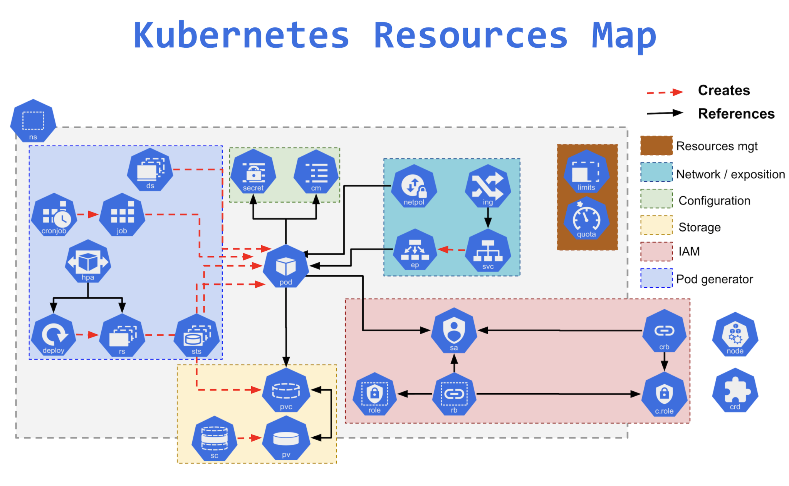
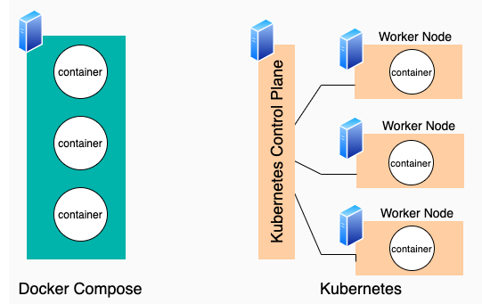
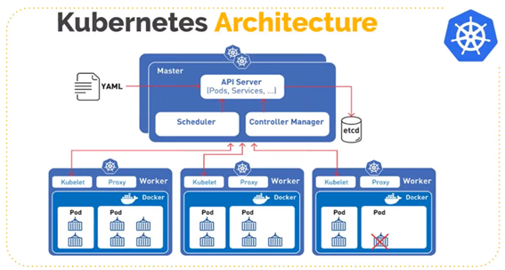
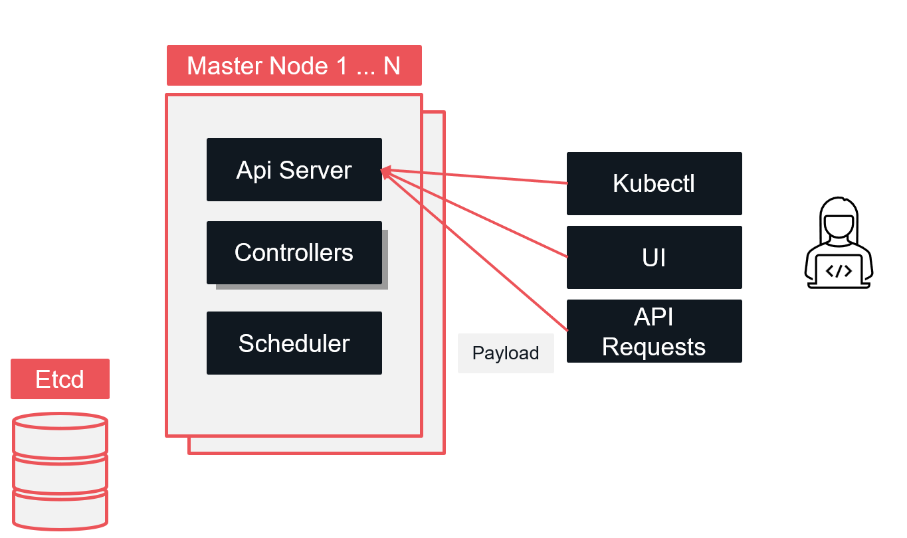
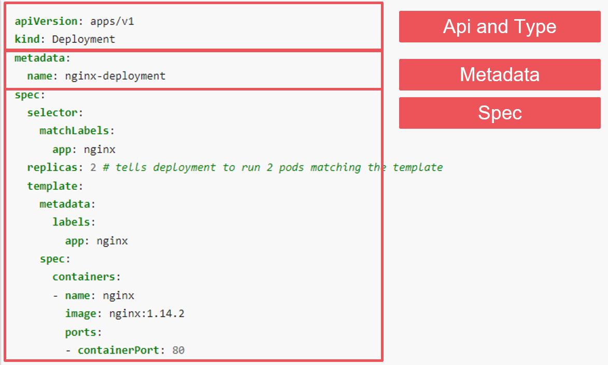
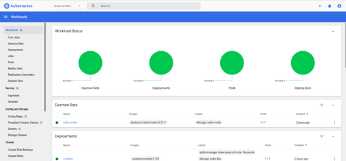
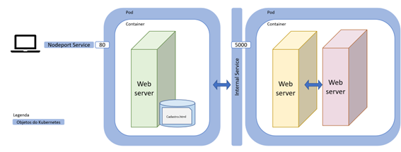

# 5.3 Orquestração com Kubernetes

Na seção anterior pudemos entender as complexidades de gerenciar aplicações multi-containers e como o uso do Docker Compose facilita a orquestração dessas aplicações.

Porém, no mundo corporativo, temos empresas que necessitam atender demandas cada vez maiores, com alta disponibilidade e com a disponibilização de novas funcionalidades de forma cada vez mais ágil. Para atender esse cenário, uma infraestrutura composta por múltiplos servidores que é utilizada por várias equipes que produzem aplicações cloud native se torna necessária.

Nesse contexto, o Kubernetes é uma ferramenta que veio para simplificar e resolver diversos problemas:

* Como dar maior **escala** para as aplicações com ajuste automático de cargas e escalabilidade horizontal?
* Como melhorar a **produtividade** do desenvolvedor com abstração da operação e infraestrutura?
* Como garantir alta **disponibilidade** entre deployments da aplicação e com self-healing?


Esse cenário é um dos principais motivadores do uso de ferramentas de orquestração mais completas e eficientes como o Kubernetes. O Kubernetes é um sistema de automação de deployments e gerenciamento de aplicações de larga escala e alta complexidade composta por containers (Luksa, M. (2018). Kubernetes in action. Manning.).

***

## 5.3.1 A história do Kubernetes

O projeto do Kubernetes foi iniciado pelo Google que reporta o uso de containers **desde 2004** e em 2014 tinha a execução de **2 bilhões de containers por semana** conforme apresentação na [Gluecon 2014](https://www.infoq.com/news/2014/06/everything-google-containers/).

Dado esse cenário de uso massivo de containers em aplicações produtivas, o Google já investia em pesquisa e desenvolvimento de soluções internas de orquestração. Primeiramente, contava com o sistema [Borg](https://research.google/pubs/pub43438/) e na sequência evoluiu para outra solução interna denominada [Omega](https://research.google/pubs/pub41684/).

Aproveitando todo o conhecimento interno desenvolvido ao longo de muitos anos, o projeto do Kubernetes foi anunciado como open source em 2014. O contexto de lançamento da plataforma envolvia também a grande adoção e disputa dos serviços de nuvem pública. Em [entrevista com o product manager do Google Martin Buhr](https://www.infoworld.com/article/3118345/why-kubernetes-is-winning-the-container-war.html), foi mencionada a estratégia do produto de tornar a API do **Kubernetes em um padrão do mercado** para orquestração de containers devido a facilidade do uso, fazendo com que o Google se posicionasse como especialista no assunto para dar maior popularidade ao seu próprio serviço de nuvem pública. Tendo um padrão de mercado para workloads containerizados, também haveria uma **facilidade de migração** dessas aplicações entre datacenters on premises e os diversos serviços de nuvem, facilitando assim a adoção dos serviços da Google Cloud Platform (GCP).



***

## 5.3.2 Objetos do Kubernetes

Objetos são entidades persistidas dentro do sistema do Kubernetes. Basicamente, eles descrevem como deveria se comportar todos os componentes orquestrados pelo cluster.

Para entendermos melhor esse conceito, podemos começar com dois objetos básicos:

* `Pod`: é um grupo de um ou mais containers e consistem na menor unidade de gerenciamento do Kubernetes
* `Service`: Uma forma de expor as aplicações rodando em pods.

Nesse contexto, quando executamos um container de nginx e expomos essa aplicação para conexões externas, estamos definindo dois objetos dentro de um cluster kubernetes. Um `pod` que especifica como esse container deve ser executado e um `service` que especifica como esse container será exposto e acessado.




Apesar do objeto `pod` ser uma camada que especifica os containers, dentro do Kubernetes os pods são gerenciados por outros objetos que controlam os *workloads* dentro do cluster. Abaixo alguns exemplos:

* `Deployment`: Determina o estado de pods e replicasets, permitindo rollback, scale up e outras funcionalidades
* `Job` e `Cronjob`: Definem tarefas que possuem um tempo para serem finalizadas. Tarefas que são executadas apenas uma vez são definidas por job. Já os cronjobs, definem tarefas recorrentes.

Outros exemplos de workload são encontrados na [documentação oficial](https://kubernetes.io/docs/concepts/workloads/).

Outro objeto que utilizaremos na nossa demonstração é o `Namespace` que serve como um mecanismo de isolamento e organização de outros objetos dentro de um mesmo cluster.

Além dos objetos citados, o Kubernetes conta com várias outras definições que, apesar de não ser o escopo do curso, podem ser estudados com mais detalhes:



_Fonte:_ [_jayendrapatil.com_](https://jayendrapatil.com/kubernetes-components/)

***
## 5.3.3 Arquitetura do Kubernetes

Para entender melhor as capacidades do Kubernetes, precisamos conhecer os seus componentes e como a plataforma gerencia a sua infraestrutura. Aproveitando o contexto do curso na utilização do Docker Compose, a imagem abaixo ilustra um comparativo entre as ferramentas e apresenta os dois papéis que um servidor pode exercer dentro de um cluster Kubernetes: `master node` ou `worker node`.



_Fonte:_ [_Serverside_](https://www.theserverside.com/blog/Coffee-Talk-Java-News-Stories-and-Opinions/What-is-Kubernetes-vs-Docker-Compose-How-these-DevOps-tools-compare)


O primeiro ponto a ser observado é que o Kubernetes administra um **cluster de servidores**. Essa característica facilita a implementação de vários benefícios dentro de um sistema containerizado como a escalabilidade horizontal e alta disponibilidade.




_Fonte:_ [_c-sharpcorner_](https://www.c-sharpcorner.com/article/getting-started-with-kubernetes-part2/)

Os servidores com papel de master executam as funções de controle e gerenciamento do cluster. Basicamente, eles possuem 4 componentes:

* `API Server`:
  * Responsável por servir a API do control plane. É por meio dessa API que todas as requisições para o controle do cluster são gerenciadas.
* `Etcd`:
  * Responsável pela persistência de todos os objetos do cluster
* `Scheduler`:
  * Responsável pela alocação de todos os pods dentro dos worker nodes.
* `Controller Manager`:
  * Aplicações responsáveis por gerenciar todo o ciclo de vida dos objetos Kubernetes.

Já os worker nodes são os servidores responsáveis por de fato executar as aplicações. Possuem os seguintes componentes:

* `Kubelet`:
  * Agente executado em cada worker responsável por garantir a execução o estado solicitado de cada container
* `Kube-proxy`:
  * Proxy de rede responsável por todas as regras e comunicação entre os pods.
* `Container Runtime`:
  * Engine responsável por executar os containers.


***

## 5.3.4 Formas de interação e fluxo de funcionamento

Entendidos os principais conceitos de arquitetura e objetos do Kubernetes, podemos analisar tudo junto e entender como ocorrem as interações com a ferramenta.

Dado que dentro dos master nodes o `api-server` é a peça responsável por receber os pedidos de **criação, atualização e deleção** dos objetos, é importante entender as principais formas de interação:

* `kubectl`: Esse é o utilitário de linha de comando do Kubernetes e possibilita a interação com a ferramenta por meio do terminal.
* `Interface Web`: O Kubernetes conta com uma UI que possibilita o monitoramento e execução de comandos de forma visual.
* `API Rest`: Também é possível interagir com o cluster por meio de clients da API em diversas linguagens.



Na interação com o cluster, enviamos um payload que pode ser especificado em **yaml** ou **json** que contém a definição dos resources que queremos modificar no cluster. A especificação contém alguns blocos de informação:

* `API e Type`: Especifica com qual api estamos interagindo e qual resource estamos definindo
* `Metadata`: Determina informações de metadados como nome do objeto, namespace, labels etc.
* `Spec`: Contém a especificação do objeto e varia de acordo com o tipo de resource que estamos trabalhando.
* `Status`: Contém o estado atual do objeto. É dessa forma que o Kubernetes persiste as informações e compara o estado declarado com o estado atual para determinar as ações necessárias dentro do cluster.



Por fim, com base nos conceitos de interação, arquitetura e objetos, é possível compreender o ciclo de vida dos objetos dentro do sistema do Kubernetes e que ações geralmente são executadas durante a criação de um resource:

1. O desenvolvedor submete um manifesto (yaml/json) para a api do Kubernetes
2. Os objetos especificados nos manifestos são persistidos no Etcd
3. Os controllers monitoram o estado desejado dos objetos especificados e se comunica novamente com o API server
4. O scheduler avalia os servidores do cluster e decide onde os novos pods irão ser executados.
5. O kubelet percebe que o seu servidor foi designado para executar uma tarefa
6. Se serviços foram especificados, o kube-proxy implementa as regras de comunicação
7. Os controllers e o kubelet continuam monitorando os estados dos objetos constantemente.

***

## 5.3.5 Instalando uma distribuição de Kubernetes Localmente

Para colocar os conceitos estudas em prática, vamos executar um primeiro exemplo de aplicação implantada no Kubernetes. Para isso, precisamos de uma versão local da ferramenta para testes e desenvolvimento. Abaixo temos algumas das principais distribuições Kubernetes para desenvolvimento:

* [minikube](https://minikube.sigs.k8s.io/docs/)
* [Microk8s](https://microk8s.io/)
* [kind](https://kind.sigs.k8s.io/)
* [Kubernetes com Docker Desktop](https://docs.docker.com/desktop/kubernetes/) 


Nessa aula utilizaremos a distribuição do Microk8s devido a boa integração que a ferramenta possui com o Ubuntu. Todo o tutorial de instalação atualizado pode ser encontrado na [página do produto](https://microk8s.io/#install-microk8s). Abaixo temos o passo a passo para instalação:

Instalando o Microk8s:

```bash
sudo snap install microk8s --classic
```

Conseguindo acesso ao grupo da aplicação:

```bash
sudo usermod -a -G microk8s SEU_USUARIO
sudo chown -f -R SEU_USUARIO ~/.kube
newgrp microk8s
```

Na sequência, validamos se temos a disponibilidade da aplicação:

```bash
microk8s status --wait-ready
```

Após o start da aplicação, iremos habilitar alguns plugins básicos:

```bash
microk8s enable dashboard dns registry
```

Por fim, podemos ver as instruções de acesso a aplicação pelo comando abaixo:

```bash
microk8s dashboard-proxy
```



A instalação do microk8s já é o suficiente para termos um ambiente de testes Kubernetes local. Caso seja necessário acessar outros cluster remotos, podemos instalar o utilitário de linha de comando do Kubernetes: `kubectl` ([Tutorial de instalação](https://kubernetes.io/docs/tasks/tools/install-kubectl-linux/)). Também podemos [configurar](https://microk8s.io/docs/working-with-kubectl) o acesso ao Microk8s via linha de comando.

***

## 5.3.6 Executando uma aplicação Hello World

Para os primeiros passos na plataforma, iremos utilizar uma aplicação web exposta pela porta 8080 que simplesmente exibe algumas informações do servidor no qual ela está hospedada.

Inicialmente vamos criar um namespace para organizar todos os workloads desse exemplo:

```bash
kubectl create ns hello-world
```

Para indicarmos que todos os próximos comandos serão executados no namespace criado, atualizamos o contexto de trabalho:

```bash
kubectl config set-context --current --namespace=hello-world
```

Na sequência, iremos criar o nosso primeiro deployment:

```bash
kubectl create deployment hello --image=k8s.gcr.io/echoserver:1.4
```

Podemos verificar o status do deployment da nossa aplicação via dashboard ou pelo seguinte comando:

```bash
kubectl get deployments
```

Uma vez que nossa aplicação estiver pronta, temos que expô-la para acesso externo:

```bash
kubectl expose deployment hello --type=NodePort --port 8080
```

Por fim, basta verificar em qual porta nossa aplicação está disponível e acessá-la pelo navegador:

```bash
kubectl get svc
```

***

## 5.3.7 Orquestrando o classificador de produtos com Kubernetes

Para demonstrar como funciona o padrão declarativo dos manifestos do Kubernetes, iremos adaptar o exemplo da aplicação de classificação de produtos com 2 containers vista na seção 3.2.



O primeiro passo é reconstruir as imagens do web server nginx e da API de classificação de produtos. Para isso, utilizaremos o diretório `aplicativos/http-api-classificacao-produtos-k8s` contido no repositório desse livro. Esse repositório contém as modificações necessárias para executarmos o nosso exemplo em cluster Kubernetes.

A partir do diretório mencionado, realize o build das duas imagens necessárias para o nosso exemplo. Atenção para as tags utilizadas durante o build.

```bash
docker build -f Dockerfile-wsgi -t wsgi-app -t localhost:32000/wsgi-app .
docker build -f Dockerfile-nginx -t custom-nginx -t localhost:32000/custom-nginx:latest .
```

Após realizado o build, iremos publicar as imagens em um registry privado local que está sendo servido na porta 32000 via Microk8s. Caso ainda não tenha o registry habilitado, realize o setup via comando abaixo:

```bash
microk8s enable registry
```

Utilize o comando de push do Docker para publicar as imagens:

```bash
docker push localhost:32000/custom-nginx:latest
docker push localhost:32000/wsgi-app
```

Inicialmente a aplicação trazia dois containers separados que se comunicavam entre si por meio de uma rede virtual do Docker. No exemplo orquestrado pelo Kubernetes, iremos utilizar cada container definido dentro de um `POD`. Cada pod será definido dentro de um objeto de `deployment`.

Para viabilizar a comunicação entre o frontend e backend, será utilizado um objeto de `service` para expor o pod da API Python dentro da rede virtual do Cluster. Por último, será utilizado um outro service para expor o frontend para comunicação externa ao cluster.

```yaml
apiVersion: apps/v1
kind: Deployment
metadata:
  name: custom-nginx
  labels:
    app: nginx

spec:
  replicas: 1
  selector:
    matchLabels:
      app: nginx
  template:
    metadata:
      labels:
        app: nginx
    spec:
      containers:
      - name: nginx
        image: localhost:32000/custom-nginx:latest
        ports:
        - containerPort: 80

---

apiVersion: apps/v1
kind: Deployment
metadata:
  name: wsgi-app-container
  labels:
    app: api
spec:
  replicas: 1
  selector:
    matchLabels:
      app: api
  template:
    metadata:
      labels:
        app: api
    spec:
      containers:
      - name: api
        image: localhost:32000/wsgi-app:latest
        ports:
        - containerPort: 5000

---

apiVersion: v1
kind: Service
metadata:
  name: wsgi-app-container
spec:
  selector:
    app: api
  ports:
    - protocol: TCP
      port: 5000
      targetPort: 5000

---

apiVersion: v1
kind: Service
metadata:
  name: custom-nginx-svc
spec:
  type: NodePort
  selector:
    app: nginx
  ports:
    - port: 80
      targetPort: 80
      nodePort: 32767
```

Para criar todos os resources especificados no yaml acima:

```
kubectl create -f k8s-manifests/classificador.yaml
```

Agora, basta acessar a aplicação no servidor local via porta 32767: http://127.0.0.1:32767/cadastro.html.

Para deletar todos os objetos criados:

```
kubectl delete -f k8s-manifests/classificador.yaml
```

Para demonstrar como o Kubernetes nos ajuda a lidar com uma maior demanda de requisições na API de produtos, vamos modificar o deployment da API Python no nosso arquivo yaml:

```diff
apiVersion: apps/v1
kind: Deployment
metadata:
  name: wsgi-app-container
  labels:
    app: api
spec:
- replicas: 1
+ replicas: 3
  selector:
    matchLabels:
      app: api
  template:
    metadata:
      labels:
        app: api
    spec:
      containers:
      - name: api
        image: localhost:32000/wsgi-app:latest
        ports:
        - containerPort: 5000
```

Essas alterações estão disponíveis no arquivo yaml `k8s-manifests/classificador-scale.yaml`.

Com apenas uma alteração possibilitamos a escalabilidade horizontal de forma independente para uma das aplicações que estamos orquestrando.

Para aplicar as alterações podemos executar o comando de apply:

```bash
kubectl apply -f k8s-manifests/classificador-scale.yaml
```

Se acessarmos o dashboard do nosso cluster Kubernetes, é possível observar que a aplicação wsgi possui 3 pods em funcionamento.

Por fim, nosso próximo exemplo demonstra como o Kubernetes facilita deploy de aplicações sem downtime e como realizar rollbacks.

Vamos provocar uma falha na nova versão da nossa aplicação alterando a imagem utilizada pelo frontend para uma imagem não existente. Essa alteração está disponível no arquivo `k8s-manifests/classificador-wrong-tag.yaml`.

```diff
apiVersion: apps/v1
kind: Deployment
metadata:
  name: custom-nginx
  labels:
    app: nginx

spec:
  replicas: 1
  selector:
    matchLabels:
      app: nginx
  template:
    metadata:
      labels:
        app: nginx
    spec:
      containers:
      - name: nginx
-       image: localhost:32000/custom-nginx:latest
+       image: localhost:32000/custom-nginx:naoexiste
        ports:
        - containerPort: 80
```

Agora, realizaremos o deployment de uma nova versão por meio do comando de apply:

```bash
kubectl apply -f k8s-manifests/classificador-wrong-tag.yaml
```

Se inspecionarmos o status da nossa aplicação no dashboard do Kubernetes, veremos que um novo pod foi lançando com a nova versão de imagem. Esse novo pod encontra-se em falha pois especificamos uma imagem inexistente.

Apesar disso, podemos conferir na [url de cadastro](http://127.0.0.1:32767/cadastro.html) da aplicação que ela ainda está totalmente funcional. Isso acontece devido a estratégia de deploy do Kubernetes que lança os pods da nova versão sem deletar os pods antigos. Os pods da versão mais antiga só são excluídos e o tráfego só é redirecionado para a nova versão se os pods da última versão se reportarem como saudáveis.

Além de possibilitar o deploy sem indisponibilizar a aplicação, o Kubernetes facilita o rollback para a nossa última versão estável. Podemos listar o histórico de deployments da nossa aplicação:

```bash
kubectl rollout history deployment custom-nginx
```

Na sequência, podemos escolher uma versão estável como ponto de rollback.

```bash
kubectl rollout undo deployment custom-nginx --to-revision=1
```

Após o rollback, nossa aplicação estará estável novamente e sem pendências de alterações.

Para limpar o ambiente novamente, basta realizarmos a deleção dos objetos declarados no nosso arquivo de deployment:

```bash
kubectl delete -f k8s-manifests/classificador.yaml
```

***

## 5.3.8 Próximos passos

Esses exemplos ajudam a nos familiarizamos com alguns conceitos básicos de orquestração com o Kubernetes, mas a plataforma oferece ainda mais possibilidades em termos de gerenciamento de configuração, storage, secrets, workloads batch e outros.

Para se aprofundar ainda mais no tema, podemos seguir a [documentação oficial](https://kubernetes.io/docs/home/).
