# 6.4 Branch e merge

Uma coisa que o GitLab (e outros sistemas baseados em git) fazem é controlar e rastrear as alterações que são feitas nos arquivos de um repositório. Por exemplo, suponha que você precise alterar a versão do Flask, pois detectou que uma nova funcionalidade deve ser introduzida no projeto. Para isto, basta alterar o arquivo `requirements.txt`:

```diff
-Flask==2.0.2
+Flask==2.1.1 # Precisa da versão 2.1.1 para unittest
scikit-learn==1.0.2
gunicorn==20.1.0
```

Uma vez que o arquivo está salvo, a mudança já passa a ser detectada pelo git. Execute o comando `git status`, e veja como o arquivo `requirements.txt` aparece como modificado:

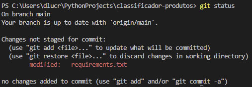

Para enviar essa modificação ao repositório, primeiro precisamos confirmar que desejamos que essa alteração entre no próximo _commit_ (confirmação de mudança). Execute:

```
git add .\requirements.txt
```

O comando `git add` marca um arquivo como adicionado ou alterado. Similarmente, o `git remove` marca um arquivo como removido.

Ao executar `git status` novamente, a mudança aparece. Após revisar, para confirmar, execute:

```
git commit -m "Atualizando versão do Flask para 2.1.1"
```

É recomendável definir uma mensagem que descreve a mudança. No git (e em outros VCS) é importante documentar sempre, e descrever todas as alterações, por menores que sejam. Assim, o rastreamento proporcionado pelo sistema pode se converter em informações valiosas para o futuro.

Ao invés de marcar as alterações individualmente e somente após isso confirmar, é possível pedir ao git que detecte as mudanças e automaticamente marque tudo para envio. Isso pode ser feito adicionando o parâmetro "a" no comando `git commit`:

```
git commit -am "Mensagem"
```

Porém, isso não funciona para arquivos novos, que precisam ser manualmente reportados pelo `git add`.

O _commit_ não significa que as mudanças já foram enviadas para o repositório no GitLab. O git é um sistema distribuído, feito para que haja múltiplas cópias em múltiplas máquinas. Assim, até o momento, a máquina local contém a mudança, confirmada. Mas o servidor do GitLab ainda não recebeu essa nova versão (acesse lá e veja). Para sincronizar as versões, é necessário executar um comando `push`:

```
git push
```

Agora sim, ao acessar o GitLab, você verá que o arquivo foi alterado. Também aparece, logo na página inicial, que houve um _commit_:

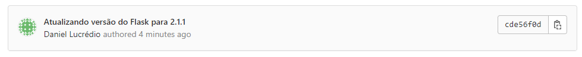

E clicando sobre a mensagem, é possível ver os detalhes deste _commit_ (todos arquivos alterados, onde foi feita alteração, etc.):

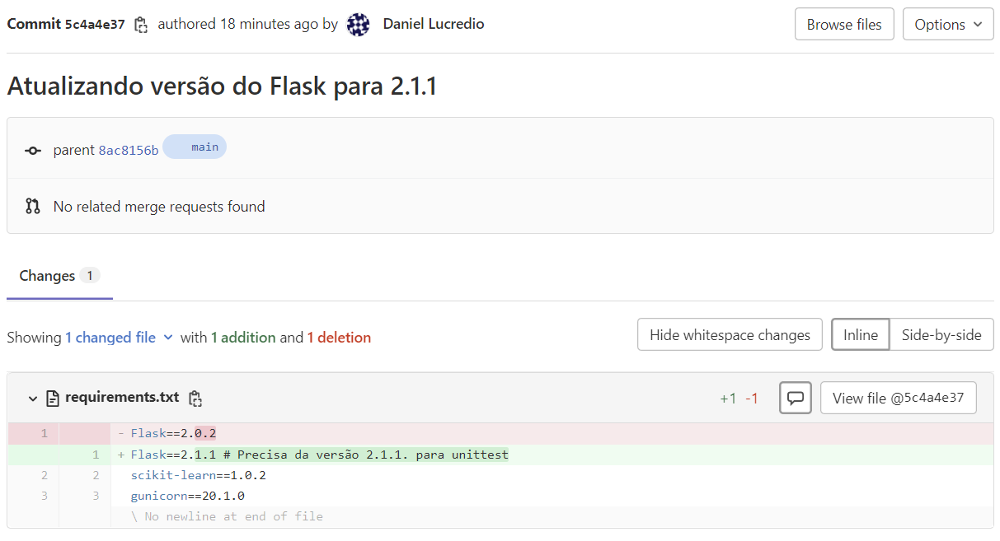

Claro, existem inúmeras complicações que podem ocorrer. Múltiplas pessoas podem tentar alterar o mesmo arquivo ao mesmo tempo, causando conflitos. Isso requer uma análise individual para manter os artefatos consistentes. Mas não entraremos nesses detalhes aqui.

O ponto principal é: essa alteração foi simples, não foi? Mas em projetos maiores, a quantidade de arquivos alterados em cada _commit_ pode ser enorme. Além disso, pode levar um longo tempo entre o início de uma alteração e a sua confirmação. No exemplo, ainda seria necessário testar a nova versão do Flask, atualizar o código, verificar que está tudo funcionando, entre outras tarefas. Imagine que essa mudança leve, por exemplo, uma semana do seu trabalho. Durante essa semana, você alterou vários arquivos, trocou conteúdo diversas vezes, experimentou, criou, apagou, e fez várias mudanças. Veja só em que conflito isso pode chegar.

De um lado, idealmente, toda e qualquer pequena alteração deve ser enviada ao VCS, ainda que seja um pequeno trecho de um arquivo. Além de permitir uma melhor rastreabilidade, isso garante que haja mais pontos de restauração, caso você decida voltar atrás. Imagine que você ficou três dias trabalhando, modificou 60 arquivos diferentes. Aí, no meio do caminho, você percebe que 30 desses arquivos não deveriam ter sido alterados (errar é humano, não se culpe!). Se você tiver registrado essas alterações aos poucos, poderia restaurar o estado do seu código, revertendo até uma versão de onde pode retomar seu trabalho e seguir novamente em frente. Mas se você não registrou nenhuma alteração, precisará voltar do início e refazer muito do que já fez.

Do outro lado, existe o problema de potenciais conflitos. Sempre que mais do que uma pessoa trabalha em um mesmo conjunto de arquivos, há a possibilidade de duas pessoas alterarem o mesmo arquivo no mesmo tempo. Se você estiver trabalhando em um projeto sozinho, tudo bem. Mas e se estiver trabalhando em equipe? E se tiverem outras pessoas trabalhando em outras mudanças, nos mesmos arquivos? E se ambos estiverem em tarefas longas de atualização? A quantidade de conflitos decorrentes de alterações simultâneas será enorme e potencialmente catastrófica. Portanto, neste caso ficar fazendo _commits_ a todo momento é ruim.

Como resolver esse dilema? Fazer _commits_ a todo momento? Ou deixar para fazer _commits_ somente no final de uma tarefa? Nenhuma opção é a ideal.

Uma solução aceitável e que fica no meio-termo é a seguinte: sempre que for trabalhar em uma alteração, crie uma cópia do repositório, e trabalhe nesta cópia. Esta cópia é exclusivamente sua, portanto pode fazer _commits_ à vontade, quantos quiser. Assim que estiver satisfeito, faça o _merge_ (junção) dessa cópia com o repositório original. Caso haja várias pessoas trabalhando juntas, vai haver conflitos provavelmente. Mas terá muito menos do que se as mudanças fossem feitas na mesma cópia. Além disso, os conflitos aparecem somente no momento do _merge_, portanto é possível que a equipe se planeje para resolver os conflitos uma única vez, ao invés de a todo momento.

No exemplo até o momento, estivemos trabalhando na mesma cópia, chamada de "main". No git, cada cópia é chamada de "branch" (ramo ou galho), pois é como se a história de evolução do software se ramificasse em um determinado momento. Na página inicial do projeto, no GitLab, é possível ver que temos apenas um "branch", e que os dois _commits_ foram feitos nele:

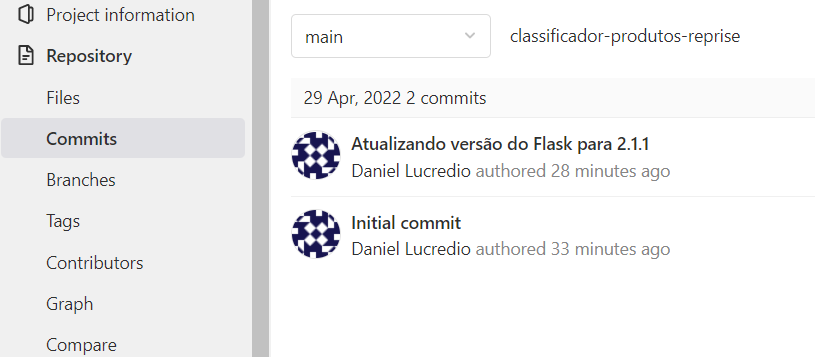

## 6.4.1 Reportando e resolvendo problemas

Problemas e melhorias aparecem a todo momento em um projeto de software. Seja a descoberta de um bug, ou a percepção de algo deve ser melhorado, ideias podem ser propostas por qualquer envolvido no projeto, desde usuários até desenvolvedores.

Por exemplo, o leitor mais preocupado pode ter percebido que, neste projeto, não incorporamos qualquer tipo de teste automatizado no nosso aplicativo. Seria ideal que tivéssemos isso implementado, não? Como fazemos para avisar aos desenvolvedores que isso é algo que requer atenção?

No GitLab (e em outros sistemas parecidos), há um sistema de questões a serem resolvidas. São normalmente chamadas de _issues_, um termo em inglês que denota que há algo a ser investigado, analisado, e que pode ser um problema. Vamos criar um novo _issue_ para nosso projeto.

Acesse o menu, no GitLab, indicado com _Issues_, e clique em "New Issue". Dê um título, como "Testes unitários são necessários", e descreva a questão como achar melhor. Quando estiver pronto, clique em "Create issue".

O novo _issue_ aparecerá na lista, e permanecerá aberto até que alguém o resolva. Ele também recebe uma numeração sequencial, neste caso é o número 1 (pois é o primeiro).

Vamos criar outro? Não seria bom se nosso aplicativo tivesse uma página inicial? Lembre-se, hoje ele somente possui uma página chamada `cadastro.html`. Faça isso, use título e descrição como achar melhor.

Temos agora dois _issues_ esperando para serem resolvidos. Vamos a seguir fazer isso conforme as boas práticas do controle de versões usando git.

## 6.4.2 Adicionando testes unitários

O que precisamos fazer, sempre que há um novo _issue_, é:

1. Criar um _branch_ para trabalhar nesse _issue_
2. Obter uma cópia deste _branch_ na máquina local
3. Resolver o problema, adicionar a nova função, ou o que quer que tenha sido reportado. Isso envolve também testar e garantir que está funcionando, pelo menos localmente
4. Enviar as alterações para o repositório
5. Fazer o _merge_ do _branch_ de volta ao conteúdo principal
6. Apagar o _branch_

### Criar um novo branch

A forma mais simples de começar esse processo, usando o GitLab, é pela página de _issues_. É possível criar _branches_ usando a linha de comando, mas pela página há algumas facilidades. Acesse o _issue_ dos testes unitários, encontre o botão que diz "Create merge request", clique-o, mas altere-o para "Create branch", e confirme:

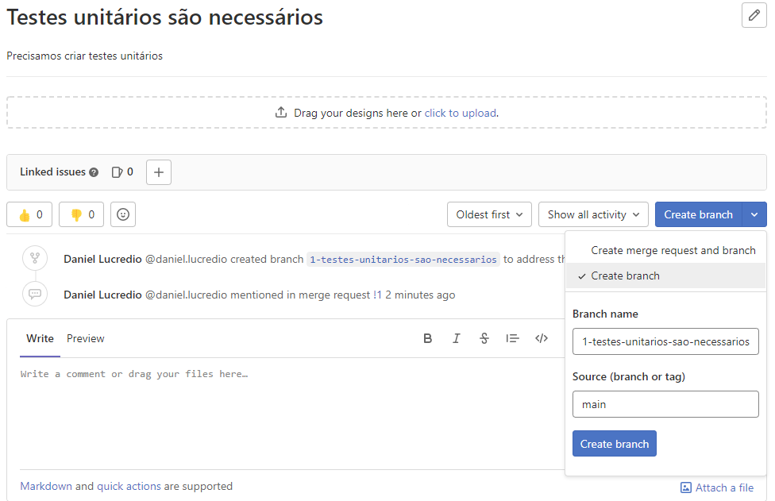

Ao fazer isso, um novo _branch_ será criado, e irá aparecer na lista de _branches_ do projeto:

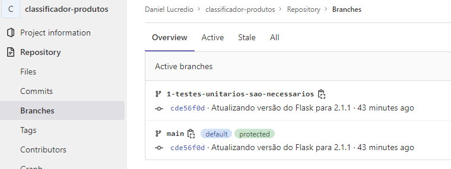

Se tivéssemos escolhido a opção "Create merge request and branch", o GitLab teria criado o _branch_ e também já deixaria criado o _merge request_, que é algo que teremos que fazer mais para a frente. Mas aqui, como estamos ensinando o passo-a-passo, vamos fazer uma coisa de cada vez. Você provavelmente irá, na maior parte do tempo, usar a opção que já cria as duas coisas de uma única vez.

Como comentado anteriormente, seria possível fazer isso via linha de comando. Mas assim, o GitLab já adianta algumas coisas:

1. Ele já dá um nome automaticamente para o branch, associando-o ao título do _issue_ que o originou
2. O _branch_ fica vinculado ao _issue_, de forma que quando você acessa o _issue_, é possível ver o _branch_ associado, o que facilita o controle.

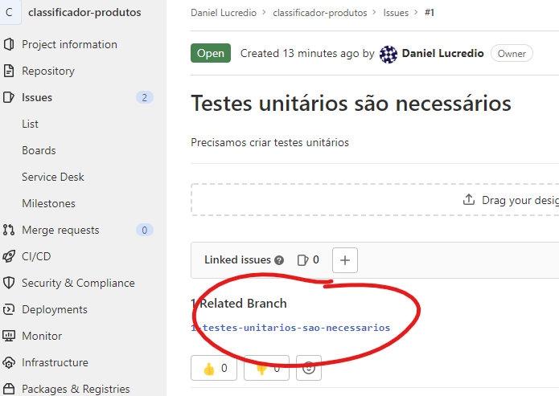

### Obter uma cópia do branch para trabalhar localmente

Já estamos prontos para trabalhar nesse _issue_. Para isso, precisamos obter uma cópia deste recém-criado _branch_, afinal queremos trabalhar em nossa própria cópia do repositório, evitar conflitos, correto? Para fazer isso, precisamos sincronizar nossa pasta local com o GitLab. Afinal, criamos o _branch_ pela página, portanto a mudança ainda não aparece localmente. Para isso, execute:

```
git pull
```

Veja como o nosso novo _branch_ foi detectado na saída do comando:

```
PS C:\Users\dlucr\PythonProjects\classificador-produtos> git pull
From https://gitlab.com/daniel.lucredio/classificador-produtos
 * [new branch]      1-testes-unitarios-sao-necessarios -> origin/1-testes-unitarios-sao-necessarios
Already up to date.
```

Agora podemos mudar para esse _branch_ com o comando:

```
git switch 1-testes-unitarios-sao-necessarios
```

Pronto, a partir de agora, todas as mudanças que forem feitas serão adicionadas a esse _branch_, mantendo o original (chamado _main_) intacto até que façamos um _merge_.

### Resolver o problema

Agora vamos resolver o problema, ou seja, vamos criar um conjunto de casos de testes para nossa API. Existem várias formas de fazer isso, mas seguiremos de um jeito simples. Crie um novo arquivo no projeto, chamado `test_api.py`:

```python
import unittest
from app import app
import json

class TestAPI(unittest.TestCase):
    def setUp(self) -> None:
        self.app_client = app.test_client()

    def test_brinquedo(self):
        response = self.app_client.post('/predizer_categoria',
                            json={'descricao':'soldadinhos de plástico'})
        cat = json.loads(response.data.decode('utf-8')).get("categoria")
        assert cat == 'brinquedo'

    def test_maquiagem(self):
        response = self.app_client.post('/predizer_categoria',
                            json={'descricao':'batom vermelho'})
        cat = json.loads(response.data.decode('utf-8')).get("categoria")
        assert cat == 'maquiagem'

    def test_game(self):
        response = self.app_client.post('/predizer_categoria',
                            json={'descricao':'dark souls'})
        cat = json.loads(response.data.decode('utf-8')).get("categoria")
        assert cat == 'game'

    def test_livro(self):
        response = self.app_client.post('/predizer_categoria',
                            json={'descricao':'O senhor dos anéis'})
        cat = json.loads(response.data.decode('utf-8')).get("categoria")
        assert cat == 'livro'
```

Esse código faz uso do pacote padrão do Python para testes, chamado `unittest`. Criamos quatro casos de teste, um para cada categoria de produtos do nosso modelo. Para rodar, basta executar:

```
pip install -r requirements.txt
python -m unittest
```

A instalação foi necessária pois atualizamos a versão do Flask, para funcionar com esse código que foi construído.

Tudo deve funcionar corretamente, e devemos ver os casos de teste bem-sucedidos.

```
----------------------------------------------------------------------
Ran 4 tests in 0.010s

OK
```

### Enviar as alterações para o repositório

Satisfeitos com as mudanças, vamos portanto confirmá-las. Lembrando que agora estamos trabalhando no _branch_ criado especificamente para esse _issue_, execute:

```
git add .
git commit -m "Adicionando um caso de teste para cada categoria de produto"
git push
```

Estamos prontos para fazer o _merge_ deste _branch_ de volta. Porém... algo aconteceu!

## 6.4.3 Adicionando página principal

Enquanto um desenvolvedor especialista em testes trabalhava nos casos de teste, outro desenvolvedor, especialista em _front-end_, resolveu atacar o _issue_ da página principal. Assim como no exemplo anterior, ele criou um _branch_ para o _issue_ número 2. Vamos simular essa situação?

Primeiro vá ao GitLab e crie um _branch_ para o _issue_ número 2, como fizemos anteriormente.

Agora, na sua máquina, crie uma nova pasta, completamente separada da que estamos trabalhando até agora (é como se fosse uma pasta na máquina de outra pessoa). Execute o comando para obter uma nova cópia do repositório (substitua pelo seu usuário/projeto/branch):

```
git clone https://gitlab.com/daniel.lucredio/classificador-produtos.git
cd classificador-produtos
git switch 2-falta-uma-pagina-inicial
```

Não se esqueça de criar/ativar um ambiente virtual, e instalar os requirements.

A primeira coisa que podemos reparar é que nessa nova pasta não existe o arquivo `test_api.py`, pois o mesmo não existe no _branch_ em questão. Porém, o arquivo existe e foi salvo. Experimente rodar `git switch` para o outro _branch_ e você verá o arquivo aparecer. Não esqueça de retornar ao _branch_ do _issue_ número 2.

Neste momento, é importante ressaltar que você precisa, a todo momento, certificar-se de que está trabalhando no _branch_ correto. Use o comando `git status` para conferir. Além disso, a maioria dos editores com suporte a git tem algum tipo de apoio visual. No Visual Studio Code, por exemplo, o _branch_ ativo aparece na janela principal:

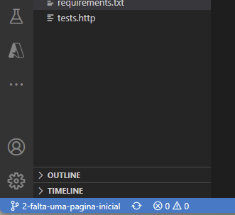

Então vamos resolver o problema. Era uma página inicial que faltava, certo? Basta criar um novo arquivo, chamado `index.html`, dentro de `webclient`, junto com `cadastro.html`:

```html
<!DOCTYPE html>
<html>

<head>
    <!--Import Google Icon Font-->
    <link href="https://fonts.googleapis.com/icon?family=Material+Icons" rel="stylesheet">
    <!-- Compiled and minified CSS -->
    <link rel="stylesheet" href="https://cdnjs.cloudflare.com/ajax/libs/materialize/1.0.0/css/materialize.min.css">

    <!--Let browser know website is optimized for mobile-->
    <meta name="viewport" content="width=device-width, initial-scale=1.0" />
    <meta charset="UTF-8">
</head>

<body>
    <nav>
        <div class="nav-wrapper">
            <a href="#" class="brand-logo">Meu e-commerce</a>
            <ul id="nav-mobile" class="right hide-on-med-and-down">
                <li><a href="#">Olá, Vendedor</a></li>
                <li><a href="#"><i class="material-icons">exit_to_app</i></a></li>
            </ul>
        </div>
    </nav>

    <div class="container">
        <div class="section no-pad-bot" id="index-banner">
            <div class="container">
                <br><br>
                <h3 class="header center">E-commerce</h3>
                <br><br>

            </div>
        </div>

        <div class="container">
            <a class="btn waves-effect waves-light " href="cadastro.html">Cadastrar produto</a>
            <a class="btn waves-effect waves-light " href="#">Listar produtos</a>
            <a class="btn waves-effect waves-light " href="#">Sair</a>
        </div>
    </div>

</body>

</html>
```

Vamos testar. Nosso `Dockerfile` já está configurado para copiar todos os arquivos dessa pasta (confira lá!), portanto não precisamos mexer em mais nada. Basta construir a imagem e executá-la.

```
docker build -t classificador-produtos . 
docker run -d -p 80:80 --rm --name classificador-produtos-container classificador-produtos
```

> Obs: caso haja problema na execução, verifique se os arquivos estão sendo salvos com terminação de linha padrão Linux. Caso seja padrão Windows, pode ocorrer erro.

Abra o navegador e acesse: `http://localhost` e veja que funcionou. Não vamos ganhar nenhum prêmio de _web design_, mas já é o suficiente para resolver o _issue_!

Podemos então seguir com o processo, confirmando e enviando as alterações para o GitLab:

```
git add .
git commit -m "Adicionando página index.html"
git push
```

## 6.4.4 Fazendo o merge das alterações com o branch principal

Temos agora três _branches_ no repositório:

1. `main`: código utilizado para inicializar o repositório
2. `1-testes-unitarios-sao-necessarios`: cópia criada para resolver o _issue_ 1
3. `2-falta-uma-pagina-inicial`: cópia criada para resolver o _issue_ 2

Também temos uma série de 4 _commits_ no repositório. Dois deles no _branch_ main, e um em cada _branch_. É possível ver esses _commits_ no gráfico que é exibido ao clicar em "Repository" -> "Graph":

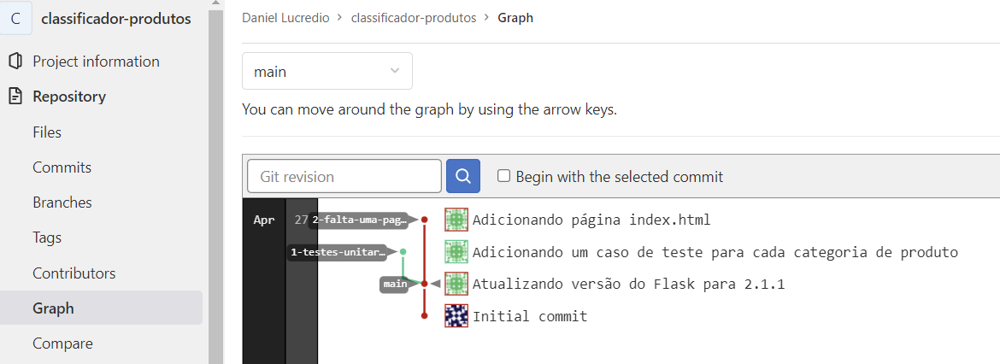

Nessa imagem, é possível ver o histórico de _commits_, e o _branch_ onde cada _commit_ ocorreu.

Vamos então fazer os _merges_ desses _branches_. Novamente, é possível fazer tudo isso em linha de comando, mas pelo GitLab as informações ficam melhor organizadas, e associadas aos _issues_ que os originaram.

Vamos começar pelo _issue_ 1. Acesse a página de _branches_, selecione o _branch_ associado ao _issue_ 1, e selecione o botão "Merge request":

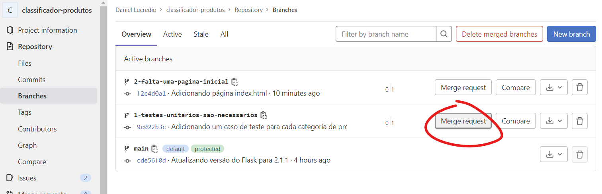

Na página que for aberta, digite um título e uma descrição, se quiser explicar algo que julgar necessário. Certifique-se que a opção "Delete source branch when merge request is accepted" está selecionada. Isso irá automaticamente apagar o _branch_ assim que o _merge_ for bem sucedido. Essa decisão é opcional, mas ajuda a manter o repositório livre de _branches_ antigos.

Faça o mesmo processo para o outro _branch_.

Assim que os "Merge requests" forem criados, ele irão aparecer na área "Merge requests" do GitLab.

Vamos agora aceitar os requests. Mas antes, é importante lembrar que estamos aqui imaginando um ambiente com múltiplos desenvolvedores. As pessoas que efetivamente implementaram as mudanças e que criaram os "merge requests" não necessariamente serão as mesmas pessoas que aceitarão as mudanças. Possivelmente há uma pessoa responsável somente por aceitar esses requests. Assim, é plausível imaginar que essa pessoa não tem o código em sua máquina. Também é plausível imaginar que ela queira revisar o que está sendo alterado antes de aceitar o request.

É possível simplesmente obter uma cópia do repositório, fazer o `git switch` para o _branch_, e revisar. Mas o GitLab tem uma interface que facilita esse processo. Vamos lá.

Entre em um dos _merge requests_ e clique no botão "Open in Web IDE":

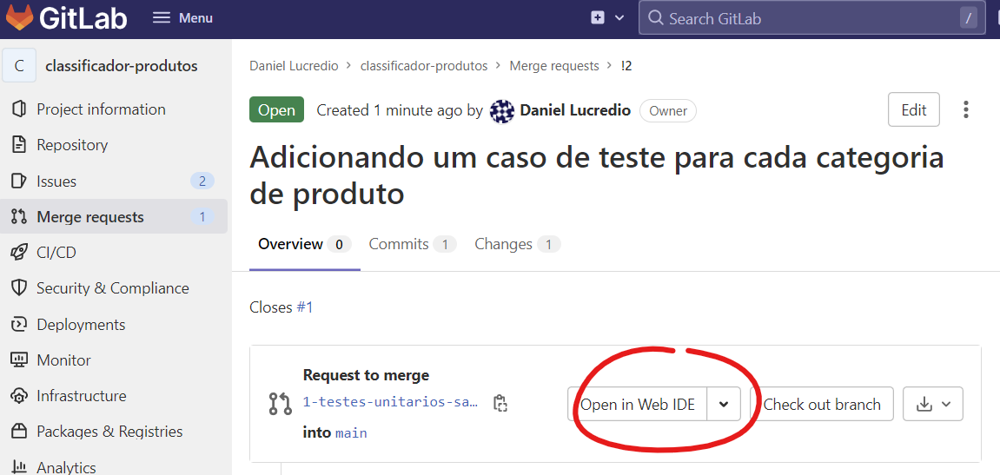

Na página que se abrir, será exibida a estrutura de arquivos, com um ícone que indica o que foi alterado, neste caso o arquivo `test_api.py`.

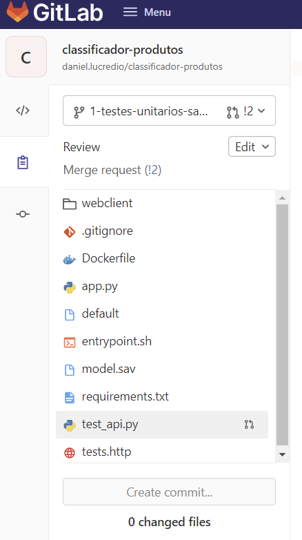

Clicando sobre o arquivo alterado, será exibida uma comparação, linha a linha, do que mudou. Neste caso, o arquivo não existia antes, então a diferença consiste em todas as linhas sendo adicionadas.

Assim que estiver satisfeito com as mudanças, volte à página anterior e clique em "Merge":

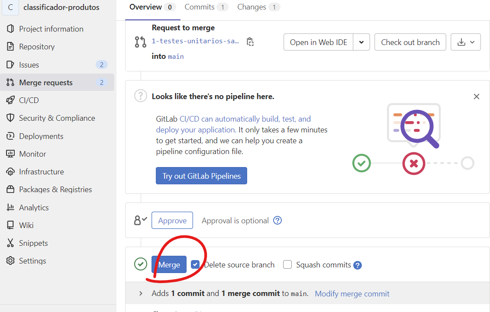

Assim que o processo for concluído, acontecerá o seguinte:

1. As alterações serão incluídas no _branch_ principal
2. O _merge request_ irá desaparecer da lista
3. O _issue_ associado irá desaparecer da lista 4, O _branch_ criado será removido (pois dissemos para o GitLab fazer isso)

Faça o mesmo com o outro _branch_.

Agora acesse novamente a área de gráfico. Veja o resumo do que fizemos até agora:

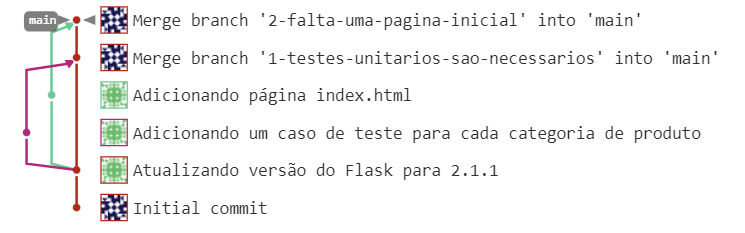

Veja como houve duas bifurcações (_branching_), duas junções (_merge_), e como cada commit adicionou mudanças. Agora temos novamente um único _branch_, que incorpora todas as mudanças realizadas.

## 6.4.5 Obtendo uma cópia atualizada do projeto

Se quiser, você já pode apagar todas as cópias locais e fazer um novo `clone` do repositório, e assim terá a versão mais recente. Ou, se quiser permanecer com uma cópia, apague uma delas, e execute os seguintes comandos na outra:

```
git switch main
git pull
```

Veja como agora a pasta contém as duas alterações feitas: o arquivo de testes e a página inicial.

## 6.4.6 Considerações finais

O processo que fizemos aqui foi bastante simplificado, mas ele representa as boas práticas do controle de versões usando git. É claro que, na maioria das vezes, a quantidade de alterações será maior, a quantidade de _issues_ será maior, haverá conflitos, entre uma série de complicações. O importante é sempre manter as informações organizadas, adicionar comentários informativos, e documentar tudo o que for essencial.
