# 6.5 Pipeline de Integração Contínua com GitLab CI/CD

Manter o VCS sempre atualizado, e com as versões mais recentes de cada mudança, sem nenhum _issue_ aberto, são passos importantes em direção à integração contínua. Mas o processo de DevOps vai além, buscando automatizar tudo o que for possível.

Até o momento, fica a cargo do desenvolvedor testar todas as mudanças efetuadas em sua máquina. No caso de sistemas simples, isso não é difícil de fazer. Mas em sistemas mais complexos, a quantidade de funções pode ser muito grande. Imagine uma API com uma centena de _endpoints_, por exemplo. Imagine que um desenvolvedor precisa resolver um _issue_ em apenas um desses _endpoints_. Você acha que ele irá perder tempo testando todos os outros 99 _endpoints_ que ele sequer tocou? Pode parecer desnecessário, mas às vezes as mudanças tem impactos não previstos, e pode ser que uma de suas mudanças tenha causado impacto em um local que aparentemente não tem relação com os arquivos modificados. Se ele não testar todos os cem _endpoints_ novamente, corre-se o risco de introduzir um erro no sistema. Por outro lado, exigir que os desenvolvedores testem o sistema inteiro a todo momento também é contra-produtivo.

Essas preocupações vão além dos testes. Verificações de integridade, qualidade de código, métricas diversas, são todos atributos importantes em um projeto de software.

Por isso, a integração contínua busca garantir, da forma mais automatizada possível, que sempre que uma mudança é confirmada, que todas essas propriedades são cumpridas. Não é possível automatizar tudo, mas é possível implementar bastante coisa, como veremos nesta seção.

Retomando a mesma Figura de antes, estamos agora entrando no item 3:


## 6.5.1. Testes unitários a cada commit

Finalmente chegamos no ponto de criarmos nosso primeiro script que irá possibilitar a realização da chamada Integração Contínua.

De maneira geral, a grande maioria das ferramentas possui um processo semelhante ao do GitLab CI/CD. Algumas, como o [Jenkins](https://www.jenkins.io), oferecem uma interface gráfica para a configuração do pipeline de Integração Contínua, outras, como o GitLab CI/CD, permitem a definição desse pipeline por meio de um arquivo especial, localizado no diretório do projeto.

No caso do GitLab CI/CD o pipeline é definido dentro de um arquivo denominado `.gitlab-ci.yml`, que segue o formato do [YAML](https://yaml.org), que nada mais é do que uma linguagem de marcação. Este arquivo define a ordem em que se dará a execução do pipeline.

Uma explicação detalhada da estrutura e organização do arquivo `.gitlab-ci.yml` pode ser encontrada em: [https://docs.gitlab.com/ee/ci/yaml/](https://docs.gitlab.com/ee/ci/yaml/). Abaixo apresentamos os conceitos essenciais para a compreensão do pipeline que desejamos para a construção da nossa aplicação de forma automática e posterior entrega da mesma no ambiente de produção.

### Jobs

Um arquivo  `.gitlab-ci.yml` é formado, basicamente, por um conjunto de _jobs_, na terminologia do GitLab CI/CD. _Jobs_ são os elementos mais básicos dentro do arquivo `.gitlab-ci.yml`.

Conforme a documentação oficial, _jobs são:_

* Definidos com restrições informando em que condições devem ser executados;
* Elementos de nível superior com um nome arbitrário e que devem conter pelo menos a cláusula `script`.
* Ilimitados dentro de um arquivo `.gitlab-ci.yml`.

```
job1:
  script: "execute-script-for-job1"

job2:
  script: "execute-script-for-job2"
```

O exemplo acima ilustra uma simples configuração de CI/CD com dois _jobs_ distintos. Cada um executa um comando diferente, especificado nas cláusulas `script`. Um comando pode executar código diretamente (`./configure;make;make install`) ou executar um script (`test.sh`) no repositório.

Os jobs são executados por [runners (executores)](https://docs.gitlab.com/ee/ci/runners/README.html) em um ambiente exclusivo dentro do executor. Além disso, vale ressaltar que os jobs executam de forma independente uns dos outros.

Embora cada job deva ter um nome, existem algumas **palavras chaves reservadas** e, portanto, não é possível atribuir algum desses nomes para um job. São elas:

* `image`
* `services`
* `stages`
* `types`
* `before_script`
* `after_script`
* `variables`
* `cache`
* `include`

Além disso, um job é definido internamente por uma lista de palavras chaves. Cada uma define um comportamento diferente dentro do job. A seguir são apresentadas algumas delas, as que serão necessárias para compreender o que será apresentado a seguir. Para uma explicação detalhada e conhecimento das demais cláusulas permitidas dentro de um job recomenda-se a leitura da documentação oficial em [https://docs.gitlab.com/ee/ci/yaml/](https://docs.gitlab.com/ee/ci/yaml/).

Lista de algumas palavras chaves (_keywords_) que definem comportamentos no job:

| Keyword                                                                                 | Descrição                                                                                                                                                                                                                                                                                                                                    |
| --------------------------------------------------------------------------------------- | -------------------------------------------------------------------------------------------------------------------------------------------------------------------------------------------------------------------------------------------------------------------------------------------------------------------------------------------- |
| [`script`](https://docs.gitlab.com/ee/ci/yaml/#script)                                  | Determina o comando ou script que será executado pelo runner.                                                                                                                                                                                                                                                                                |
| [`after_script`](https://docs.gitlab.com/ee/ci/yaml/#before\_script-and-after\_script)  | Permite a execução de um conjunto de comandos após a execução do job ser finalizada.                                                                                                                                                                                                                                                         |
| [`artifacts`](https://docs.gitlab.com/ee/ci/yaml/#artifacts)                            | Lista de arquivos ou diretórios anexados ao job quando sua execução finaliza com sucesso. Tais artefatos ficam disponíveis para download na plataforma. Veja também: `artifacts:paths`, `artifacts:exclude`, `artifacts:expose_as`, `artifacts:name`, `artifacts:untracked`, `artifacts:when`, `artifacts:expire_in`, e `artifacts:reports`. |
| [`before_script`](https://docs.gitlab.com/ee/ci/yaml/#before\_script-and-after\_script) | Permite a execução de um conjunto de comandos antes da execução do job.                                                                                                                                                                                                                                                                      |
| [`cache`](https://docs.gitlab.com/ee/ci/yaml/#cache)                                    | Lista de arquivos que devem ser mantidos em cache entre execuções subsequentes. Veja também: `cache:paths`, `cache:key`, `cache:untracked`, `cache:when`, e `cache:policy`.                                                                                                                                                                  |
| [`image`](https://docs.gitlab.com/ee/ci/yaml/#image)                                    | Uso de imagens Docker. Veja também: `image:name` e `image:entrypoint`.                                                                                                                                                                                                                                                                       |
| [`only`](https://docs.gitlab.com/ee/ci/yaml/#onlyexcept-basic)                          | Limita quando os jobs podem ser criados: `only:refs`, `only:kubernetes`, `only:variables`, e `only:changes`.                                                                                                                                                                                                                                 |
| [`services`](https://docs.gitlab.com/ee/ci/yaml/#services)                              | Uso de serviços de imagens Docker. Veja também: `services:name`, `services:alias`, `services:entrypoint`, e `services:command`.                                                                                                                                                                                                              |
| [`stage`](https://docs.gitlab.com/ee/ci/yaml/#stage)                                    | Define o stage (estágio) de um job (padrão: `test`).                                                                                                                                                                                                                                                                                         |
| [`variables`](https://docs.gitlab.com/ee/ci/yaml/#variables)                            | Define variáveis no nível do job.                                                                                                                                                                                                                                                                                                            |

### Configurando um runner

Antes de submeter um job para execução no GitLab, é necessário resolver um problema. Todo job, no fundo, é um processamento. Todo processamento tem um custo. Considerando que estamos utilizando uma conta gratuita no GitLab, quem paga esse custo?

Um _runner_ é um processo que executa uma tarefa. E o GitLab dispõe de um conjunto de _runners_ gratuitos e compartilhados, para ser usado pelos usuários. Porém, desde algum tempo atrás, o GitLab adotou uma política de verificação de contas para que esse conjunto de _runners_ gratuitos possa ser utilizado. Ao tentar executar um _pipeline_ em uma conta gratuita, pode ser que apareça a seguinte mensagem:

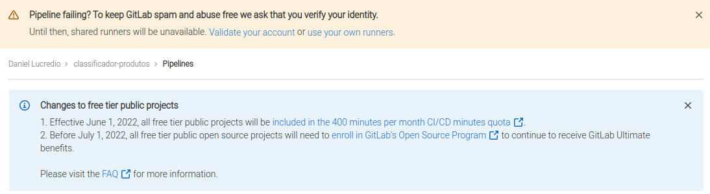

Isso significa que, para usar os _runners_ gratuitos, é preciso verificar a conta, ou utilizar seu próprio _runner_. Além disso, existe um limite de 400 minutos por mês de processamento. Após esse limite, o usuário deverá contratar minutos adicionais.

Verificar a conta significa, no caso do GitLab, colocar um número de cartão de crédito para que o GitLab possa verificar que o usuário tem potencial para se tornar um cliente pago (e eventualmente oferecer serviços pagos). Na prática, isso reduz os custos da plataforma com os _runners_ gratuitos. Trata-se de uma decisão estratégica da empresa, e não cabe a nós questioná-la. Caso você queira seguir nessa direção, vá em frente, adicione seus dados de cartão de crédito e você terá direito a usar os _runners_ gratuitamente. Você pode fazer isso clicando nessa mensagem que aparece na figura acima. Neste caso, pode pular o restante desta seção.

Caso não possa seguir essa opção, o GitLab dá a opção de adicionarmos nosso próprio _runner_. É claro que, para isso, precisamos de uma máquina para deixar o processo sempre em execução. Mas a boa notícia é que podemos usar a nossa própria máquina local para isso.

Para habilitar essa opção, acesse o menu "Settings" -> "CI/CD" -> "Runners":

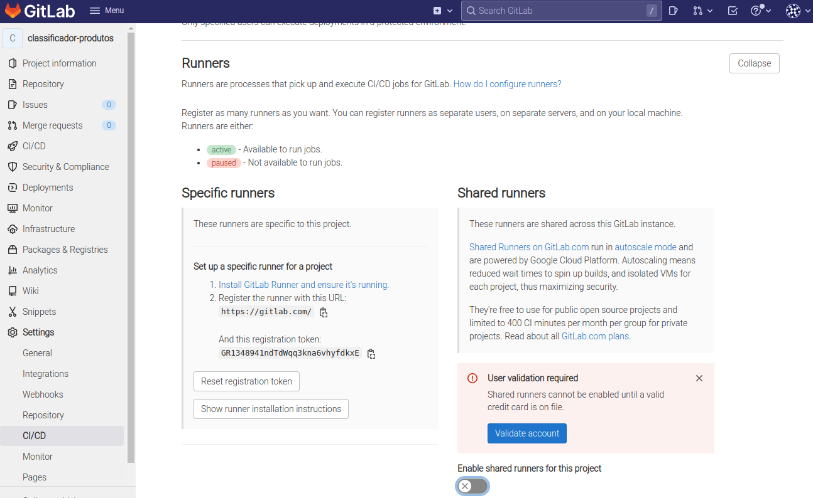

No lado direito, note que o uso de _shared runners_ está desabilitado. Caso não queira colocar seu cartão de crédito, faça o mesmo.

No lado esquerdo, existem as instruções para registrar seu próprio runner. Clique em "Show runner installation instruction", selecione seu sistema operacional e siga as instruções, executando os comandos listados. Por exemplo, para o Linux, os comandos são os seguintes:

```sh
# Download the binary for your system
sudo curl -L --output /usr/local/bin/gitlab-runner https://gitlab-runner-downloads.s3.amazonaws.com/latest/binaries/gitlab-runner-linux-amd64

# Give it permission to execute
sudo chmod +x /usr/local/bin/gitlab-runner

# Create a GitLab Runner user
sudo useradd --comment 'GitLab Runner' --create-home gitlab-runner --shell /bin/bash

# Install and run as a service
sudo gitlab-runner install --user=gitlab-runner --working-directory=/home/gitlab-runner
sudo gitlab-runner start
```

Recomendamos não utilizar os comandos aqui, e sim seguir as instruções do próprio GitLab, pois o conteúdo aqui pode estar desatualizado.

> Obs: No Windows, não se esqueça de abrir o terminal em modo de administrador.

Assim que a instalação for concluída, é preciso registrar o _runner_ no GitLab. Para isso, você precisará da URL e do token que aparecem na página acima. Ainda seguindo as instruções, execute o comando para seu sistema operacional. No caso do Linux, é o seguinte (lembre-se de substituir o token pelo seu):

```sh
sudo gitlab-runner register --url https://gitlab.com/ --registration-token GR1348941ndTdWqq3kna6vhyfdkxE
```

Você será indagado por uma série de opções. Pode deixar todas no valor padrão, exceto pelas duas últimas:

* `Enter an executor`: `docker`
* `Enter the default Docker image`: `python:3.9.6-slim`

Após essas etapas, o _runner_ aparecerá como ativo ao recarregar a página. Veja, na figura a seguir, como temos 2 _runners_ em nosso projeto.

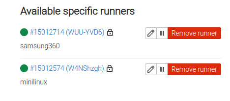

> A configuração desse _runner_ fica registrada na máquina. No caso do Linux, ela fica em `/etc/gitlab-runner/config.toml`. No Windows, fica em `C:\GitLab-Runner\config.toml`. Caso precise alterar algo, basta editar esse arquivo e aguardar alguns segundos até que o _runner_ detecte as mudanças.

Certifique-se de que o Docker está rodando, e vamos seguir em frente.

### Primeiro job no projeto

Para exemplificar os conceitos até o momento vamos dar início à definição do pipeline DevOps no projeto do classificador de produtos. O primeiro passo para isso é criarmos o arquivo `.gitlab-ci.yml` dentro do projeto, com o seguinte conteúdo:

```
image: python:3.9.6-slim

run_tests:
    script:
        - pip install -r requirements.txt
        - python -m unittest
```

Esse script de Integração Contínua faz uso da imagem `python:3.9.6-slim`, que é a mesma que estamos utilizando até agora. Você pode usar qualquer imagem que quiser e que tenha os requisitos para os _jobs_ que quer rodar. Como queremos rodar comandos Python, é interessante usar uma imagem oficial do Python.

Por padrão, as imagens são baixadas do Docker Hub, mas é possível alterar essa configuração se desejado. Para mais informações sobre como alterar o repositório de contêineres consulte [https://docs.gitlab.com/ee/user/packages/container\_registry/](https://docs.gitlab.com/ee/user/packages/container\_registry/). Em nosso caso, faremos uso do Docker Hub padrão para a busca e registro de imagens.

O script tem um único _job_, que é a execução de dois scripts. O primeiro instala os pacotes do Python necessários, e o segundo executa os casos de teste.

Agora faça o envio das alterações:

```sh
git add .
git commit -m "Primeiro pipeline CI"
git push
```

Assim que o _commit_ for enviado, o GitLab vai eventualmente detectar a existência de um arquivo chamado `.gitlab-ci.yml` e vai disparar a execução do pipeline para rodar em um dos _runners_ disponíveis. Veja como isso aparece, na página inicial, ao lado da informação do _commit_ (símbolo de "pausa"):

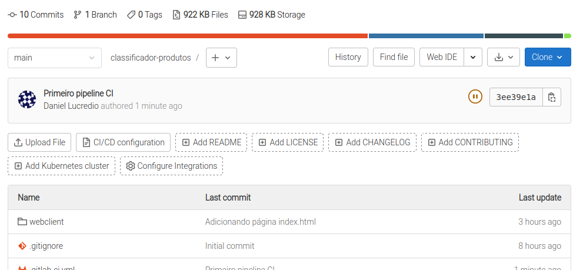

Também é possível ver o pipeline clicando em "CI/CD" -> "Pipelines". Veja como, agora, o pipeline já terminou de executar e está marcado como "Passed":

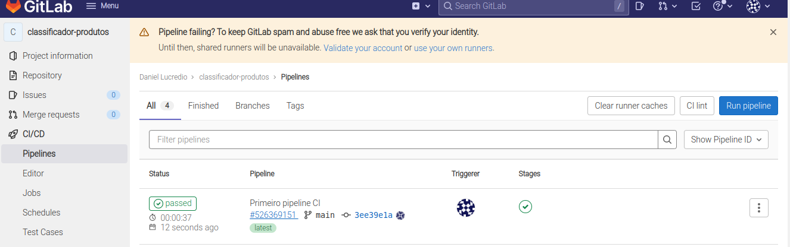

Clicando sobre o botão "Passed", é possível ver mais detalhes do pipeline, incluino nosso único _job_, chamado `run_tests`:

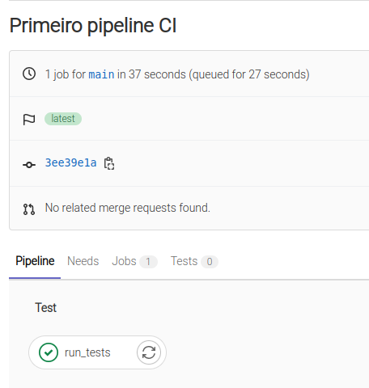

E clicando sobre o _job_, é possível ver o resultado de sua execução. Neste caso, aparece que a execução dos quatro casos de teste foi bem sucedida:

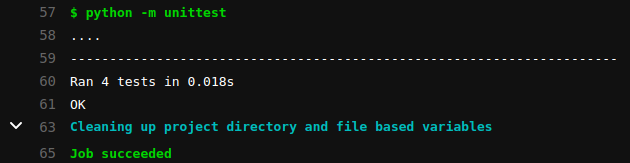

Retornando à página inicial, veja como agora há um símbolo verde que indica que o pipeline associado ao projeto foi bem sucedido:

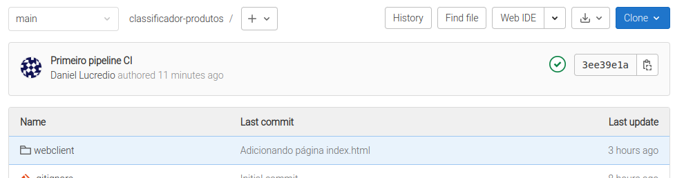

O sucesso ou não da execução é detectado da mesma forma que vimos no [Capítulo 4](../4-monitoramento/4-1-introducao.md): o resultado do comando no sistema operacional deve ser 0, indicando sucesso. Caso seja outro, é reportada uma falha.

## 6.5.2. Verificando o ambiente antes dos testes

Como observamos acima, criamos um pipeline de CI com apenas um _job_ que, ao final, em caso de sucesso, roda quatro casos de teste. Entretanto, em geral, o processo de construção de uma aplicação passa por diferentes estágios, até que a mesma seja finalmente empacotada para a distribuição.

O GitLab permite que isso seja feito por meio da definição de estágios (`stages`) dentro de nosso arquivo de configuração.

Mas o que são os `stages`?

`stages` são usados para definir etapas que contém _jobs_ associados. Os `stages` são definidos de forma global para o pipeline.

Com a especificação de `stages` passamos a ter pipelines multiestágios, e não de estágio único como no exemplo anterior no qual tínhamos apenas o estágio de testes. A ordem dos elementos dentro de `stages` define a ordem em que os _jobs_ serão executados:

1. _Jobs_ dentro do mesmo `stage` são executados em paralelo;
2. _Jobs_ do próximo `stage` só iniciam sua execução após todos os _jobs_ de um `stage` anterior finalizarem com sucesso.

Desse modo, vamos considerar a alteração abaixo em nosso arquivo de configuração do pipeline:

```
image: python:3.9.6-slim

stages:
  - verify
  - quality

verify-python:
  stage: verify
  script:
    - python --version
    - whoami

verify-pip:
  stage: verify
  script:
    - pip install -r requirements.txt

run_tests:
  stage: quality
  script:
    - pip install -r requirements.txt
    - python -m unittest
```

Na linha 3 fazemos uso de `stages` e definimos dois estágios: `verify` e `quality`. Cada um deles está diretamente relacionado a _jobs_ que executaremos:

1. No estágio `verify` queremos testar o funcionamento básico da imagem, para ver se está funcionando, se existe o python, se a instalação foi bem sucedida, e se é possível rodar `pip install`.
2. No estágio `quality` executaremos _jobs_ referentes à garantia de qualidade, como execução de testes unitários.

O comportamento definido para a execução de cada _job_ passa a ser o seguinte:

1. Primeiro, todos os _jobs_ de `verify` são executados em paralelo;
2. Se todos os _jobs_ de `verify` finalizarem com sucesso, os _jobs_ de `quality` iniciam a execução em paralelo.
3. Se todos os _jobs_ de `quality` finalizarem com sucesso, o _commit_ é marcado como `passed`; e
4. Se algum dos _jobs_ anteriores falhar, o _commit_ é marcado como `failed` e nenhum _job_ subsequente é executado.

Há ainda duas particularidades com `stages`:

1. Se não há uma definição global de `stages` no arquivo `.gitlab-ci.yml`, então, os estágios `build`, `test` e `deploy` podem ser utilizados nos _jobs_ por padrão;
2. Se um _job_ não especificar a qual `stage`,  ele é associado ao estágio `test` por padrão.

Para verificar se a alteração acima funciona corretamente, basta submeter as mudanças:


```sh
git commit -am "Configurando múltiplos estágios de CI"
git push
```

Entre no GitLab, aguarde um tempo e acompanhe enquanto a execução começa, e veja como fica a interface quando ela termina, indicando que os três _jobs_ foram bem sucedidos:

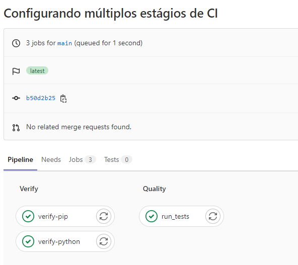

## 6.5.3. Adicionando verificação de cobertura dos testes

Vamos fazer uma mudança nova, para verificar se a cobertura dos casos de teste está OK. Essa é uma importante verificação, e apesar de não garantir qualidade, ela nos obriga a pensar em casos de teste que de fato exercitam todo o sistema que estamos desenvolvendo, o que contribui para o aumento da qualidade.

Mas agora vamos seguir o caminho correto, ou seja:

1. Criaremos um _issue_
2. Criaremos um _branch_
3. Faremos a mudança, testando localmente
4. Solicitaremos um _merge_

Vamos começar criando um _issue_, solicitando à equipe que configure uma análise de cobertura de testes, para garantir que, a cada commit, 100% do código esteja coberto por algum caso de teste.

Crie um novo _issue_, com o seguinte título: "Adicionar análise de cobertura de testes no pipeline CI/CD". Escreva algo na descrição, como: "Seria legal se tivéssemos uma análise de cobertura dos testes que rodam no pipeline CI/CD".

Em seguida, crie um novo _branch_ (faça isso a partir da página do _issue_ recém-criado). Se quiser, aproveite para testar a opção que cria o _branch_ junto com um _merge request_. Atualize sua cópia local e mude para o novo _branch_ (o nome gerado pelo GitLab deve ser esse do comando):

```sh
git pull
git switch 3-adicionar-analise-de-cobertura-de-testes-no-pipeline-ci-cd
```

Agora vamos implementar a mudança. Faremos uso de um pacote do Python chamado `coverage`, que precisa ser instalado. Modifique o arquivo `requirements.txt`:

```diff
Flask==2.1.1 # Precisa da versão 2.1.1 para unittest
scikit-learn==1.0.2
gunicorn==20.1.0
+coverage==6.3.2
```

Já podemos testar. Instale o pacote novo (não se esqueça de ativar o ambiente virtual), e execute o comando que testa a cobertura dos casos de teste:

```sh
pip install -r requirements.txt
coverage run -m unittest
coverage report --fail-under=100
```

Sucesso! Estamos com 100% de cobertura em todos os arquivos Python:

```
Name          Stmts   Miss  Cover
---------------------------------
app.py           12      0   100%
test_api.py      22      0   100%
---------------------------------
TOTAL            34      0   100%
```

Se não estivéssemos com 100% de cobertura, o comando retornaria um código 1, o que seria detectado pelo GitLab como uma falha. Veremos isso em ação mais adiante.

Agora vamos adicionar esse _job_ ao nosso pipeline. Modifique o arquivo `.gitlab-ci.yml` para inclui-lo no stage de `quality`:

```diff
image: python:3.9.6-slim

stages:
  - verify
  - quality

verify-python:
  stage: verify
  script:
    - python --version
    - whoami

verify-pip:
  stage: verify
  script:
    - pip install -r requirements.txt

run_tests:
  stage: quality
  script:
    - pip install -r requirements.txt
    - python -m unittest

+analyze_coverage:
+  stage: quality
+  script:
+    - pip install -r requirements.txt
+    - coverage run -m unittest
+    - coverage report --fail-under=100
```

Tudo funcionando, agora resta enviar as mudanças para o repositório. Mas antes, vamos dizer ao git para ignorar a pasta `.coverage` que é criada e que contém o resultado da análise de cobertura. Essa pasta não precisa ficar sob controle de versões. Edite o arquivo `.gitignore`:

```diff
.venv
+.coverage
__pycache__
```

Agora sim, é só enviar as mudanças para o GitLab:

```sh
git commit -am "Adicionando job de cobertura no CI/CD"
git push
```

Volte ao GitLab agora. Veja como o novo pipeline já roda no _branch_ recém criado. Mas o mais interessante é, ao analisar o _merge request_, veja como o resultado do pipeline aparece ao lado do último _commit_ associado, junto com a mensagem de que ele passou:

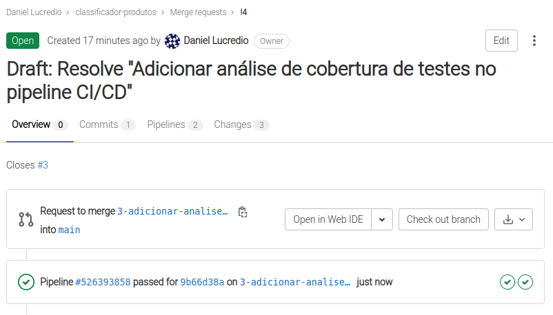

Isso dá uma segurança muito maior à pessoa que vai aprovar o _merge request_, pois ele sabe que as configurações e verificações configuradas estão passando. Confirme o _merge request_ agora, e vamos testar esse novo pipeline.

## 6.5.4. Colocando nosso novo pipeline à prova

Vamos começar esta seção adicionando mais um _issue_:

Título: "Endpoint para healthcheck rápido"
Descrição: "Vamos criar um endpoint que apenas faz um healtcheck rápido, para facilitar a integração no Nagios. Hoje, o Nagios fica solicitando à API que faça uma predição, o que é custoso. Se tivermos um endpoint simples, podemos economizar dinheiro".

Analise esse _issue_ e veja se ele fa sentido para você. Depois de ter estudado sobre o Nagios no [Capítulo 4](../4-monitoramento/4-1-introducao.md) você já deve saber do que esse _issue_ se trata, não?

Siga em frente com o processo, crie um novo _branch_ e altere para ele na cópia local, e vamos começar a trabalhar!

Modifique o arquivo `app.py` para incluir esse novo endpoint:

```diff
from flask import Flask, request, jsonify
import pickle

app = Flask(__name__)

model = pickle.load(open('model.sav', 'rb'))

+@app.route("/health_check")
+def health_check():
+    return "alive"

@app.route('/predizer_categoria', methods=['POST'])
def predizer_categoria():
    request_data = request.get_json()
    input_message = [request_data['descricao']]
    input_message = model["vect"].transform(input_message)
    final_prediction = model["clf"].predict(input_message)[0]

    response = {
        'categoria': final_prediction
    }

    return jsonify(response)
```

Pronto, a mudança era pequena, afinal de contas. Vamos testar para ver se funcionou. Vamos rodar o Flask localmente:

```sh
flask run
```

Em seguida, no terminal, faça um GET simples usando curl:

```sh
curl http://localhost:5000/health_check
```

Deve ser exibida a string "alive" como resposta, o que indica que deu certo.

Agora é só fazer o _commit_ e enviar tudo para o repositório remoto:

```sh
git commit -am "Adicionando endpoint para healthcheck"
git push
```

Tudo pronto, serviço concluído, é só criar o _merge request_ e aguardar o responsável pela aprovação. Certo?

Em pouco tempo o responsável vai lá olhar no _merge request_, e vê o que foi que você mudou:

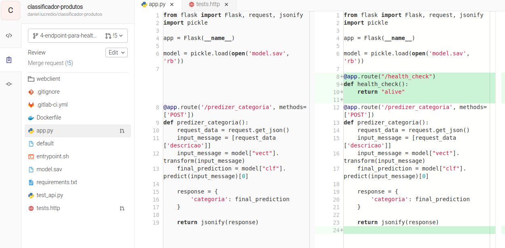

Tudo parece OK. Então ele volta para a página para aprovar e...

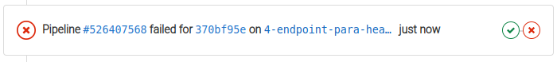

Aquele "X" vermelho significa que há algo de errado. Clicando sobre ele, ele fica sabendo que é um problema de cobertura.

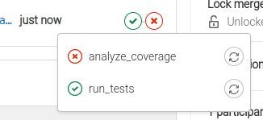

E clicando sobre o _job_ que falhou, ele descobre que sua mudança resultou em uma cobertura menor do que 100% no arquivo `app.py`:

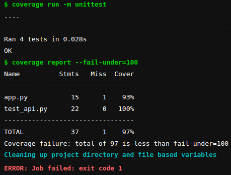

Em breve, você receberá um e-mail assim:

> Prezado desenvolvedor,
> 
> Em virtude do desrespeito às diretrizes de qualidade da nossa empresa, você está convocado a participar de um treinamento intensivo sobre qualidade de software, a ser ministrado pelo prof. Auri Marcello Rizzo Vincenzi, no próximo sábado, começando às 05h30 da manhã e terminando às 23h40 da noite. Esperamos que essa experiência sirva de lição para que não volte a cometer esse tipo de falha no futuro.
> 
> Atenciosamente,
> 
> A gerência

Sim, faltou acrescentar um caso de teste para verificar a nova funcionalidade.

Estranhando a rapidez com que esse e-mail chegou para você, você agora descobre que o GitLab envia automaticamente um e-mail para os usuários do repositório sempre que um pipeline falhar ou for bem-sucedido.

Vamos corrigir isso. Modifique o arquivo `test_api.py`:

```diff
import unittest
from app import app
import json

class TestAPI(unittest.TestCase):
    def setUp(self) -> None:
        self.app_client = app.test_client()

    def test_brinquedo(self):
        response = self.app_client.post('/predizer_categoria',
                            json={'descricao':'soldadinhos de plástico'})
        cat = json.loads(response.data.decode('utf-8')).get("categoria")
        assert cat == 'brinquedo'

    def test_maquiagem(self):
        response = self.app_client.post('/predizer_categoria',
                            json={'descricao':'batom vermelho'})
        cat = json.loads(response.data.decode('utf-8')).get("categoria")
        assert cat == 'maquiagem'

    def test_game(self):
        response = self.app_client.post('/predizer_categoria',
                            json={'descricao':'dark souls'})
        cat = json.loads(response.data.decode('utf-8')).get("categoria")
        assert cat == 'game'

    def test_livro(self):
        response = self.app_client.post('/predizer_categoria',
                            json={'descricao':'O senhor dos anéis'})
        cat = json.loads(response.data.decode('utf-8')).get("categoria")
        assert cat == 'livro'
    
+    def test_health_check(self):
+        response = self.app_client.get('/health_check')
+        assert response.data.decode('utf-8') == 'Alive'
```

Sem testar (afinal, não tem como errar um código tão simples assim!), envie as mudanças novamente para o GitLab:

```sh
git commit -am "Adicionando caso de teste para o endpoint de healthcheck, para atender às normas da empresa, como fui muito bem lembrado pela gerência"
git push
```

Aguarde um pouco, e você deve receber o seguinte e-mail em breve:

> Prezado desenvolvedor,
> 
> Pela reincidência em não cumprir as diretrizes de qualidade de sofware de nossa empresa, estamos promovendo-o a colaborador não-assalariado, trabalhando em home office, exclusivamente em projetos pessoais seus, e não mais da empresa. A promoção é válida a partir deste momento.
> 
> Atenciosamente,
> 
> A gerência

Deixamos para o leitor a tarefa de identificar e corrigir o problema, aceitar o _merge request_ e deixar tudo correto no repositório. Veja como, mesmo depois que o _merge request_ for aprovado, o pipeline irá rodar novamente, garantindo que após a junção nenhum novo erro ou problema de cobertura foi inserido.

## 6.5.5. Considerações finais

Esperamos que tenha ficado claro que a automação que é possível graças a essa ferramenta pode evitar muitos problemas e ajudar a garantir um mínimo de qualidade e consistência nos artefatos de software.

De maneira geral, pode-se dizer que o processo para a criação de pipelines com o GitLab CI/CD não é uma tarefa muito complicada mas exige que se conheça a documentação de como escrever corretamente o arquivo de configuração do pipeline.

Existem muitas outras opções que podem ser utilizadas e exploraremos mais algumas delas no capítulo a seguir, mas recomendamos fortemente que aqueles interessados em fazer uso profissional da tecnologia leiam atentamente toda a documentação da mesma para compreender suas capacidades e limitações.

