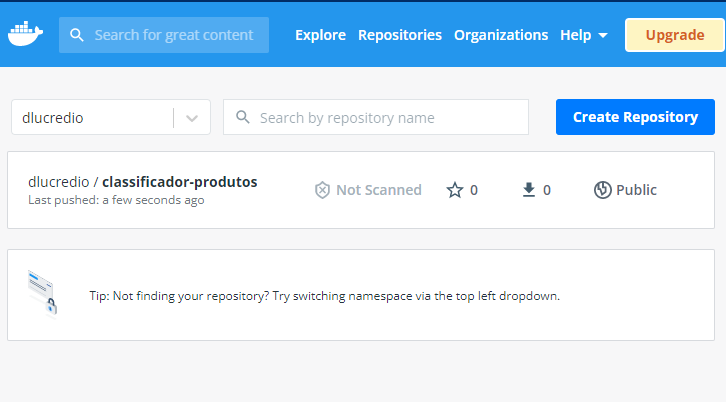
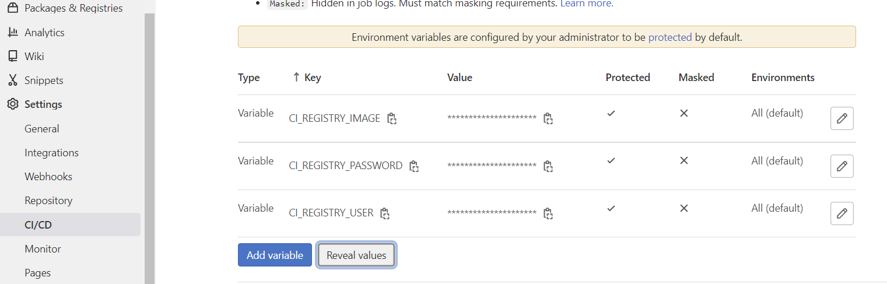
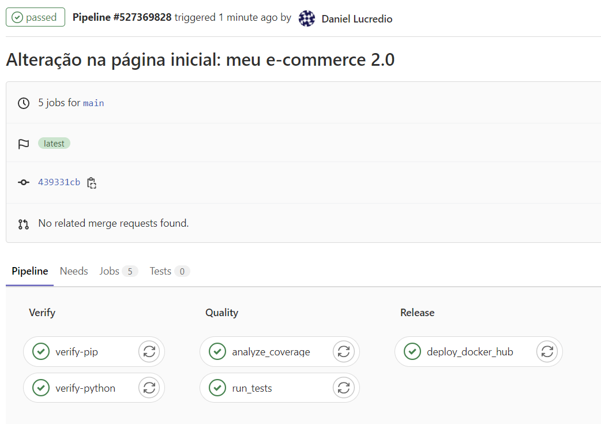
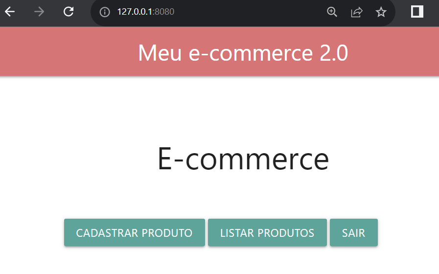

# 7.2 Implantação automática no Docker Hub

Nos capítulos anteriores, utilizamos imagens do Docker Hub e as personalizamos para atender nossas necessidades de configuração de Servidores, incluindo o Kafka, Python WSGI, servidor web e também o servidor de monitoramento. Mas também é possível utilizar o Docker Hub (ou outro serviço de registro de imagens) para armazenar nossas próprias imagens personalizadas, facilitando assim a sua implantação.

Uma vez que temos um arquivo `Dockerfile`, o mesmo pode ser utilizado para a construção de uma imagem personalizada e já fizemos isso em capítulo anteriores utilizando-se o comando `docker build`. Entretanto, a imagem personalizada foi mantida apenas localmente e não disponibilizada para uso geral. Vamos agora enviar a imagem para o Docker Hub.

## 7.2.1 Implantação manual no Docker Hub

Vamos começar fazendo o processo manualmente, para depois automatizá-lo no contexto do GitLab CI/CD.

Para darmos mais esse passo precisamos, primeiro, ter nossa conta no Docker Hub e criar um _token_ de acesso. Para isso, acesse o [Docker Hub](http://hub.docker.com) e crie uma conta. Em seguida, acesse, no canto superior direito, a opção "Account settings", depois "Security" e clique em "New Access Token". Dê uma descrição qualquer para esse _token_, e clique em "Generate token". Será exibida uma página com o _token_ criado. Atenção, salve esse _token_, pois o mesmo não será exibido novamente assim que a página for fechada. Salve também seu nome de usuário, que como lembrete aparece nesse mesmo local.

Lembrando que aqui estamos trabalhando dando continuidade ao exemplo do [Capítulo anterior](../6-integracao-continua/6-1-introducao.md), portanto você deve ter uma pasta com o projeto de classificação de produtos, que já tem um `Dockerfile`.

Vamos então construir a imagem. Já fizemos isso antes, porém aqui é necessário um cuidado especial para nomear a imagem conforme as regras do Docker Hub, afinal, estaremos enviando-a para lá. Para seguir as regras, é necessário adicionar o seu nome de usuário no Docker Hub como parte da etiqueta da imagem. Estando no diretório onde o `Dockerfile` está salvo, execute o comando:

```sh
docker build -t dlucredio/classificador-produtos .
```

Neste caso, o usuário do Docker Hub (que dissemos para você anotar agora há pouco) é `dlucredio`. O restante pode ser um nome qualquer e que seja único entre todas as suas imagens que pretende enviar.

Ao final desse processo temos uma imagem denominada `dlucredio/classificador-produtos`, criada e armazenada localmente. Agora vamos enviá-la para o Docker Hub. Para isso você precisa primeiro executar o comando de login. Em seguida será solicitada sua senha. Simplesmente copie e cole o seu token de acesso de desenvolvedor criado na platadorma Docker Hub.

```
$ docker login -u dlucredio
Password: 
Login Succeeded
```

Após o login realizado com sucesso, basta enviar a imagem para sua área do Hub Docker. Isso é feito de forma semelhante à atualização via git, por meio de um comando `docker push` seguido pelo nome da imagem criada, conforme ilustrado abaixo.

```
docker push dlucredio/classificador-produtos
```

Após o docker push ter finalizado é possível observar que nossa imagem personalizada está disponível em nossa área do Docker Hub.



Podemos agora testar o comando para executar essa imagem a partir do Docker Hub. Primeiro, apague a imagem localmente, e depois execute-a:

```sh
docker image rm dlucredio/classificador-produtos
docker run -d -p 8080:80 --rm --name classificador-produtos-container dlucredio/classificador-produtos
```

Tudo vai funcionar exatamente como antes, exceto que agora a imagem não existe localmente, e será recuperada a partir do Docker Hub. Você pode fazer o teste, executando o comando a partir de uma outra máquina, para realmente ver os benefícios de publicar a imagem em um servidor de registros.

## 7.2.2 Implantação automática a partir do GitLab CI/CD

Agora o que precisamos fazer é configurar o nosso pipeline para executar esses comandos automaticamente, conforme desejarmos. Modifique o código do arquivo `.gitlab-ci.yml`, da seguinte forma:

```diff
-image: python:3.9.6-slim
+default:
+  image: python:3.9.6-slim


stages:
  - verify
  - quality
+  - publish

+variables:
+  DOCKER_TLS_CERTDIR: ""

verify-python:
  stage: verify
  script:
    - python --version
    - whoami

verify-pip:
  stage: verify
  script:
    - pip install -r requirements.txt

run-tests:
  stage: quality
  script:
    - pip install -r requirements.txt
    - python -m unittest

analyze_coverage:
  stage: quality
  script:
    - pip install -r requirements.txt
    - coverage run -m unittest
    - coverage report --fail-under=100

+deploy_docker_hub:
+  image: docker:19.03.12
+  stage: publish  
+  services:
+    - docker:19.03.12-dind
+  before_script:
+    - docker login -u "$CI_REGISTRY_USER" -p "$CI_REGISTRY_PASSWORD"
+  script:
+    - docker build --pull -t "$CI_REGISTRY_IMAGE" .
+    - docker push "$CI_REGISTRY_IMAGE"
+  only:
+    - main
```

Tivemos algumas mudanças importantes aqui. Explicando uma a uma:

* A primeira mudança foi que, ao invés de definir uma única imagem para todos, agora cada _job_ pode usar uma imagem diferente. Para isso, definimos uma imagem padrão para o pipeline e especificamos uma nova imagem para o job de publish do docker. Isso vai ser necessário pois o _job_ que envia a imagem para o Docker Hub deve usar uma imagem que tem o Docker, para poder executar os comandos `docker build` e `docker push`;
* A segunda mudança foi a criação de uma variável chamada `DOCKER_TLS_CERTDIR`, com conteúdo vazio. Isso diz para o _runner_ para executar o docker sem a verificação de segurança TLS. Apesar de não recomendado, fizemos isso para simplificar o processo de configuração mais adiante, para fins didáticos;
* A terceira mudança foi a inclusão de um novo _stage_, chamado "publish". Esse estágio passa a compor nosso pipeline de entrega contínua; e
* A última mudança foi justamente a criação do _job_ de entrega, chamado `deploy_docker_hub`, que executa os scripts que vimos agora há pouco. Ele usa para isso o conceito de `service`, que é uma configuração personalizada para um pipeline CI/CD. No caso, estamos usando o serviço `dind`, que significa `Docker-in-Docker`, pois estamos rodando Docker dentro do Docker para executar os comandos de construção e envio da imagem ao Docker Hub.

Além disso, estamos usando algumas variáveis nesses scripts:

* `CI_REGISTRY_IMAGE`: nome da imagem, no caso será `dlucredio/classificador-produtos`
* `CI_REGISTRY_PASSWORD`: o _token_ de acesso ao Docker Hub que criamos agora há pouco
* `CI_REGISTRY_USER`: o nome de usuário para login no Docker Hub

Essas variáveis devem ser configuradas no GitLab. Acesse a opção "Settings", "CI/CD", "Variables", e crie essas três, conforme imagem a seguir:



Ao executar o _pipeline_, o GitLab irá substituir os valores dos scripts pelos digitados aqui nesta página. Dessa forma, evitamos de ficar salvando senhas e nomes de usuário em locais que ficam sob o controle do VCS.

Antes de enviar as mudanças para o GitLab, porém, vamos precisar alterar uma configuração no _runner_. Caso você esteja usando os _runners_ gratuitos do GitLab, não é necessário fazer nada. Mas Caso você esteja rodando seu próprio _runner_, é necessário que ele tenha acesso e privilégios necessários para executar comandos do Docker, o que não acontece por padrão. Assim, vamos reconfigurá-lo para isso. Não é necessário interromper sua execução, basta alterar seu registro, e o GitLab irá automaticamente recarregar as configurações. 

Abra o arquivo `/etc/gitlab-runner/config.toml` (ou `C:\GitLab-Runner\config.toml`, no Windows) (será necessário permissão de administrador) e altere-o (ATENÇÃO: No Windows, não altere a linha com os volumes, pois não é necessário
):

```diff
concurrent = 1
check_interval = 0

[session_server]
  session_timeout = 1800

[[runners]]
  name = "minilinux"
  url = "https://gitlab.com/"
  token = "HpyD5Wzv6YPZgCrEKgGo"
  executor = "docker"
  [runners.custom_build_dir]
  [runners.cache]
    [runners.cache.s3]
    [runners.cache.gcs]
    [runners.cache.azure]
  [runners.docker]
    tls_verify = false
-    image = "python:3.9.6-slim"
+    image = "docker:19.03.12"
-    privileged = false
+    privileged = true
    disable_entrypoint_overwrite = false
    oom_kill_disable = false
    disable_cache = false
-    volumes = ["/cache"]
+    volumes = ["/cache", "/var/run/docker.sock:/var/run/docker.sock"]
    shm_size = 0
```


Os detalhes dessa configuração são explicados na documentação do GitLab sobre o assunto. [Recomendamos a leitura](https://docs.gitlab.com/ee/ci/docker/using_docker_build.html).

Agora já podemos enviar as mudanças. Mas antes, vamos acrescentar uma alteração em algum lugar, apenas para vermos se de fato o processo todo executa normalmente, do começo ao fim. Altere o arquivo `index.html`, mudando o título da página:

```diff
<body>
    <nav>
        <div class="nav-wrapper">
-            <a href="#" class="brand-logo">Meu e-commerce</a>
+            <a href="#" class="brand-logo">Meu e-commerce 2.0</a>
            <ul id="nav-mobile" class="right hide-on-med-and-down">
                <li><a href="#">Olá, Vendedor</a></li>
                <li><a href="#"><i class="material-icons">exit_to_app</i></a></li>
            </ul>
        </div>
    </nav>
```

Agora sim, podemos enviar as mudanças:

```sh
git commit -am "Adicionando deploy no Docker Hub via CI/CD"
git push
```

Aguarde alguns minutos até que o pipeline execute de forma bem sucedida, e todos os _jobs_ estejam passando normalmente:



Se tudo deu certo, ao rodar a nova imagem (que será puxada do Docker Hub), devemos ver o novo título na página inicial. Antes de rodar o seguinte comando, certifique-se de parar quaisquer contêineres que estiverem rodando, e apagar a imagem anterior.

```sh
docker run -d -p 8080:80 --rm --name classificador-produtos-container dlucredio/classificador-produtos
```



Pare um instante agora e aprecie o que fizemos. Volte à imagem inicial, que estivemos trabalhando desde o início do livro:


A alteração que fizemos saiu da nossa máquina (1), foi até o GitLab (2), passou por testes e verificações (3), foi implantada no Docker Hub (4). Tudo isso foi feito automaticamente. A passagem da etapa 4 para a etapa 5 fizemos manualmente, ou seja, executamos a imagem com um comando `docker run`. Será que conseguimos automatizá-la também?

Descubra na próxima seção!