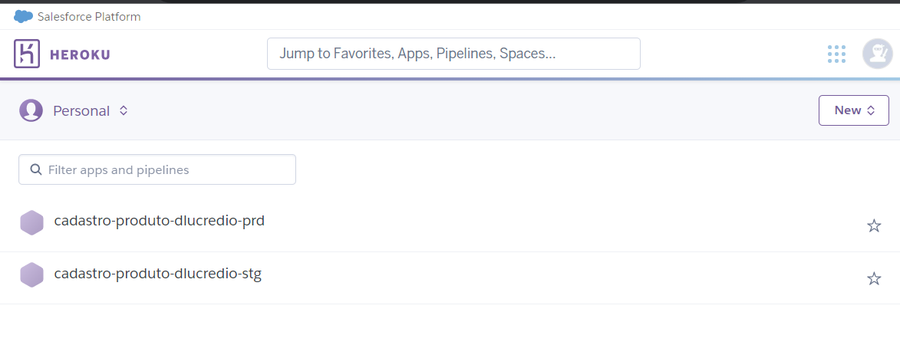
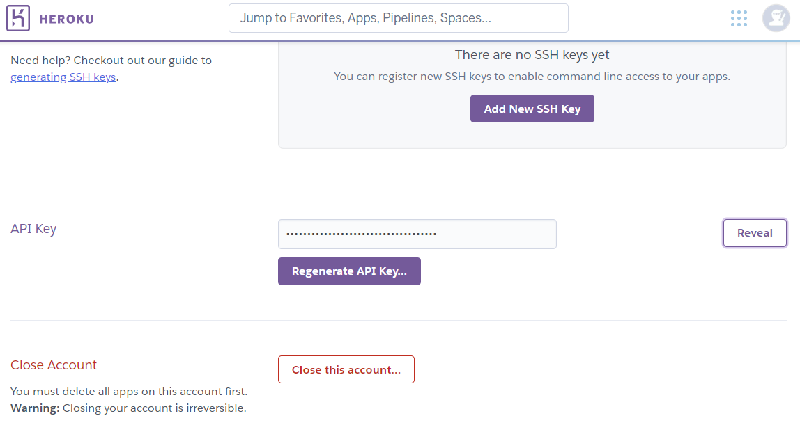
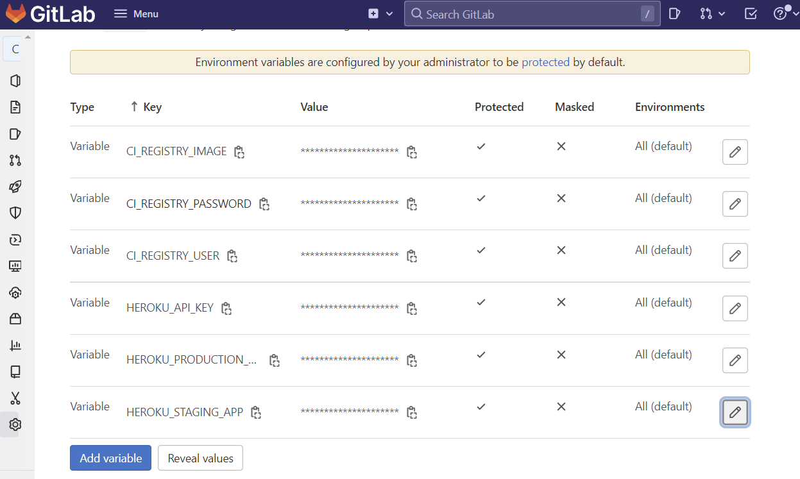
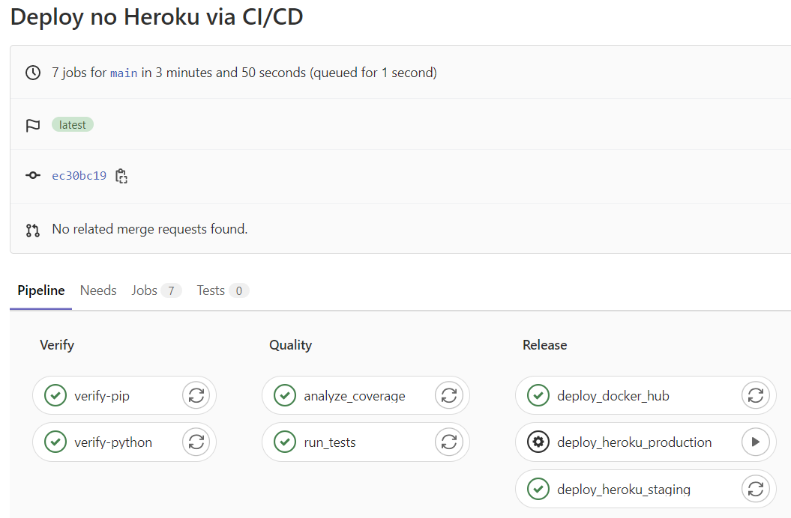
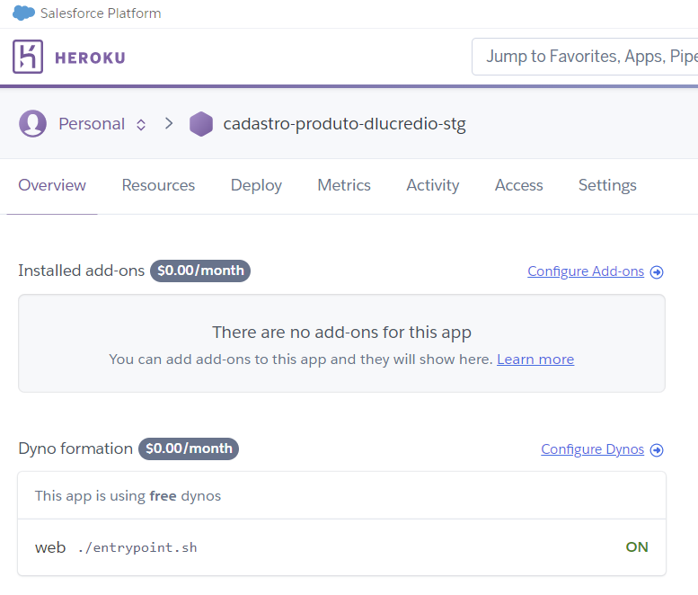

# 7.3 Implantação automática no Heroku

Vamos começar esta seção já colocando a mão na massa!

Comece entrando no Heroku e criando duas aplicações. Uma delas vai ser o ambiente _staging_, para testes e experimentação, e outra vai ser o ambiente de produção. Escolha nomes únicos, como no exemplo da figura:



Temos portanto duas aplicações, e iremos configurar o nosso _pipeline_ de CI/CD da seguinte maneira:

* `cadastro-produto-dlucredio-stg`: ambiente de _staging_. Sempre que houver um _commit_ no _branch_ chamado _main_, será construída uma imagem e enviada para essa aplicação.
* `cadastro-produto-dlucredio-prd`: ambiente de produção. Será configurado um _job_ para envio da imagem para essa aplicação, mas ele não será automático, e sim manual. A ideia é que alguém, manualmente, decida por fazer o _deploy_, possivelmente depois que a versão de _staging_ tiver sido testada exaustivamente. A princípio, não é muito diferente do que já fizemos anteriormente, porém aqui há a facilidade de estar tudo configurado no GitLab, ou seja, não há a necessidade sequer de haver o Docker instalado na máquina do desenvolvedor!

Vamos começar!

### Obtendo tokens de acesso para o Heroku

Acessando o seu perfil no Heroku (canto superior direito), clique em "Account settings", e depois encontre "API Key". Clique em "Reveal". Copie e cole esse valor.



Agora vá até o GitLab, entre no seu projeto, e selecione a opção "Settings" -> "CI/CD" -> "Variables". Já adicionamos 3 variáveis lá, que são os dados de acesso ao Docker Hub. Fizemos isso na [seção anterior](./7-2-implantacao-automatica-no-docker-hub.md). Adicione mais três:

* `HEROKU_API_KEY`: o valor é a chave que acabamos de copiar e colar
* `HEROKU_STAGING_APP`: coloque o nome do aplicativo de _staging_
* `HEROKU_PRODUCTION_APP`: coloque o nome do aplicativo de produção

Ao final, devemos ter seis variáveis configuradas. Todas elas estão disponíveis para os scripts de CI/CD:



Agora vamos modificar o arquivo de pipeline `.gitlab-ci.yml`:

```diff
default:
  image: python:3.9.6-slim

stages:
  - verify
  - quality
  - publish
+ - deploy 
 
variables:
  DOCKER_TLS_CERTDIR: ""

verify-python:
  stage: verify
  script:
    - python --version
    - whoami

verify-pip:
  stage: verify
  script:
    - pip install -r requirements.txt

run_tests:
  stage: quality
  script:
    - pip install -r requirements.txt
    - python -m unittest

analyze_coverage:
  stage: quality
  script:
    - pip install -r requirements.txt
    - coverage run -m unittest
    - coverage report --fail-under=100

deploy_docker_hub:
  image: docker:19.03.12
  stage: publish
  
  services:
    - docker:19.03.12-dind
  before_script:
    - docker login -u "$CI_REGISTRY_USER" -p "$CI_REGISTRY_PASSWORD"
  script:
    - docker build --pull -t "$CI_REGISTRY_IMAGE" .
    - docker push "$CI_REGISTRY_IMAGE"
  only:
    - main

+deploy_heroku_staging:
+  image: docker:19.03.12
+  stage: deploy
  
+  services:
+    - docker:19.03.12-dind
+  before_script:
+    - apk add --no-cache curl
+    - apk add --no-cache bash
+    - apk add --no-cache nodejs
+    - curl https://cli-assets.heroku.com/install.sh | sh
+    - docker login --username=_ -p "$HEROKU_API_KEY" registry.heroku.com
+  script:
+    - heroku container:push web --app $HEROKU_STAGING_APP
+    - heroku container:release web --app $HEROKU_STAGING_APP
+  only:
+    - main

+deploy_heroku_production:
+  image: docker:19.03.12
+  stage: deploy
  
+  services:
+    - docker:19.03.12-dind
+  before_script:
+    - apk add --no-cache curl
+    - apk add --no-cache bash
+    - apk add --no-cache nodejs
+    - curl https://cli-assets.heroku.com/install.sh | sh
+    - docker login --username=_ -p "$HEROKU_API_KEY" registry.heroku.com
+  script:
+    - heroku container:push web --app $HEROKU_PRODUCTION_APP
+    - heroku container:release web --app $HEROKU_PRODUCTION_APP
+  when: manual
+  only:
+    - main
```

Há dois novos _jobs_, um para implantação no ambiente de _staging_ e outro para implantação no ambiente de produção. Note como, para o ambiente de _staging_, o _job_ está configurado para rodar automaticamente assim que houver um _commit_ no _branch_ _main_ (configuração `only: main`). Isso significa que alterações em outros _branches_ não provocam um deploy automático.

Já o _job_ para implantação no ambiente de produção foi configurado `when: manual`. Isso significa que esse _job_ não irá rodar automaticamente em hipótese alguma. Ou seja, é necessário que alguém vá lá e dispare sua execução para efetuar o deploy.

Ambos os _jobs_ utilizam um preâmbulo (`before_script`) que faz o seguinte:
* instalar alguns pacotes auxiliares (curl, bash e nodejs)
* instalar a [CLI do Heroku via curl](https://devcenter.heroku.com/articles/heroku-cli)
* login no registro de contêineres do heroku

Em seguida os _jobs_ fazem a construção e envio da imagem, e seu _release_. Compare esses comandos com aqueles que vimos no final da [Seção 3.3](../3-producao/3-3-ambiente-de-producao-parte-2.md). São exatamente os mesmos, portanto nenhuma novidade aqui!

Estamos quase prontos para enviar as alterações. Porém, antes, precisamos alterar duas coisas.

Primeiro, como já fizemos antes no final da [Seção 3.3](../3-producao/3-3-ambiente-de-producao-parte-2.md), é preciso deixar a porta variável, pois o Heroku define a porta dinamicamente. Altere o `Dockerfile` para não mais exportar a porta 80 (o Heroku fará isso com uma porta aleatória):

```diff
-EXPOSE 80/tcp
+#EXPOSE 80/tcp
```

E também altere o arquivo `default`, para que o nginx não tenha uma porta fixa:

```diff
-listen 80;
+listen $PORT;
```

E por último, o arquivo `entrypoint.sh`, para substituir dinamicamente (na hora de subir o contêiner) o valor de `$PORT` no `default` pelo valor sorteado pelo Heroku e que será informado ao contêiner como uma variável de ambiente:

```diff
#!/bin/bash

gunicorn -w 4 -b 127.0.0.1:5000 app:app &

-nginx -g 'daemon off;' &
+sed -i -e 's/$PORT/'"$PORT"'/g' /etc/nginx/sites-available/default && nginx -g 'daemon off;' &
  
wait -n
  
exit $?
```

Isso nós já tínhamos feito lá na [Seção 3.3](../3-producao/3-3-ambiente-de-producao-parte-2.md).

A última mudança é a seguinte: como agora teremos dois ambientes diferentes, seria bom se, na página `cadastro.html` de cada versão (_staging_ e produção), a requisição à API HTTP fosse direcionada à sua respectiva versão. Até agora estivemos usando um endereço fixo no comando `fetch`. É hora de mudarmos isso. Altere a linha do arquivo `cadastro.html` da seguinte forma:

```diff
-            fetch("http://127.0.0.1:8080/api/predizer_categoria", {
+            fetch("api/predizer_categoria", {
```

Com isso, o navegador irá automaticamente fazer a requisição de maneira relativa ao local onde a página está hospedada. Dessa forma, o mesmo código Javascript irá funcionar em qualquer ambiente, basta que a API esteja definida embaixo da URL `/api`, que foi o que fizemos no nginx.

Pronto, vamos enviar as mudanças:

```sh
git commit -am "Deploy no Heroku via CI/CD"
git push
```

Aguarde até que o pipeline seja bem sucedido:



Repare que apenas o deploy no ambiente de _staging_ foi executado. O outro foi configurado para ser executado manualmente. Faça isso agora, clicando no símbolo de "play" ao lado do _job_. Aguarde até que o mesmo execute corretamente e vamos checar lá no Heroku para ver se deu tudo certo:



Sim, na figura acima podemos ver que o serviço `web ./entrypoint.sh` está "ON". Agora vamos testar. Abra o navegador e teste os dois endereços:

`https://cadastro-produto-dlucredio-prd.herokuapp.com/`

`https://cadastro-produto-dlucredio-stg.herokuapp.com/`

Se estiver tudo funcionando, significa que conseguimos completar o ciclo de DevOps!