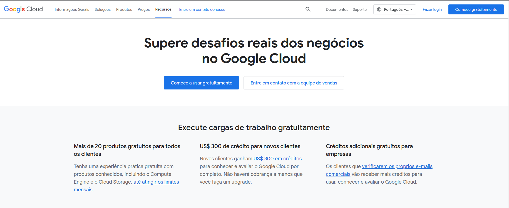
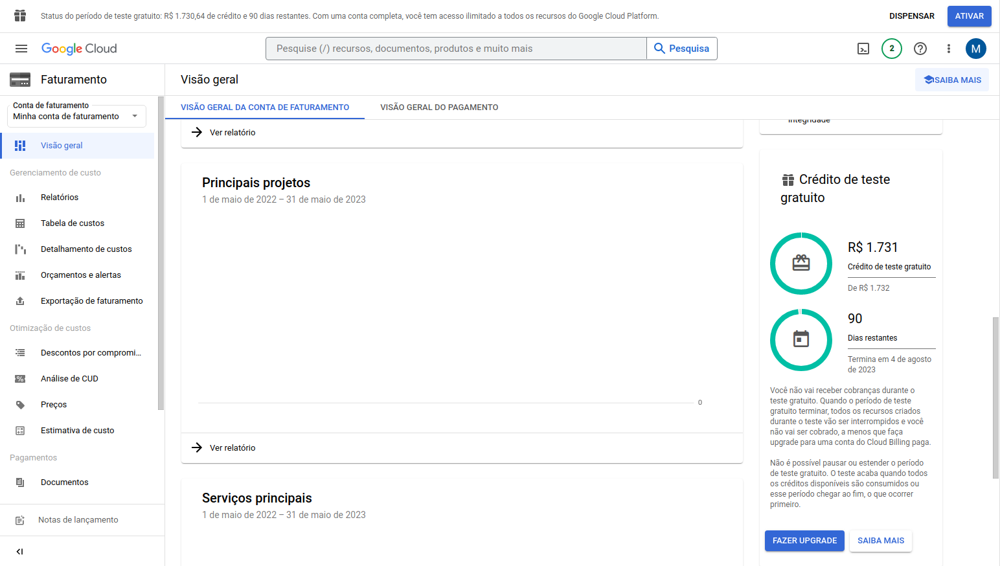
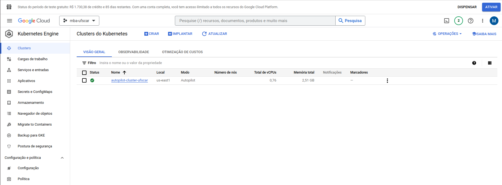
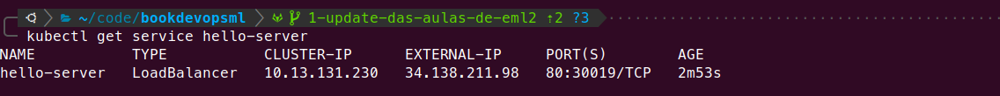
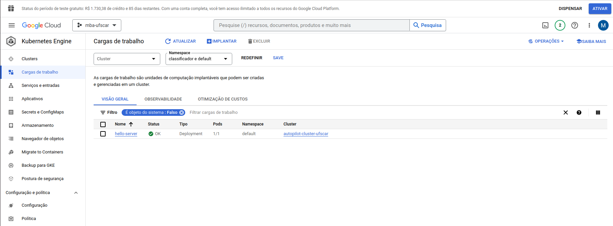
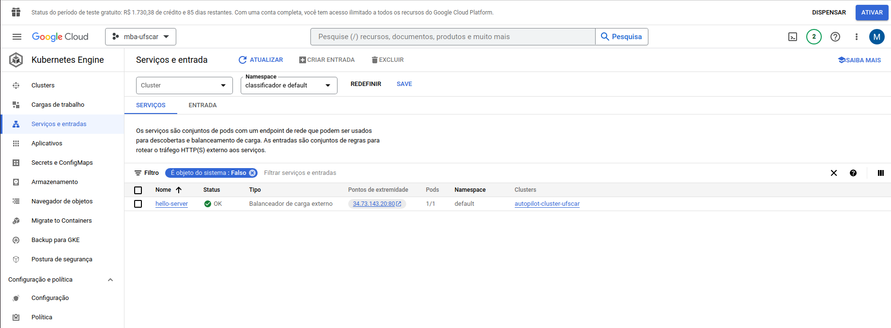
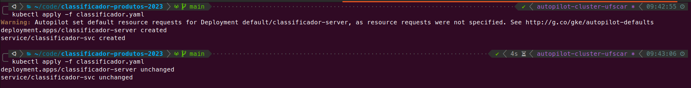

# 7.4 Implantação automática no Google Kubernetes Engine (GKE)

Para automatizar nosso fluxo de entrega e integração, vimos nas seções passadas que as automações são, geralmente, realizadas em servidores. Assim, levamos o versionamento de código para um repositório centralizado: Gitlab. Também publicamos a nossa imagem Docker em um repositório centralizado: Docker Hub. Por fim, vamos servir nosso classificador em um serviço de Kubernetes e não mais na nossa própria máquina.

Para fins didáticos, vamos buscar um serviço de Kubernetes que possa ser utilizado de forma gratuita. O link abaixo nos apresenta algumas opções:

[Opções Free Tier de Kubernetes](https://github.com/learnk8s/free-kubernetes)

Nesse tutorial utilizaremos a Google Kubernetes Engine (GKE) da Google Cloud Platform (GCP).

## 7.4.1 Setup

### Configurando uma conta Google Cloud

O primeiro passo para provisionarmos um cluster Kubernetes é criarmos uma conta na google cloud.



Através desse [link](https://cloud.google.com/free?hl=pt-br) você pode configurar a sua conta. Para **novos usuários**, a GCP oferece U$300 de crédito para o uso de alguns serviços.

> **ATENÇÃO**: 
> Uma ferramenta cloud possui políticas de [preço](https://cloud.google.com/products/calculator?hl=pt-br) para cada serviço, então esteja sempre atento aos serviços que você está utilizando. De preferência, elimine os objetos criados após a aula para evitar cobranças inesperadas.

Para conferir os seus créditos e o período de trial, acesse o Menu do console > Faturamento > Visão Geral.




### Utilizando e Instalando a Gcloud CLI

Para interagir com os serviços da GCP, podemos utilizar a UI do console Web ou podemos utilizar o terminal com o utilitário de linha de comando [gcloud](https://cloud.google.com/sdk/gcloud?hl=pt-br).

É recomendado o uso do utilitário gcloud, pois permite a reproducibilidade e automação das configurações que estamos realizando futuramente.

Temos duas opções para utilizar o gcloud CLI:
1. Via terminal do [Cloud Shell](https://cloud.google.com/shell/docs/launching-cloud-shell?hl=pt-br)
2. Via terminal da nossa estação de trabalho: [Guia de instalação](https://cloud.google.com/sdk/docs/install?hl=pt-br#deb)

**Quickstart da configuração local**

Para configuração local, devemos adicionar o pacote adicional gke-auth:

```shell
sudo apt-get install google-cloud-cli-gke-gcloud-auth-plugin
```

Na sequência, finalizamos a configuração da CLI com o comando abaixo:

```shell
gcloud init
```
Uma vez configurada, podemos listar a contas autenticadas:

```shell
gcloud auth list
```

Também podemos verificar informações da instalação:

```shell
gcloud info
```


### Criando um cluster GKE

Agora que já temos o pré-requisito da gcloud CLI atendido, podemos criar um cluster GKE usando a linha de comando:


1. Primeiro vamos criar um projeto
```shell
gcloud projects create mba-mle-ufscar --name="mba-mle-ufscar"

```
2. Vamos ativar esse projeto
```shell
gcloud config set project mba-mle-ufscar
```
3. Habilitando o uso da API do GKE
```shell
gcloud services enable container.googleapis.com
```
4. Conferindo se o serviço está habilitado
```shell
gcloud services list --enabled
```
5. Criando um cluster no formato [Autopilot](https://cloud.google.com/kubernetes-engine/docs/concepts/autopilot-overview?hl=pt-br)
```shell
gcloud container clusters create-auto "autopilot-cluster-ufscar" --region "us-east1"
```
6. Conferindo o status do nosso cluster Kubernetes
```shell
gcloud container clusters list
```

Podemos conferir também pela UI, usando a rota: Console GCP > Kubernetes Engine > Clusters



## 7.4.2 Realizando o deploy na nuvem de forma manual

Como fizemos nas seções anteriores, vamos primeiro realizar a implantação do nosso serviço "classificador" de forma manual para entendermos todos os passos e requisitos necessários. Assim, ficará mais claro como deve ser formato o script de automação.

### Configurando o Kubectl

Como vimos na [sessão 5.3](../5-infraestrutura-como-codigo-e-orquestracao/5-3-kubernetes.md), para interagir e realizar o deploy de aplicações no Kubernetes, podemos utilizar o utilitário de linha de comando **kubectl**. Portanto, se você ainda não realizou a instalação desse binário volte na sessão mencionada e siga o tutorial de instalação.

Conferindo a instalação do kubectl:

```shell
kubectl version
```

Configurando os parâmetros de acesso ao GKE Cloud:
```shell
gcloud container clusters get-credentials autopilot-cluster-ufscar
```

Agora podemos fazer um deployment "hello-world" para validar a configuração
```shell
kubectl create deployment hello-server --image=matheusvmleite/classificador-produtos
```


Agora, vamos expor o serviço do classificador para acesso público:
```shell
kubectl expose deployment hello-server --type LoadBalancer --port 80 --target-port 80
```

Podemos validar o nosso serviço classificador entrando no endereço IP onde nossa aplicação está exposta:
```shell
kubectl get service hello-server
```

Devemos ter um output com o External IP que podemos usar no nosso navegador para validar a aplicação



Também podemos analisar o output em yaml dos serviços criados, pois isso vai nos auxiliar na automação:

```shell
kubectl get svc hello-server -o yaml
```

Na interface do GKE, podemos conferir o deployment criado pela rota: Console GCP > Kubernetes Engine > Cargas de trabalho:



Também na UI, podemos conferir os serviços criados e ter fácil acesso ou link do serviço pela rota: Console GCP > Kubernetes Engine > Serviços e Entradas:




Pra finalizar, vamos deletar os objetos criados:
```shell
kubectl delete svc,deploy hello-server
```

### Criando manifestos YAML

Para implantar nossa aplicação no GKE de forma consistente e automatizada, vamos precisar usar um arquivo manifesto YAML para definir o estado desejado dos recursos do Kubernetes.

Crie o arquivo `classificador.yaml` com a seguinte especificação:

```yaml
apiVersion: apps/v1
kind: Deployment
metadata:
  name: classificador-server
  labels:
    app: api
spec:
  replicas: 1
  selector:
    matchLabels:
      app: api
  template:
    metadata:
      labels:
        app: api
    spec:
      containers:
      - name: api
        image: matheusvmleite/classificador-produtos
        ports:
        - containerPort: 80

---

apiVersion: v1
kind: Service
metadata:
  name: classificador-svc
spec:
  selector:
    app: api
  type: LoadBalancer
  ports:
    - protocol: TCP
      port: 80
      targetPort: 80
```


Esse arquivo especifica dois objetos: Deployment e Service. O deployment faz o uso da imagem que estamos utilizando no curso para rodar a API do nosso classificador de produtos. Já o Service expõe essa API para acesso público por meio de um LoadBalance.


### Criando objetos no K8S

Após criar os manifestos dos objetos que vamos criar no GKE, basta utilizarmos o comando abaixo para realizar o deploy:

```shell
kubectl apply -f classificador.yaml
```

Podemos validar nossa aplicação listando o serviço criado e acessando o external IP.

Finalizado o teste do deploy manual, basta remover o deployment:
```shell
kubectl delete -f classificador.yaml
```


## 7.4.3 Automatizando o deploy na Nuvem

Com toda experimentação que realizamos, alguns pré-requisitos para a automação do nosso deploy ficam claros:

1. Precisamos dos binários da gcloud e do kubectl
2. Precisamos de uma autenticação na GCP
3. Precisamos da configuração do cluster GKE no kubectl

Na sequência, vamos resolver cada um desses items e criar nossa automação. 

### Configurando uma conta de serviço

No deploy manual utilizamos nossa credencial pessoal para realizar a autenticação com o GCP. Na prática, automações de serviços cloud devem utilizar contas de serviço para se autenticar.

Para criar uma conta de serviço, podemos seguir os passos abaixo:

1. Criar uma conta de serviço
```shell
gcloud iam service-accounts create gitlab-gke \ 
--description "Conta para pipeline Gitlab" --display-name "gitlab-gke"
```

Uma identificação será criada para a conta de serviço com o seguinte padrão:

```
my-service-account@my-project.iam.gserviceaccount.com
```

No caso de uma conta com o nome "gitlab-gke" e projeto com nome "mba-ufscar":

```
gitlab-gke@mba-ufscar.iam.gserviceaccount.com
```

2. Adicionar permissão de Agente de Serviço de Kubernetes Engine
```shell
gcloud projects add-iam-policy-binding mba-ufscar \ --member="serviceAccount:gitlab-gke@mba-ufscar.iam.gserviceaccount.com" \
 --role="roles/container.serviceAgent"
```
3. Criar uma chave json de acesso
```shell
 gcloud iam service-accounts keys create ./key.json --iam-account cgitlab-gke@mba-ufscar.iam.gserviceaccount.com
```
4. Encondar chave de acesso em base64
```shell
base64 -w 0 key.json > encoded_key.json
```


### Criando uma variável no Gitlab com a chave de acesso

Agora, vamos utilizar o conteúdo do arquivo json encoded para criar nossa variável de ambiente no gitlab. Pra isso:

1. Acessar opção "Settings" no menu lateral do repositório no Gitlab
2. Opção CI/CD
3. Seção "Variables"
4. Criar a variável `GKE_SERVICE_ACCOUNT` com o conteúdo base64 do arquivo json.


### Adicionando script de automação para o pipeline

Com todos os pré-requisitos configurados, podemos enfim atualizar o nosso arquivo `.gitlab-ci.yaml`:

```diff
default:
  image: python:3.9.6-slim


stages:
  - verify
  - quality
  - publish
+ - deploy

verify-python:
  stage: verify
  script:
    - python --version
    - whoami

verify-pip:
  stage: verify
  script:
    - pip --version

run-tests:
  stage: quality
  script:
    - pip install -r requirements.txt
    - python -m unittest


analyze-coverage:
  stage: quality
  script:
    - pip install -r requirements.txt
    - coverage run -m unittest
    - coverage report --fail-under=100 -m


publish-docker-hub:
  image: docker:19.03.12
  stage: publish  
  services:
    - docker:19.03.12-dind
  before_script:
    - docker login -u "$CI_REGISTRY_USER" -p "$CI_REGISTRY_PASSWORD"
  script:
    - docker build --pull -t "$CI_REGISTRY_IMAGE" .
    - docker push "$CI_REGISTRY_IMAGE"
  only:
    - main


+gcloud-deploy:
+  stage: deploy
+  image: google/cloud-sdk
+  script:
+    - echo $GKE_SERVICE_ACCOUNT | base64 -d > ~/encoded_serviceaccount.json
+    - gcloud auth activate-service-account --key-file ~/encoded_serviceaccount.json
+    - gcloud container --project "mba-ufscar" clusters get-credentials autopilot-cluster-ufscar --region us-east1
+    - kubectl apply -f classificador.yaml
+  only:
+    - main

```


Essa alteração adiciona uma stage de deploy que será responsável por criar a nossa aplicação dentro do GKE.

De forma detalhada, o script cumpre as seguintes funções:

1. Cria um arquivo de autenticação com a CLI do gcloud.
2. Autentica com a Google Cloud usando a conta de serviço configurada
3. Configura o cluster 'autopilot-cluster-ufscar' pra ser utilizado pelo utilitário kubectl
4. Aplica os manifestos dos objetos do Kubernetes, efetivando o deploy.

### Melhorando o deploy

Na nossa automação estamos utilizando o comando de apply para criar a nossa aplicação.

Porém, como não estamos versionanda as imagens docker com tags, nas próximas execuções do pipeline vamos nos deparar com um cenário indesejado. Ao realizar o apply de uma imagem com o mesmo nome, os manifestos yaml não apresentam nenhuma alteração. Assim, o Kubernetes entender que não alterações a serem aplicadas.




Para corrigir esse cenário, vamos criar um script bash chamado `apply_and_restart.sh` que irá verificar se após o commando `apply` temos um output de deployment `unchanged`. Se esse for o cenário encontrado, faremos um restart do deployment. Isso irá forçar que o Kubernetes sempre baixe a versão do classificador mais recente disponível no Docker Hub.

```bash
#!/bin/bash

DEPLOYMENT_NAME="classificador-server"

# Apply the deployment and capture the output
output=$(kubectl apply -f classificador.yaml)

echo $output

# Check if the output contains "unchanged"
if [[ $output == *"unchanged"* ]]; then
    echo "No changes detected. Performing rollout restart..."
    kubectl rollout restart deployment $DEPLOYMENT_NAME
else
    echo "Changes detected. Deployment not restarted."
fi
```

Por fim, basta adicionar a chamada do script na nossa automação de CI/CD:

```diff
default:
  image: python:3.9.6-slim


stages:
  - verify
  - quality
  - publish
  - deploy

verify-python:
  stage: verify
  script:
    - python --version
    - whoami

verify-pip:
  stage: verify
  script:
    - pip --version

run-tests:
  stage: quality
  script:
    - pip install -r requirements.txt
    - python -m unittest


analyze-coverage:
  stage: quality
  script:
    - pip install -r requirements.txt
    - coverage run -m unittest
    - coverage report --fail-under=100 -m


publish-docker-hub:
  image: docker:19.03.12
  stage: publish  
  services:
    - docker:19.03.12-dind
  before_script:
    - docker login -u "$CI_REGISTRY_USER" -p "$CI_REGISTRY_PASSWORD"
  script:
    - docker build --pull -t "$CI_REGISTRY_IMAGE" .
    - docker push "$CI_REGISTRY_IMAGE"
  only:
    - main


gcloud-deploy:
  stage: deploy
  image: google/cloud-sdk
  script:
    - echo $GKE_SERVICE_ACCOUNT | base64 -d > ~/encoded_serviceaccount.json
    - gcloud auth activate-service-account --key-file ~/encoded_serviceaccount.json
    - gcloud container --project "mba-ufscar" clusters get-credentials autopilot-cluster-ufscar --region us-east1
-   - kubectl apply -f classificador.yaml
+   - bash apply_and_restart.sh
  only:
    - main

```

## 7.4.4 Limpando nosso ambiente cloud

Como falamos no início dessa seção, é importante ter ciência das cobranças envolvidas em um ambiente cloud. Para finalizar nossa aula e evitar cobranças indevidas, vamos remover nosso cluster kubernetes utilizando a gcloud cli:

```bash
gcloud container clusters delete CLUSTER_NAME
```

Documentação oficial: [Como excluir um cluster GKE](https://cloud.google.com/kubernetes-engine/docs/how-to/deleting-a-cluster?hl=pt-br#gcloud)

## 7.4.5 Conclusão e próximos passos

Nesta seção demonstramos como configurar um ambiente de deploy Kubernetes na cloud com o serviço GKE. Também passamos por todo o passo a passo de automação desses tipos de deployment.

Apesar de ser um cenário inicial, os conceitos aplicados aqui permitem uma série de melhorias que podem ser utilizadas tanto em casos práticos como na continuidade da exploração de Continuous Deployment com esse exemplo. Seguem algumas sugestões:

* Como configurar um ambiente de homologação e automatizar o deploy com múltiplas etapas
* Como versionar as imagens docker por meio de tags de forma automatizada
* Como criar templates de manifestos yaml de objetos Kubernetes para realizar configurações dinâmicas
* Como adicionar probes na aplicação e automatizar um smoke test após deployment
* Como realizar o rollback automático nos casos de deploys mal sucedidos
* Como otimizar o tempo de execução do pipeline
