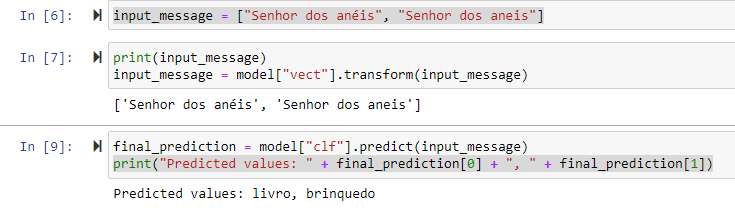
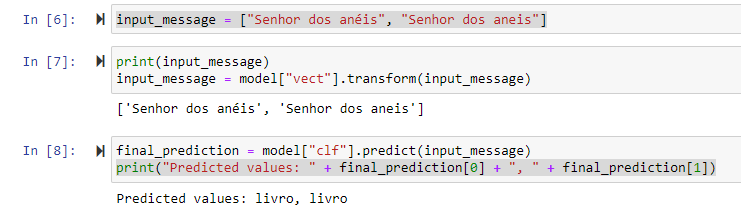
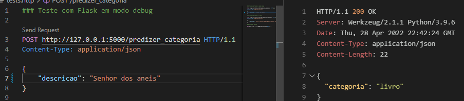
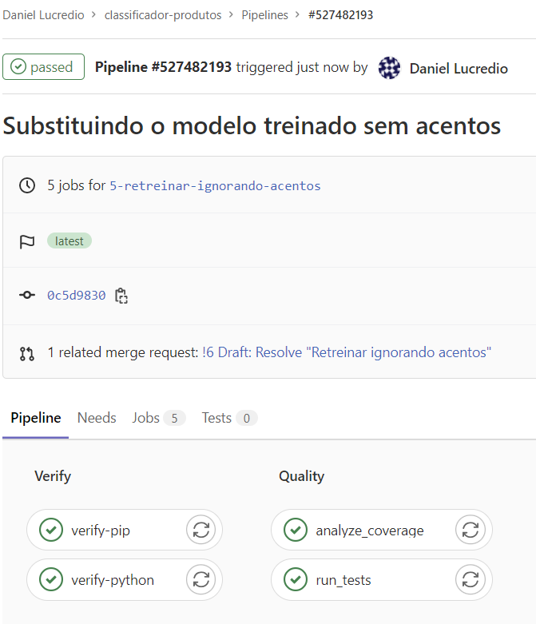
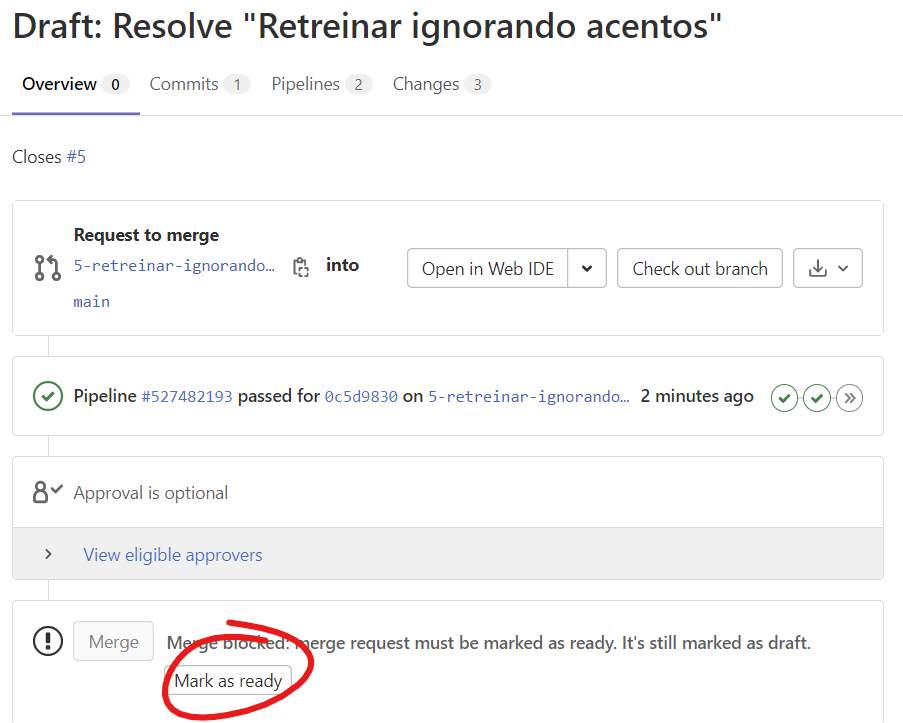
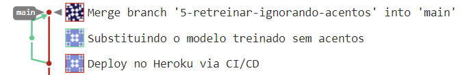
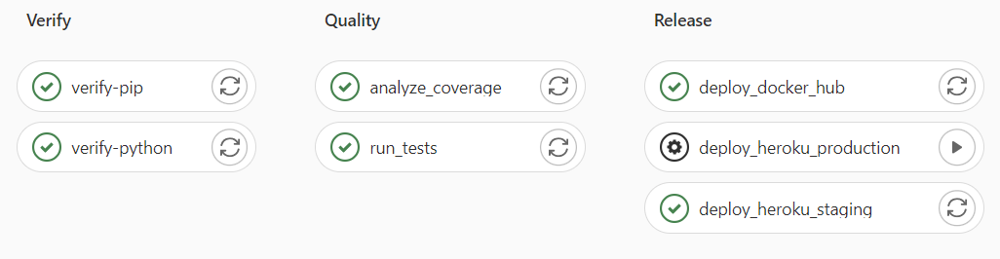
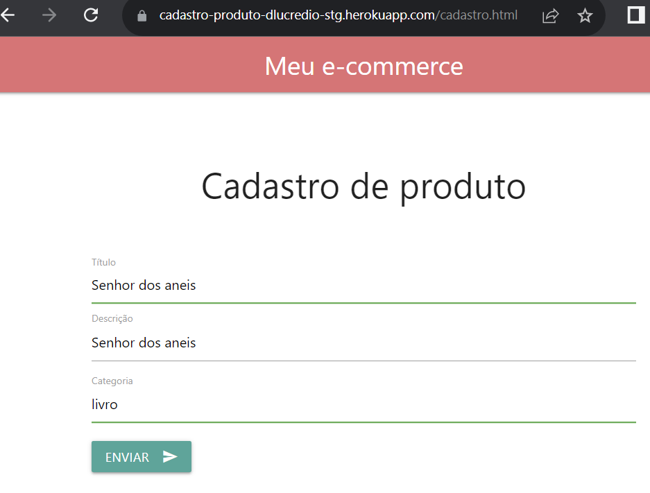
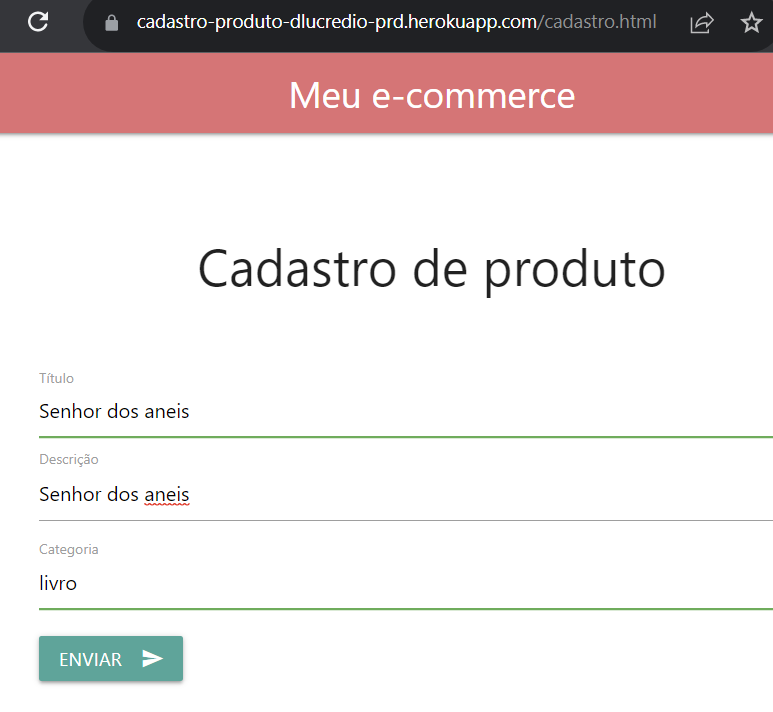

# 7.5 Testando tudo junto

Vamos simular um ciclo completo nessa já conhecida figura:


### Criando um _issue_

Entre no GitLab e crie um novo _issue_:

Título: Retreinar ignorando acentos

Descrição: O modelo de classificação de produtos parece estar errando quando há acentos. Por exemplo, "senhor dos anéis" é corretamente reconhecido como um livro, mas "senhor dos aneis" é reconhecido como um brinquedo.

Na página do _issue_, já clique em "Create merge request", junto com um _branch_. Na nova página do _merge request_, veja que o título aparece com um prefixo "Draft:". Isso indica que esse _merge request_ é apenas um rascunho, o que é ótimo, pois nem sequer começamos a trabalhar nele. Deixe assim e confirme a criação.

A primeira coisa que faremos, segundo as boas práticas, é reproduzir o problema. Para isso, vamos criar um caso de teste que demonstra a situação que leva ao erro. Mas antes não podemos nos esquecer de trocar para o _branch_ novo.

```sh
git pull
git switch 5-retreinar-ignorando-acentos
```

Agora sim, vamos criar um caso de teste e adicioná-lo aos nossos testes. Modifique o arquivo `test_api.py`:

```diff
import unittest
from app import app
import json

class TestAPI(unittest.TestCase):
    def setUp(self) -> None:
        self.app_client = app.test_client()

    def test_brinquedo(self):
        response = self.app_client.post('/predizer_categoria',
                            json={'descricao':'soldadinhos de plástico'})
        cat = json.loads(response.data.decode('utf-8')).get("categoria")
        assert cat == 'brinquedo'

    def test_maquiagem(self):
        response = self.app_client.post('/predizer_categoria',
                            json={'descricao':'batom vermelho'})
        cat = json.loads(response.data.decode('utf-8')).get("categoria")
        assert cat == 'maquiagem'

    def test_game(self):
        response = self.app_client.post('/predizer_categoria',
                            json={'descricao':'dark souls'})
        cat = json.loads(response.data.decode('utf-8')).get("categoria")
        assert cat == 'game'

    def test_livro(self):
        response = self.app_client.post('/predizer_categoria',
                            json={'descricao':'O senhor dos anéis'})
        cat = json.loads(response.data.decode('utf-8')).get("categoria")
        assert cat == 'livro'

+    def test_livro_sem_acento(self):
+        response = self.app_client.post('/predizer_categoria',
+                            json={'descricao':'O senhor dos aneis'})
+        cat = json.loads(response.data.decode('utf-8')).get("categoria")
+        assert cat == 'livro'

    def test_health_check(self):
        response = self.app_client.get('/health_check')
        assert response.data.decode('utf-8') == 'alive'
```

Execute os casos de teste, e veja que de fato o erro acontece:

```sh
python -m unittest
======================================================================
FAIL: test_livro_sem_acento (test_api.TestAPI)
----------------------------------------------------------------------
Traceback (most recent call last):
  File "C:\Users\dlucr\PythonProjects\testeEmCasa2\classificador-produtos-reprise\test_api.py", line 37, in test_livro_sem_acento
    assert cat == 'livro'
AssertionError

----------------------------------------------------------------------
Ran 6 tests in 0.014s

FAILED (failures=1)
```

Agora vamos tentar resolver o problema. Para isso, é interessante retomar o notebook original e tentar ajustar algo por lá. Caso não tenha mais o ambiente, volte até a [Seção 2.1.1](../2-desenvolvimento/2-1-do-notebook-para-aplicacao-parte-1.md) e refaça o processo como explicamos lá.

Já vimos que o problema existe, e reproduzimos em um caso de teste. Mas vamos reproduzir o problema aqui também, no notebook, para facilitar nossa vida. No final do notebook, altere:

```diff
-input_message = ["Figura Transformers Prime War Deluxe - E9687 - Hasbro"]
+input_message = ["Senhor dos anéis", "Senhor dos aneis"]
print(input_message)
input_message = model["vect"].transform(input_message)
-final_prediction = model["clf"].predict(input_message)[0]
+final_prediction = model["clf"].predict(input_message)
-print("Predicted value: " + final_prediction)
+print("Predicted values: " + final_prediction[0] + ", " + final_prediction[1])
```

Estamos simplesmente testando de uma só vez a predição para as duas grafias de "Senhor dos anéis", com e sem acento. O resultado, como já sabíamos, é que a predição muda (com acento é livro, sem acento é brinquedo):



Para retirar os acentos durante o treinamento (o que em teoria resolve o problema), podemos utilizar o pacote [Unidecode](https://pypi.org/project/Unidecode/). Entre outras coisas, ele despreza caracteres que tem acento, substituindo por suas alternativas sem acento.

Altere o notebook nos seguintes locais:

```diff
import sys 
!{sys.executable} -m pip install nltk 
!{sys.executable} -m pip install matplotlib
!{sys.executable} -m pip install seaborn
!{sys.executable} -m pip install sklearn
+!{sys.executable} -m pip install unidecode

...

import pandas as pd
import nltk
from nltk.corpus import stopwords
+from unidecode import unidecode

...

stop_words=set(stopwords.words("portuguese"))
# transforma a string em caixa baixa e remove stopwords

-products_data['sem_stopwords'] = products_data['informacao'].str.lower().apply(lambda x: ' '.join([word for word in x.split() if word not in (stop_words)]))
+products_data['sem_stopwords'] = products_data['informacao'].str.lower().apply(lambda x: ' '.join([unidecode(word) for word in x.split() if word not in (stop_words)]))

```

Execute novamente o notebook e veja que agora a predição é a mesma, independentemente do acento:



Se você estiver rodando o notebook modificado na [Seção 2.1](../2-desenvolvimento/2-1-do-notebook-para-aplicacao-parte-1.md), ele já terá salvo o modelo no arquivo `model.sav`. Caso contrário, faça as modificações novamente:

```diff
from sklearn.naive_bayes import MultinomialNB
+ # Biblioteca para salvar objetos Python em disco
+ import pickle

clf = MultinomialNB()
clf.fit(dataset["X_train"], dataset["y_train"])

model = {
    "clf" : clf,
    "vect": dataset["vect"]
}
+ # Salva o modelo em um arquivo
+ pickle.dump(model, open("model.sav", 'wb'))
```

Após a execução, um novo arquivo `model.sav` será salvo, e temos que copiá-lo para a pasta do projeto. Feito isso, execute os testes novamente, e confirme que agora estamos passando em todos eles.

Vamos também testar para ver se o sistema continua funcionando, e se não quebramos algo. O primeiro teste pode ser usando o próprio modo DEBUG do Flask:

```sh
flask run
```

Enviando um POST simples, vemos que aparentemente funcionou:



Tudo deu certo, e o melhor é que não quebramos nenhum dos testes que já estavam passando. Ainda podemos testar com o mesmo ambiente que estará rodando em produção, fazendo uso do Docker. Apesar de já termos testado usando Flask, no ambiente final lembre-se que temos ainda outros componentes, como o gunicorn e o nginx. Então faz sentido testar com tudo isso integrado.

Lembrando que alteramos nossa imagem para que a porta seja especificada em uma variável de ambiente, vamos construir a imagem e subir o contêiner especificando a porta como uma variável de ambiente, como o Heroku faria:

```sh
docker build -t dlucredio/classificador-produtos .
docker run -d -p 8080:9361 --env PORT=9361 --rm --name classificador-produtos-container dlucredio/classificador-produtos
```

No exemplo, sorteamos a porta 9361. Veja como passamos isso para o contêiner por meio do parâmetro `--env PORT=9361`. E estamos mapeando isso para a porta 8080 da máquina hospedeira. No Heroku, isso é mapeado para a porta 80.

Teste, acessando no navegador o endereço `http://localhost:8080`, e veja que tudo está funcionando.

Então já podemos fazer o envio das mudanças para o GitLab:

```sh
git commit -am "Substituindo o modelo treinado sem acentos"
git push
```

Neste momento, nosso pipeline CI/CD já deve ter começado a executar. Vamos lá conferir no GitLab:



Sucesso! Testes e cobertura foram verificados e não causamos nenhum problema!

Veja que os estágios de _release_ não foram executados, pois eles foram configurados para rodar somente no _branch_ _main_, lembra? Portanto, na verdade o que rodou foi apenas a parte de CI.

Agora é o momento de revisar e aprovar o _merge request_. Abra-o e veja que ele está marcado como "draft". Clique em "Mark as ready":



Agora clique em "Merge" (lembrando que em um ambiente corporativo provavelmente é outra pessoa que irá fazer isso, verificando as mudanças, conferindo se os pipelines estão passando, etc.). Isso irá disparar o pipeline novamente, e agora ele inclui a parte de CD. Em breve a nova versão estará pronta e implantada no Heroku para testarmos.

Enquanto o pipeline é executado, aproveite para ver o gráfico e conferir a ordem dos _commits_:



Depois de um tempo, os _jobs_ completam, exceto pelo deploy em produção, pois deixamos este para ser executado manualmente, lembra?



Vamos fazer um último teste. Entre no ambiente de _staging_ e faça mais testes. Neste momento, uma boa ideia é chamar usuários e colocá-los para usar o sistema em sua nova versão, sem ainda mexer na versão oficial:



Assim que estiver satisfeito, basta retornar ao pipeline, executar o deploy em produção, e a versão oficial passará a contar com as melhorias implementadas.



### Considerações finais

Pare um pouco e respire. Olhe novamente a figura que começou este livro (prometemos que será a última vez):


Andamos por um longo caminho, não? Agora temos um ciclo completo, que agiliza todo processo de implantação e entrega de mudanças, desde os testes até chegar em um servidor na nuvem.

Fizemos aqui exemplos concretos, com tecnologias reais. É claro que existem outras alternativas para tudo o que vimos aqui. Algumas pagas, outras gratuitas. Umas mais simples, outras mais complexas. O importante é entender os conceitos e o princípio, que não mudam.

Também é importante ressaltar que seguimos um caminho simplificado. Não abordamos questões mais complexas, como verificações adicionais, notificações, configurações mais complexas de ambientes.

Também não abordamos a questão do versionamento, desde o código até as imagens no Docker. É uma boa prática nomear corretamente todas as versões, seguindo uma política bem estabelecida e respeitada.

Mas esperamos que você tenha aproveitado o que aprendeu até aqui, e que consiga agora compreender o que está envolvido no conceito de CI/CD.

Porém, ainda há o que aprender. Tudo o que fizemos aqui, de certa forma, não tem muitas especificidades exclusivas do aprendizado de máquina. Então, no fundo, estivemos falando de DevOps, e não de MLOps. É esse o caminho que iremos trilhar a seguir.