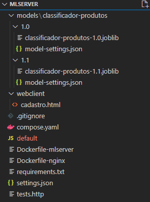
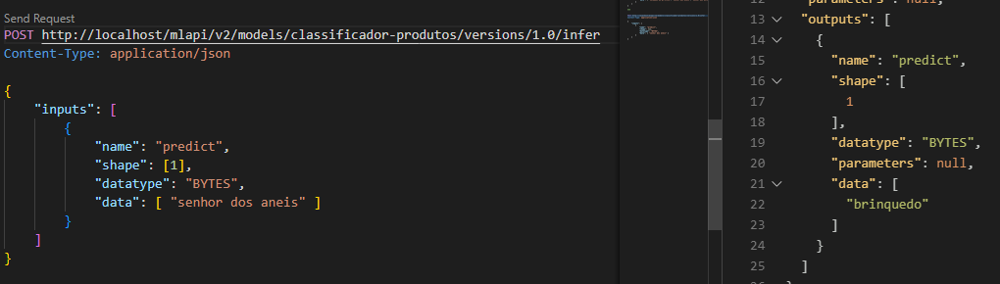
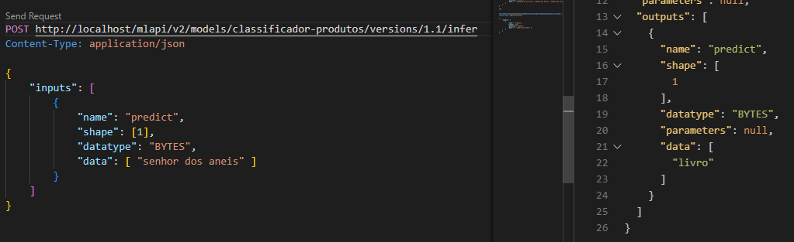
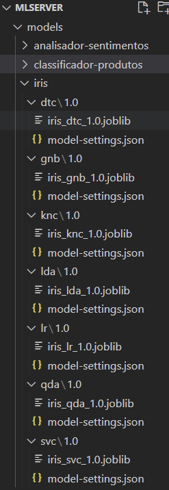
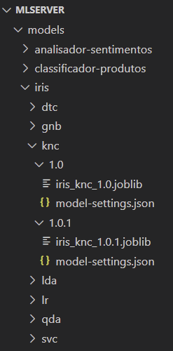

# 8.2 Model serving com MLServer

Vamos começar com algo simples, que o leitor já está familiarizado, apresentando uma alternativa de tecnologia para servir modelos.

Para estes exemplos, vamos utilizar um servidor de modelos chamado [MLServer](https://MLServer.readthedocs.io/). Trata-se de um projeto _open source_ que torna a tarefa de servir modelos um pouco mais simples do que temos feito até agora. Ele segue o modelo de uma API, que é o que fizemos nas Seções [2.2](../2-desenvolvimento/2-2-do-notebook-para-aplicacao-parte-2.md), [3.3](../3-producao/3-3-ambiente-de-producao-parte-2.md) e os capítulos 6 e 7. Portanto, ele não serve, a princípio, para tarefas _offline_ ou para um modelo baseado em eventos como os demais exemplos que fizemos. Mas considerando que APIs são a forma mais comum para servir modelos, podemos dizer que ele atende bem a uma grande variedade de cenários. Em resumo, o MLServer vai substituir o que fizemos com Flask e gunicorn nas referidas seções.

Antes de entrar no código e colocar a mão na massa, é importante destacar alguns aspectos. Primeiro, o MLServer pode sim substituir o Flask, ou FastAPI, com gunicorn e nginx. Sua principal vantagem, como você verá, é a simplicidade. Ele exige menos código. O MLServer também traz uma alternativa ao HTTP, que é o [grpc](https://grpc.io/), um formato e protocolo mais eficientes e que facilita a escrita de clientes, em comparação com uso de REST e JSON. Ao utilizar MLServer, você terá as duas opções de conexão, automaticamente.

Outra vantagem grande de utilizar um servidor de modelos é que você pode manter, em um único servidor, uma grande quantidade de modelos. Assim, ao invés de criar uma imagem para cada modelo, que vai ocupar uma máquina virtual (ou um nó de um _cluster_), é possível compartilhar recursos, o que pode ser essencial caso a quantidade de modelos em produção seja muito grande.

Existem algumas desvantagens. A arquitetura WSGI com nginx que vimos aqui é mais robusta e preparada para uma carga maior de acessos. Além disso, seguindo por esse caminho e construindo uma API a partir do zero, temos total controle sobre os _endpoints_. Podemos escolher o formato das mensagens, a arquitetura de execução, acrescentar _endpoints_ customizados, entre outros exemplos. Caso o projeto exija esse tipo de detalhe, a funcionalidade padrão do MLServer pode ser insuficiente.

Mas podemos seguramente dizer que, caso seu projeto possa ser atendido pelo que o MLServer oferece, é uma opção muito atraente e simples de utilizar, além de ter a vantagem de possibilitar a hospedagem de múltiplos modelos em um único local. Vamos lá ver como funciona?

## 8.2.1 Subindo um primeiro modelo

Vamos retomar o exemplo do classificador de produtos. Comece fazendo novamente o download dos dois arquivos a seguir. São os mesmos que já utilizamos na [Secão 2.1](../2-desenvolvimento/2-1-do-notebook-para-aplicacao-parte-1.md):

* [produtos.csv](codigo/classificador-produtos/produtos.csv) - conjunto de dados anotado contendo produtos e sua classificação. Existem quatro categorias de produtos neste conjunto: game, maquiagem, brinquedo e livro
* [produtos.ipynb](codigo/classificador-produtos/produtos.ipynb) - notebook com a solução para classificação de produtos

Crie um ambiente virtual e uma pasta chamada `notebooks` para abrir o notebook (instale jupyter notebook nesse ambiente), tente executá-lo para certificar-se que está tudo funcionando, antes de seguir adiante.

O MLServer consegue servir modelos com base em diferentes tecnologias, incluindo [Scikit-Learn, XGBoost, HuggingFace, entre outros](https://MLServer.readthedocs.io/en/latest/runtimes/index.html). Como nosso modelo de classificação de produtos é baseado no Scikit-learn, ele é compatível com o MLServer.

O processo depende da existência de uma função chamada `predict`, que deve existir no modelo salvo. Além disso, deve existir um único objeto, que deve ser salvo utilizando a biblioteca [joblib](https://joblib.readthedocs.io/). O joblib é equivalente ao pickle, que utilizamos até agora, com algumas diferenças no desempenho em casos específicos. O leitor pode pesquisar caso queira saber mais. Aqui, basta saber que o MLServer é compatível com o joblib, e que vamos utilizá-lo exatamente da mesma forma que o pickle.

Porém, há um aspecto importante a ser considerado. Nosso notebook utiliza dois objetos do scikit-learn. Como nosso modelo serve para processamento de texto, é necessário um pré-processamento, para converter texto (string) em uma representação vetorial. Veja lá, no notebook, como temos dois objetos: um `CountVectorizer` e um `MultinomialNB`.

Tanto o treinamento como a predição exigem que os dados brutos passem por esses dois estágios: o `CountVectorizer` transforma o texto em um vetor, e o `MultinomialNB` faz o aprendizado com base no vetor. No final do notebook (quando fazemos a predição de um exemplo), também é necessário que o processo passe pelos dois estágios. Confira lá no notebook, e também no código que utilizamos nas Seções [2.1](../2-desenvolvimento/2-1-do-notebook-para-aplicacao-parte-1.md) e [2.2](../2-desenvolvimento/2-2-do-notebook-para-aplicacao-parte-2.md). Veja como a predição passa pelos dois estágios.

Mas isso não foi um problema para nós até agora. Isso porque, como acabamos de mencionar no início desta seção, até agora tínhamos nosso próprio código, e portanto total controle sobre a execução. O que fizemos foi salvar os dois objetos em forma de um dicionário. Por ter o controle total, podíamos facilmente extrair os elementos do dicionário e aplicá-los na sequência. Veja lá, nas Seções [2.1](../2-desenvolvimento/2-1-do-notebook-para-aplicacao-parte-1.md) e [2.2](../2-desenvolvimento/2-2-do-notebook-para-aplicacao-parte-2.md).

Porém, agora estamos usando o MLServer, que espera um único objeto, que tenha uma função chamada `predict`. Ou seja, não temos mais o controle sobre a leitura e execução do modelo. Como fazer?

Para resolver o problema, podemos utilizar um _pipeline_ do scikit-learn. Um _pipeline_ encapsula vários componentes em um só. Assim, tanto o treinamento como a predição podem ser feitas em um único passo, exatamente como o MLServer espera. Então vamos modificar o notebook para utilizar um pipeline ao invés de componentes separados.

Vamos modificar as seguintes células:

```diff
from sklearn.feature_extraction.text import CountVectorizer
+from sklearn.naive_bayes import MultinomialNB
from sklearn.model_selection import train_test_split
+from sklearn.pipeline import Pipeline

X_train,X_test,y_train,y_test = train_test_split( # Separação dos dados para teste e treino
    products_data["strings"], 
    products_data["categoria"], 
    test_size = 0.2, 
    random_state = 10
)

+pipe = Pipeline([('vetorizador', CountVectorizer()), ("classificador", MultinomialNB())])

-# CountVectorizer
-vect = CountVectorizer()
-vect.fit(products_data["strings"])
-dataset = { 
-    "X_train": vect.transform(X_train),
-    "X_test": vect.transform(X_test),
-    "y_train": y_train,
-    "y_test" : y_test,
-    "vect": vect
-}
```

```diff
-from sklearn.naive_bayes import MultinomialNB

-clf = MultinomialNB()
-clf.fit(dataset["X_train"], dataset["y_train"])
-model = {
-    "clf" : clf,
-    "vect": dataset["vect"]
-}
pipe.fit(X_train, y_train)
```

```diff
from sklearn.metrics import accuracy_score
from sklearn import metrics
-# Multinomial NB
-y_prediction = model["clf"].predict(dataset["X_test"])
-accuracy = accuracy_score(y_prediction, dataset["y_test"])
+y_prediction = pipe.predict(X_test)
+accuracy = accuracy_score(y_prediction, y_test)
```

```diff
-input_message = ["Figura Transformers Prime War Deluxe - E9687 - Hasbro"]
+input_message = ["Figura Transformers Prime War Deluxe - E9687 - Hasbro",  "Senhor dos aneis", "Senhor dos anéis"]
```

```diff
-print(input_message)
-input_message = model["vect"].transform(input_message)
```

```diff
-final_prediction = model["clf"].predict(input_message)[0]
-print("Predicted value: " + final_prediction)
+final_prediction = pipe.predict(input_message)
+print("Predicted values:")
+print(",".join(final_prediction))
```

Agora temos apenas um único objeto, chamado `pipe`, que já encapsula os dois componentes necessários: vetorizador e classificador. Execute o notebook e veja como continua funcionando da mesma forma (lembre-se que essa versão não traz a [correção dos acentos que fizemos na Seção 7.5](../7-entrega-continua/7-4-testando-tudo-junto.md)).

Podemos então seguir para o próximo passo, que é salvá-lo em disco. Modifique o seguinte trecho do notebook:

```diff
+import joblib
pipe.fit(X_train, y_train)
+joblib.dump(pipe, "classificador-produtos-1.0.joblib")
```

Após executar essa célula, o arquivo com o pipeline será salvo e podemos seguir adiante.

Para subir o MLServer, vamos usar Docker. Poderíamos rodar normalmente na máquina local, mas com Docker temos uma série de vantagens que o leitor já deve estar familiarizado. Uma delas é a compatibilidade. O MLServer não funciona no Windows, por exemplo, por uma limitação do Python nesse sistema operacional que não foi contornada pelos desenvolvedores.

Crie uma nova pasta, chamada `MLServer`. Em seguida, copie o arquivo `classificador-produtos-1.0.joblib` para essa pasta.

Acrescente um arquivo chamado `requirements.txt`, com o seguinte conteúdo (pode existir versões mais novas no momento da leitura):

```
mlserver==1.3.2
mlserver-sklearn==1.3.2
```

Crie também um arquivo chamado `settings.json`. Trata-se de um [arquivo de configurações](https://MLServer.readthedocs.io/en/latest/reference/settings.html) utilizado pelo MLServer. Vamos fazer uma configuração mínima:

```json
{
    "debug": "true"
}
```

Crie também um arquivo chamado `model-settings.json`. É um arquivo de [configuração de um modelo](https://MLServer.readthedocs.io/en/latest/reference/model-settings.html). O conteúdo é o seguinte:

```json
{
    "name": "classificador-produtos",
    "implementation": "mlserver_sklearn.SKLearnModel",
    "parameters": {
        "uri": "./classificador-produtos-1.0.joblib",
        "version": "1.0"
    }
}
```

Veja como esse arquivo define um nome para o modelo e uma implementação, que neste caso é o scikit-learn. Há dois parâmetros: a `uri`, que aponta para o arquivo com o modelo, e a versão, que no caso é `1.0`.

Isso é tudo que o MLServer precisa para servir nosso modelo. Vamos construir agora uma imagem e subir o contêiner. Crie um arquivo chamado `Dockerfile`:

```
FROM python:3.10.4
WORKDIR /usr/src/app
COPY requirements.txt ./
RUN pip install --no-cache-dir -r requirements.txt
COPY . .
CMD [ "mlserver", "start", "." ]
```

Não deve haver nenhuma novidade para o leitor, exceto pelo comando que inicia o servidor. Trata-se do comando `mlserver start .`.

Para subir o contêiner, vamos utilizar o `docker-compose`, para facilitar a execução e documentá-la, [seguindo os princípios de infraestrutura como código que já vimos no Capítulo 5](../5-infraestrutura-como-codigo-e-orquestracao/). Crie um arquivo chamado `compose.yaml`:

```yaml
services:
  mlserver:
    build: .
    ports:
      - "8080:8080"
```

Novamente, não há muita coisa aqui. Estamos pedindo para que o Docker construa a imagem com base no diretório atual (que contém um `Dockerfile`), e que, ao executar, o contêiner tenha a porta 8080 mapeada para e mesma porta do _host_. É a porta padrão do MLServer.

Vamos executar e ver o resultado (o parâmetro `--build` instrui o `docker-compose` a sempre reconstruir a imagem, caso necessário):

```sh
docker-compose up --build
```

O resultado que será exibido no terminal é interessante:

```sh
PS C:\Users\dlucr\PythonProjects\MLServer> docker-compose up --build
[+] Building 1.2s (10/10) FINISHED
 => [internal] load build definition from Dockerfile                    0.0s
 => => transferring dockerfile: 32B                                     0.0s 
 => [internal] load .dockerignore                                       0.0s
 => => transferring context: 2B                                         0.0s 
 => [internal] load metadata for docker.io/library/python:3.10.4        1.1s 
 => [internal] load build context                                       0.0s
 => => transferring context: 281B                                       0.0s 
 => [1/5] FROM docker.io/library/python:3.10.4@sha256:85f504ba9cad91a6  0.0s 
 => => resolve docker.io/library/python:3.10.4@sha256:85f504ba9cad91a6  0.0s 
 => CACHED [2/5] WORKDIR /usr/src/app                                   0.0s 
 => CACHED [3/5] COPY requirements.txt ./                               0.0s 
 => CACHED [4/5] RUN pip install --no-cache-dir -r requirements.txt     0.0s 
 => CACHED [5/5] COPY . .                                               0.0s 
 => exporting to image                                                  0.0s 
 => => exporting layers                                                 0.0s 
 => => writing image sha256:d519f28c41def1385577c6caf2dd3154e8c1a1f88d  0.0s 
 => => naming to docker.io/library/MLServer_MLServer                    0.0s 

Use 'docker scan' to run Snyk tests against images to find vulnerabilities and learn how to fix them
[+] Running 1/0
 - Container MLServer-MLServer-1  Cr...                                 0.0s 
Attaching to MLServer-MLServer-1
MLServer-MLServer-1  | 2022-05-13 13:10:24,773 [MLServer] WARNING - Model name 'classificador-produtos' is different than model's folder name '.'.        
MLServer-MLServer-1  | /usr/local/lib/python3.10/site-packages/sklearn/base.py:329: UserWarning: Trying to unpickle estimator CountVectorizer from version 1.0.2 when using version 1.1.0. This might lead to breaking code or invalid results. Use at your own risk. For more info please refer to:
MLServer-MLServer-1  | https://scikit-learn.org/stable/modules/model_persistence.html#security-maintainability-limitations
MLServer-MLServer-1  |   warnings.warn(
MLServer-MLServer-1  | /usr/local/lib/python3.10/site-packages/sklearn/base.py:329: UserWarning: Trying to unpickle estimator MultinomialNB from version 1.0.2 when using version 1.1.0. This might lead to breaking code or invalid results. Use at your own risk. For more info please refer to:
MLServer-MLServer-1  | https://scikit-learn.org/stable/modules/model_persistence.html#security-maintainability-limitations
MLServer-MLServer-1  | https://scikit-learn.org/stable/modules/model_persistence.html#security-maintainability-limitations  
MLServer-MLServer-1  |   warnings.warn(MLServer-MLServer-1  | 2022-05-13 13:10:24,892 [MLServer] INFO - Loaded model 'classificador-produtos' succesfully.MLServer-MLServer-1  | INFO:     Started server process [1]
MLServer-MLServer-1  | INFO:     Waiting for application startup.
MLServer-MLServer-1  | INFO:     Application startup complete.
MLServer-MLServer-1  | 2022-05-13 13:10:24,914 [MLServer.grpc] INFO - gRPC server running on http://0.0.0.0:8081
MLServer-MLServer-1  | INFO:     Uvicorn running on http://0.0.0.0:8080 (Press CTRL+C to quit)
```

Veja como a imagem é construída, os pacotes Python são instalados (no caso, MLServer e seu suporte ao sklearn). No final, veja como são iniciados dois servidores: um gRPC server (que iremos testar daqui a pouco), e o [Uvicorn](https://www.uvicorn.org/). Trata-se de um servidor similar ao gunicorn, que já utilizamos, mas que utiliza o padrão [ASGI](https://asgi.readthedocs.io/) ao invés de WSGI. Não falamos de ASGI antes, apenas WSGI, e agora é um bom momento para o leitor se aprofundar no assunto, lendo sua documentação. Mas em resumo, ASGI é o sucessor do WSGI, trazendo maior desempenho e escalabilidade. Para o cliente, nada muda, portanto podemos utilizar da mesma forma que antes.

Para testar o servidor, podemos utilizar algum software que faz requisições HTTP, como [Postman](https://www.postman.com/) ou o [plugin do VSCode para REST](https://marketplace.visualstudio.com/items?itemName=humao.rest-client). 

O padrão de comunicação que o MLServer utiliza chama-se "V2 Inference Protocol". Foi desenvolvido pela [Seldon](https://www.seldon.io/), principal empresa por trás do MLServer, junto com o projeto [NVIDIA Triton Server](https://github.com/triton-inference-server/server) e o [KServe Project](https://github.com/kserve). Acesse a [documentação](https://kserve.github.io/website/0.10/modelserving/data_plane/v2_protocol/) para se familiar com o formato.

Por exemplo, a documentação lista que existe uma requisição para teste de saúde do servidor, com o seguinte formato:

```
GET ${ADDRESS:PORT}/v2/models/${MODEL_NAME}[/versions/${MODEL_VERSION}]/ready
```

A primeira parte interessante dessa requisição é a URL para onde a enviamos. Após o endereço e porta, temos a string `v2`, que indica que estamos utilizando o protocolo V2 mencionado acima. Em seguida, temos a string `models`, que indica que vamos consultar algo de um modelo específico. O nome do modelo vem em seguida. Caso estejamos controlando versões (e neste exemplo estamos), em seguida vem a indicação da versão em particular que estamos interessados.

No nosso exemplo, faça a seguinte requisição:

```
GET http://localhost:8080/v2/models/classificador-produtos/versions/1.0/ready
```

O resultado deve ser uma resposta HTTP com código 200, o que significa que nosso servidor está encontrando o modelo corretamente. Isso pode ser facilmente incorporado a um servidor de monitoramento, como o [Nagios, que vimos no Capítulo 4](../4-monitoramento/4-1-introducao.md), para detectar problemas com nosso modelo.

Mas vamos agora testar a inferência. O padrão de requisição é o mesmo, exceto pelo final, que tem a string `infer` ao invés de `ready`, e pelo fato de que agora temos que usar `POST` e não `GET`:

```
POST http://localhost:8080/v2/models/classificador-produtos/versions/1.0/infer
Content-Type: application/json

{
    "inputs": [
        {
            "name": "predict",
            "shape": [3],
            "datatype": "BYTES",
            "data": [ "Soldados de plástico", "Senhor dos aneis", "Senhor dos anéis" ]
        }
    ]
}
```

Veja como estamos enviando um objeto JSON. Novamente, é o protocolo V2 que define quais são os formatos de entrada e saída esperados (não deixe de ler [a documentação](https://kserve.github.io/website/0.10/modelserving/data_plane/v2_protocol/)!). A entrada é uma lista chamada `inputs`. Cada `input` deve ter quatro valores, ao menos:

* `name`: um nome para a entrada;
* `shape`: o formato da entrada (quantidade de registros e features, ou linhas e colunas na matriz de dados). Neste caso, vamos testar com 3 registros, portanto o `shape` é `[3]`, o que representa um array unidimensional com 3 entradas;
* `datatype`: o tipo de dados sendo enviado, que deve ser escolhido entre os [diferentes tipos suportados](https://kserve.github.io/website/0.10/modelserving/data_plane/v2_protocol/#tensor-data-types). Neste caso, estamos enviando cadeias, portanto devemos especificar o tipo `BYTES`; e
* `data`: os dados propriamente ditos, no caso um array com 3 strings.

A resposta enviada pelo MLServer também segue o padrão V2. Veja o exemplo gerado:

```
HTTP/1.1 200 OK
date: Fri, 13 May 2022 13:33:41 GMT
server: uvicorn
content-length: 244
content-type: application/json
Connection: close

{
  "model_name": "classificador-produtos",
  "model_version": "1.0",
  "id": "0f83d368-d425-43f3-bdfb-6ccacc66e4ae",
  "parameters": null,
  "outputs": [
    {
      "name": "predict",
      "shape": [
        3
      ],
      "datatype": "BYTES",
      "parameters": null,
      "data": [
        "brinquedo",
        "brinquedo",
        "livro"
      ]
    }
  ]
}
```

Após o cabeçalho com código 200, vem o conteúdo da resposta. O MLServer nos devolve o nome e versão do modelo, um identificador, que pode ter sido especificado na requisição e que nos é devolvido. Neste caso, como não especificamos nenhum, é gerado automaticamente. Os parâmetros, caso existam (neste caso não utilizamos), também são devolvidos. E por fim vem a saída (`outputs`). A saída tem um nome (no caso, `predict`, que foi a operação executada), além do `shape`, tipo e parâmetros, seguido pelos dados gerados (`data`). Este último tem o resultado da predição, que no caso são as categorias dos produtos enviadas.

Compare o que fizemos aqui com o que fizemos nas Seções [2.2](../2-desenvolvimento/2-2-do-notebook-para-aplicacao-parte-2.md) e [3.3](../3-producao/3-3-ambiente-de-producao-parte-2.md). O resultado é praticamente o mesmo, exceto pelo fato de que não precisamos codificar nada. Novamente, temos menos controle sobre a execução, mas ganhamos pelo lado da facilidade de codificação.

## 8.2.2 Crindo uma solução mais robusta usando nginx, e um cliente REST em Javascript

Nós já fizemos uma discussão interessante sobre o uso do nginx (ou outro servidor web), que serve como uma camada a mais de proteção para o servidor Python. Tudo o que dissemos [lá atrás, na Seção 3.3](../3-producao/3-3-ambiente-de-producao-parte-2.md), continua valendo. Então vamos adaptar tudo o que fizemos para essa nova versão. Vamos fazer a versão com dois contêineres, pois agora que já passamos pelo Capítulo 5, já podemos utilizar `docker-compose` para facilitar essa configuração.

Primeiro, vamos fazer uma cópia do arquivo `cadastro.html` que criamos lá atrás. Salve-o em uma pasta chamada `webclient`, dentro do diretório atual (dentro da pasta MLServer que criamos agora há pouco). O conteúdo é o seguinte (copiado diretamente da Seção 3.3):

```html
<!DOCTYPE html>
<html>

<head>
    <!--Import Google Icon Font-->
    <link href="https://fonts.googleapis.com/icon?family=Material+Icons" rel="stylesheet">
    <!-- Compiled and minified CSS -->
    <link rel="stylesheet" href="https://cdnjs.cloudflare.com/ajax/libs/materialize/1.0.0/css/materialize.min.css">

    <!--Let browser know website is optimized for mobile-->
    <meta name="viewport" content="width=device-width, initial-scale=1.0" />
    <meta charset="UTF-8">
</head>

<body>
    <nav>
        <div class="nav-wrapper">
            <a href="#" class="brand-logo">Meu e-commerce</a>
            <ul id="nav-mobile" class="right hide-on-med-and-down">
                <li><a href="#">Olá, Vendedor</a></li>
                <li><a href="#"><i class="material-icons">exit_to_app</i></a></li>
            </ul>
        </div>
    </nav>

    <div class="container">
        <form>
            <div class="section no-pad-bot" id="index-banner">
                <div class="container">
                    <br><br>
                    <h3 class="header center">Cadastro de produto</h3>
                    <br><br>

                </div>
            </div>

            <div class="container">
                <div class="input-field">
                    <input placeholder="Título" id="titulo" type="text" class="validate">
                    <label for="titulo">Título</label>
                </div>
                <div class="input-field">
                    <textarea placeholder="Descrição" id="descricao" class="materialize-textarea" onfocusout="buscarCategoria()"></textarea>
                    <label for=" descricao ">Descrição</label>
                </div>
                <div class="input-field ">
                    <input placeholder="Categoria" id="categoria" type="text" class="validate">
                    <label for="categoria ">Categoria</label>
                </div>
            </div>
            <div class="container ">
                <button class="btn waves-effect waves-light " type="submit " name="action ">Enviar
                    <i class="material-icons right ">send</i>
                </button>
            </div>

        </form>
    </div>

    <!--JavaScript at end of body for optimized loading-->
    <!-- Compiled and minified JavaScript -->
    <script src="https://cdnjs.cloudflare.com/ajax/libs/materialize/1.0.0/js/materialize.min.js "></script>
    <script>
        function buscarCategoria() {
            // Primeiro vamos construir um objeto JSON para enviar para a API
            // O objeto tem um campo "descricao", cujo conteúdo vem do formulário,
            // sendo obtido do "input" cujo "id" é "descricao" (procure-o no HTML)
            let data = {
                "descricao": document.getElementById("descricao").value
            };

            // Em seguida, vamos enviar uma requisição
            // Note como o endereço aponta para o servidor local
            fetch("http://127.0.0.1:5000/predizer_categoria", {
                // Vamos usar método POST
                method: "POST",
                // Estamos enviando um JSON
                headers: {
                    'Content-Type': 'application/json'
                },
                // Aqui vai o conteúdo, que é o objeto JSON convertido para
                // string (lembre-se, um HTTP Request é uma string)
                body: JSON.stringify(data)
            }).then(res => {
                // Essa função "then" é chamada assim que o serviço responder
                res.json().then(function(json) {
                    // Vamos converter o resultado para JSON e salvar
                    // a categoria no formulário, no "input" cujo "id" é "categoria"
                    document.getElementById("categoria").value = json.categoria;

                    // E pronto!
                })
            });
        }
    </script>
</body>

</html>
```

As alterações que faremos são as seguintes, todas dentro de `buscarCategoria()`, que é a função que faz a requisição e trata a resposta:

```diff
function buscarCategoria() {
    // Primeiro vamos construir um objeto JSON para enviar para a API
    // O objeto tem um campo "descricao", cujo conteúdo vem do formulário,
    // sendo obtido do "input" cujo "id" é "descricao" (procure-o no HTML)
-    let data = {
-        "descricao": document.getElementById("descricao").value
-    };

+    let data = {
+        "inputs": [
+            {
+                "name": "predict",
+                "shape": [1],
+                "datatype": "BYTES",
+                "data": [ document.getElementById("descricao").value ]
+            }
+        ]
+    }
    // Em seguida, vamos enviar uma requisição
-    // Note como o endereço aponta para o servidor local
+    // Note como o endereço aponta para um caminho relativo
+    // que será resolvido pelo nginx.
+    // mlapi é o prefixo que escolhemos para o MLServer
-    fetch("http://127.0.0.1:5000/predizer_categoria", {
+    fetch("/mlapi/v2/models/classificador-produtos/versions/1.0/infer", {
        // Vamos usar método POST
        method: "POST",
        // Estamos enviando um JSON
        headers: {
            'Content-Type': 'application/json'
        },
        // Aqui vai o conteúdo, que é o objeto JSON convertido para
        // string (lembre-se, um HTTP Request é uma string)
        body: JSON.stringify(data)
    }).then(res => {
        // Essa função "then" é chamada assim que o serviço responder
        res.json().then(function(json) {
            // Vamos converter o resultado para JSON e salvar
            // a categoria no formulário, no "input" cujo "id" é "categoria"
-            document.getElementById("categoria").value = json.categoria;
+            document.getElementById("categoria").value = json.outputs[0].data[0];

            // E pronto!
        })
    });
}
```

Em seguida, renomeie o arquivo `Dockerfile` para `Dockerfile-mlserver`, e acrescente uma linha:

```diff
FROM python:3.10.4

WORKDIR /usr/src/app

COPY requirements.txt ./

RUN pip install --no-cache-dir -r requirements.txt

COPY . .

+EXPOSE 8080

CMD [ "mlserver", "start", "." ]
```

Agora crie um arquivo chamado `Dockerfile-nginx`:

```
FROM nginx
COPY webclient/* /usr/share/nginx/html
COPY default /etc/nginx/conf.d/default.conf
```

E por último, vamos criar o arquivo de configuração do nginx, que é praticamente o mesmo que tínhamos antes, cujo nome é `default` (sem extensão):

```
server {
    listen 80;
    server_name example.org;
    access_log  /var/log/nginx/example.log;

    location / {
        root /usr/share/nginx/html;
    }

    location /mlapi/ {
        rewrite /mlapi/(.*)$ /$1 break;
        proxy_pass http://mlserver:8080;
        proxy_set_header Host $host;
        proxy_set_header X-Forwarded-For $proxy_add_x_forwarded_for;
    }
}
```

Note como estamos redirecionando as requisições que chegam para URLs que começam com `/mlapi` para o MLServer.

Veja como também agora mudou a estrutura da entrada e saída da requisição. Localize no código javascript esses trechos e compare com as requisições que fizemos manualmente antes.

Agora basta subir tudo. Modifique o arquivo `compose.yaml` para codificar a nova infraestrutura:

```diff
services:
  mlserver:
-    build: .
-    ports:
-      - "8080:8080"     
+    build:
+      context: .
+      dockerfile: Dockerfile-mlserver
+  nginx:
+    build:
+      context: .
+      dockerfile: Dockerfile-nginx
+    ports:
+      - "80:80"
```

E rodar o seguinte comando:

```sh
docker-compose up --build
```

Abra o navegador no endereço `http://localhost/cadastro.html` e veja como agora temos nosso novo servidor respondendo às requisições do cliente Javascript.

## 8.2.3 Adicionando uma nova versão do modelo

Vamos ver como é possível acrescentar uma nova versão, de modo que seja possível alternar facilmente entre as duas ao se utilizar o MLServer.

Primeiro, vamos abrir o notebook original e acrescentar uma modificação. Pode ser o [ajuste feito no Capítulo 7](../7-entrega-continua/7-4-testando-tudo-junto.md), para desprezar acentos durante o treinamento.

Modifique o seguinte conteúdo:

```diff
import sys 
!{sys.executable} -m pip install nltk 
!{sys.executable} -m pip install matplotlib
!{sys.executable} -m pip install seaborn
!{sys.executable} -m pip install sklearn
+!{sys.executable} -m pip install unidecode
```

```diff
import pandas as pd
import nltk
from nltk.corpus import stopwords
+from unidecode import unidecode

nltk.download('stopwords')

products_data = pd.read_csv("produtos.csv", delimiter=';', encoding='utf-8')

# concatenando as colunas nome e descricao
products_data['informacao'] = products_data['nome'] + products_data['descricao']
# excluindo linhas com valor de informacao ou categoria NaN
products_data.dropna(subset=['informacao', 'categoria'], inplace=True)
products_data.drop(columns=['nome', 'descricao'], inplace=True)

stop_words=set(stopwords.words("portuguese"))
# transforma a string em caixa baixa e remove stopwords
-products_data['sem_stopwords'] = products_data['informacao'].str.lower().apply(lambda x: ' '.join([word for word in x.split() if word not in (stop_words)]))
+products_data['sem_stopwords'] = products_data['informacao'].str.lower().apply(lambda x: ' '.join([unidecode(word) for word in x.split() if word not in (stop_words)]))
tokenizer = nltk.RegexpTokenizer(r"\w+")
products_data['tokens'] = products_data['sem_stopwords'].apply(tokenizer.tokenize) # aplica o regex tokenizer
products_data.drop(columns=['sem_stopwords','informacao'],inplace=True) # Exclui as colunas antigas

products_data["strings"]= products_data["tokens"].str.join(" ") # reunindo cada elemento da lista
products_data.head()
```

```diff
import joblib
pipe.fit(X_train, y_train)
-joblib.dump(pipe, "classificador-produtos-1.0.joblib")
+joblib.dump(pipe, "classificador-produtos-1.1.joblib")
```

Após executar o notebook (e verificar que agora a predição acerta nos livros com e sem acento), copie o novo arquivo gerado para a pasta do projeto. Mas vamos ter que modificar a estrutura de diretórios um pouco:

De volta à pasta `MLServer`, crie uma pasta chamada "models". Dentro dessa pasta, crie outra, chamada "classificador-produtos". E dentro desta, crie duas pastas, uma chamada "1.0" e outra "1.1". Copie os arquivos ".joblib" para suas respectivas pastas. Por fim, mova o arquivo "model-settings.json" para uma delas, e faça uma cópia para a outra versão. O resultado final deve ter a seguinte estrutura:



Cada versão do arquivo "model-settings.json" deve ter seu respectivo conteúdo, assim:

* `models/classificador-produtos/1.0/model-settings.json`:
```
{
    "name": "classificador-produtos",
    "implementation": "mlserver_sklearn.SKLearnModel",
    "parameters": {
        "uri": "classificador-produtos-1.0.joblib",
        "version": "1.0"
    }
}
```

* `models/classificador-produtos/1.1/model-settings.json`:
```
{
    "name": "classificador-produtos",
    "implementation": "mlserver_sklearn.SKLearnModel",
    "parameters": {
        "uri": "classificador-produtos-1.1.joblib",
        "version": "1.1"
    }
}
```

Essa é apenas uma das formas de se configurar múltiplas versões. A vantagem é que a estrutura de diretórios claramente indica quais versões estão disponíveis.

Agora execute novamente o projeto:

```sh
docker-compose up --build
```

Faça os testes e veja que as duas versões estão disponíveis:

Ao fazer uma requisição para a versão 1.0 (note a URL), o resultado é "brinquedo" (versão antiga):



Já na versão 1.1 (note a URL), o resultado é "livro" (versão nova):



Dessa forma, podemos manter múltiplas versões ao mesmo tempo, facilitando testes, possibilitando que os clientes escolham qual a melhor para cada caso, entre outras vantagens.


## 8.2.4 Adicionando mais modelos

Uma das grandes vantagens de se utilizar um único servidor de modelos é a possibilidade de hospedar múltiplos modelos em um único servidor. Talvez essa funcionalidade não seja tão importante em uma equipe ou empresa pequena, onde exista apenas um ou dois modelos. Neste caso, criar um contêiner dedicado para cada solução pode ser suficiente e até mais flexível, oferecendo maior controle às equipes para definir exatamente como hospedar cada um, definindo ajustes especializados e realizando o monitoramento individual. Mas imagine uma empresa onde existem centenas ou milhares de modelos sendo utilizados. Criar um servidor dedicado para cada modelo é inviável.

Com um servidor único de modelos, pode ser necessário alocar mais recursos, como memória, armazenamento e processamento. Mas a manutenção do ambiente, e até mesmo seu monitoramento, torna-se uma tarefa muito mais gerenciável.

O MLServer oferece essa possibilidade. Já vimos como armazenar múltiplas versões de um mesmo modelo, criando uma estrutura de pastas onde cada versão tem seus próprios parâmetros e seu próprio conjunto de configurações. Para hospedar múltiplos modelos, o caminho é o mesmo. Basta acrescentar mais um conjunto pasta/arquivo de configuração, e o MLServer estará apto a receber requisições para esse modelo. O único requisito é que o motor de inferência (_inference runtime_) esteja instalado e disponível.

Já temos o motor do scikit learn instalado, então vamos adicionar mais um modelo desse motor ao MLServer. Vamos utilizar o famoso exemplo [Iris Dataset do Scikit-learn](https://scikit-learn.org/stable/auto_examples/datasets/plot_iris_dataset.html). No ambiente virtual chamado `notebooks`, onde rodamos o notebook anterior, crie um notebook com o seguinte conteúdo, que cria uma série de modelos de classificação do scikit learn:

Importando os pacotes necessários, carregando o dataset e criando os conjuntos de treino e teste:
```
import numpy as np
from sklearn import datasets
from sklearn.metrics import accuracy_score
import joblib

iris = datasets.load_iris()
x = iris.data
y = iris.target
y_names = iris.target_names

np.random.seed(26322)
test_ids = np.random.permutation(len(x))

x_train = x[test_ids[:-10]]
x_test = x[test_ids[-10:]]

y_train = y[test_ids[:-10]]
y_test = y[test_ids[-10:]]
```

Agora vamos treinar vários modelos. Veja como estamos salvando cada um em um arquivo, usando a biblioteca joblib:

Árvore de decisão:
```
from sklearn import tree
dtc = tree.DecisionTreeClassifier()
dtc.fit(x_train, y_train)
pred = dtc.predict(x_test)
print(pred)
print(y_test)
print((accuracy_score(pred, y_test))*100)
joblib.dump(dtc, "iris_dtc_1.0.joblib")
```

Naive Bayes:
```
from sklearn.naive_bayes import GaussianNB
gnb = GaussianNB()
gnb.fit(x_train, y_train)
pred = gnb.predict(x_test)
print(pred)
print(y_test)
print((accuracy_score(pred, y_test))*100)
joblib.dump(gnb, "iris_gnb_1.0.joblib")
```

LDA:
```
from sklearn.discriminant_analysis import LinearDiscriminantAnalysis
lda = LinearDiscriminantAnalysis()
lda.fit(x_train, y_train)
pred = lda.predict(x_test)
print(pred)
print(y_test)
print((accuracy_score(pred, y_test))*100)
joblib.dump(lda, "iris_lda_1.0.joblib")
```

QDA:
```
from sklearn.discriminant_analysis import QuadraticDiscriminantAnalysis
qda = QuadraticDiscriminantAnalysis()
qda.fit(x_train, y_train)
pred = qda.predict(x_test)
print(pred)
print(y_test)
print((accuracy_score(pred, y_test))*100)
joblib.dump(qda, "iris_qda_1.0.joblib")
```

KNN:
```
from sklearn.neighbors import KNeighborsClassifier
knc = KNeighborsClassifier(n_neighbors=5)
knc.fit(x_train, y_train)
pred = knc.predict(x_test)
print(pred)
print(y_test)
print((accuracy_score(pred, y_test))*100)
joblib.dump(knc, "iris_knc_1.0.joblib")
```

SVM:
```
from sklearn.svm import SVC
svc = SVC(kernel='linear')
svc.fit(x_train, y_train)
pred = svc.predict(x_test)
print(pred)
print(y_test)
print((accuracy_score(pred, y_test))*100)
joblib.dump(svc, "iris_svc_1.0.joblib")
```

Regressão logística:
```
from sklearn.linear_model import LogisticRegression
lr = LogisticRegression(solver='newton-cg')
lr.fit(x_train, y_train)
pred = lr.predict(x_test)
print(pred)
print(y_test)
print((accuracy_score(pred, y_test))*100)
joblib.dump(lr, "iris_lr_1.0.joblib")
``` 

Pronto, ao final da execução, devemos ter 7 modelos de classificação diferentes, cada um com suas próprias métricas de acurácia. Cada um será salvo em um arquivo `joblib` diferente. Copie para a pasta `MLServer` cada arquivo em um diretório diferente, na seguinte estrutura:

```models/iris/XXX/1.0```

Em cada pasta, crie um arquivo `model-settings.json`, seguindo o padrão:

```
{
    "name": "iris-XXX",
    "implementation": "mlserver_sklearn.SKLearnModel",
    "parameters": {
        "uri": "iris_XXX_1.0.joblib",
        "version": "1.0"
    }
}
```

Substituindo `XXX` pelo respectivo nome ou sigla do modelo, teremos 7 arquivos diferentes, em 7 diretórios diferentes, com 7 `model-settings.json` diferentes. O resultado final deve ficar parecido com o seguinte:



Agora basta rodar o servidor novamente e poderemos fazer os testes de predição nos modelos. Por exemplo, podemos testar o modelo DTC:

```
POST http://localhost/mlapi/v2/models/iris-dtc/versions/1.0/infer
Content-Type: application/json

{
    "inputs": [
        {
            "name": "predict",
            "shape": [10,4],
            "datatype": "FP32",
            "data": [[5  , 3.4, 1.5, 0.2],
                     [5.8, 2.7, 5.1, 1.9],
                     [4.7, 3.2, 1.6, 0.2],
                     [6  , 2.9, 4.5, 1.5],
                     [5.4, 3.9, 1.7, 0.4],
                     [5.4, 3.7, 1.5, 0.2],
                     [6.2, 3.4, 5.4, 2.3],
                     [6.9, 3.1, 4.9, 1.5],
                     [5.7, 4.4, 1.5, 0.4],
                     [7.2, 3.6, 6.1, 2.5]]
        }
    ]
}
```

O resultado deve ser algo parecido com:

```
HTTP/1.1 200 OK
Server: nginx/1.21.6
Date: Mon, 16 May 2022 21:45:04 GMT
Content-Type: application/json
Content-Length: 219
Connection: close

{
  "model_name": "iris-dtc",
  "model_version": "1.0",
  "id": "c14babd8-9d33-4d0d-ab06-72ee221f0eea",
  "parameters": null,
  "outputs": [
    {
      "name": "predict",
      "shape": [
        10
      ],
      "datatype": "INT32",
      "parameters": null,
      "data": [
        0,
        2,
        0,
        1,
        0,
        0,
        2,
        1,
        0,
        2
      ]
    }
  ]
}
```

Para testar com outros modelos, basta substituir o nome do modelo na URL por outros, conforme definido nos respectivos arquivos `model-settings.json`. Por exemplo, para testar o modelo LDA, a URL é a seguinte:

```
POST http://localhost/mlapi/v2/models/iris-lda/versions/1.0/infer
```

Com isso, temos a possibilidade de utilizar vários modelos diferentes em um mesmo servidor. É possível inclusive trocar as versões individualmente. Por exemplo, suponha que decidimos aumentar o número de vizinhos no modelo KNN de 5 para 7. Modificando o código do notebook:

```diff
from sklearn.neighbors import KNeighborsClassifier
-knc = KNeighborsClassifier(n_neighbors=5)
+knc = KNeighborsClassifier(n_neighbors=7)
knc.fit(x_train, y_train)
pred = knc.predict(x_test)
print(pred)
print(y_test)
print((accuracy_score(pred, y_test))*100)
-joblib.dump(knc, "iris_knc_1.0.joblib")
+joblib.dump(knc, "iris_knc_1.0.1.joblib")
```

Veja como esse novo código salva o modelo em um outro arquivo, para a nova versão, que chamamos de 1.0.1 (a política de numeração de versões pode variar de equipe para equipe). Para que o MLServer passe a reconhecer essa nova versão, basta criar uma nova pasta para ela, copiar o arquivo para lá, criar um novo arquivo `model-settings.json`, configurando a URL e versão corretamente, e teremos o resultado desejado. A estrutura de diretórios deve ficar assim:



E o arquivo `model-settings.json` deve ficar assim:

```
{
    "name": "iris-knc",
    "implementation": "mlserver_sklearn.SKLearnModel",
    "parameters": {
        "uri": "iris_knc_1.0.1.joblib",
        "version": "1.0.1"
    }
}
```

Ao reiniciar o servidor, passamos a ter uma alternativa de modelo para fazer requisições, bastando para isso utilizar a URL correspondente:

```POST http://localhost/mlapi/v2/models/iris-knc/versions/1.0.1/infer```

Lembrando que a versão antiga ainda está lá, caso queiramos mantê-la até decidir que a nova pode substituir completamente a antiga e que não há mais clientes dependendo dela.


## 8.2.5 Adicionando um modelo de um _runtime_ diferente

O MLServer já possui suporte nativo para diferentes _runtimes_. Até agora, vimos o _scikit learn_, que utilizamos tanto de maneira simples como com um _pipeline_ para processamento de língua natural. Mas o MLServer também tem suporte para outros, como [XGBoost](https://MLServer.readthedocs.io/en/latest/examples/xgboost/README.html#), [LightGBM](https://MLServer.readthedocs.io/en/latest/examples/lightgbm/README.html), entre outros.

Para esses casos, adicionar modelos para esses _runtimes_ segue o mesmo processo, com algumas diferenças mínimas em termos de configuração do modelo e do formato de persistência do arquivo. Vamos ilustrar esse processo com o mesmo dataset, mas utilizando o LightGBM, seguindo o [tutorial oficial do MLServer](https://MLServer.readthedocs.io/en/latest/examples/lightgbm/README.html).

Crie um novo notebook na mesma pasta que os outros e adicione o seguinte código:

```
import sys
!{sys.executable} -m pip install lightgbm 

import lightgbm as lgb
from sklearn.datasets import load_iris
from sklearn.model_selection import train_test_split
import os

model_dir = "."
BST_FILE = "iris-lightgbm-1.0.bst"

iris = load_iris()
y = iris['target']
X = iris['data']
X_train, X_test, y_train, y_test = train_test_split(X, y, test_size=0.1)
dtrain = lgb.Dataset(X_train, label=y_train)

params = {
    'objective':'multiclass', 
    'metric':'softmax',
    'num_class': 3
}
lgb_model = lgb.train(params=params, train_set=dtrain)
model_file = os.path.join(model_dir, BST_FILE)
lgb_model.save_model(model_file)
```

A diferença principal aqui, além do modelo, é que o salvamento em disco é feito pelo método `save_model` do LightGBM, ao invés do `joblib`.

Após executar, será salvo o arquivo `iris-lightgbm-1.0.bst`. Copie-o para a pasta `MLServer`, em `models/iris/lightgbm/1.0/`. Em seguida, crie o arquivo `model-settings.json`:

```
{
    "name": "iris-lgb",
    "implementation": "mlserver_lightgbm.LightGBMModel",
    "parameters": {
        "uri": "iris-lightgbm-1.0.bst",
        "version": "1.0"
    }
}
```

Além das configurações já conhecidas, como nome, URI e versão, veja como agora a implementação é diferente. Isso basta para que o MLServer saiba executar o modelo.

Já podemos testar, mas antes é necessário acrescentar esse módulo ao MLServer (instalamos apenas no ambiente do Jupyter, agora precisamos atualizar o ambiente do servidor). Modifique o arquivo `requirements.txt`:

```diff
mlserver==1.3.2
mlserver-sklearn==1.3.2
+mlserver-lightgbm==1.3.2
```

Note que, o que estamos instalando não é apenas o LightGBM (como fizemos no ambiente Jupyter), e sim o módulo que implementa o _runtime_ do LightGBM no MLServer, assim como fizemos com o _scikit learn_.

Agora, ao executar o comando: `docker-compose up --build`, a imagem será reconstruída já com o novo módulo. Assim que o servidor estiver no ar, podemos testar com a nova URL:

```
POST http://localhost/mlapi/v2/models/iris-lgb/versions/1.0/infer
Content-Type: application/json

{
    "inputs": [
        {
            "name": "predict",
            "shape": [1,4],
            "datatype": "FP32",
            "data": [[5  , 3.4, 1.5, 0.2]]
        }
    ]
}
```

O resultado, porém, é um pouco diferente, pois esse modelo retorna as probabilidades associadas a cada classe, sequenciamente. Como temos 3 classes possíveis, a leitura deve ser feita da seguinte maneira: probabilidade de ser classe 0, depois probabilidade de ser classe 1 e por fim probabilidade de ser classe 2. Nesse exemplo em particular (e com o treinamento realizado no momento da escrita desse livro), o resultado é o seguinte:

```
HTTP/1.1 200 OK
Server: nginx/1.21.6
Date: Mon, 16 May 2022 22:17:42 GMT
Content-Type: application/json
Content-Length: 263
Connection: close

{
  "model_name": "iris-lgb",
  "model_version": "1.0",
  "id": "1574a0a4-3208-4e35-b93c-5a8cf26ec25d",
  "parameters": null,
  "outputs": [
    {
      "name": "predict",
      "shape": [
        1,
        3
      ],
      "datatype": "FP64",
      "parameters": null,
      "data": [
        0.9999884688260307,
        1.0977681540657215e-05,
        5.534924286370479e-07
      ]
    }
  ]
}
```

No caso, a probabilidade associada à classe 0 é a maior (aproximadamente 0.999... ou seja, quase 1), portanto essa é a classe que o modelo inferiu.

Mas o importante é notar como o MLServer nos dá a flexibilidade de servir diferentes modelos, construídos de formas diferentes, com pouca configuração necessária.


## 8.2.6 Adicionando um modelo de um _runtime_ não suportado nativamente

A pergunta que naturalmente deve surgir na mente do leitor agora é a seguinte: e se eu tiver um modelo que não é nativamente suportado pelo MLServer? Além de ter formulado essa pergunta, o leitor mais dedicado já terá acessado a documentação oficial do MLServer e constatado, por exemplo, que o BERT, que utilizamos aqui no livro em alguns exemplos, não faz parte dos [motores de inferência suportados pelo MLServer](https://MLServer.readthedocs.io/en/latest/runtimes/index.html). Será que é possível utilizar o MLServer com outros modelos?

A resposta é sim: o MLServer [é extensível](https://MLServer.readthedocs.io/en/latest/runtimes/custom.html), portanto podemos acrescentar nossos próprios motores de inferência, programando um conjunto de funções mínimas necessárias para o carregamento e a predição. Vamos fazer isso agora, mas vamos primeiro criar um _runtime_ "fake", apenas para ilustrar o processo, e depois vamos fazer um para modelos BERT.

Para manter a estrutura da imagem organizada, vamos criar no projeto `MLServer` uma pasta chamada `custom-runtimes`. Nela vamos colocar todos os _runtimes_ que queremos suportar. Crie dentro dessa pasta um arquivo chamado `fake.py`, com o seguinte conteúdo. Os comentários explicam o que o código faz:

```python
from mlserver import MLModel, types
from mlserver.utils import get_model_uri
from mlserver.errors import InferenceError
import json
import random

# Um runtime é definido por uma classe que é filha da classe MLModel,
# que faz parte da API do MLServer
class FakeRuntime(MLModel):
    # o método load é responsável por carregar o modelo do disco
    # conforme especificado na URI
    async def load(self) -> bool:
        # primeiro vamos obter a localização do modelo
        # o código a seguir recupera a URI especificada
        # pelo usuário no arquivo model-settings.json
        model_uri = await get_model_uri(self._settings)

        # agora vamos carregar esse modelo. Neste exemplo fake,
        # estamos esperando que venha um json
        with open(model_uri) as model_file:
            self._model = json.load(model_file)

        # se tudo der certo, temos que dizer ao MLServer que
        # o modelo está pronto para receber pedidos de 
        # inferência
        self.ready = True
        return self.ready

    # o método predict é chamado a cada pedido de inferência
    # o parâmetro payload contém o conteúdo da requisição, seguindo o formato
    # do protocolo V2 para inferência: https://kserve.github.io/website/0.10/modelserving/data_plane/v2_protocol/
    async def predict(self, payload: types.InferenceRequest) -> types.InferenceResponse:
        # Nosso modelo espera que apenas um input seja fornecido. Caso
        # seja fornecido 0 ou mais do que um, vamos retornar um erro para o cliente
        if len(payload.inputs) != 1:
            raise InferenceError(f"FakeRuntime supports a single input tensor ({len(payload.inputs)} were received)")
        
        # Agora vamos ler o input (só deve existir um, depois da checagem acima)
        singleInput = payload.inputs[0]
        
        # A variável classes irá conter as classes determinadas pelo nosso modelo
        classes = []

        # O loop a seguir lê a entrada. Estamos esperando uma lista de strings
        for txt in singleInput.data: 

            # Aqui é a parte "fake" do nosso modelo. Na verdade não estamos
            # fazendo nada, apenas sorteando uma entre as possíveis classes
            # especificadas no JSON do "modelo"
            classes.append(random.choice(self._model['classes']))

        # Por fim, vamos retornar uma resposta, também seguindo o protocolo
        # de inferência V2: https://kserve.github.io/website/0.10/modelserving/data_plane/v2_protocol/
        return types.InferenceResponse(
            id=payload.id, # o id da requisição volta para a resposta
            model_name=self.name, # o nome do modelo
            model_version=self.version, # a versão do modelo
            outputs=[types.ResponseOutput( # aqui começa a saída
                name=self._model['output_name'], # o nome da saída também faz parte do json do modelo
                shape=[len(classes)], # o shape da saída é simples. Um vetor unidimensional, cujo comprimento é o número de classes
                datatype="BYTES", # o tipo da saída será string, que segundo o protocolo V2 deve ser especificado pelo tipo BYTES
                data=classes) # por fim, vamos enviar as classes "previstas" (na verdade, randomicamente selecionadas)
            ]
        )
```

Analise o código e tente compreender o que ele faz, antes de ler a explicação que se segue. Lembre-se, esse _runtime_ irá dar suporte a qualquer quantidade de modelos compatíveis com ele, assim como o _runtime_ do _scikit learn_ dá suporte a qualquer quantidade de modelos compatíveis.

Um _runtime_ é definido por dois métodos: `load` e `predict`. O primeiro é chamado uma única vez, assim que o MLServer sobe pela primeira vez. O último é chamado a cada requisição. No `load` devemos carregar o modelo do disco, seguindo um modelo predefinido. Assim como `scikit learn` usa `joblib`, e LightGBM usa `bst.save_model()`, podemos escolher o formato que quisermos. Neste exemplo, escolhemos JSON. Ao término da execução do `load`, devemos sinalizar ao MLServer que o carregamento foi bem sucedido, assim ele sabe que pode enviar pedidos de inferência para o modelo.

No `predict` fazemos a inferência. Neste exemplo, estamos apenas fazendo uma seleção aleatória, mas em um _runtime_ de verdade é onde aplicaríamos a inferência real. Além disso, o `predict` é responsável por ler a entrada e produzir a saída. Em muitos aspectos, esse método é muito parecido com o que faz uma API HTTP, que no fundo segue o modelo requisição-resposta. A diferença principal é no formato da entrada e saída, que deve respeitar o que é definido no [protocolo V2](https://kserve.github.io/website/0.10/modelserving/data_plane/v2_protocol/). Neste caso, estamos lendo um _input_, que tem uma lista de strings, e estamos produzindo um _output_, que é também uma lista de strings. Apesar de estarmos amarrados ao formato do V2, temos algumas liberdades. Por exemplo, não precisamos de fato utilizar o conteúdo dos parâmetros _shape_ e _datatype_ se não quisermos, podemos simplesmente assumir que os clientes estão utilizando sempre os mesmos e gerar um erro caso não estejam.

Para que esse _runtime_ possa ser utilizado, é preciso apenas referenciá-lo corretamente a partir de algum arquivo `model-settings.json`. Mas para seguir o padrão dos demais _runtimes_, faça o seguinte. Na pasta `custom-runtimes`, crie um arquivo `__init__.py`, com o seguinte conteúdo":

```python
from .fake import FakeRuntime

__all__ = ["FakeRuntime"]
```

O que esse código faz é remover o nome do arquivo `fake.py` da referência ao módulo `custom-runtimes`, tornando a configuração um pouco mais limpa e intuitiva.

Para ilustrar como funciona, vamos criar dois modelos "fakes". Um deles que detecta emoções, e um deles que prevê o futuro, respondendo com "sim", "não" e "talvez" a uma pergunta aleatória.

Crie uma pasta `models/identificador-emocoes/1.0`, e nela crie um arquivo chamado `emocoes.json`:

```
{
    "output_name": "emocao",
    "classes": [
        "alegria",
        "tristeza",
        "ira",
        "desprezo"
    ]
}
```

Crie também um arquivo chamado `model-settings.json`:

```
{
    "name": "identificador-emocoes",
    "implementation": "custom-runtimes.FakeRuntime",
    "parameters": {
        "uri": "emocoes.json",
        "version": "1.0"
    }
}
```

Veja como esse modelo utiliza o nosso _runtime_, por meio do parâmetro `implementation`. E veja como o arquivo `emocoes.json` é definido para ser carregado pelo _runtime_.

Para o outro modelo, crie uma pasta `models/adivinhador-futuro/1.0`, e nela crie um arquivo chamado `respostas.json`:

``` 
{
    "output_name": "futuro",
    "classes": [
        "sim",
        "não",
        "talvez"
    ]
}
```

Crie também um arquivo chamado `model-settings.json`:

```
{
    "name": "adivinhador-futuro",
    "implementation": "custom-runtimes.FakeRuntime",
    "parameters": {
        "uri": "respostas.json",
        "version": "1.0"
    }
}
```

Está tudo pronto agora, então podemos testar. Interrompa o servidor e suba-o novamente, e faça um teste:

```
POST http://localhost/mlapi/v2/models/identificador-emocoes/versions/1.0/infer
Content-Type: application/json

{
    "inputs": [
        {
            "name": "texto",
            "shape": [4],
            "datatype": "BYTES",
            "data": ["estou bravo", "estou feliz", "amo você", "pra mim tanto faz"]
        }
    ]
}
```

A resposta será algo completamente aleatório (obviamente):

```
HTTP/1.1 200 OK
Server: nginx/1.21.6
Date: Mon, 16 May 2022 23:14:00 GMT
Content-Type: application/json
Content-Length: 248
Connection: close

{
  "model_name": "identificador-emocoes",
  "model_version": "1.0",
  "id": "93910384-4a66-4d55-a873-b8ddf46b1b1b",
  "parameters": null,
  "outputs": [
    {
      "name": "emocao",
      "shape": [
        4
      ],
      "datatype": "BYTES",
      "parameters": null,
      "data": [
        "alegria",
        "desprezo",
        "tristeza",
        "ira"
      ]
    }
  ]
}
```

Veja como o formato da saída respeita o protocolo V2. E veja também como as emoções foram geradas dentro desse formato. O nome da resposta ("emocao") veio configurado a partir do "modelo", assim como as possíveis emoções. Experimente também fazer uma requisição sem nenhum _input_: 

```
POST http://localhost/mlapi/v2/models/identificador-emocoes/versions/1.0/infer
Content-Type: application/json

{
    "inputs": []
}
```

A resposta será:

```
HTTP/1.1 400 Bad Request
Server: nginx/1.21.6
Date: Mon, 16 May 2022 23:15:39 GMT
Content-Type: application/json
Content-Length: 70
Connection: close

{
  "error": "FakeRuntime supports a single input tensor (0 were received)"
}
```

A mensagem que nós programamos aparecerá, indicando ao cliente que é obrigatório enviar um (e apenas um) _input_.

Você também pode experimentar modificando a lista de emoções possíveis. Recarregue o MLServer e veja como as emoções "identificadas" passarão a incluir as modificações.

Vamos agora testar o adivinhador do futuro:

```
POST http://localhost/mlapi/v2/models/adivinhador-futuro/versions/1.0/infer
Content-Type: application/json

{
    "inputs": [
        {
            "name": "texto",
            "shape": [1],
            "datatype": "BYTES",
            "data": ["Espelho, espelho meu, eu ficarei rico com Machine Learning?"]
        }
    ]
}
```

A resposta pode ser a seguinte:

```
HTTP/1.1 200 OK
Server: nginx/1.21.6
Date: Mon, 16 May 2022 23:16:58 GMT
Content-Type: application/json
Content-Length: 213
Connection: close

{
  "model_name": "adivinhador-futuro",
  "model_version": "1.0",
  "id": "7ddf8047-3168-4bfd-9a9c-b52f0547f538",
  "parameters": null,
  "outputs": [
    {
      "name": "futuro",
      "shape": [
        1
      ],
      "datatype": "BYTES",
      "parameters": null,
      "data": [
        "sim"
      ]
    }
  ]
}
```

Veja como o nome da resposta ("futuro") veio configurado a partir do nosso "modelo". E veja como nesse modelo, a resposta não é mais uma emoção, e sim uma resposta direta (neste caso, "sim", ficaremos ricos com Machine Learning!). Isso demonstra que o modelo é personalizável.

Também podemos utilizar outra abordagem para personalizar o modelo. Ao invés de utilizar um arquivo JSON para configurar quais classes queremos e qual o nome da resposta, podemos utilizar os parâmetros adicionais do `model-settings.json`. Assim deixamos o arquivo do modelo livre para o componente que de fato fará a predição.

Como no nosso caso não temos um modelo real, vamos substituir os arquivos `emocoes.json` e `respostas.json` por um arquivo JSON que tem uma semente para a aleatoriedade. Apague os arquivos `emocoes.json` e `respostas.json` e substitua cada um por um arquivo `seed.json`, com o seguinte conteúdo (pode usar o valor que quiser para `seed`, pois tanto faz):

```
{
    "seed": 12345
}
```

Agora modifique o arquivo `fake.py` da seguinte forma:

```diff
from MLServer import MLModel, types
from MLServer.utils import get_model_uri
from MLServer.errors import InferenceError
import json
import random

# Um runtime é definido por uma classe que é filha da classe MLModel,
# que faz parte da API do MLServer
class FakeRuntime(MLModel):
    # o método load é responsável por carregar o modelo do disco
    # conforme especificado na URI
    async def load(self) -> bool:
        # primeiro vamos obter a localização do modelo
        # o código a seguir recupera a URI especificada
        # pelo usuário no arquivo model-settings.json
        model_uri = await get_model_uri(self._settings)

+        # Vamos ler os parâmetros diretamente do model-settings.json
+        # Ao invés do arquivo JSON.
+        # A variável "extra" vai receber os parâmetros que quisermos
+        # colocar ao configurar o modelo. No caso, vamos usar para
+        # configurar o nome da saída e as classes para a "predição"
+        extra = self._settings.parameters.extra
+        self.output_name = extra['output_name']
+        self.classes = extra['classes']

        # agora vamos carregar esse modelo. Neste exemplo fake,
        # estamos esperando que venha um json
        with open(model_uri) as model_file:
            self._model = json.load(model_file)

+        # Vamos alimentar o componente aleatório com a semente lida
+        random.seed = self._model['seed']

        # se tudo der certo, temos que dizer ao MLServer que
        # o modelo está pronto para receber pedidos de 
        # inferência
        self.ready = True
        return self.ready

    # o método predict é chamado a cada pedido de inferência
    # o parâmetro payload contém o conteúdo da requisição, seguindo o formato
    # do protocolo V2 para inferência: https://kserve.github.io/website/0.10/modelserving/data_plane/v2_protocol/
    async def predict(self, payload: types.InferenceRequest) -> types.InferenceResponse:
        # Nosso modelo espera que apenas um input seja fornecido. Caso
        # seja fornecido 0 ou mais do que um, vamos retornar um erro para o cliente
        if len(payload.inputs) != 1:
            raise InferenceError(f"FakeRuntime supports a single input tensor ({len(payload.inputs)} were received)")
        
        # Agora vamos ler o input (só deve existir um, depois da checagem acima)
        singleInput = payload.inputs[0]
        
        # A variável classes irá conter as classes determinadas pelo nosso modelo
        classes = []

        # O loop a seguir lê a entrada. Estamos esperando uma lista de strings
        for txt in singleInput.data: 

            # Aqui é a parte "fake" do nosso modelo. Na verdade não estamos
            # fazendo nada, apenas sorteando uma entre as possíveis classes
-            # especificadas no JSON do "modelo"
+            # especificadas no model-settings
-            classes.append(random.choice(self._model['classes']))
+            classes.append(random.choice(self.classes))

        # Por fim, vamos retornar uma resposta, também seguindo o protocolo
        # de inferência V2: https://kserve.github.io/website/0.10/modelserving/data_plane/v2_protocol/
        return types.InferenceResponse(
            id=payload.id, # o id da requisição volta para a resposta
            model_name=self.name, # o nome do modelo
            model_version=self.version, # a versão do modelo
            outputs=[types.ResponseOutput( # aqui começa a saída
-                name=self._model['output_name'], # o nome da saída também faz parte do json do modelo
+                name=self.output_name, # o nome da saída foi configurado no model-settings
                shape=[len(classes)], # o shape da saída é simples. Um vetor unidimensional, cujo comprimento é o número de classes
                datatype="BYTES", # o tipo da saída será string, que segundo o protocolo V2 deve ser especificado pelo tipo BYTES
                data=classes) # por fim, vamos enviar as classes "previstas" (na verdade, randomicamente selecionadas)
            ]
        )
```

Agora basta modificar os arquivos `model-settings.json`. Para o `adivinhador-futuro`:

```diff
{
    "name": "adivinhador-futuro",
    "implementation": "custom-runtimes.FakeRuntime",
    "parameters": {
-        "uri": "respostas.json",
+        "uri": "seed.json",
        "version": "1.0",
+        "extra": {
+            "output_name": "futuro",
+            "classes": [
+                "sim",
+                "não",
+                "talvez"
+            ]
+        }
    }
}
```

E para o `identificador-emocoes`:

```diff
{
    "name": "identificador-emocoes",
    "implementation": "custom-runtimes.FakeRuntime",
    "parameters": {
-        "uri": "emocoes.json",
+        "uri": "seed.json",
        "version": "1.0",
+        "extra": {
+            "output_name": "emocao",
+            "classes": [
+                "alegria",
+                "tristeza",
+                "ira",
+                "desprezo"
+            ]
+        }
    }
}
```

Experimente executar e veja que continua funcionando como esperado. A diferença é que agora utilizamos esse parâmetro "extra" para configurar o modelo e deixar a implementação mais flexível. Em um cenário mais real, isso deixa o arquivo do modelo livre para ser utilizado pelo algoritmo de machine learning em questão.

Mas chega de brincar com modelos "fake". Vamos fazer o MLServer oferecer suporte a modelos BERT, como o classificador de sentimentos que utilizamos nos capítulos iniciais deste livro.

## 8.2.7 Adicionando suporte a modelos BERT no MLServer

Na pasta `custom-runtimes`, atualize o `__init__.py` para definir o nome do novo modelo que faremos. Iremos colocá-lo em um arquivo `bert.py`, portanto o conteúdo de `__init__.py` deverá ser o seguinte:

```diff
from .fake import FakeRuntime
+from .bert import BertRuntime

-__all__ = ["FakeRuntime"]
+__all__ = ["FakeRuntime", "BertRuntime"]
```

Agora vamos construir o _runtime_, com base no código que fizemos na [Seção 2.3](../2-desenvolvimento/2-3-do-notebook-para-aplicacao-parte-3.md). Aliás, o código é bastante similar ao que já temos. Volte lá e veja como a classe `Model` também tem um método para carregar o arquivo e inicializar o modelo, e outro para fazer o `predict`. Portanto, nossa tarefa aqui não será muito complicada. Mas existem diferenças importantes:

1. Primeiro, faremos a configuração dos parâmetros utilizando o arquivo `model-settings.json`, e não mais um arquivo próprio como na [Seção 2.3](../2-desenvolvimento/2-3-do-notebook-para-aplicacao-parte-3.md). Já fizemos isso na seção anterior, com a variável "extra".
2. Segundo, criaremos uma classe adicional para encapsular o classificador de sentimentos. Isso também já fizemos antes, basta colocar no local correto aqui.

Vamos lá, mão na massa!

Primeiro, adicione os módulos necessários ao arquivo `requirements.txt`:

```diff
mlserver==1.3.2
mlserver-sklearn==1.3.2
mlserver-lightgbm==1.3.2
+torch==1.11.0
+torchaudio==0.11.0
+torchvision==0.12.0
+transformers==4.19.2
```

Agora vamos ao código do arquivo `bert.py`:

```python
# módulos do MLServer
from mlserver import MLModel, types
from mlserver.utils import get_model_uri
from mlserver.errors import InferenceError

# módulos necessários para o BERT
import torch
import torch.nn.functional as F
from transformers import BertTokenizer, BertModel

# módulos gerais
import json
import random

# Classe que encapsula o classificador de sentimentos
class SentimentClassifier(torch.nn.Module):
    def __init__(self, n_classes, bert_model):
        super(SentimentClassifier, self).__init__()
        self.bert = BertModel.from_pretrained(bert_model,
                                              return_dict=False)
        self.drop = torch.nn.Dropout(p=0.3)
        self.out = torch.nn.Linear(self.bert.config.hidden_size, n_classes)

    def forward(self, input_ids, attention_mask):
        _, pooled_output = self.bert(input_ids=input_ids, attention_mask=attention_mask)
        output = self.drop(pooled_output)
        return self.out(output)

# Classe do runtime BERT para o MLServer
class BertRuntime(MLModel):
    async def load(self) -> bool:
        # Vamos obter o caminho do arquivo do modelo
        model_uri = await get_model_uri(self._settings)

        # Parâmetros específicos do BERT, configurados via "extra"
        extra = self._settings.parameters.extra
        self.output_name = extra['OUTPUT_NAME']
        self.bert_model = extra['BERT_MODEL']
        self.class_names = extra['CLASS_NAMES']
        self.max_sequence_len = extra['MAX_SEQUENCE_LEN']

        # Carregando o modelo e configurando o classificador
        self.device = torch.device("cuda:0" if torch.cuda.is_available()
                                    else "cpu")
        self.tokenizer = BertTokenizer.from_pretrained(self.bert_model)

        classifier = SentimentClassifier(len(self.class_names), self.bert_model)
        classifier.load_state_dict(
            torch.load(model_uri, map_location=self.device)
        )
        classifier = classifier.eval()
        self.classifier = classifier.to(self.device)

        # Carregamento bem-sucedido, vamos sinalizar ao MLServer que estamos prontos
        self.ready = True
        return self.ready

    # Método que faz uma predição
    async def predict(self, payload: types.InferenceRequest) -> types.InferenceResponse:
        # Checando se de fato está sendo enviado apenas um input
        if len(payload.inputs) != 1:
            raise InferenceError(f"FakeModel supports a single input tensor ({len(payload.inputs)} were received)")
        
        singleInput = payload.inputs[0]
        
        # Variável que armazenará os resultados das predições
        results = []

        # Para cada texto enviado fazemos o processamento
        for txt in singleInput.data: 
            # Primeiro a tokenização e outros preprocessamentos
            encoded_text = self.tokenizer.encode_plus( txt,
                                                    max_length = self.max_sequence_len,
                                                    add_special_tokens = True,
                                                    return_token_type_ids = False,
                                                    pad_to_max_length = True,
                                                    return_attention_mask = True,
                                                    return_tensors = "pt")
            input_ids = encoded_text["input_ids"].to(self.device)
            attention_mask = encoded_text["attention_mask"].to(self.device)

            with torch.no_grad():
                #Obtendo a predição
                probabilities = F.softmax(self.classifier(input_ids, attention_mask),
                                dim = 1)

            # Selecionando o resultado mais provável
            confidence, predicted_class = torch.max(probabilities, dim = 1)
            predicted_class = predicted_class.cpu().item()
            probabilities = probabilities.flatten().cpu().numpy().tolist()

            # Montando a resposta e adicionando ao array de resultados
            results.append({
                "original_text": txt,
                "predicted_class": self.class_names[predicted_class],
                "confidence": confidence,
                "probabilities": dict(zip(self.class_names, probabilities))
            })

        # Depois que todos os textos de entrada foram processados,
        # vamos montar a resposta para o MLServer
        return types.InferenceResponse(
            id=payload.id,
            model_name=self.name,
            model_version=self.version,
            outputs=[types.ResponseOutput(
                name=self.output_name,
                shape=[len(results)],
                datatype="BYTES",
                data=results)
            ]
        )
```

Os comentários indicam o que cada trecho de código faz. Leia-os cuidadosamente e tente entender. Para ajudar, compare com o que fizemos na [Seção 2.3](../2-desenvolvimento/2-3-do-notebook-para-aplicacao-parte-3.md) e veja como as coisas são bem parecidas. Tente identificar as diferenças que aplicamos aqui, tanto no código como nos conceitos de model serving:

* Configuração das classes
* Configuração do arquivo pré-treinado do BERT
* Carregamento inicial do modelo
* O que acontece a cada predição?
* Como a resposta ao MLServer é gerada?

Agora que temos um _runtime_ BERT, vamos adicionar um modelo para ele. Crie uma pasta `models/identificador-sentimentos/1.0`.

Você vai precisar do arquivo pré-treinado do BERT que construímos nos capítulos iniciais do livro. Você pode baixar [dessa pasta aqui](https://gitlab.com/aurimrv/bookdevopsml/-/blob/main/exemplos/aplicativos/README.md), procure em "analise-sentimentos" -> "assets" -> "best_model_state.bin". Lembre-se, esse arquivo é grande. Salve-o na pasta acima.

Crie também um arquivo `model-settings.json`:

```
{
    "name": "identificador-sentimentos",
    "implementation": "custom-runtimes.BertRuntime",
    "parameters": {
        "uri": "best_model_state.bin",
        "version": "1.0",
        "extra": {
            "OUTPUT_NAME": "sentiment",
            "BERT_MODEL": "neuralmind/bert-base-portuguese-cased",
            "CLASS_NAMES": [
                "negative",
                "neutral",
                "positive"
            ],
            "MAX_SEQUENCE_LEN": 160
        }
    }
}
```

Veja como a implementação faz referência ao _runtime_ que acabamos de criar. Veja também como a URI aponta para o arquivo que salvamos (aquele grande). Compare com a forma como isso era feito lá na [Seção 2.3](../2-desenvolvimento/2-3-do-notebook-para-aplicacao-parte-3.md). Aliás, aproveite e compare os demais parâmetros de configuração, veja como era lá e como ficou aqui.

Já podemos testar. Suba o MLServer (e aguarde, pois carregar o modelo do BERT demora). Em seguida faça um teste (a primeira execução também demora):

```
POST http://localhost/mlapi/v2/models/identificador-sentimentos/versions/1.0/infer
Content-Type: application/json

{
    "inputs": [
        {
            "name": "texto",
            "shape": [4],
            "datatype": "BYTES",
            "data": ["Que droga! Estou muito bravo, não gostei nada disso!", 
                     "estou feliz, que legal isso",
                     "amo você, mas não tenho certeza",
                     "meh"]
        }
    ]
}
```

O resultado será:

```
HTTP/1.1 200 OK
Server: nginx/1.21.6
Date: Tue, 17 May 2022 13:38:53 GMT
Content-Type: application/json
Content-Length: 1045
Connection: close

{
  "model_name": "identificador-sentimentos",
  "model_version": "1.0",
  "id": "a1436c6e-fb92-4f3c-80cb-12e7f4060e60",
  "parameters": null,
  "outputs": [
    {
      "name": "sentiment",
      "shape": [
        4
      ],
      "datatype": "BYTES",
      "parameters": null,
      "data": [
        {
          "original_text": "Que droga! Estou muito bravo, não gostei nada disso!",
          "predicted_class": "negative",
          "confidence": {},
          "probabilities": {
            "negative": 0.9969719648361206,
            "neutral": 0.001736390870064497,
            "positive": 0.0012916270643472672
          }
        },
        {
          "original_text": "estou feliz, que legal isso",
          "predicted_class": "positive",
          "confidence": {},
          "probabilities": {
            "negative": 0.0001973198086488992,
            "neutral": 0.0004197522939648479,
            "positive": 0.9993828535079956
          }
        },
        {
          "original_text": "amo você, mas não tenho certeza",
          "predicted_class": "positive",
          "confidence": {},
          "probabilities": {
            "negative": 0.00045660074101760983,
            "neutral": 0.000869430135935545,
            "positive": 0.9986740350723267
          }
        },
        {
          "original_text": "meh",
          "predicted_class": "neutral",
          "confidence": {},
          "probabilities": {
            "negative": 0.0017616115510463715,
            "neutral": 0.9196370244026184,
            "positive": 0.07860139012336731
          }
        }
      ]
    }
  ]
}
```

Esse exemplo até que funcionou bem, mas lembre-se que esse modelo foi treinado com base em [opiniões sobre aplicativos Android](https://medium.com/data-hackers/an%C3%A1lise-de-sentimentos-em-portugu%C3%AAs-utilizando-pytorch-e-python-91a232165ec0), então se as predições não funcionarem muito bem com os exemplos aqui, isso é esperado.

## 8.2.8 Criando um cliente GRPC

Além da facilidade na codicicação, temos outra vantagem com o MLServer, que é o servidor grpc que já vem pronto. A tecnologia [grpc](https://grpc.io/) traz vantagens em termos de desempenho em relação ao REST, pois utiliza um protocolo binário ao invés de texto. Além disso, utiliza formatos de mensagens predefinidos, o que minimiza a ocorrência de erros decorrentes de uso errado das mensagens e formatação divergente.

A título de demonstração, vamos criar um cliente Java que consome essa API do MLServer. Esse exemplo poderia facilmente ser incorporado em um aplicativo Android, por exemplo. Além disso, serve para ilustrar a grande flexibilidade que essas tecnologias web trazem para a equipe de _front-end_, dando mais uma opção ao desenvolvedor sem que seja necessário implementar um novo _back-end_.

Mas antes, precisamos tornar a porta utilizada pelo MLServer para o GRPC disponível para nosso novo cliente que iremos construir. Modifique o arquivo `compose.yaml` da seguinte maneira:

```diff
services:
  MLServer:
    build:
      context: .
      dockerfile: Dockerfile-MLServer
+    ports:
+      - "8081:8081"
  nginx:
    build:
      context: .
      dockerfile: Dockerfile-nginx
    ports:
      - "80:80"
```

Veja como estamos expondo a porta do MLServer diretamente para fora do contêiner. É possível fazer a [configuração do nginx para isso](https://www.nginx.com/blog/nginx-1-13-10-grpc/), mas exige uma configuração mais demorada que não faremos aqui. De qualquer forma, seriam necessárias duas portas de qualquer maneira, uma para o GRPC e uma para o HTTP, portanto para a aplicação que faremos não teria muita diferença.

A configuração do projeto Java que faremos aqui depende da instalação do [Apache Maven](https://maven.apache.org/), além do [JDK](https://adoptium.net/). Após instalação, execute o seguinte comando:

```sh
mvn archetype:generate -DarchetypeGroupId=org.apache.maven.archetypes -DarchetypeArtifactId=maven-archetype-quickstart -DarchetypeVersion=1.4
```

No Windows pode ser necessário acrescentar aspas:

```sh
mvn archetype:generate "-DarchetypeGroupId=org.apache.maven.archetypes" "-DarchetypeArtifactId=maven-archetype-quickstart" "-DarchetypeVersion=1.4"
```

Esse comando irá criar um novo projeto. Serão feitas algumas perguntas. Utilize as seguintes respostas, para seguir com este exemplo:

```
Define value for property 'groupId': mba.ufscar.iti.eml
Define value for property 'artifactId': cadastro-produtos
Define value for property 'version' 1.0-SNAPSHOT: :
Define value for property 'package' mba.ufscar.iti.eml: :
```

Em seguida confirme e aguarde a criação do projeto. Uma nova pasta, chamada `cadastro-produtos` será criada.

Agora vamos configurar as dependências do projeto. No Maven, isso é feito modificando o arquivo `pom.xml`:

```diff
<?xml version="1.0" encoding="UTF-8"?>

<project xmlns="http://maven.apache.org/POM/4.0.0" xmlns:xsi="http://www.w3.org/2001/XMLSchema-instance" xsi:schemaLocation="http://maven.apache.org/POM/4.0.0 http://maven.apache.org/xsd/maven-4.0.0.xsd">
    <modelVersion>4.0.0</modelVersion>

    <groupId>mba.ufscar.iti.eml</groupId>
    <artifactId>cadastro-produtos</artifactId>
    <version>1.0-SNAPSHOT</version>

    <name>cadastro-produtos</name>
    <!-- FIXME change it to the project's website -->
    <url>http://www.example.com</url>

    <properties>
        <project.build.sourceEncoding>UTF-8</project.build.sourceEncoding>
-        <maven.compiler.source>1.7</maven.compiler.source>
-        <maven.compiler.target>1.7</maven.compiler.target>        
+        <maven.compiler.source>16</maven.compiler.source>
+        <maven.compiler.target>16</maven.compiler.target>
    </properties>

+    <dependencyManagement>
+        <dependencies>
+            <dependency>
+                <groupId>io.grpc</groupId>
+                <artifactId>grpc-bom</artifactId>
+                <version>1.55.1</version>
+                <type>pom</type>
+                <scope>import</scope>
+            </dependency>
+        </dependencies>
+    </dependencyManagement>

    <dependencies>
        <dependency>
            <groupId>junit</groupId>
            <artifactId>junit</artifactId>
            <version>4.11</version>
            <scope>test</scope>
        </dependency>
+        <dependency>
+            <groupId>com.google.protobuf</groupId>
+            <artifactId>protobuf-java</artifactId>
+            <version>3.23.0</version>
+        </dependency>
+        <dependency>
+            <groupId>io.grpc</groupId>
+            <artifactId>grpc-netty-shaded</artifactId>
+            <version>1.55.1</version>
+        </dependency>
+        <dependency>
+            <groupId>io.grpc</groupId>
+            <artifactId>grpc-protobuf</artifactId>
+            <version>1.55.1</version>
+        </dependency>
+        <dependency>
+            <groupId>io.grpc</groupId>
+            <artifactId>grpc-stub</artifactId>
+            <version>1.55.1</version>
+        </dependency>
+        <dependency>
+            <groupId>javax.annotation</groupId>
+            <artifactId>javax.annotation-api</artifactId>
+            <version>1.3.2</version>
+        </dependency>
    </dependencies>
    <build>
+        <extensions>
+            <extension>
+                <groupId>kr.motd.maven</groupId>
+                <artifactId>os-maven-plugin</artifactId>
+                <version>1.7.1</version>
+            </extension>
+        </extensions>
+        <plugins>
+            <plugin>
+                <groupId>org.xolstice.maven.plugins</groupId>
+                <artifactId>protobuf-maven-plugin</artifactId>
+                <version>0.6.1</version>
+                <configuration>
+                    <protocArtifact>com.google.protobuf:protoc:3.23.0:exe:${os.detected.classifier}</protocArtifact>
+                    <pluginId>grpc-java</pluginId>
+                    <pluginArtifact>io.grpc:protoc-gen-grpc-java:1.55.1:exe:${os.detected.classifier}</pluginArtifact>
+                </configuration>
+                <executions>
+                    <execution>
+                        <goals>
+                            <goal>compile</goal>
+                            <goal>compile-custom</goal>
+                        </goals>
+                    </execution>
+                </executions>
+            </plugin>
+        </plugins>
        <pluginManagement>
            <!-- lock down plugins versions to avoid using Maven defaults (may be moved to parent pom) -->
            <plugins>
                <!-- clean lifecycle, see https://maven.apache.org/ref/current/maven-core/lifecycles.html#clean_Lifecycle -->
                <plugin>
                    <artifactId>maven-clean-plugin</artifactId>
                    <version>3.1.0</version>
                </plugin>
                <!-- default lifecycle, jar packaging: see https://maven.apache.org/ref/current/maven-core/default-bindings.html#Plugin_bindings_for_jar_packaging -->
                <plugin>
                    <artifactId>maven-resources-plugin</artifactId>
                    <version>3.0.2</version>
                </plugin>
                <plugin>
                    <artifactId>maven-compiler-plugin</artifactId>
                    <version>3.8.0</version>
                </plugin>
                <plugin>
                    <artifactId>maven-surefire-plugin</artifactId>
                    <version>2.22.1</version>
                </plugin>
                <plugin>
                    <artifactId>maven-jar-plugin</artifactId>
                    <version>3.0.2</version>
                </plugin>
                <plugin>
                    <artifactId>maven-install-plugin</artifactId>
                    <version>2.5.2</version>
                </plugin>
                <plugin>
                    <artifactId>maven-deploy-plugin</artifactId>
                    <version>2.8.2</version>
                </plugin>
                <!-- site lifecycle, see https://maven.apache.org/ref/current/maven-core/lifecycles.html#site_Lifecycle -->
                <plugin>
                    <artifactId>maven-site-plugin</artifactId>
                    <version>3.7.1</version>
                </plugin>
                <plugin>
                    <artifactId>maven-project-info-reports-plugin</artifactId>
                    <version>3.0.0</version>
                </plugin>
            </plugins>
        </pluginManagement>
    </build>
</project>
```

São muitas mudanças, mas não se preocupe se não entender todos os detalhes. Basicamente, esse arquivo é utilizado pelo Maven para compilar o projeto e gerenciar as dependências, mais ou menos uma mistura do `pip` do Python com `make` do C. Neste caso, temos as seguintes configurações básicas:

* Configuração de versões do Java e dos plugins GRPC
* Dependências do GRPC e seus subcomponentes
* Configuração de um plugin que gera código Java a partir da especificação das interfaces "protobuf"

Esse último ponto é o que iremos abordar agora. O [protocolo de inferência utilizado pelo MLServer e outros](https://kserve.github.io/website/0.10/modelserving/data_plane/v2_protocol/) define, como já vimos, o formato de entrada e saída das requisições e respostas. Até o momento, estamos seguindo esse protocolo ao fazer as requisições usando POST e olhando as respostas que chegam.

Já o GRPC trabalha de um jeito diferente. Ao invés de confiar que os desenvolvedores vão respeitar o protocolo ao construir as requisições e respostas, o protocolo é codificado em uma especificação formal, no formato [Protocol buffers (protobuf)](https://developers.google.com/protocol-buffers). Esse formato especifica as mensagens de maneira detalhada e inequívoca, de modo que o desenvolvedor não tem opção a não ser respeitar o protocolo. Isso torna a tarefa de produzir e consumir serviços menos propensa a erros de tipos. Além disso, facilita o versionamento e possibilita a otimização na comunicação, pois sabendo-se os tipos exatos das mensagens e suas composições, é possível codificar de maneira mais concisa as mensagens.

Em termos práticos, para o MLServer, isso significa que todos os _endpoints_ são codificados seguindo o padrão _protobuf_. Isso pode ser visto na [documentação](https://developers.google.com/protocol-buffers), mas também no [código-fonte do MLServer](https://github.com/SeldonIO/MLServer/blob/1064d9ad2404ff597a6d88c06457c7c7894d88fe/proto/dataplane.proto). Esse arquivo `.proto` serve como uma espécie de "contrato" entre cliente e servidor, pois é utilizado diretamente para gerar código de ambos os lados. Como o código é gerado, ele é automaticamente compatível. Claro que o código não é gerado de maneira completa. O desenvolvedor do _back-end_ precisa fornecer a lógica dos serviços, equanto o desenvolvedor do _front-end_ precisa de fato consumir os serviços adequadamente. Mas toda a conversão entrada/saída fica a cargo do código gerado, oferecendo assim uma garantia maior de compatibilidade.

Vamos então colocar isso em prática. O MLServer já implementa, como dissemos, o lado do servidor desse "contrato". Como estamos fazendo um novo cliente, precisamos implementar o nosso lado. Para isso, vamos copiar e colar o mesmo arquivo utilizado pelo MLServer em nosso projeto.

Crie uma pasta, no projeto, com a seguinte estrutura: `src/main/proto`. Dentro dela, crie um arquivo chamado `MLServer.proto`. Copie o [conteúdo do arquivo do código-fonte do MLServer](https://github.com/SeldonIO/MLServer/blob/1064d9ad2404ff597a6d88c06457c7c7894d88fe/proto/dataplane.proto), mas são necessárias algumas pequenas modificações apenas para facilitar a integração com nosso projeto em termos de nomeação de pacotes:

```diff
syntax = "proto3";

+option java_package = "mba.ufscar.iti.eml.grpc";

package inference;

//
// Inference Server GRPC endpoints.
//
service GRPCInferenceService
{
  ...
```

O restante do conteúdo é o mesmo que o servidor (garantindo assim a compatibilidade).

Agora já podemos utilizar o Maven para gerar o código. Execute o seguinte comando (você precisa estar na mesma pasta onde o arquivo `pom.xml` está):

```
mvn generate-sources
```

Veja como será criada, na pasta `target` do projeto, o arquivo `generated-sources/protobuf/grpc-java/mba/ufscar/iti/eml/grpc/GRPCInferenceServiceGrpc.java`. Esse arquivo contém todo o código de comunicação com o servidor, já contendo a lógica das mensagens e os formatos estabelecidos. Veja também como o pacote foi configurado para ser o mesmo de nosso projeto, graças ao código que introduzimos no arquivo `.proto`.

O que precisamos fazer é utilizar essa classe em nosso cliente para fazer as chamadas.

Abra o arquivo `App.java` e vamos começar. Primeiro vamos fazer um código simples, que fica esperando o servidor ficar "vivo" para seguir adiante:

```java
package mba.ufscar.iti.eml;

import java.io.IOException;
import java.net.URISyntaxException;
import java.util.concurrent.TimeUnit;

import io.grpc.ManagedChannel;
import io.grpc.ManagedChannelBuilder;
import io.grpc.StatusRuntimeException;
import mba.ufscar.iti.eml.grpc.GRPCInferenceServiceGrpc;
import mba.ufscar.iti.eml.grpc.GRPCInferenceServiceGrpc.GRPCInferenceServiceBlockingStub;
import mba.ufscar.iti.eml.grpc.MLServer.ServerLiveRequest;
import mba.ufscar.iti.eml.grpc.MLServer.ServerLiveResponse;

public class App {
    private static void printBanner() {
        // Vamos gerar um banner para nosso aplicativo.
        // Você pode gerar um também facilmente no endereço
        // https://manytools.org/hacker-tools/ascii-banner/
        System.out.println("""
                    8888888888 .d8888b.                888                   888
                    888       d88P  Y88b               888                   888
                    888       888    888               888                   888
                    8888888   888         8888b.   .d88888  8888b.  .d8888b  888888 888d888 .d88b.
                    888       888            "88b d88" 888     "88b 88K      888    888P"  d88""88b
                    888       888    888 .d888888 888  888 .d888888 "Y8888b. 888    888    888  888
                    888       Y88b  d88P 888  888 Y88b 888 888  888      X88 Y88b.  888    Y88..88P
                    8888888888 "Y8888P"  "Y888888  "Y88888 "Y888888  88888P'  "Y888 888     "Y88P"
                """);
    }

    // Esse é o método principal.
    public static void main(String[] args) throws InterruptedException, IOException, URISyntaxException {
        printBanner();
        System.out.println("Abrindo canal de comunicação com o servidor...");

        // Aqui fazemos a conexão, especificando endereço e porta,
        // No caso é localhost:8081
        ManagedChannel channel = ManagedChannelBuilder.forAddress("localhost", 8081)
                .usePlaintext()
                .build();

        // Em seguida, obtemos um "stub", que é um objeto que vai se comunicar com o servidor
        // Neste caso, estamos utilizando um "BlockingStub", que é um objeto que bloqueia a
        // execução até que a resposta chegue. Existem outras versões, como a non-blocking,
        // que utiliza "callbacks" para possibilitar um modelo menos travado de execução
        GRPCInferenceServiceBlockingStub MLServer = GRPCInferenceServiceGrpc.newBlockingStub(channel);

        try {
            // O método "realizarCadastro" vai ter a lógica principal do nosso aplicativo
            realizarCadastro(MLServer);
        } catch (IOException | URISyntaxException | InterruptedException e) {
            // Em Java, é boa prática especificar todas as exceções que podem existir
            // durante a execução, e implementar um tratamento adequado
            // No mínimo, deve-se fazer um log do que ocorreu, para depuração
            System.out.println("Ocorreu um erro na execução");
            e.printStackTrace();
        } finally {
            // O canal de comunicação aberto deve ser fechado antes de encerrarmos o processo
            channel.shutdownNow().awaitTermination(5, TimeUnit.SECONDS);
        }
    }

    // Aqui temos a lógica do aplicativo
    static void realizarCadastro(GRPCInferenceServiceBlockingStub MLServer)
            throws IOException, URISyntaxException, InterruptedException {
        boolean completed = false;
        // O cadastro será feito em um loop. Cada iteração irá fazer as verificações e fazer
        // a predição de uma categoria de produto.
        // Caso as verificações falhem, o loop retorna do início.
        do {
            try {
                System.out.println("Verificando se o servidor está vivo...");

                // A seguir fazemos nossa primeira requisição ao servidor. Estamos utilizando um
                // serviço que checa se o servidor está vivo. Isso é feito através do serviço
                // chamado "serverLive".
                // Cada serviço tem uma mensagem de entrada e uma de saída, e isso é especificado
                // no arquivo .proto. Veja lá e compare com os objetos Java que foram gerados para utilizar aqui
                // Os objetos Java utilizam o padrão Builder para sua construção ser mais facilitada.
                ServerLiveResponse serverLiveResponse = MLServer.serverLive(ServerLiveRequest.newBuilder().build());
                if (!serverLiveResponse.getLive()) {
                    // Isso não faz muito sentido, pois se o servidor não está vivo ele normalmente não responde
                    // (ocorre timeout). Mas é assim que foi especificado no .proto, e é assim que o protocolo
                    // foi definido. Pode ser que haja situação em que o servidor esteja rodando mas não esteja
                    // apto, e aí ele vai responder.
                    System.out.println("Servidor respondeu que não está vivo!");
                    // Caso o servidor não estja vivo, vamos esperar 10 segundos e tentar novamente depois disso
                    Thread.sleep(10000);
                    continue;
                } else {
                    // Se o servidor estiver vivo, vamos seguir em frente
                    System.out.println("Servidor está vivo!");
                }

                // Vamos sair do loop (por enquanto, depois faremos um controle disso)
                completed = true;

            } catch (StatusRuntimeException e) {
                // Caso aconteça algum erro (por exemplo, um timeout)
                // Vamos esperar 10 segundos e tentar novamente depois disso
                e.printStackTrace();
                System.out.println("Servidor não está respondendo...");
                Thread.sleep(10000);
                continue;
            }
        } while (!completed);
    }
}

```

Já podemos testar. Execute o seguinte comando (no Linux as aspas não são necessárias):

```sh
mvn compile exec:java "-Dexec.mainClass=mba.ufscar.iti.eml.App"
```

Esse comando já ativa a compilação e execução da classe principal (aquela que tem o método `main()`). Caso o servidor esteja rodando, a seguinte saída será exibida após a compilação:

```
    8888888888 .d8888b.                888                   888
    888       d88P  Y88b               888                   888
    888       888    888               888                   888
    8888888   888         8888b.   .d88888  8888b.  .d8888b  888888 888d888 .d88b.
    888       888            "88b d88" 888     "88b 88K      888    888P"  d88""88b
    888       888    888 .d888888 888  888 .d888888 "Y8888b. 888    888    888  888
    888       Y88b  d88P 888  888 Y88b 888 888  888      X88 Y88b.  888    Y88..88P
    8888888888 "Y8888P"  "Y888888  "Y88888 "Y888888  88888P'  "Y888 888     "Y88P"

Abrindo canal de comunicação com o servidor...
Verificando se o servidor está vivo...
Servidor está vivo!
```

Se o servidor não estiver rodando, o aplicativo irá ficar aguardando a cada 10 segundos e tentando novamente, até que esteja respondendo.

Podemos acrescentar outras verificações, para saber se o servidor, além de vivo, está pronto, e também se o modelo que estamos interessados está pronto (não se esqueça de adicionar os novos "imports" para que este novo código funcione):

```java
System.out.println("Verificando se o servidor está pronto..");
ServerReadyResponse serverReadyResponse = MLServer.serverReady(ServerReadyRequest.newBuilder().build());
if (!serverReadyResponse.getReady()) {
    System.out.println("Servidor respondeu que não está pronto!");
    Thread.sleep(10000);
    continue;
} else {
    System.out.println("Servidor está pronto!");
}

System.out.println("Verificando se o modelo está pronto..");
ModelReadyRequest modelReadyRequest = ModelReadyRequest.newBuilder()
        .setName("classificador-produtos")
        .setVersion("1.1")
        .build();
ModelReadyResponse modelReadyResponse = MLServer.modelReady(modelReadyRequest);
if (!modelReadyResponse.getReady()) {
    System.out.println("Servidor respondeu que o modelo não está pronto!");
    Thread.sleep(10000);
    continue;
} else {
    System.out.println("Modelo está pronto!");
}
```

Tudo parece estar funcionando, então podemos de fato fazer as requisições para o classificador de produtos. O código final é este aqui:

```diff
package mba.ufscar.iti.eml;

import java.io.IOException;
import java.net.URISyntaxException;
import java.util.concurrent.TimeUnit;

import com.google.protobuf.ByteString;

import io.grpc.ManagedChannel;
import io.grpc.ManagedChannelBuilder;
import io.grpc.StatusRuntimeException;
import mba.ufscar.iti.eml.grpc.GRPCInferenceServiceGrpc;
import mba.ufscar.iti.eml.grpc.GRPCInferenceServiceGrpc.GRPCInferenceServiceBlockingStub;
import mba.ufscar.iti.eml.grpc.MLServer.InferParameter;
import mba.ufscar.iti.eml.grpc.MLServer.InferTensorContents;
import mba.ufscar.iti.eml.grpc.MLServer.ModelInferRequest;
import mba.ufscar.iti.eml.grpc.MLServer.ModelInferRequest.InferInputTensor;
import mba.ufscar.iti.eml.grpc.MLServer.ModelInferResponse;
import mba.ufscar.iti.eml.grpc.MLServer.ModelReadyRequest;
import mba.ufscar.iti.eml.grpc.MLServer.ModelReadyResponse;
import mba.ufscar.iti.eml.grpc.MLServer.ServerLiveRequest;
import mba.ufscar.iti.eml.grpc.MLServer.ServerLiveResponse;
import mba.ufscar.iti.eml.grpc.MLServer.ServerReadyRequest;
import mba.ufscar.iti.eml.grpc.MLServer.ServerReadyResponse;

public class App {
    private static void printBanner() {
        // Vamos gerar um banner para nosso aplicativo.
        // Você pode gerar um também facilmente no endereço
        // https://manytools.org/hacker-tools/ascii-banner/
        System.out.println("""
                    8888888888 .d8888b.                888                   888
                    888       d88P  Y88b               888                   888
                    888       888    888               888                   888
                    8888888   888         8888b.   .d88888  8888b.  .d8888b  888888 888d888 .d88b.
                    888       888            "88b d88" 888     "88b 88K      888    888P"  d88""88b
                    888       888    888 .d888888 888  888 .d888888 "Y8888b. 888    888    888  888
                    888       Y88b  d88P 888  888 Y88b 888 888  888      X88 Y88b.  888    Y88..88P
                    8888888888 "Y8888P"  "Y888888  "Y88888 "Y888888  88888P'  "Y888 888     "Y88P"
                """);
    }

    // Esse é o método principal.
    public static void main(String[] args) throws InterruptedException, IOException, URISyntaxException {
        printBanner();
        System.out.println("Abrindo canal de comunicação com o servidor...");

        // Aqui fazemos a conexão, especificando endereço e porta,
        // No caso é localhost:8081
        ManagedChannel channel = ManagedChannelBuilder.forAddress("localhost", 8081)
                .usePlaintext()
                .build();

        // Em seguida, obtemos um "stub", que é um objeto que vai se comunicar com o
        // servidor
        // Neste caso, estamos utilizando um "BlockingStub", que é um objeto que
        // bloqueia a
        // execução até que a resposta chegue. Existem outras versões, como a
        // non-blocking,
        // que utiliza "callbacks" para possibilitar um modelo menos travado de execução
        GRPCInferenceServiceBlockingStub MLServer = GRPCInferenceServiceGrpc.newBlockingStub(channel);

        try {
            // O método "realizarCadastro" vai ter a lógica principal do nosso aplicativo
            realizarCadastro(MLServer);
        } catch (IOException | URISyntaxException | InterruptedException e) {
            // Em Java, é boa prática especificar todas as exceções que podem existir
            // durante a execução, e implementar um tratamento adequado
            // No mínimo, deve-se fazer um log do que ocorreu, para depuração
            System.out.println("Ocorreu um erro na execução");
            e.printStackTrace();
        } finally {
            // O canal de comunicação aberto deve ser fechado antes de encerrarmos o
            // processo
            channel.shutdownNow().awaitTermination(5, TimeUnit.SECONDS);
        }
    }

    // Aqui temos a lógica do aplicativo
    static void realizarCadastro(GRPCInferenceServiceBlockingStub MLServer)
            throws IOException, URISyntaxException, InterruptedException {
        boolean completed = false;
        // O cadastro será feito em um loop. Cada iteração irá fazer as verificações e
        // fazer
        // a predição de uma categoria de produto.
        // Caso as verificações falhem, o loop retorna do início.
        do {
            try {
                System.out.println("Verificando se o servidor está vivo...");

                // A seguir fazemos nossa primeira requisição ao servidor. Estamos utilizando um
                // serviço que checa se o servidor está vivo. Isso é feito através do serviço
                // chamado "serverLive".
                // Cada serviço tem uma mensagem de entrada e uma de saída, e isso é
                // especificado
                // no arquivo .proto. Veja lá e compare com os objetos Java que foram gerados
                // para utilizar aqui
                // Os objetos Java utilizam o padrão Builder para sua construção ser mais
                // facilitada.
                ServerLiveResponse serverLiveResponse = MLServer.serverLive(ServerLiveRequest.newBuilder().build());
                if (!serverLiveResponse.getLive()) {
                    // Isso não faz muito sentido, pois se o servidor não está vivo ele normalmente
                    // não responde
                    // (ocorre timeout). Mas é assim que foi especificado no .proto, e é assim que o
                    // protocolo
                    // foi definido. Pode ser que haja situação em que o servidor esteja rodando mas
                    // não esteja
                    // apto, e aí ele vai responder.
                    System.out.println("Servidor respondeu que não está vivo!");
                    // Caso o servidor não estja vivo, vamos esperar 10 segundos e tentar novamente
                    // depois disso
                    Thread.sleep(10000);
                    continue;
                } else {
                    // Se o servidor estiver vivo, vamos seguir em frente
                    System.out.println("Servidor está vivo!");
                }

                System.out.println("Verificando se o servidor está pronto..");
                ServerReadyResponse serverReadyResponse = MLServer.serverReady(ServerReadyRequest.newBuilder().build());
                if (!serverReadyResponse.getReady()) {
                    System.out.println("Servidor respondeu que não está pronto!");
                    Thread.sleep(10000);
                    continue;
                } else {
                    System.out.println("Servidor está pronto!");
                }

                System.out.println("Verificando se o modelo está pronto..");
                ModelReadyRequest modelReadyRequest = ModelReadyRequest.newBuilder()
                        .setName("classificador-produtos")
                        .setVersion("1.1")
                        .build();
                ModelReadyResponse modelReadyResponse = MLServer.modelReady(modelReadyRequest);
                if (!modelReadyResponse.getReady()) {
                    System.out.println("Servidor respondeu que o modelo não está pronto!");
                    Thread.sleep(10000);
                    continue;
                } else {
                    System.out.println("Modelo está pronto!");
                }

-                // Vamos sair do loop (por enquanto, depois faremos um controle disso)
-                completed = true;

+                System.out.println("Tudo pronto, iniciando cadastro...");

+                // Vamos fazer a execução recorrente, até que o usuário decida parara
+                while (!completed) {
+                    System.out.print("Digite a descrição do produto: ");
+                    // Vamos ler a descrição do produto a partir do terminal
+                    String descricao = System.console().readLine();
+                    // Precisamos converter para a classe ByteString, que é a representação
+                    // de dados binários do protobuf
+                    ByteString descricaoBytes = ByteString.copyFromUtf8(descricao);

+                    // Agora precisamos construir nossa mensagem, conforme a definição
+                    // do arquivo .proto. A estrutura é a seguinte (confira lá no .proto):
+                    // - ModelInferRequest: (um request)
+                    //   - InferInputTensor: (pode ter vários inputs)
+                    //     - InferTensorContents (que pode ter vários conteúdos)
+                    // Para reproduzir essa estrutura, basta utilizar os "builders" das
+                    // respectivas classes geradas a partir do .proto. Além dessa hierarquia
+                    // vamos definir também os metadados, como o nome, shape e tipo de dados
+                    // Compare com a requisição JSON equivalente:
+                    // {
+                    //    "inputs": [
+                    //        {
+                    //            "name": "predict",
+                    //            "shape": [1],
+                    //            "datatype": "BYTES",
+                    //            "data": [ "boneca" ]
+                    //        }
+                    //    ]
+                    // }
+                    // Porém, há uma diferença: quando usamos GRPC, é necessário
+                    // definir que o shape tem um tamanho equivalente ao número de bytes
+                    // da string, e não a quantidade de strings.
+                    // Também é necessário acrescentar um parâmetro que
+                    // define explicitamente que estamos enviando uma string, e não
+                    // uma lista de bytes. O parâmetro se chama "content_type", e o
+                    // valor deve ser "str". Veja a seguir:
+                    InferTensorContents contents = InferTensorContents.newBuilder()
+                            .addBytesContents(descricaoBytes).build();

+                    InferInputTensor input = InferInputTensor.newBuilder()
+                            .setName("predict")
+                            .setDatatype("BYTES")
+                            .addShape(descricaoBytes.size())
+                            .putParameters("content_type",
+                                    InferParameter.newBuilder().setStringParam("str").build())
+                            .setContents(contents)
+                            .build();

+                    ModelInferRequest modelInferRequest = ModelInferRequest.newBuilder()
+                            .setModelName("classificador-produtos")
+                            .setModelVersion("1.1")
+                            .addInputs(input)
+                            .build();

+                    // Agora basta enviar a requisição e obter a resposta. Como estamos
+                    // utilizando um "blocking" stub, essa chamada fica esperando o retorno
+                    ModelInferResponse modelInferResponse = MLServer.modelInfer(modelInferRequest);
+                    // A categoria inferida vem na mesma estrutura definida no protocolo V2
+                    String categoria = modelInferResponse.getOutputs(0).getContents().getBytesContents(0)
+                            .toStringUtf8();
+                    // A seguir temos a lógica final desse aplicativo. Nada muito complicado.
+                    System.out.println("A categoria do produto é " + categoria);
+                    System.out.print("Deseja cadastrar mais algum produto? (s/n) ");
+                    String continua = System.console().readLine();
+                    if (!continua.equalsIgnoreCase("s")) {
+                        completed = true;
+                    }
+                }
            } catch (StatusRuntimeException e) {
                e.printStackTrace();
                System.out.println("Servidor não está respondendo...");
                Thread.sleep(10000);
                continue;
            }
        } while (!completed);
    }
}
```

Agora basta fazer o teste. Execute o código novamente:

```sh 
mvn compile exec:java "-Dexec.mainClass=mba.ufscar.iti.eml.App"
```

Basta digitar as descrições e obter as categorias:

```
    8888888888 .d8888b.                888                   888
    888       d88P  Y88b               888                   888
    888       888    888               888                   888
    8888888   888         8888b.   .d88888  8888b.  .d8888b  888888 888d888 .d88b.
    888       888            "88b d88" 888     "88b 88K      888    888P"  d88""88b
    888       888    888 .d888888 888  888 .d888888 "Y8888b. 888    888    888  888
    888       Y88b  d88P 888  888 Y88b 888 888  888      X88 Y88b.  888    Y88..88P
    8888888888 "Y8888P"  "Y888888  "Y88888 "Y888888  88888P'  "Y888 888     "Y88P"

Abrindo canal de comunicação com o servidor...
Verificando se o servidor está vivo...
Servidor está vivo!
Verificando se o servidor está pronto..
Servidor está pronto!
Verificando se o modelo está pronto..
Modelo está pronto!
Tudo pronto, iniciando cadastro...
Digite a descrição do produto: boneca de pano
A categoria do produto é brinquedo
Deseja cadastrar mais algum produto? (s/n) s
Digite a descrição do produto: Senhos dos anéis
A categoria do produto é brinquedo
Deseja cadastrar mais algum produto? (s/n) s
Digite a descrição do produto: Senor dos aneis
A categoria do produto é livro
Deseja cadastrar mais algum produto? (s/n) n
```

Da mesma forma, poderíamos fazer requisições similares aos outros modelos. Por exemplo, uma requisição para um dos modelos do dataset Iris poderia ser feita também, tomando-se o cuidado de construir a requisição e a resposta corretamente. Crie um arquivo chamado `App2.java`, na mesma localização que `App.java`:

```java
package mba.ufscar.iti.eml;

import java.io.IOException;
import java.net.URISyntaxException;
import java.util.concurrent.TimeUnit;

import io.grpc.ManagedChannel;
import io.grpc.ManagedChannelBuilder;
import mba.ufscar.iti.eml.grpc.GRPCInferenceServiceGrpc;
import mba.ufscar.iti.eml.grpc.GRPCInferenceServiceGrpc.GRPCInferenceServiceBlockingStub;
import mba.ufscar.iti.eml.grpc.MLServer.InferTensorContents;
import mba.ufscar.iti.eml.grpc.MLServer.ModelInferRequest;
import mba.ufscar.iti.eml.grpc.MLServer.ModelInferRequest.InferInputTensor;
import mba.ufscar.iti.eml.grpc.MLServer.ModelInferResponse;

public class App2 {
    public static void main(String[] args) throws InterruptedException, IOException, URISyntaxException {
        System.out.println("Abrindo canal de comunicação com o servidor...");

        ManagedChannel channel = ManagedChannelBuilder.forAddress("localhost", 8081)
                .usePlaintext()
                .build();
        GRPCInferenceServiceBlockingStub MLServer = GRPCInferenceServiceGrpc.newBlockingStub(channel);

        try {
            System.out.println("Digite as dimensões da sépala (comprimento,largura em cm). Ex: 5, 3.4");
            System.out.print("> ");
            String[] sepala = System.console().readLine().trim().split(",");

            System.out.println("Digite as dimensões da pétala (comprimento,largura em cm). Ex: 1.5, 0.2");
            System.out.print("> ");
            String[] petala = System.console().readLine().trim().split(",");

            float sepala_comprimento = Float.parseFloat(sepala[0].trim());
            float sepala_largura = Float.parseFloat(sepala[1].trim());
            float petala_comprimento = Float.parseFloat(petala[0].trim());
            float petala_largura = Float.parseFloat(petala[1].trim());

            InferTensorContents contents = InferTensorContents.newBuilder()
                .addFp32Contents(sepala_comprimento)
                .addFp32Contents(sepala_largura)
                .addFp32Contents(petala_comprimento)
                .addFp32Contents(petala_largura)
                .build();

            InferInputTensor input = InferInputTensor.newBuilder()
                    .setName("predict")
                    .setDatatype("FP32")
                    .addShape(1)
                    .addShape(4)
                    .setContents(contents)
                    .build();

            ModelInferRequest modelInferRequest = ModelInferRequest.newBuilder()
                    .setModelName("iris-qda")
                    .setModelVersion("1.0")
                    .addInputs(input)
                    .build();

            ModelInferResponse modelInferResponse = MLServer.modelInfer(modelInferRequest);
            InferTensorContents contentsResponse = modelInferResponse.getOutputs(0).getContents();
            int categoria = contentsResponse.getIntContents(0);
            System.out.println("A categoria inferida é "+categoria);
        } finally {
            channel.shutdownNow().awaitTermination(5, TimeUnit.SECONDS);
        }
    }
}
```

Para executar, o comando é o seguinte:

```sh
mvn compile exec:java "-Dexec.mainClass=mba.ufscar.iti.eml.App2"
```

O resultado deve ser algo parecido com o seguinte:

```
Abrindo canal de comunicação com o servidor...
Digite as dimensões da sépala (comprimento,largura em cm). Ex: 5, 3.4
> 5.8, 2.7
Digite as dimensões da pétala (comprimento,largura em cm). Ex: 1.5, 0.2
> 5.1, 1.9
A categoria inferida é 2
```


## 8.2.9 Considerações finais

Chegamos ao fim desta seção, que foi bastante longa, mas que cobriu uma grande quantidade de conteúdo. Fizemos a instalação e configuração de um servidor de modelos open source, e nele hospedamos modelos de diferentes tipos. O servidor de modelos não apenas tem funções para fazer inferência, mas também tem alguns serviços de verificação de saúde, o que casa muito bem com o espírito de MLOps, onde devemos manter a operação sempre sob controle. Aliás, fizemos a implantação e execução utilizando Docker, o que facilitou o gerenciamento e execução dos serviços.

Nos casos mais simples, subir um modelo é tão simples quanto copiar um arquivo e criar um descritor. Foi o que fizemos com modelos _scikit learn_ e _LightGBM_, que já possuem suporte nativo no servidor que utilizamos. Outros não possuem o suporte, mas o servidor é extensível o suficiente para acrescentarmos nosso próprio _runtime_, o que fizemos aqui também.

Por fim, demonstramos como o MLServer expõe os serviços em HTTP API, mas também no padrão GRPC, um formato mais otimizado e que entrega maior desempenho, além de proporcionar uma maior garantia de qualidade. 

Ainda há outras coisas a explorar, mas faremos isso na próxima seção. Por enquanto, revisite os exemplos e procure entender os detalhes do uso e implementação dos modelos em um servidor como o MLServer.

### Contribuições a esta seção

* O modelo de classificação de produtos foi desenvolvido por [Letícia Bossatto Marchezi](https://www.linkedin.com/in/letmarchezi/)
* O exemplo de GRPC foi desenvolvido e testado com a colaboração de [Matheus Leite](https://www.linkedin.com/in/matheusvmleite)
* Os autores também agradecem às orientações e dicas valiosas de Lucas Cardoso Silva